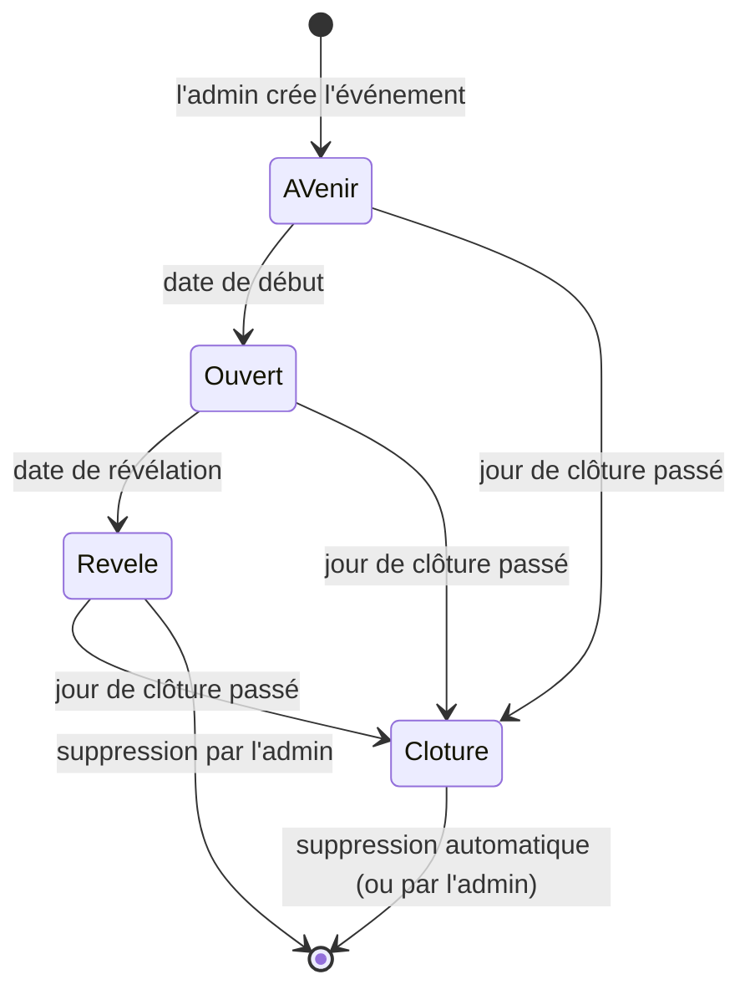

# OuiSnap

OuiSnap est l'appli photo des invités d'un événement. Les invités scannent un QR code posé sur leur table, photographient toute la journée, et les organisateurs découvrent l'album le lendemain. Personne n'installe rien ni ne crée de compte.

C'est le service de PourUnOuiEternel, photographe de mariage : OuiSnap complète le reportage du photographe avec tous les regards des proches.

Adresse du site : https://ouisnap.pourunouieternel.fr

Ce document décrit ce que fait OuiSnap et selon quelles règles. Les processus détaillés sont dans [docs/PDD.md](docs/PDD.md). La technique est dans [docs/SDD.md](docs/SDD.md).

## Qui fait quoi

| Qui | Ce qu'il peut faire |
|---|---|
| **Visiteur de la vitrine** | Découvre OuiSnap sur la page d'accueil (vidéo de présentation, captures de l'appli) et envoie une demande d'album : nom, e-mail, type et date de l'événement, message facultatif. |
| **Administrateur** (Franck) | Se connecte à `/admin/` avec un mot de passe. Crée et règle les événements (dont leur date de suppression), imprime les cartes QR des tables et les cartes des organisateurs, récupère le lien de l'album des organisateurs, voit toutes les photos à tout moment, supprime des photos ou un événement entier. Il est prévenu par e-mail avant chaque suppression automatique et voit dans l'administration l'état des suppressions. |
| **Organisateurs** (mariés, famille, hôtes) | Reçoivent un lien privé vers leur album. Avant la révélation, ils voient qui a photographié et combien. Après, ils parcourent les photos, posent des coups de cœur et téléchargent tout en un fichier ZIP. Ils sont prévenus par e-mail, puis sur leur page, avant la suppression de leur album. |
| **Invités / photographes** | Scannent le QR code, choisissent un pseudo (et donnent leur e-mail s'ils veulent), photographient ou importent des photos, revoient et suppriment leurs propres photos tant que l'album est ouvert. |

## La vie d'un album

1. **Création.** Franck crée l'événement dans l'administration : type, nom de l'album, nom et e-mail des organisateurs, dates, limites. Le QR code et le lien privé des organisateurs sont créés avec lui.
2. **À venir.** Avant la date de début, le QR code répond « L'album n'est pas encore ouvert » et indique le jour et l'heure d'ouverture.
3. **Ouverture.** À la date de début, les invités peuvent photographier. Les organisateurs reçoivent un e-mail avec le QR code et le lien de leur album.
4. **Prise de photos.** Les invités scannent, se présentent, photographient. Les organisateurs suivent les compteurs, mais ne voient aucune image.
5. **Révélation.** À la date de révélation, l'album se dévoile aux organisateurs : les invités ne peuvent plus photographier ni supprimer, mais les photos qu'ils ont déjà prises et qui n'étaient pas parties rejoignent encore l'album jusqu'à la clôture. Les photographes qui ont laissé leur e-mail et envoyé au moins une photo sont prévenus.
6. **Clôture.** Le jour de clôture passé, l'album n'est plus accessible, ni aux organisateurs ni aux invités. Les photos restent sur le serveur.
7. **Suppression.** Six mois après la clôture au plus tard, l'album est supprimé automatiquement et ses photos sont effacées du serveur. Organisateurs et administrateur en sont prévenus par e-mail un mois avant (voir « Conservation des données »). Franck peut aussi supprimer un album à la main, à tout moment.

## Les règles du produit

### Types d'événement

Un événement est un mariage, un baptême, un anniversaire ou un autre événement. Les textes de l'appli et des e-mails s'y adaptent (« Album des mariés », « Album du baptême », « Album d'anniversaire », « Album de l'événement » ; « les mariés », « la famille », « les organisateurs »). Les tournures des e-mails sont aussi personnalisées pour le mariage, le baptême et l'anniversaire ; « Autre événement » reste neutre.

### Dates

- **Début** : pas d'envoi avant.
- **Révélation** : fin des envois, les organisateurs découvrent les photos. Proposée par défaut le lendemain du début à 12h00.
- **Clôture** : un jour, sans heure, proposé par défaut deux semaines après le début. L'album reste accessible jusqu'à la fin de ce jour. Elle doit suivre la révélation. Vide : l'album n'est jamais clôturé.
- La révélation doit suivre le début.

### Limites

- Nombre de photographes et nombre de photos par photographe : réglables par événement, entre 1 et 65 535. Vides, ils sont illimités.
- Un invité qui laisse son e-mail reçoit 5 photos de plus (seulement si l'album est limité en photos).
- Si le nombre maximum de photographes est atteint, un nouvel invité voit « Cet album est complet ».

### Envoi des photos

Une photo prise n'est plus perdue si l'invité ferme la page ou perd le réseau. Chaque photo est d'abord gardée sur son téléphone, puis envoyée à l'album une fois que la connexion le permet. Si le réseau tombe, l'écran indique combien de photos attendent et elles partent toutes seules au retour du réseau. Si l'invité ferme la page avant la fin, il retrouve ses photos en rouvrant la page (en scannant de nouveau le QR code ou par son lien personnel) : elles repartent sans qu'il ait rien à refaire. Une photo n'est jamais enregistrée deux fois, même si la connexion a coupé juste après son envoi. Pendant l'envoi, l'écran du téléphone reste allumé.

Une limite reste vraie : page fermée, rien ne part. L'invité doit rouvrir la page pour que ses photos en attente repartent.

Une photo prise avant la révélation rejoint encore l'album après, tant qu'il n'est pas clôturé : l'invité rouvre sa page et elle part toute seule. Après la révélation, il ne peut plus photographier ni supprimer, et sa page « Mes photos » lui dit où en sont ses photos. Une photo qui n'est pas partie est gardée 7 jours sur le téléphone : c'est la vraie limite de ce rattrapage, et elle court depuis la prise de vue, pas depuis la révélation. Quelques réserves : la date de prise vient du téléphone et n'est pas une preuve, le serveur vérifie seulement qu'elle est vraisemblable (avec un quart d'heure de tolérance) ; une photo refusée parce qu'elle n'a pas été prise avant la révélation n'est plus jamais renvoyée, même si la révélation est repoussée ensuite ; l'invité ne peut pas supprimer pour faire de la place, donc une photo qui dépasse sa limite est refusée.

Pour les organisateurs, quand des photos arrivent après la révélation, leur page l'indique sous les compteurs et les invite à télécharger de nouveau l'album. Cette ligne apparaît au prochain chargement de leur page : elle ne se rafraîchit pas toute seule après la révélation, et aucun e-mail ne les prévient. Une photo arrivée tard se range à la fin des photos de son photographe.

### Un album surprise

Avant la révélation, les organisateurs voient seulement le nombre total de photos et, pour chaque photographe ayant envoyé au moins une photo, son pseudo et son nombre de photos. Aucune image n'est accessible. Un invité ne voit que ses propres photos.

### Coups de cœur

Après la révélation, les organisateurs posent ou retirent un coup de cœur sur une photo. Le photographe le voit sur sa photo. L'administrateur le voit aussi.

### Ce que voit et peut faire l'administrateur

Il voit tous les événements (état, dates, nombre de photographes, de photos et leur poids, adresses e-mail recueillies). Il voit toutes les photos à tout moment, même avant la révélation et après la clôture, rangées par photographe, avec les coups de cœur. Il peut supprimer une photo, même après la révélation, ou un événement entier.

### E-mails envoyés

| Message | Pour qui | Quand |
|---|---|---|
| Bienvenue | L'invité qui a laissé son e-mail | Dès son inscription. Contient son lien personnel pour revenir photographier depuis n'importe quel appareil, et le QR code. |
| Album ouvert | Les organisateurs | À l'ouverture : QR code et lien privé de l'album. Pas envoyé si l'album est déjà révélé. |
| Album dévoilé | Les photographes qui ont laissé leur e-mail et envoyé au moins une photo | À la révélation. |
| Album dévoilé | Les organisateurs | À la révélation : nombre de photos et de photographes, jour de clôture. |
| Album bientôt supprimé | Les organisateurs (s'ils ont une adresse) | Trente jours avant la suppression automatique. Deux versions : album encore accessible (télécharger ses photos) ou déjà clôturé (écrire à son photographe). |
| Suppression automatique à venir | Les adresses de l'administrateur | Au même moment : l'album concerné, sa date de suppression, comment le garder plus longtemps. |
| Demande reçue | Le service (adresse d'expédition de OuiSnap) | À chaque demande envoyée depuis la vitrine. |
| Mot de passe oublié | Les adresses de l'administrateur | Quand il clique sur « Mot de passe oublié ? ». |

Les messages d'ouverture, de révélation et de suppression à venir partent une seule fois par album, à la première visite utile après l'heure prévue (page invité, album des organisateurs ou administration), ou dès que la tâche planifiée de l'hébergeur passe, une fois par heure, même si personne ne visite le site.

Un message dont la date n'est pas encore venue (début ou révélation repoussés après sa mise en file) attend son heure sans compter d'essai et part ensuite. Un message qui ne part pas n'est pas perdu : il est retenté, d'abord dix minutes plus tard, puis à intervalles de plus en plus longs (jusqu'à douze heures), et abandonné après six essais, soit environ une journée. Un message devenu sans objet est abandonné aussitôt : album clôturé (sauf l'avertissement de suppression, qui concerne justement les albums clôturés), invité supprimé ou sans photo, adresse retirée. Un message déjà parti ne repart jamais. Pour l'avertissement de suppression, six échecs ne le font pas oublier : l'album reste conservé et l'avertissement est remis en file au passage suivant, au plus une fois par jour. Les messages de bienvenue, de mot de passe oublié et de demande reçue ne sont pas retentés.

Dans l'administration, un petit bouton rond placé après le titre « Événements » ouvre une bulle d'info : Franck y voit quand la tâche planifiée est passée pour la dernière fois, et le nombre d'e-mails en attente d'un nouvel essai ou abandonnés. Le bouton est discret quand tout va bien ; il devient un avertissement coloré, visible sans ouvrir la bulle, si la tâche n'est jamais passée ou pas depuis plus de deux heures (les messages ne partent alors qu'à la visite du site), ou si des e-mails sont abandonnés.

Limite connue : quand l'hébergeur accepte d'envoyer un message, OuiSnap le considère comme envoyé. Il ne peut pas savoir si le message arrive vraiment (courrier indésirable, adresse erronée).

### QR code et cartes imprimables

Chaque événement a deux QR codes, qui ne s'ouvrent pas sur la même page :

- **Celui des invités** ouvre la page où l'on rejoint l'album. Il se pose sur les tables.
- **Celui des organisateurs** ouvre leur album privé. Il ne se pose jamais sur les tables.

Dans l'administration, le bloc « QR code et liens » les montre côte à côte. Chacun a son PDF à imprimer et son téléchargement du code seul. Le QR code des organisateurs est signalé « ALBUM PRIVÉ » jusque dans l'image téléchargée, pour ne pas le prendre pour celui des invités. Sous les deux, le lien des invités et le lien privé des organisateurs peuvent être copiés ou ouverts dans un nouvel onglet.

**Cartes de table.** Le PDF des tables tient sur deux pages A4 : la première porte quatre cartes A6 identiques, à découper ; la seconde porte leurs quatre dos, à imprimer en recto-verso. Chaque type d'événement a sa propre carte, avec ses textes d'accroche et d'explication :

- mariage : deux alliances entrelacées en tête de carte, les prénoms en grand, le QR code dans un fin cadre doré ;
- baptême : une goutte d'or et des ondes, le nom et l'explication suivent les courbes ;
- anniversaire : le QR code est le gâteau, avec ses bougies et son glaçage ;
- autre événement : le QR code cadré comme dans un viseur d'appareil photo.

Toutes sont de la même famille : papier blanc, sans fond ni cadre, QR code vert sapin au centre, logo OuiSnap en signature au pied. Un nom d'événement très long est réduit puis coupé plutôt que de déborder.

**Dos des cartes de table.** Le dos explique aux invités quoi faire, sans rien leur demander d'installer : le slogan « La fête, vue par vous. » signé OuiSnap, le mode d'emploi en trois étapes (ouvrir l'appareil photo et viser le code du recto ; toucher le lien et choisir un pseudo ; photographier la fête), puis « Rien à installer · Aucun compte · Un pseudo suffit ». Un petit motif propre au type d'événement orne un filet (alliances, goutte, bougie, mire), suivi d'un paragraphe qui présente OuiSnap et change selon le type, puis de la phrase « Ce que vous ne photographiez pas, personne ne le verra. ». En pied, un petit QR code mène au site de PourUnOuiEternel, avec la mention « Le photographe de votre événement » : il est volontairement discret et sans le logo OuiSnap, pour ne pas passer pour le code de l'album. Le dos est le même pour les quatre cartes d'une feuille. Il est prévu pour une imprimante qui retourne la feuille sur le bord long, le réglage courant ; le retournement sur le bord court n'est pas géré, et sera décidé après un essai d'impression. Les traits de coupe ne figurent que sur la page des faces avant : l'imprimante décale un peu le recto-verso, et des traits sur les dos tomberaient à l'intérieur des cartes.

**Carte des organisateurs.** Le PDF des organisateurs tient sur une page A4 : deux cartes identiques en format A5 paysage, à remettre en main propre aux organisateurs. Leur QR code ouvre l'album privé. La carte porte la mention « ALBUM PRIVÉ », le titre « Votre album », le nom de l'événement, ce qu'on trouve dans l'album avant et après la révélation, la date de révélation, une consigne de confidentialité (la carte est personnelle, à ne pas poser sur les tables) et « par PourUnOuiEternel » sous le logo. Son format, son carton crème et sa mention sont voulus pour qu'on ne la confonde pas avec une carte de table. Le nom du fichier ne contient jamais la clé secrète de l'album.

**Logo dans le QR code.** Sur toutes les cartes et sur les QR codes de l'administration, « OuiSnap » figure dans un petit cartouche au centre du code. Le code est conçu pour rester lisible malgré ce cartouche. Les autres QR codes du site (page des organisateurs, plein écran, e-mails) n'ont pas de logo.

### Mot de passe oublié de l'administrateur

Le bouton de l'écran de connexion envoie un lien aux adresses de l'administrateur. Le lien est valable une heure et ne sert qu'une fois. Le nouveau mot de passe compte au moins 10 caractères. Il déconnecte les sessions ouvertes. Au plus 3 demandes par heure et 10 par jour.

### Sécurité de la connexion

Après 5 mots de passe erronés depuis une même adresse en 15 minutes, la connexion est bloquée pendant ce délai.

### Conservation des données

La politique de confidentialité promet la suppression des albums au plus tard six mois après leur clôture, et celle des demandes de la vitrine trois ans après leur réception. OuiSnap l'applique tout seul.

- **Échéance.** Un album est supprimé six mois après sa clôture, jour pour jour (le 31 août, six mois plus tard, devient le 28 ou le 29 février). Franck peut choisir une date plus proche dans le formulaire de l'événement (champ « Suppression »), entre la clôture et ces six mois, jamais au-delà. Un album sans clôture n'est jamais supprimé automatiquement.
- **Garder un album plus longtemps.** Franck repousse la clôture : l'échéance suit. L'album redevient alors accessible jusqu'à la nouvelle clôture.
- **Préavis.** Trente jours avant l'échéance, les organisateurs (s'ils ont une adresse e-mail) et Franck reçoivent un e-mail. Le message aux organisateurs dit que les photos seront définitivement supprimées et qu'il faut les télécharger ; si l'album est déjà clôturé, il leur dit d'écrire à leur photographe pour demander de rouvrir l'accès. La page des organisateurs affiche aussi, à partir de ce moment, la date de suppression et un rappel de télécharger les photos.
- **Aucune suppression par surprise.** Un album n'est supprimé que s'il est clôturé, que son échéance est passée et que l'avertissement est réellement parti depuis au moins sept jours, vers Franck et vers les organisateurs quand ils ont une adresse. Si l'e-mail ne part pas, l'album est conservé et l'avertissement est retenté chaque jour. Sans adresse d'administrateur configurée, rien n'est supprimé. Au plus cinq albums sont supprimés à la fois.
- **Si Franck change une date ou l'adresse des organisateurs**, l'avertissement est refait quand c'est nécessaire (échéance avancée ou lointaine, nouvelle adresse), et les sept jours repartent de son envoi.
- **Ce que voit Franck.** Sur la carte de chaque événement, la ligne « Suppression des photos » donne la date et l'état de l'avertissement. Au-dessus de la liste, l'administration indique quand les suppressions ont été examinées pour la dernière fois et quelle est la dernière suppression automatique.
- **Demandes de la vitrine.** Elles sont supprimées trois ans après leur réception.
- **Qui fait ce travail.** La tâche planifiée de l'hébergeur, lancée par l'hébergeur lui-même, et elle seule : une visite du site ne supprime jamais rien. Si l'hébergeur ne la lance pas, rien n'est supprimé et l'administration le dit en rouge.

### Mentions légales et confidentialité

Les mentions légales et la politique de confidentialité sont en ligne, liées depuis l'écran d'accueil des invités et la vitrine. Seule la page vitrine est ouverte aux moteurs de recherche.

## Où en est le projet

| Étape | État |
|---|---|
| Page vitrine (présentation, vidéo, formulaire de demande) | en ligne |
| Parcours invité (QR code, « Connecté ! », appareil photo, import, envoi, « Mes photos » dans l'ordre de prise de vue) | en ligne, y compris l'envoi fiable des photos (gardées sur le téléphone, reprise à la réouverture, jamais en double), mis en ligne le 5 octobre 2026 ; à essayer sur de vrais téléphones. Les photos prises avant la révélation rejoignent l'album après, jusqu'à la clôture : en ligne le 6 octobre 2026, vérifié sur le serveur local seulement (ni MySQL ni Safari) |
| Album des organisateurs (compteurs, révélation, ZIP, coups de cœur) | en ligne |
| Administration (événements, QR codes, PDF des tables, photos, coups de cœur visibles) | en ligne |
| Cartes imprimables : une carte de table par type d'événement (recto et dos, en deux pages), carte des organisateurs, logo au centre du QR code | en ligne ; imprimées et essayées le 6 octobre 2026 : les QR codes se lisent sur papier |
| Mot de passe oublié de l'administration | en ligne |
| E-mails (bienvenue, ouverture, révélation, avertissement de suppression, adaptés au type d'événement) | en ligne ; les e-mails d'ouverture et de révélation qui échouent sont retentés pendant environ une journée, et un message dont la date est repoussée attend son heure sans s'épuiser (octobre 2026). Ces nouveaux essais n'ont jamais été éprouvés par un envoi réel : ils ont été vérifiés sur une base de test, pas sur la messagerie de l'hébergeur |
| Mentions légales et politique de confidentialité | en ligne |
| Tests de bout en bout Playwright (4 scénarios : mariage, mot de passe, types d'événement, reprise de l'envoi) | en place ; au dernier passage, le 7 octobre 2026, les quatre scénarios réussissent (239 contrôles) |
| Tâche planifiée (e-mails sans visite du site, suppressions automatiques) | en service chez l'hébergeur depuis le 6 octobre 2026, une fois par heure ; son état est visible dans l'administration, qui alerte si elle cesse de passer |
| Suppression automatique des albums six mois après la clôture, avec préavis de trente jours, et suppression des demandes de la vitrine après trois ans | en ligne depuis le 6 octobre 2026. Vérifiée sur une base de test (154 contrôles) et dans le navigateur en local ; jamais éprouvée sur la vraie base de l'hébergeur ni par un envoi réel d'avertissement. Elle ne fonctionne que si l'hébergeur lance bien la tâche planifiée (voir ci-dessus) : l'administration l'affiche |
| Paiement | OuiSnap est gratuit au lancement (choix de Franck, 9 octobre 2026). Rien n'est facturé, ni aux organisateurs ni aux invités, et l'appli ne comporte aucun paiement. Une offre payante reste possible plus tard, elle n'est pas décidée |

## Pour aller plus loin

- [docs/PDD.md](docs/PDD.md) : les processus détaillés, étape par étape, avec leurs règles de gestion.
- [docs/SDD.md](docs/SDD.md) : la technique (architecture, installation, commandes, mise en ligne, tests).
