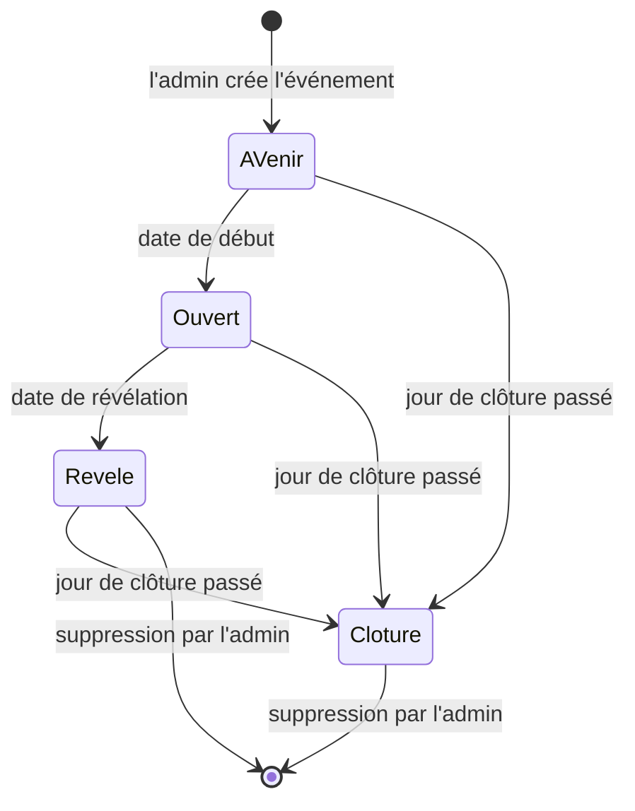

# OuiSnap

OuiSnap est l'appli photo des invités d'un événement. Les invités scannent un QR code posé sur leur table, photographient toute la journée, et les organisateurs découvrent l'album le lendemain. Personne n'installe rien ni ne crée de compte.

C'est le service de PourUnOuiEternel, photographe de mariage : OuiSnap complète le reportage du photographe avec tous les regards des proches.

Adresse du site : https://ouisnap.pourunouieternel.fr

Ce document décrit ce que fait OuiSnap et selon quelles règles. Les processus détaillés sont dans [docs/PDD.md](docs/PDD.md). La technique est dans [docs/SDD.md](docs/SDD.md).

## Qui fait quoi

| Qui | Ce qu'il peut faire |
|---|---|
| **Visiteur de la vitrine** | Découvre OuiSnap sur la page d'accueil (vidéo de présentation, captures de l'appli) et envoie une demande d'album : nom, e-mail, type et date de l'événement, message facultatif. |
| **Administrateur** (Franck) | Se connecte à `/admin/` avec un mot de passe. Crée et règle les événements, imprime les cartes QR des tables et les cartes des organisateurs, récupère le lien de l'album des organisateurs, voit toutes les photos à tout moment, supprime des photos ou un événement entier. |
| **Organisateurs** (mariés, famille, hôtes) | Reçoivent un lien privé vers leur album. Avant la révélation, ils voient qui a photographié et combien. Après, ils parcourent les photos, posent des coups de cœur et téléchargent tout en un fichier ZIP. |
| **Invités / photographes** | Scannent le QR code, donnent leur prénom (et leur e-mail s'ils veulent), photographient ou importent des photos, revoient et suppriment leurs propres photos tant que l'album est ouvert. |

## La vie d'un album

1. **Création.** Franck crée l'événement dans l'administration : type, nom de l'album, nom et e-mail des organisateurs, dates, limites. Le QR code et le lien privé des organisateurs sont créés avec lui.
2. **À venir.** Avant la date de début, le QR code répond « L'album n'est pas encore ouvert » et indique le jour et l'heure d'ouverture.
3. **Ouverture.** À la date de début, les invités peuvent photographier. Les organisateurs reçoivent un e-mail avec le QR code et le lien de leur album.
4. **Prise de photos.** Les invités scannent, se présentent, photographient. Les organisateurs suivent les compteurs, mais ne voient aucune image.
5. **Révélation.** À la date de révélation, les envois s'arrêtent et l'album se dévoile aux organisateurs. Les photographes qui ont laissé leur e-mail et envoyé au moins une photo sont prévenus.
6. **Clôture.** Le jour de clôture passé, l'album n'est plus accessible, ni aux organisateurs ni aux invités. Les photos restent sur le serveur.
7. **Suppression.** Franck supprime l'album à la main. Ses photos sont alors effacées du serveur.

## Les règles du produit

### Types d'événement

Un événement est un mariage, un baptême, un anniversaire ou un autre événement. Les textes de l'appli et des e-mails s'y adaptent (« Album des mariés », « Album du baptême », « Album d'anniversaire », « Album de l'événement » ; « les mariés », « la famille », « les organisateurs »). Les tournures des e-mails sont aussi personnalisées pour le mariage, le baptême et l'anniversaire ; « Autre événement » reste neutre.

### Dates

- **Début** : pas d'envoi avant.
- **Révélation** : fin des envois, les organisateurs découvrent les photos. Proposée par défaut le lendemain du début à 12h00.
- **Clôture** : un jour, sans heure, proposé par défaut deux semaines après le début. L'album reste accessible jusqu'à la fin de ce jour. Elle doit suivre la révélation. Vide : l'album n'est jamais clôturé.
- La révélation doit suivre le début.

### Limites

- Nombre de photographes et nombre de photos par photographe : réglables par événement, entre 1 et 65 535. Vides, ils sont illimités.
- Un invité qui laisse son e-mail reçoit 5 photos de plus (seulement si l'album est limité en photos).
- Si le nombre maximum de photographes est atteint, un nouvel invité voit « Cet album est complet ».

### Envoi des photos

Une photo prise n'est plus perdue si l'invité ferme la page ou perd le réseau. Chaque photo est d'abord gardée sur son téléphone, puis envoyée à l'album une fois que la connexion le permet. Si le réseau tombe, l'écran indique combien de photos attendent et elles partent toutes seules au retour du réseau. Si l'invité ferme la page avant la fin, il retrouve ses photos en rouvrant la page (en scannant de nouveau le QR code ou par son lien personnel) : elles repartent sans qu'il ait rien à refaire. Une photo n'est jamais enregistrée deux fois, même si la connexion a coupé juste après son envoi. Pendant l'envoi, l'écran du téléphone reste allumé.

Une limite reste vraie : page fermée, rien ne part. L'invité doit rouvrir la page pour que ses photos en attente repartent. Deux règles actuelles, pas encore confirmées : les photos encore en attente quand l'album est dévoilé ne sont pas envoyées (elles restent sur le téléphone, avec un message), et une photo qui n'est pas partie est gardée 7 jours sur le téléphone.

### Un album surprise

Avant la révélation, les organisateurs voient seulement le nombre total de photos et, pour chaque photographe ayant envoyé au moins une photo, son prénom et son nombre de photos. Aucune image n'est accessible. Un invité ne voit que ses propres photos.

### Coups de cœur

Après la révélation, les organisateurs posent ou retirent un coup de cœur sur une photo. Le photographe le voit sur sa photo. L'administrateur le voit aussi.

### Ce que voit et peut faire l'administrateur

Il voit tous les événements (état, dates, nombre de photographes, de photos et leur poids, adresses e-mail recueillies). Il voit toutes les photos à tout moment, même avant la révélation et après la clôture, rangées par photographe, avec les coups de cœur. Il peut supprimer une photo, même après la révélation, ou un événement entier.

### E-mails envoyés

| Message | Pour qui | Quand |
|---|---|---|
| Bienvenue | L'invité qui a laissé son e-mail | Dès son inscription. Contient son lien personnel pour revenir photographier depuis n'importe quel appareil, et le QR code. |
| Album ouvert | Les organisateurs | À l'ouverture : QR code et lien privé de l'album. Pas envoyé si l'album est déjà révélé. |
| Album dévoilé | Les photographes qui ont laissé leur e-mail et envoyé au moins une photo | À la révélation. |
| Album dévoilé | Les organisateurs | À la révélation : nombre de photos et de photographes, jour de clôture. |
| Demande reçue | Le service (adresse d'expédition de OuiSnap) | À chaque demande envoyée depuis la vitrine. |
| Mot de passe oublié | Les adresses de l'administrateur | Quand il clique sur « Mot de passe oublié ? ». |

Ces messages partent une seule fois par album, à la première visite utile après l'heure prévue (page invité, album des organisateurs ou administration), ou par une tâche planifiée si elle est installée.

### QR code et cartes imprimables

Chaque événement a deux QR codes, qui ne s'ouvrent pas sur la même page :

- **Celui des invités** ouvre la page où l'on rejoint l'album. Il se pose sur les tables.
- **Celui des organisateurs** ouvre leur album privé. Il ne se pose jamais sur les tables.

Dans l'administration, le bloc « QR code et liens » les montre côte à côte. Chacun a son PDF à imprimer et son téléchargement du code seul. Le QR code des organisateurs est signalé « ALBUM PRIVÉ » jusque dans l'image téléchargée, pour ne pas le prendre pour celui des invités. Sous les deux, le lien des invités et le lien privé des organisateurs peuvent être copiés ou ouverts dans un nouvel onglet.

**Cartes de table.** Le PDF des tables tient sur une page A4 : quatre cartes A6 identiques, à découper. Chaque type d'événement a sa propre carte, avec ses textes d'accroche et d'explication :

- mariage : deux alliances entrelacées en tête de carte, les prénoms en grand, le QR code dans un fin cadre doré ;
- baptême : une goutte d'or et des ondes, le nom et l'explication suivent les courbes ;
- anniversaire : le QR code est le gâteau, avec ses bougies et son glaçage ;
- autre événement : le QR code cadré comme dans un viseur d'appareil photo.

Toutes sont de la même famille : papier blanc, sans fond ni cadre, QR code vert sapin au centre, logo OuiSnap en signature au pied. Un nom d'événement très long est réduit puis coupé plutôt que de déborder.

**Carte des organisateurs.** Le PDF des organisateurs tient sur une page A4 : deux cartes identiques en format A5 paysage, à remettre en main propre aux organisateurs. Leur QR code ouvre l'album privé. La carte porte la mention « ALBUM PRIVÉ », le titre « Votre album », le nom de l'événement, ce qu'on trouve dans l'album avant et après la révélation, la date de révélation, une consigne de confidentialité (la carte est personnelle, à ne pas poser sur les tables) et « par PourUnOuiEternel » sous le logo. Son format, son carton crème et sa mention sont voulus pour qu'on ne la confonde pas avec une carte de table. Le nom du fichier ne contient jamais la clé secrète de l'album.

**Logo dans le QR code.** Sur toutes les cartes et sur les QR codes de l'administration, « OuiSnap » figure dans un petit cartouche au centre du code. Le code est conçu pour rester lisible malgré ce cartouche. Les autres QR codes du site (page des organisateurs, plein écran, e-mails) n'ont pas de logo.

### Mot de passe oublié de l'administrateur

Le bouton de l'écran de connexion envoie un lien aux adresses de l'administrateur. Le lien est valable une heure et ne sert qu'une fois. Le nouveau mot de passe compte au moins 10 caractères. Il déconnecte les sessions ouvertes. Au plus 3 demandes par heure et 10 par jour.

### Sécurité de la connexion

Après 5 mots de passe erronés depuis une même adresse en 15 minutes, la connexion est bloquée pendant ce délai.

### Conservation, mentions légales et confidentialité

La politique de confidentialité annonce la suppression des albums au plus tard six mois après leur clôture. Cette suppression se fait à la main depuis l'administration. Les mentions légales et la politique de confidentialité sont en ligne, liées depuis l'écran d'accueil des invités et la vitrine. Seule la page vitrine est ouverte aux moteurs de recherche.

## Où en est le projet

| Étape | État |
|---|---|
| Page vitrine (présentation, vidéo, formulaire de demande) | en ligne |
| Parcours invité (QR code, « Connecté ! », appareil photo, import, envoi, « Mes photos » dans l'ordre de prise de vue) | en ligne, y compris l'envoi fiable des photos (gardées sur le téléphone, reprise à la réouverture, jamais en double), mis en ligne le 5 octobre 2026 ; à essayer sur de vrais téléphones |
| Album des organisateurs (compteurs, révélation, ZIP, coups de cœur) | en ligne |
| Administration (événements, QR codes, PDF des tables, photos, coups de cœur visibles) | en ligne |
| Cartes imprimables : une carte de table par type d'événement, carte des organisateurs, logo au centre du QR code | codées (octobre 2026) ; rendu jamais vérifié sur papier : les QR codes ont été relus par un détecteur dans le navigateur, y compris réduits et floutés, mais rien n'a été imprimé. À imprimer et à essayer avec un vrai téléphone avant tout tirage |
| Mot de passe oublié de l'administration | en ligne |
| E-mails (bienvenue, ouverture, révélation, adaptés au type d'événement) | en ligne |
| Mentions légales et politique de confidentialité | en ligne |
| Tests de bout en bout Playwright (4 scénarios : mariage, mot de passe, types d'événement, reprise de l'envoi) | en place ; au dernier passage de chacun (4 et 5 octobre 2026), les quatre scénarios réussissent |
| Tâche planifiée pour les e-mails sans visite du site | à confirmer (voir le SDD) |
| Suppression des albums six mois après la clôture | à faire à la main, pas automatisée |
| Paiement | à décider |

## Pour aller plus loin

- [docs/PDD.md](docs/PDD.md) : les processus détaillés, étape par étape, avec leurs règles de gestion.
- [docs/SDD.md](docs/SDD.md) : la technique (architecture, installation, commandes, mise en ligne, tests).
