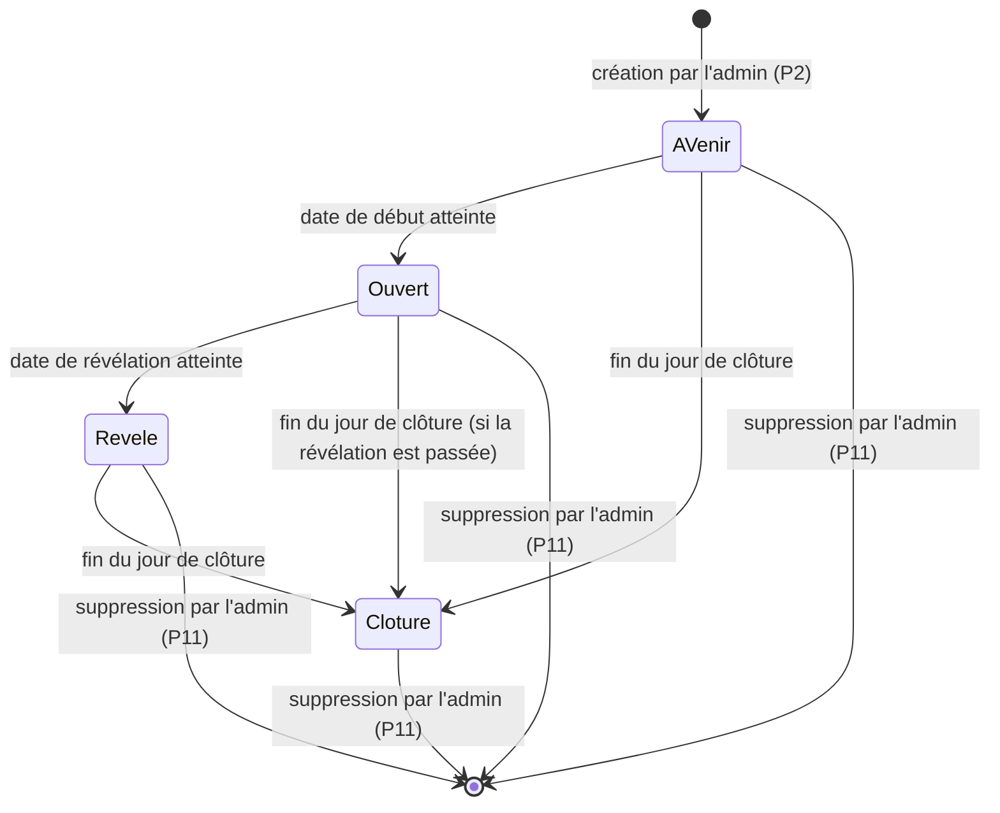

# OuiSnap : document de définition des processus (PDD)

Version du 4 octobre 2026. Les valeurs chiffrées sont suivies du fichier du code où elles sont lues, entre parenthèses (chemins relatifs à `public/api/` pour les `.php`, à `src/` pour le reste).

## 1. Introduction

### 1.1 Objet

Ce document décrit les processus métier de OuiSnap tels qu'ils fonctionnent aujourd'hui : qui fait quoi, dans quel ordre, selon quelles règles, et ce que l'utilisateur voit à l'écran. Il ne décrit pas comment ils sont programmés.

### 1.2 Périmètre

Du formulaire de demande de la vitrine jusqu'à la suppression d'un album, pour les quatre types d'acteurs (visiteur, administrateur, organisateurs, invités). Le paiement et le contrat avec le client n'en font pas partie (voir le chapitre 6).

### 1.3 Documents liés

- [README.md](../README.md) : présentation fonctionnelle et état d'avancement.
- [SDD.md](SDD.md) : conception technique (architecture, installation, commandes, mise en ligne, tests).

### 1.4 Glossaire

| Terme | Définition |
|---|---|
| Événement | Ce que Franck crée dans l'administration : un mariage, un baptême, un anniversaire ou un autre événement, avec ses dates et ses limites. |
| Album | Ensemble des photos d'un événement. Chaque événement a un album. |
| Organisateurs | Les personnes qui reçoivent l'album : mariés, famille, hôtes. Elles sont désignées par un nom et une adresse e-mail à la création de l'événement. |
| Invité / photographe | Personne qui rejoint l'album en scannant le QR code. Elle est identifiée par son prénom, sans compte. |
| Code | Code de 8 caractères propre à l'événement, contenu dans le QR code (admin-event-save.php). |
| Lien privé | Adresse de l'album des organisateurs, avec une clé secrète : `/album/?k=…`. Qui l'a voit toutes les photos après la révélation. |
| Lien personnel | Adresse envoyée par e-mail à l'invité qui a laissé son adresse : elle rouvre sa session sur n'importe quel appareil. |
| Révélation | Moment où l'album est dévoilé aux organisateurs et où les envois s'arrêtent. |
| Clôture | Dernier jour d'accès à l'album. Ensuite, plus personne sauf l'administrateur n'y accède. |
| Coup de cœur | Marque posée par les organisateurs sur une photo après la révélation. |
| Bonus e-mail | Photos supplémentaires accordées à l'invité qui laisse son adresse. |
| ZIP | Fichier unique contenant toutes les photos de l'album, un dossier par photographe. |

Vocabulaire des états : l'administration affiche « À venir », « En cours », « Révélé » et « Clôturé » (admin-app.tsx). Dans ce document, « En cours » est appelé « ouvert ». Dans le code, l'état « révélé » s'appelle `closed` : ne pas le confondre avec la clôture (`expired`).

## 2. Acteurs et rôles

| Acteur | Rôle | Moyen d'accès |
|---|---|---|
| Visiteur | Découvre OuiSnap et demande un album | Page d'accueil `/` |
| Administrateur (Franck) | Crée les événements, diffuse les QR codes, modère, clôture, supprime | `/admin/`, mot de passe |
| Organisateurs | Suivent l'album, le découvrent, le téléchargent, posent des coups de cœur | Lien privé `/album/?k=…` |
| Invité / photographe | Photographie et gère ses propres photos | QR code `/e/?c=CODE`, puis lien personnel s'il a laissé son e-mail |
| Système | Envoie les e-mails à l'heure prévue | Déclenché par une visite utile ou par la tâche planifiée (cron.php) |

## 3. Vue d'ensemble

### 3.1 Cartographie des processus

| N° | Processus | Acteur principal |
|---|---|---|
| P1 | Demande d'un album depuis la vitrine | Visiteur |
| P2 | Création et réglage d'un événement | Administrateur |
| P3 | Diffusion du QR code | Administrateur, organisateurs |
| P4 | Arrivée et inscription d'un invité | Invité |
| P5 | Prise et envoi de photos | Invité |
| P6 | Consultation et suppression de ses photos | Invité |
| P7 | Suivi avant la révélation | Organisateurs |
| P8 | Révélation | Système |
| P9 | Découverte, coups de cœur et téléchargement | Organisateurs |
| P10 | Modération par l'administrateur | Administrateur |
| P11 | Clôture et suppression d'un album | Administrateur, système |
| P12 | E-mails | Système |
| P13 | Connexion de l'administrateur et mot de passe oublié | Administrateur |

### 3.2 Cycle de vie d'un album

| État | Invités | Organisateurs | Administrateur |
|---|---|---|---|
| À venir | Message « L'album n'est pas encore ouvert » et date d'ouverture. Pas d'inscription ni d'envoi. | Compteurs à zéro, aucune image. | Tout |
| Ouvert | Inscription, envoi, consultation et suppression de leurs photos. | Compteurs rafraîchis toutes les 30 secondes, aucune image. | Tout |
| Révélé | Lecture seule de leurs photos. Plus d'envoi ni de suppression. | Photos, coups de cœur, ZIP. | Tout |
| Clôturé | « Cet album est clôturé : il n'est plus accessible. » | « Cet album est clôturé : il n'est plus accessible. » | Tout |

(lib.php : `event_state`, `require_open`, `require_revealed` ; album-app.tsx ; guest-app.tsx)

Les transitions sont déterminées par l'heure : personne ne « passe » un album d'un état à l'autre à la main. L'administrateur agit en changeant les dates de l'événement.

## 4. Les processus

### P1. Demande d'un album depuis la vitrine

**Objectif.** Permettre à un visiteur de demander un album à Franck.
**Déclencheur.** Le visiteur remplit le formulaire en bas de la page d'accueil.
**Acteurs.** Visiteur ; administrateur (destinataire).
**Préconditions.** Aucune.

**Étapes**

1. Le visiteur lit la page : vidéo de présentation, explication du principe, album surprise.
2. Il remplit : Votre nom, Votre e-mail, Type d'événement (Mariage, Baptême, Anniversaire, Autre événement), Date de l'événement, Votre message (facultatif).
3. Il clique sur « Envoyer ma demande » (le bouton affiche « Envoi… »).
4. L'écran affiche : « Merci, votre demande est envoyée. Nous vous répondons par e-mail. »
5. La demande est enregistrée et un e-mail « Demande OuiSnap : <nom> » part vers l'adresse d'expédition du service, avec un bouton « Répondre à <nom> ».
6. Franck répond par e-mail hors de l'appli, puis passe à P2.

**Règles de gestion**

- RG-01 : le nom est obligatoire, 80 caractères au plus (contact.php).
- RG-02 : l'adresse e-mail doit être valide, 254 caractères au plus (contact.php).
- RG-03 : le type d'événement doit être l'un des quatre proposés (contact.php).
- RG-04 : la date est facultative, au format année-mois-jour (contact.php).
- RG-05 : le message est facultatif, tronqué à 2 000 caractères (contact.php).
- RG-06 : un champ caché sert de piège à robots ; s'il est rempli, la demande est ignorée sans erreur (contact.php).
- RG-07 : la demande est enregistrée même si l'e-mail ne peut pas partir (contact.php).

**Exceptions**

- Champ invalide : le message de l'erreur s'affiche sous le formulaire (« Indiquez votre nom. », « Cette adresse e-mail ne semble pas valide. », « Choisissez un type d'événement. », « La date de l'événement n'est pas valide. »).
- Réseau coupé : « Connexion impossible. Vérifiez votre réseau. » (api.ts).

**Résultat.** Une demande est enregistrée et Franck est prévenu par e-mail.

### P2. Création et réglage d'un événement

**Objectif.** Créer l'album d'un client et fixer ses dates, ses limites et ses organisateurs.
**Déclencheur.** Une demande acceptée (P1) ou un accord direct avec le client.
**Acteur.** Administrateur.
**Préconditions.** Connexion à l'administration (P13).

**Étapes**

1. Dans la liste « Événements », l'administrateur clique sur « Nouvel événement » (ou « Modifier » sur un événement existant).
2. Il renseigne : Nature de l'événement, Nom de l'album, Nom des organisateurs, E-mail des organisateurs, Début, Révélation, Clôture, Photographes maximum, Photos maximum par photographe.
3. Dès qu'il choisit le début, la révélation est proposée le lendemain à 12h00 et la clôture deux semaines après, tant qu'il ne les a pas modifiées lui-même (event-form.tsx).
4. Il clique sur « Créer l'événement » (« Enregistrer » en modification).
5. Le serveur crée l'événement avec un code de 8 caractères et une clé secrète pour le lien privé (admin-event-save.php).
6. L'administration dépose sur le serveur l'image du QR code, utilisée dans les e-mails (event-form.tsx, admin-event-qr.php).
7. La liste s'affiche avec le nouvel événement et son état.

**Règles de gestion**

- RG-08 : le nom de l'album est obligatoire, 120 caractères au plus (admin-event-save.php).
- RG-09 : la nature est mariage, baptême, anniversaire ou autre (lib.php : `EVENT_KINDS`).
- RG-10 : le nom des organisateurs est obligatoire, 80 caractères au plus ; l'e-mail des organisateurs est obligatoire, valide, 254 caractères au plus. Ces règles valent aussi à chaque modification (admin-event-save.php).
- RG-11 : le début et la révélation sont obligatoires ; la révélation doit suivre le début (admin-event-save.php).
- RG-12 : la clôture est facultative ; si elle est donnée, elle doit suivre la révélation. Elle se saisit comme un jour : l'album reste accessible jusqu'à 23h59 de ce jour, heure du navigateur de l'administrateur (event-form.tsx). Vide, l'album n'est jamais clôturé.
- RG-13 : les deux limites (photographes, photos par photographe) sont des entiers de 1 à 65 535, ou vides pour « illimité » (admin-event-save.php).
- RG-14 : la révélation est affichée à l'heure de Paris dans les e-mails et sur la page des organisateurs (lib.php, album-app.tsx).
- RG-15 : modifier une date ou une limite agit immédiatement : l'état de l'album se recalcule à chaque requête.

**Exceptions.** Une règle non respectée affiche son message sous le formulaire, par exemple « La révélation doit avoir lieu après le début. » ou « La clôture doit avoir lieu après la révélation. ». Rien n'est enregistré.

**Résultat.** Un événement existe, avec son code, son lien privé et son QR code. Les e-mails prévus sont mis en attente (P12).

### P3. Diffusion du QR code

**Objectif.** Faire parvenir le QR code aux invités et le lien privé aux organisateurs.
**Déclencheur.** Événement créé.
**Acteurs.** Administrateur, organisateurs.
**Préconditions.** P2 terminé.

**Étapes**

1. Dans la liste, l'administrateur clique sur « QR code et liens ». Le QR code, le PDF et les liens se déplient.
2. « PDF pour les tables » (bouton « Préparation… » le temps de la création) télécharge un PDF : une page A4 avec quatre cartes A6 identiques à découper (table-card.ts). Chaque carte porte le logo, le type d'album, le nom de l'album, le QR code, « Scannez-moi ! » et « Visez le QR code avec l'appareil photo de votre téléphone et partagez vos photos. »
3. « QR code seul » télécharge l'image du QR code.
4. Deux lignes à copier : « Lien des invités (celui du QR code) » et « Lien privé de l'album (pour les organisateurs) ».
5. Franck remet le lien privé aux organisateurs ; il peut aussi laisser faire l'e-mail d'ouverture (P12).
6. À l'ouverture de l'album, les organisateurs reçoivent l'e-mail « Votre album est ouvert » avec le QR code et le bouton « Suivre mon album ».
7. Sur leur page, le QR code apparaît avec « Touchez pour l'afficher en plein écran et le faire scanner à vos invités ». La page `/qr/?c=CODE` l'affiche en plein écran.
8. Le QR code figure aussi dans l'e-mail de bienvenue des invités (« Invitez d'autres convives »).

**Règles de gestion**

- RG-16 : le QR code ouvre `/e/?c=CODE` sur l'adresse du site (qr.ts). Les QR codes imprimés contiennent cette adresse : la changer les rendrait inutilisables.
- RG-17 : le code est de 8 caractères choisis parmi des lettres et chiffres non ambigus (pas de O/0, I/1) (admin-event-save.php).
- RG-18 : le lien privé contient une clé de 48 caractères ; il donne accès à toutes les photos après la révélation. Les organisateurs le partagent avec des personnes de confiance (mentions légales).
- RG-19 : l'image du QR code utilisée dans les e-mails n'a rien de secret ; elle est servie sans connexion (qr.php).

**Exceptions.** Échec de la création du PDF : « Le PDF n'a pas pu être créé. Réessayez. » (event-links.tsx). Code inconnu sur `/qr/` : « Ce QR code n'est pas reconnu. » (join.php).

**Résultat.** Les invités ont un QR code à scanner, les organisateurs un lien privé.

### P4. Arrivée et inscription d'un invité

**Objectif.** Faire entrer l'invité dans l'album en quelques secondes.
**Déclencheur.** L'invité scanne le QR code (`/e/?c=CODE`).
**Acteur.** Invité.
**Préconditions.** Un événement existe avec ce code.

**Étapes**

1. L'écran affiche « Connexion à l'album ».
2. Si le téléphone a déjà un jeton de session pour ce code (ou si l'invité arrive par son lien personnel), il est reconnu et passe directement à l'appareil photo (P5).
3. Sinon l'écran « Connecté ! » apparaît, avec le type d'album et le nom de l'événement.
4. L'invité saisit « Votre prénom » (obligatoire, aide : « Les mariés verront qui a pris des photos. » selon le type) et, s'il le souhaite, « Votre e-mail (facultatif) ».
5. L'écran indique la limite : « Vous pouvez envoyer jusqu'à N photos, ou N+5 avec votre e-mail. » et, pour l'e-mail, « 5 photos supplémentaires offertes si vous laissez votre e-mail. Vous serez aussi prévenu quand l'album sera dévoilé. »
6. Il accepte implicitement les règles d'utilisation et la politique de confidentialité (liens sous le bouton) et clique sur « Commencer à photographier ».
7. Le serveur crée l'invité, donne à son téléphone un jeton secret, et l'appareil photo s'ouvre.
8. S'il a laissé un e-mail, un message de bienvenue lui est envoyé (P12).

**Règles de gestion**

- RG-20 : le prénom est obligatoire ; espaces multiples réduits, caractères de contrôle retirés, 40 caractères au plus (join.php).
- RG-21 : l'e-mail est facultatif ; s'il est donné, il doit être valide, 254 caractères au plus (join.php).
- RG-22 : le bonus e-mail est de 5 photos, accordé seulement si l'album est limité en photos par photographe (lib.php : `EMAIL_BONUS`, `guest_max_photos`).
- RG-23 : un nouvel invité n'est accepté que si l'album est ouvert (ni à venir, ni révélé, ni clôturé) (join.php, lib.php : `require_open`).
- RG-24 : si le nombre maximum de photographes est atteint, un nouvel invité est refusé ; les invités déjà inscrits ne sont pas touchés (join.php).
- RG-25 : le jeton de l'invité reste dans le navigateur de son téléphone ; le serveur n'en garde que l'empreinte, sauf pour les invités qui ont laissé un e-mail (leur jeton sert à construire le lien personnel) (join.php, guest-app.tsx).
- RG-26 : l'adresse e-mail n'est jamais montrée aux organisateurs ni aux autres invités (confidentialité).
- RG-27 : le lien personnel (`/e/?c=CODE&t=…`) rouvre la session sur un autre appareil ; le jeton est retiré de la barre d'adresse après lecture (guest-app.tsx).

**Exceptions et messages**

| Situation | Ce que voit l'invité |
|---|---|
| QR code sans code | « Scannez le QR code posé sur votre table pour rejoindre l'album. » |
| Code inconnu | « Ce QR code n'est pas reconnu. » |
| Album pas encore ouvert | « L'album n'est pas encore ouvert. Rendez-vous <jour> à <heure>. » et un bouton « Réessayer » |
| Album révélé, invité inconnu | « L'album a été dévoilé. Il n'accepte plus de nouvelles photos. » |
| Album clôturé | « Cet album est clôturé : il n'est plus accessible. » |
| Prénom vide | « Indiquez votre prénom pour que les mariés sachent qui a photographié. » (selon le type) |
| E-mail invalide | « Cette adresse e-mail ne semble pas valide. » |
| Album complet | « Cet album est complet : le nombre maximum de photographes est atteint. » |
| Service indisponible | « Le service est momentanément indisponible. » avec « Réessayer » |

**Résultat.** L'invité est inscrit, son téléphone le reconnaît s'il revient.

### P5. Prise et envoi de photos

**Objectif.** Photographier ou importer des photos, et les envoyer à l'album sans effort.
**Déclencheur.** L'invité est connecté (P4).
**Acteur.** Invité.
**Préconditions.** Album ouvert.

**Étapes**

1. L'appareil photo s'ouvre en plein écran (caméra arrière par défaut). L'invité peut changer de caméra, zoomer (pincement, ou bouton qui passe de 1 à 2) et utiliser l'orientation paysage (camera.tsx).
2. Il appuie sur le déclencheur : un éclair blanc confirme la prise.
3. Il peut aussi importer une ou plusieurs photos de sa galerie (bouton « Importer depuis la galerie »). Les fichiers illisibles (vidéo, format inconnu) sont ignorés.
4. Le navigateur réduit chaque photo (JPEG, 2 560 pixels au plus sur le grand côté, qualité 0,85) avant l'envoi (image.ts).
5. Les photos partent une à une, en arrière-plan. Un compteur affiche « N / max photos » (ou « N photos » sans limite), et « Envoi de N photos… » pendant l'envoi.
6. Le serveur contrôle la photo, l'enregistre et crée une vignette de 480 pixels (upload.php).
7. À la dernière photo permise : « Vous avez envoyé vos N photos. Merci ! »

**Règles de gestion**

- RG-28 : limite par photographe = limite de l'événement + 5 s'il a donné son e-mail ; vide = illimité (lib.php).
- RG-29 : à l'import, si le lot dépasse la place restante, seules les premières photos sont prises : « Limite de N photos atteinte : X sur Y ajoutées. » (guest-app.tsx).
- RG-30 : le serveur n'accepte que du JPEG, 15 Mo au plus, 8 000 pixels au plus sur chaque côté (upload.php).
- RG-31 : le serveur revérifie la limite après l'enregistrement : si deux envois simultanés dépassent le plafond, le dernier est annulé (upload.php).
- RG-32 : l'envoi n'est possible que tant que l'album est ouvert ; à la révélation, l'appli passe en lecture seule (guest-app.tsx, lib.php).
- RG-33 : les photos sont stockées hors du dossier public du site ; aucune adresse web n'y mène directement (lib.php).

**Réseau instable**

- Une panne passagère (réseau coupé, serveur en panne) ne perd pas la photo : elle reste dans la file d'attente, l'écran affiche « Réseau indisponible. N photo(s) en attente, nouvel essai automatique. » et l'envoi reprend toutes les 6 secondes et dès que la connexion revient (guest-app.tsx).
- La file d'attente n'existe que dans la page ouverte : la fermer avant la fin de l'envoi perd les photos en attente. Le navigateur demande alors confirmation avant de fermer (guest-app.tsx).

**Exceptions**

| Situation | Message |
|---|---|
| Limite atteinte (serveur) | « Vous avez atteint la limite de N photos fixée pour cet album. » La file est vidée. |
| Album dévoilé pendant l'envoi | « L'album a été dévoilé : il n'est plus possible d'ajouter ou de supprimer des photos. » |
| Photo trop lourde | « Cette photo est trop lourde. » |
| Fichier non valide | « Ce fichier n'est pas une photo valide. » |
| Session perdue | « Session expirée. Scannez de nouveau le QR code. » |
| Caméra refusée ou absente | « L'appareil photo n'est pas accessible ici. » avec le bouton « Prendre une photo » qui ouvre l'appareil photo du téléphone |
| Refus définitif d'une photo | Elle est retirée de la file et le message s'affiche ; les suivantes continuent. |

**Résultat.** Les photos sont dans l'album, comptées pour l'invité.

### P6. Consultation et suppression de ses photos par l'invité

**Objectif.** Laisser l'invité revoir ses photos et retirer celles qu'il ne veut pas garder.
**Déclencheur.** Appui sur la vignette « Voir mes photos » de l'appareil photo.
**Acteur.** Invité.
**Préconditions.** Invité connecté ; album non clôturé.

**Étapes**

1. L'écran « Mes photos » montre une grille de vignettes, dans l'ordre de prise de vue.
2. L'invité touche une vignette pour l'agrandir (« Agrandir la photo »).
3. Pour supprimer, il touche « Supprimer » puis « Confirmer la suppression ».
4. La photo disparaît et libère une place dans sa limite.
5. Une flèche permet de revenir à l'appareil photo.

**Règles de gestion**

- RG-34 : un invité ne voit que ses propres photos (photos.php, photo.php).
- RG-35 : la suppression n'est possible que tant que l'album est ouvert ; après la révélation, « Mes photos » devient en lecture seule avec le message « L'album a été dévoilé. Il n'est plus possible d'ajouter ou de supprimer des photos. » (delete.php, my-photos.tsx).
- RG-36 : après la révélation, l'invité voit un cœur sur ses photos marquées coup de cœur (my-photos.tsx).
- RG-37 : album vide : « Aucune photo pour l'instant. » et, hors lecture seule, « Votre première photo apparaîtra ici. »
- RG-38 : album clôturé : les photos ne sont plus servies (photos.php, photo.php).

**Résultat.** La liste de l'invité est à jour.

### P7. Suivi par les organisateurs avant la révélation

**Objectif.** Permettre aux organisateurs de suivre l'activité sans gâcher la surprise.
**Déclencheur.** Ouverture du lien privé (bouton « Suivre mon album » de l'e-mail d'ouverture, ou lien remis par Franck).
**Acteur.** Organisateurs.
**Préconditions.** Album ni clôturé, ni révélé.

**Étapes**

1. L'écran « Ouverture de l'album » s'affiche, puis la page de l'album : type d'album, nom.
2. Un encadré annonce « Votre album se dévoile <jour> à <heure> » (heure de Paris) avec un compte à rebours en jours, heures, minutes, secondes, et « D'ici là, les photos restent une surprise. Vous pouvez seulement voir qui photographie. »
3. Le QR code des invités est affiché, à toucher pour le plein écran.
4. Le total de photos reçues et le nombre d'invités s'affichent, puis la liste « prénom, nombre de photos ».
5. Sans photo : « Aucune photo pour l'instant. Les premières arriveront dès que vos invités scanneront le QR code. »
6. La page se rafraîchit seule toutes les 30 secondes (album-app.tsx).
7. Quand le compte à rebours atteint zéro, la page se recharge et bascule vers la révélation.

**Règles de gestion**

- RG-39 : avant la révélation, aucune information sur les photos ne sort du serveur, hormis le nombre par invité (album.php).
- RG-40 : seuls les invités ayant envoyé au moins une photo figurent dans la liste ; ordre par nombre de photos décroissant puis par prénom (album.php).
- RG-41 : une coupure réseau passagère garde l'affichage en place ; le prochain rafraîchissement réessaie (album-app.tsx).

**Exceptions.** Lien non reconnu : « Ce lien d'album n'est pas valide. ». Album clôturé : « Cet album est clôturé : il n'est plus accessible. »

**Résultat.** Les organisateurs savent qui photographie et combien, sans voir d'image.

### P8. Révélation

**Objectif.** Dévoiler l'album à la date prévue et prévenir tout le monde.
**Déclencheur.** L'heure de révélation est passée.
**Acteurs.** Système, organisateurs, invités.
**Préconditions.** Album ouvert.

**Étapes**

1. À l'heure de révélation, l'état de l'album devient « révélé » : les envois et les suppressions des invités sont refusés (RG-32, RG-35).
2. À la prochaine visite utile (page invité, page des organisateurs, administration) ou au prochain passage de la tâche planifiée, le système envoie les e-mails de révélation, une seule fois par album (P12) : d'abord aux photographes, puis aux organisateurs.
3. Les organisateurs ouvrent leur lien : la page affiche l'album (P9).

**Règles de gestion**

- RG-42 : seuls sont prévenus les invités qui ont laissé une adresse et envoyé au moins une photo (mail.php).
- RG-43 : les e-mails de révélation partent une seule fois par album, même si l'administrateur modifie ensuite les dates (mail.php : réservation par `reveal_mail_sent_at`).
- RG-44 : le message aux organisateurs indique le nombre de photos et de photographes, ou « aucune photo n'a été envoyée » (mail.php).

**Exception.** Si l'envoi d'un e-mail échoue, l'erreur est enregistrée dans le journal du serveur et le message n'est pas renvoyé (mail.php).

**Résultat.** L'album est dévoilé, figé pour les invités, et tous sont prévenus.

### P9. Découverte de l'album, coups de cœur et téléchargement

**Objectif.** Permettre aux organisateurs de parcourir, choisir et récupérer l'album.
**Déclencheur.** Ouverture du lien privé après la révélation.
**Acteur.** Organisateurs.
**Préconditions.** Album révélé et non clôturé.

**Étapes**

1. La page affiche le total (« N photos, N invités ») et le bouton « Tout télécharger ».
2. Les photos sont rangées par invité (ordre alphabétique des prénoms), chacune dans sa section avec son nombre de photos, puis dans l'ordre de prise de vue.
3. Les organisateurs touchent une photo : elle s'agrandit avec zoom, flèches précédente et suivante, et le rang « N sur total ».
4. Le bouton cœur ajoute ou retire un coup de cœur (« Ajouter un coup de cœur » / « Retirer le coup de cœur ») ; le cœur s'affiche tout de suite et revient en arrière si le serveur refuse.
5. « Tout télécharger » télécharge `album-<nom de l'album>.zip`. Il contient un dossier par photographe, avec des photos numérotées dans l'ordre de prise de vue (`001.jpg`, `002.jpg`…).

**Règles de gestion**

- RG-45 : les photos ne sont servies qu'après la révélation (album-photo.php, album-like.php, album-zip.php).
- RG-46 : deux photographes de même prénom reçoivent « Camille » et « Camille-2 » comme noms de dossier ; les accents et caractères spéciaux sont retirés des noms de dossier et de fichier (album-zip.php).
- RG-47 : l'archive est écrite au fil de l'eau, sans fichier temporaire ; elle est limitée à 4 Go et 65 535 photos (format ZIP classique) ; sa taille n'est annoncée au navigateur que sous 150 Mo (album-zip.php). Un essai du 3 octobre 2026 sur le serveur : 1 000 photos (651 Mo) en 64 secondes (README précédent).
- RG-48 : le coup de cœur est vu par l'organisateur, par le photographe sur « Mes photos », et par l'administrateur (my-photos.tsx, album-view.tsx).
- RG-49 : les organisateurs ne peuvent ni supprimer ni ajouter de photo.

**Exceptions**

| Situation | Message |
|---|---|
| Aucune photo envoyée | « Aucune photo n'a été envoyée pour cet événement. » (pas de bouton de téléchargement) |
| Archive trop volumineuse | « Cet album est trop volumineux pour un seul fichier. Contactez-nous pour le récupérer. » |
| Album pas encore dévoilé | « L'album n'est pas encore dévoilé. » |
| Album clôturé | « Cet album est clôturé : il n'est plus accessible. » |

**Résultat.** Les organisateurs ont choisi leurs préférées et récupéré l'album.

### P10. Modération par l'administrateur

**Objectif.** Contrôler le contenu et retirer une photo inappropriée ou à la demande d'une personne.
**Déclencheur.** Constat de l'administrateur ou demande de retrait (droit à l'image) reçue par e-mail.
**Acteur.** Administrateur.
**Préconditions.** Connexion à l'administration.

**Étapes**

1. Dans la liste, l'administrateur clique sur « Voir les photos » de l'événement.
2. L'écran indique « N photos, N photographes » et, si besoin, « (pas encore révélé) ».
3. Les photos sont rangées par photographe ; les coups de cœur portent un cœur.
4. Il agrandit une photo ; une mention « Coup de cœur des organisateurs » s'affiche si besoin.
5. Il clique sur « Supprimer » puis sur « Confirmer la suppression ». La photo et sa vignette sont effacées du serveur.
6. L'écran passe à la photo suivante, ou se ferme s'il n'en reste plus.

**Règles de gestion**

- RG-50 : l'administrateur voit toutes les photos à tout moment : avant la révélation, après la révélation, après la clôture (admin-album.php, admin-photo.php).
- RG-51 : il peut supprimer une photo à tout moment, même après la révélation (admin-photo-delete.php).
- RG-52 : la suppression est définitive ; l'invité n'est pas prévenu.
- RG-53 : une personne qui figure sur une photo peut en demander le retrait par e-mail à l'éditeur, qui la retire (politique de confidentialité, mentions légales).

**Résultat.** La photo n'existe plus ; les compteurs de l'album baissent.

### P11. Clôture et suppression d'un album

**Objectif.** Terminer la vie d'un album : fermer l'accès, puis effacer les données.
**Déclencheur.** Clôture : fin du jour fixé. Suppression : décision de l'administrateur.
**Acteurs.** Système (clôture), administrateur (suppression).
**Préconditions.** Aucune pour la suppression.

**Étapes de la clôture**

1. À la fin du jour de clôture, l'état de l'album passe à « Clôturé ».
2. Les invités et les organisateurs n'accèdent plus à rien (messages de P4 et P7).
3. Les photos restent sur le serveur, et l'administrateur peut toujours les voir.

**Étapes de la suppression**

1. Dans la liste, l'administrateur clique sur l'icône corbeille (« Supprimer »).
2. Une confirmation indique : « Supprimer définitivement « <nom> » ? Ses N photos seront effacées du serveur. Le QR code et le lien de l'album ne fonctionneront plus. Cette action est irréversible. »
3. Il clique sur « Supprimer définitivement » (« Suppression… » pendant l'opération) ou « Annuler ».
4. Le serveur efface les fichiers, l'image du QR code, puis les photos, les invités et l'événement de la base.

**Règles de gestion**

- RG-54 : la clôture est calculée par le code à chaque requête : aucune action n'est nécessaire (lib.php : `is_expired`).
- RG-55 : la politique de confidentialité annonce la suppression des albums au plus tard six mois après la clôture. Cette suppression est manuelle : aucun mécanisme automatique ne l'exécute (README précédent, code).
- RG-56 : si des fichiers n'ont pas pu être effacés, l'événement est conservé et l'erreur affichée : « Certaines photos n'ont pas pu être supprimées du serveur. L'album a été conservé. » (admin-event-delete.php).
- RG-57 : la suppression est possible quel que soit l'état de l'album (admin-event-delete.php).
- RG-58 : les photos et la base ne sont sauvegardées que par les instantanés de l'hébergeur (README précédent).

**Résultat.** Plus aucune photo, aucun invité, aucune adresse e-mail liée à l'événement.

### P12. E-mails

**Objectif.** Informer chaque acteur au bon moment, sans intervention de l'administrateur.
**Acteur.** Système.

| N° | Message (objet) | Destinataire | Déclencheur |
|---|---|---|---|
| M1 | « <album> » : bienvenue parmi les photographes | L'invité qui a laissé son e-mail | À son inscription (join.php). Lien « Continuer à photographier », QR code, mention du bonus. |
| M2 | « <album> » : votre album est ouvert | E-mail des organisateurs | À l'ouverture de l'album, une fois (mail.php). QR code, bouton « Suivre mon album ». |
| M3 | « <album> » : l'album est dévoilé | Invités ayant laissé un e-mail et envoyé au moins une photo | À la révélation, une fois (mail.php). Bouton « Revoir mes photos ». |
| M4 | « <album> » : votre album est dévoilé | E-mail des organisateurs | À la révélation, une fois, après M3 (mail.php). Nombre de photos et de photographes, bouton « Découvrir mon album », jour de clôture. |
| M5 | Demande OuiSnap : <nom> | Adresse d'expédition du service | À l'envoi du formulaire de la vitrine (contact.php). Réponse directe au visiteur. |
| M6 | OuiSnap : réinitialisation du mot de passe d'administration | Adresses de l'administrateur | Clic sur « Mot de passe oublié ? » (admin-forgot.php). |

**Règles de gestion**

- RG-59 : les messages partent de l'adresse d'expédition du service, en HTML aux couleurs de OuiSnap avec une version texte de secours (mail.php).
- RG-60 : M2 et M3-M4 sont envoyés « à la première occasion » : à la première visite qui appelle l'API (page invité, page des organisateurs, liste de l'administration) après l'heure prévue, ou par la tâche planifiée `cron.php` (mail.php, cron.php). Sans visite et sans tâche planifiée, le message attend.
- RG-61 : M2 n'est pas envoyé si l'album est déjà révélé à ce moment-là, ni s'il est à venir ou clôturé (mail.php).
- RG-62 : chaque message de M2 à M4 n'est envoyé qu'une fois par album (réservation en base) (mail.php).
- RG-63 : les objets et les phrases d'accroche suivent le type d'événement (voir 5.1) (mail.php).
- RG-64 : si un envoi échoue, l'erreur est notée dans le journal du serveur et le message n'est pas retenté, sauf M6 qui renvoie l'erreur à l'écran (mail.php, admin-forgot.php).
- RG-65 : les e-mails d'invités contiennent un pied de page rappelant que l'adresse ne sert qu'à leur écrire à propos de l'album ; ceux des organisateurs, que leur adresse a été indiquée comme celle des organisateurs (mail.php).

**Résultat.** Chaque acteur reçoit ce qui le concerne, une fois.

### P13. Connexion de l'administrateur et mot de passe oublié

**Objectif.** Protéger l'administration et permettre de retrouver l'accès.
**Déclencheur.** Ouverture de `/admin/`, ou clic sur « Mot de passe oublié ? ».
**Acteur.** Administrateur.

**Étapes de connexion**

1. L'écran « Administration » demande le mot de passe.
2. L'administrateur clique sur « Se connecter » (« Connexion… »).
3. La liste des événements s'affiche. Le bouton « Déconnexion » termine la session.

**Étapes de « Mot de passe oublié »**

1. Il clique sur « Mot de passe oublié ? » (« Envoi… »).
2. L'écran affiche : « Un lien de réinitialisation vient d'être envoyé à <adresses masquées>. Il est valable une heure. Pensez à regarder dans les courriers indésirables. »
3. Il ouvre le lien reçu (M6) : `/admin/#reset=…`. Le jeton est retiré de la barre d'adresse dès qu'il est lu.
4. L'écran « Nouveau mot de passe » demande le mot de passe et sa confirmation (« 10 caractères au minimum. »).
5. Après validation, retour à l'écran de connexion avec « Mot de passe modifié. Connectez-vous avec le nouveau. »

**Règles de gestion**

- RG-66 : après 5 mots de passe erronés depuis une même adresse en 15 minutes, ou 30 toutes adresses confondues, la connexion est refusée pendant ce délai, même avec le bon mot de passe (admin-login.php).
- RG-67 : chaque échec de connexion est ralenti de 0,8 seconde (admin-login.php).
- RG-68 : la session est un cookie de session, sans durée fixée, réservé à ce site (HTTPS, inaccessible au script, même site uniquement) (lib.php).
- RG-69 : le lien de réinitialisation est valable une heure et ne sert qu'une fois ; un nouveau lien annule les précédents, mais seulement si au moins un envoi a réussi (admin-forgot.php, admin-reset.php).
- RG-70 : au plus 3 demandes par heure et 10 par jour, toutes adresses confondues (admin-forgot.php).
- RG-71 : le nouveau mot de passe compte 10 caractères au moins, 72 octets au plus, sans caractère nul, et doit être confirmé à l'identique (admin-reset.php).
- RG-72 : une saisie refusée ne consomme pas le lien (admin-reset.php).
- RG-73 : le mot de passe choisi remplace le mot de passe initial ; il déconnecte toutes les sessions ouvertes et efface les essais de connexion ratés (lib.php, admin-reset.php).
- RG-74 : la réinitialisation n'est pas disponible si les adresses de l'administrateur ou l'adresse publique du site ne sont pas configurées (admin-forgot.php).

**Exceptions**

| Situation | Message |
|---|---|
| Mauvais mot de passe | « Mot de passe incorrect. » |
| Trop d'essais | « Trop d'essais. Réessayez dans 15 minutes. » |
| Trop de demandes de lien | « Trop de demandes. Utilisez le dernier lien reçu, ou réessayez dans une heure. » |
| Envoi du lien impossible | « Le message n'a pas pu être envoyé. Réessayez dans quelques minutes. » |
| Fonction non configurée | « La réinitialisation n'est pas disponible pour l'instant. » |
| Lien expiré ou déjà utilisé | « Ce lien n'est plus valable : il a expiré ou a déjà servi. Demandez-en un nouveau. » |
| Mot de passe trop court | « Le mot de passe doit compter au moins 10 caractères. » |
| Confirmation différente | « Les deux mots de passe ne sont pas identiques. » |
| Session expirée | retour à l'écran de connexion (réponse « Connexion requise. ») |

**Secours.** Si les e-mails ne partent pas, la procédure de secours est technique : voir [SDD.md](SDD.md).

**Résultat.** L'administrateur est connecté, ou a un nouveau mot de passe.

## 5. Règles transverses

### 5.1 Adaptation des textes au type d'événement

| Type | Libellé | Titre de l'album | Qui voit qui a photographié | Désignation dans les e-mails |
|---|---|---|---|---|
| Mariage | Mariage | Album des mariés | « Les mariés verront qui a pris des photos. » | « aux mariés » |
| Baptême | Baptême | Album du baptême | « La famille verra qui a pris des photos. » | « à la famille » |
| Anniversaire | Anniversaire | Album d'anniversaire | « Les organisateurs verront qui a pris des photos. » | « aux organisateurs » |
| Autre | Autre événement | Album de l'événement | « Les organisateurs verront qui a pris des photos. » | « aux organisateurs » |

(kinds.ts, mail.php)

- RG-75 : le message qui demande le prénom suit la même logique : « Indiquez votre prénom pour que <les mariés | la famille | les organisateurs> sachent qui a photographié. » (kinds.ts).
- RG-76 : les e-mails ont des titres et phrases propres au mariage (« Votre album de mariage est ouvert », « Revivez votre mariage à travers le regard de vos invités. »), au baptême (« L'album du baptême est ouvert », « Revivez ce baptême à travers le regard de vos proches. ») et à l'anniversaire (« L'album d'anniversaire est ouvert », « Revivez cet anniversaire à travers le regard de vos invités. »). Le type « Autre » reste neutre (« Votre album est ouvert », « Votre album est dévoilé ») (mail.php).
- RG-77 : un type inconnu est traité comme « Autre » (kinds.ts, mail.php).

### 5.2 Confidentialité et conservation des données

- RG-78 : données des invités : prénom, photos, adresse e-mail facultative. L'adresse n'est jamais montrée aux organisateurs ni aux autres invités (politique de confidentialité).
- RG-79 : données des organisateurs : nom et adresse e-mail, pour leur écrire (ouverture, révélation).
- RG-80 : données du formulaire : nom, e-mail, type et date, message ; conservées trois ans après le dernier échange (politique de confidentialité). Aucune purge automatique n'existe dans le code : à confirmer.
- RG-81 : photos, prénoms et e-mails d'un événement : conservés jusqu'à la suppression de l'album, au plus tard six mois après la clôture (politique de confidentialité). Suppression manuelle (RG-55).
- RG-82 : hébergement en France (OVH). Aucun cookie de publicité ou de mesure d'audience. Un identifiant de session est gardé dans le navigateur de l'invité ; un cookie de session sert à l'administrateur (politique de confidentialité).
- RG-83 : seule la page vitrine est ouverte aux moteurs de recherche ; l'API, l'administration, l'album, la page invité et le QR plein écran sont exclus (robots.txt).
- RG-84 : les clés des liens privés ne sont pas transmises à d'autres sites par le navigateur (Referrer-Policy) et les photos ne sont jamais accessibles par une adresse directe (README précédent, lib.php).
- RG-85 : les mentions légales et la politique de confidentialité sont accessibles depuis la page invité (écran « Connecté ! ») et la vitrine.

### 5.3 Limites et plafonds

| Élément | Valeur | Source |
|---|---|---|
| Photographes par événement | 1 à 65 535, ou illimité | admin-event-save.php |
| Photos par photographe | 1 à 65 535, ou illimité | admin-event-save.php |
| Bonus e-mail | 5 photos (si l'album est limité) | lib.php |
| Nom de l'album | 120 caractères | admin-event-save.php |
| Nom des organisateurs | 80 caractères | admin-event-save.php |
| Prénom d'un invité | 40 caractères | join.php |
| E-mail | 254 caractères | join.php, contact.php, admin-event-save.php |
| Nom du demandeur (vitrine) | 80 caractères | contact.php |
| Message de la vitrine | 2 000 caractères | contact.php |
| Code d'événement | 8 caractères | admin-event-save.php |
| Photo reçue | JPEG, 15 Mo, 8 000 px par côté | upload.php |
| Photo réduite avant envoi | 2 560 px sur le grand côté, qualité 0,85 | image.ts |
| Vignette | 480 px sur le grand côté | upload.php |
| Rafraîchissement des compteurs | 30 secondes | album-app.tsx |
| Nouvel essai d'envoi hors ligne | 6 secondes | guest-app.tsx |
| Révélation par défaut | lendemain du début, 12h00 | event-form.tsx |
| Clôture par défaut | début + 14 jours | event-form.tsx |
| ZIP | 4 Go et 65 535 photos au plus ; taille annoncée sous 150 Mo | album-zip.php |
| Connexion admin | 5 échecs par adresse ou 30 au total, en 15 minutes | admin-login.php |
| Lien de réinitialisation | 1 heure, usage unique | admin-forgot.php |
| Demandes de réinitialisation | 3 par heure, 10 par 24 heures | admin-forgot.php |
| Mot de passe admin | 10 caractères au moins, 72 octets au plus | admin-reset.php |
| QR code envoyé pour les e-mails | PNG, 512 Ko au plus | admin-event-qr.php |
| Conservation après clôture | six mois au plus (engagement, suppression manuelle) | confidentialite/page.tsx |

### 5.4 Contrôle de bout en bout (Playwright)

Trois scénarios Playwright rejouent des parcours réels sur le serveur local et alimentent une page de bilan (skill `pw`, `.claude/skills/pw/SKILL.md`) :

| Scénario | Ce qu'il couvre | Dernier passage (4 octobre 2026) |
|---|---|---|
| mariage | création par l'admin, album des organisateurs, 5 photos d'un invité, suppression par l'admin, révélation, coups de cœur | réussi : 11 étapes, 41 contrôles |
| mot-de-passe | demande de lien, e-mail, nouveau mot de passe, refus, plafond de demandes | réussi : 10 étapes, 28 contrôles |
| types | un événement de chaque type, textes adaptés | réussi : 28 étapes, 102 contrôles |

Les résultats sont lus dans `.playwright-mcp/resultats.json`, un fichier local qui n'est pas versionné.

## 6. Hors périmètre et points ouverts

Ce qui n'existe pas encore ou qui n'est pas confirmé :

- **Paiement** : pas de paiement dans l'appli ; « à décider » (README précédent).
- **Suppression automatique** des albums six mois après la clôture : engagement pris dans la politique de confidentialité, mais exécuté à la main (RG-55).
- **Purge automatique** des demandes de la vitrine après trois ans : aucun mécanisme dans le code, à confirmer.
- **Tâche planifiée** (`cron.php`) : prévue pour envoyer les e-mails sans visite du site ; sa mise en place sur l'hébergement est à confirmer. Sans elle, les e-mails d'ouverture et de révélation attendent la première visite utile (RG-60).
- **Réponse à une demande de la vitrine** et création de l'événement : manuelles (P1, P2).
- **Prévenir un invité** dont la photo est supprimée par l'administrateur : non prévu (RG-52).
- **Texte de la vitrine** : le texte de la vitrine annonce « le lendemain à midi » pour la révélation, alors que la date se règle événement par événement (P2).
- **Sauvegardes** : seulement les instantanés de l'hébergeur (RG-58).
- **Reprise des photos en attente** après fermeture de la page de l'invité : non prévue (P5).
