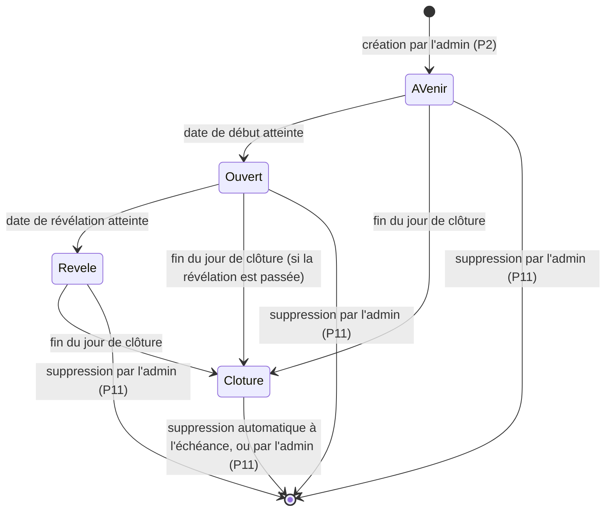

# OuiSnap : document de définition des processus (PDD)

Version du 6 octobre 2026. Les valeurs chiffrées sont suivies du fichier du code où elles sont lues, entre parenthèses (chemins relatifs à `public/api/` pour les `.php`, à `src/` pour le reste).

## 1. Introduction

### 1.1 Objet

Ce document décrit les processus métier de OuiSnap tels qu'ils fonctionnent aujourd'hui : qui fait quoi, dans quel ordre, selon quelles règles, et ce que l'utilisateur voit à l'écran. Il ne décrit pas comment ils sont programmés.

### 1.2 Périmètre

Du formulaire de demande de la vitrine jusqu'à la suppression d'un album, pour les quatre types d'acteurs (visiteur, administrateur, organisateurs, invités). Le service est gratuit au lancement : le paiement et le contrat avec le client n'en font pas partie (voir le chapitre 6).

### 1.3 Documents liés

- [README.md](../README.md) : présentation fonctionnelle et état d'avancement.
- [SDD.md](SDD.md) : conception technique (architecture, installation, commandes, mise en ligne, tests).

### 1.4 Glossaire

| Terme | Définition |
|---|---|
| Événement | Ce que Franck crée dans l'administration : un mariage, un baptême, un anniversaire ou un autre événement, avec ses dates et ses limites. |
| Album | Ensemble des photos d'un événement. Chaque événement a un album. |
| Organisateurs | Les personnes qui reçoivent l'album : mariés, famille, hôtes. Elles sont désignées par un nom et une adresse e-mail à la création de l'événement. |
| Invité / photographe | Personne qui rejoint l'album en scannant le QR code. Elle est identifiée par son prénom, sans compte. |
| Code | Code de 8 caractères propre à l'événement, contenu dans le QR code (admin-event-save.php). |
| Lien privé | Adresse de l'album des organisateurs, avec une clé secrète : `/album/?k=…`. Qui l'a voit toutes les photos après la révélation. |
| Lien personnel | Adresse envoyée par e-mail à l'invité qui a laissé son adresse : elle rouvre sa session sur n'importe quel appareil. |
| Révélation | Moment où l'album est dévoilé aux organisateurs et où les envois s'arrêtent. |
| Clôture | Dernier jour d'accès à l'album. Ensuite, plus personne sauf l'administrateur n'y accède. Elle fixe aussi l'échéance de suppression de l'album. |
| Échéance de suppression | Date à partir de laquelle un album clôturé peut être supprimé automatiquement : la clôture plus six mois, ou une date plus proche choisie par l'administrateur (RG-117). |
| Préavis | E-mail d'avertissement envoyé trente jours avant l'échéance aux organisateurs et à l'administrateur (RG-120). |
| Coup de cœur | Marque posée par les organisateurs sur une photo après la révélation. |
| Bonus e-mail | Photos supplémentaires accordées à l'invité qui laisse son adresse. |
| Carte de table | Carte A6 portant le QR code des invités, imprimée par quatre sur une page A4 (puis ses dos sur une seconde page, en recto-verso) et posée sur les tables. Son dessin dépend du type d'événement. |
| Carte des organisateurs | Carte A5 en paysage, imprimée par deux sur une page A4, remise en main propre aux organisateurs. Son QR code ouvre l'album privé. |
| File d'attente des e-mails | Liste des e-mails d'ouverture, de révélation et de préavis de suppression à envoyer. Un message qui ne part pas y reste et est retenté (P12). |
| Tâche planifiée | Programme que l'hébergeur lance toutes les heures pour envoyer les e-mails en attente, même sans visite du site (cron.php). C'est aussi lui, et lui seul, qui supprime les albums arrivés à échéance et les anciennes demandes de la vitrine (retention.php). Son dernier passage est visible dans l'administration. |
| Photo en attente | Photo prise ou importée qui n'a pas encore été reçue par l'album. Elle est gardée sur le téléphone de l'invité jusqu'à ce que le serveur confirme sa réception. |
| ZIP | Fichier unique contenant toutes les photos de l'album, un dossier par photographe. |

Vocabulaire des états : l'administration affiche « À venir », « En cours », « Révélé » et « Clôturé » (admin-app.tsx). Dans ce document, « En cours » est appelé « ouvert ». Dans le code, l'état « révélé » s'appelle `closed` : ne pas le confondre avec la clôture (`expired`).

## 2. Acteurs et rôles

| Acteur | Rôle | Moyen d'accès |
|---|---|---|
| Visiteur | Découvre OuiSnap et demande un album | Page d'accueil `/` |
| Administrateur (Franck) | Crée les événements, diffuse les QR codes, modère, clôture, supprime | `/admin/`, mot de passe |
| Organisateurs | Suivent l'album, le découvrent, le téléchargent, posent des coups de cœur | Lien privé `/album/?k=…` |
| Invité / photographe | Photographie et gère ses propres photos | QR code `/e/?c=CODE`, puis lien personnel s'il a laissé son e-mail |
| Système | Envoie les e-mails à l'heure prévue ; supprime les albums échus et les anciennes demandes | E-mails : une visite utile ou la tâche planifiée (cron.php). Suppressions : la tâche planifiée lancée par l'hébergeur en ligne de commande, jamais une visite |

## 3. Vue d'ensemble

### 3.1 Cartographie des processus

| N° | Processus | Acteur principal |
|---|---|---|
| P1 | Demande d'un album depuis la vitrine | Visiteur |
| P2 | Création et réglage d'un événement | Administrateur |
| P3 | Diffusion du QR code | Administrateur, organisateurs |
| P4 | Arrivée et inscription d'un invité | Invité |
| P5 | Prise et envoi de photos | Invité |
| P6 | Consultation et suppression de ses photos | Invité |
| P7 | Suivi avant la révélation | Organisateurs |
| P8 | Révélation | Système |
| P9 | Découverte, coups de cœur et téléchargement | Organisateurs |
| P10 | Modération par l'administrateur | Administrateur |
| P11 | Clôture et suppression d'un album (automatique ou manuelle) | Système, administrateur, organisateurs |
| P12 | E-mails | Système |
| P13 | Connexion de l'administrateur et mot de passe oublié | Administrateur |

### 3.2 Cycle de vie d'un album

| État | Invités | Organisateurs | Administrateur |
|---|---|---|---|
| À venir | Message « L'album n'est pas encore ouvert » et date d'ouverture. Pas d'inscription ni d'envoi. | Compteurs à zéro, aucune image. | Tout |
| Ouvert | Inscription, envoi, consultation et suppression de leurs photos. | Compteurs rafraîchis toutes les 30 secondes, aucune image. | Tout |
| Révélé | Lecture seule de leurs photos. Plus d'envoi ni de suppression. | Photos, coups de cœur, ZIP. | Tout |
| Clôturé | « Cet album est clôturé : il n'est plus accessible. » | « Cet album est clôturé : il n'est plus accessible. » | Tout |

(lib.php : `event_state`, `require_open`, `require_revealed` ; album-app.tsx ; guest-app.tsx)

Les transitions sont déterminées par l'heure : personne ne « passe » un album d'un état à l'autre à la main. L'administrateur agit en changeant les dates de l'événement.

## 4. Les processus

### P1. Demande d'un album depuis la vitrine

**Objectif.** Permettre à un visiteur de demander un album à Franck.
**Déclencheur.** Le visiteur remplit le formulaire en bas de la page d'accueil.
**Acteurs.** Visiteur ; administrateur (destinataire).
**Préconditions.** Aucune.

**Étapes**

1. Le visiteur lit la page : vidéo de présentation, explication du principe, album surprise.
2. Il remplit : Votre nom, Votre e-mail, Type d'événement (Mariage, Baptême, Anniversaire, Autre événement), Date de l'événement, Votre message (facultatif).
3. Il clique sur « Envoyer ma demande » (le bouton affiche « Envoi… »).
4. L'écran affiche : « Merci, votre demande est envoyée. Nous vous répondons par e-mail. »
5. La demande est enregistrée et un e-mail « Demande OuiSnap : <nom> » part vers l'adresse d'expédition du service, avec un bouton « Répondre à <nom> ».
6. Franck répond par e-mail hors de l'appli, puis passe à P2.

**Règles de gestion**

- RG-01 : le nom est obligatoire, 80 caractères au plus (contact.php).
- RG-02 : l'adresse e-mail doit être valide, 254 caractères au plus (contact.php).
- RG-03 : le type d'événement doit être l'un des quatre proposés (contact.php).
- RG-04 : la date est facultative, au format année-mois-jour (contact.php).
- RG-05 : le message est facultatif, tronqué à 2 000 caractères (contact.php).
- RG-06 : un champ caché sert de piège à robots ; s'il est rempli, la demande est ignorée sans erreur (contact.php).
- RG-07 : la demande est enregistrée même si l'e-mail ne peut pas partir (contact.php).

**Exceptions**

- Champ invalide : le message de l'erreur s'affiche sous le formulaire (« Indiquez votre nom. », « Cette adresse e-mail ne semble pas valide. », « Choisissez un type d'événement. », « La date de l'événement n'est pas valide. »).
- Réseau coupé : « Connexion impossible. Vérifiez votre réseau. » (api.ts).

**Résultat.** Une demande est enregistrée et Franck est prévenu par e-mail.

### P2. Création et réglage d'un événement

**Objectif.** Créer l'album d'un client et fixer ses dates, ses limites et ses organisateurs.
**Déclencheur.** Une demande acceptée (P1) ou un accord direct avec le client.
**Acteur.** Administrateur.
**Préconditions.** Connexion à l'administration (P13).

**Étapes**

1. Dans la liste « Événements », l'administrateur clique sur « Nouvel événement » (ou « Modifier » sur un événement existant).
2. Il renseigne : Nature de l'événement, Nom de l'album, Nom des organisateurs, E-mail des organisateurs, Début, Révélation, Clôture, Suppression (facultative), Photographes maximum, Photos maximum par photographe.
3. Dès qu'il choisit le début, la révélation est proposée le lendemain à 12h00 et la clôture deux semaines après, tant qu'il ne les a pas modifiées lui-même (event-form.tsx).
4. Il clique sur « Créer l'événement » (« Enregistrer » en modification).
5. Le serveur crée l'événement avec un code de 8 caractères et une clé secrète pour le lien privé (admin-event-save.php).
6. L'administration dépose sur le serveur l'image du QR code, utilisée dans les e-mails (event-form.tsx, admin-event-qr.php).
7. La liste s'affiche avec le nouvel événement et son état.

**Règles de gestion**

- RG-08 : le nom de l'album est obligatoire, 120 caractères au plus (admin-event-save.php).
- RG-09 : la nature est mariage, baptême, anniversaire ou autre (lib.php : `EVENT_KINDS`).
- RG-10 : le nom des organisateurs est obligatoire, 80 caractères au plus ; l'e-mail des organisateurs est obligatoire, valide, 254 caractères au plus. Ces règles valent aussi à chaque modification (admin-event-save.php).
- RG-11 : le début et la révélation sont obligatoires ; la révélation doit suivre le début (admin-event-save.php).
- RG-12 : la clôture est facultative ; si elle est donnée, elle doit suivre la révélation. Elle se saisit comme un jour : l'album reste accessible jusqu'à 23h59 de ce jour, heure du navigateur de l'administrateur (event-form.tsx). Vide, l'album n'est jamais clôturé, donc jamais supprimé automatiquement (RG-118). Repousser la clôture repousse aussi l'échéance de suppression (RG-117).
- RG-13 : les deux limites (photographes, photos par photographe) sont des entiers de 1 à 65 535, ou vides pour « illimité » (admin-event-save.php).
- RG-14 : la révélation est affichée à l'heure de Paris dans les e-mails et sur la page des organisateurs (lib.php, album-app.tsx).
- RG-15 : modifier une date ou une limite agit immédiatement : l'état de l'album se recalcule à chaque requête.

**Exceptions.** Une règle non respectée affiche son message sous le formulaire, par exemple « La révélation doit avoir lieu après le début. », « La clôture doit avoir lieu après la révélation. » ou l'un des refus de la date de suppression (RG-119). Rien n'est enregistré.

**Résultat.** Un événement existe, avec son code, son lien privé et son QR code. Les e-mails prévus sont mis en attente (P12) et son échéance de suppression est calculée (P11).

### P3. Diffusion du QR code

**Objectif.** Faire parvenir le QR code aux invités et le lien privé aux organisateurs.
**Déclencheur.** Événement créé.
**Acteurs.** Administrateur, organisateurs.
**Préconditions.** P2 terminé.

**Étapes**

1. Dans la liste, l'administrateur clique sur « QR code et liens ». Deux QR codes se déplient côte à côte, avec leurs liens en dessous : à gauche « QR code des invités », à droite « QR code des organisateurs (album privé) », cadre doré et cadenas. Le second n'apparaît que si l'événement a une clé d'album.
2. « PDF pour les tables » (bouton « Préparation… » le temps de la création) télécharge `ouisnap-tables-<code>.pdf` : deux pages A4. La première porte quatre cartes A6 identiques à découper, tracées selon le type de l'événement (RG-96, RG-97) ; chaque carte porte le type d'album en capitales, le nom de l'album, le QR code des invités, une accroche et une phrase d'explication (tableau en 5.1), et le logo au pied. La seconde porte les quatre dos, aux mêmes places, à imprimer en recto-verso (RG-132 à RG-134). Une consigne affichée sous le bouton rappelle d'imprimer en recto-verso avec un retournement sur le bord long, à l'échelle 100 % et non « ajuster à la page », qui fausserait les QR codes, et de faire une feuille d'essai avant la série.
3. « QR code des invités seul » télécharge `ouisnap-qr-<code>.png`.
4. « PDF des organisateurs » télécharge `ouisnap-organisateurs-<code>.pdf` : une page A4 avec deux cartes A5 en paysage, identiques, séparées par un trait de coupe (RG-99, RG-100). Franck les imprime et les remet en main propre aux organisateurs. « QR code privé seul » télécharge `ouisnap-qr-organisateurs-<code>.png`, image qui porte le bandeau « ALBUM PRIVÉ » (RG-103).
5. Sous les deux QR codes, deux lignes : « Lien des invités (celui du QR code des invités) » et « Lien privé de l'album (pour les organisateurs) ». À côté de chaque lien, un bouton copie le lien et un bouton l'ouvre dans un nouvel onglet.
6. Franck remet aux organisateurs la carte imprimée ou le lien privé ; il peut aussi laisser faire l'e-mail d'ouverture (P12).
7. À l'ouverture de l'album, les organisateurs reçoivent l'e-mail « Votre album est ouvert » avec le QR code et le bouton « Suivre mon album ».
8. Sur leur page, le QR code apparaît avec « Touchez pour l'afficher en plein écran et le faire scanner à vos invités ». La page `/qr/?c=CODE` l'affiche en plein écran.
9. Le QR code figure aussi dans l'e-mail de bienvenue des invités (« Invitez d'autres convives »).

**Règles de gestion**

- RG-16 : le QR code des invités ouvre `/e/?c=CODE` sur l'adresse du site (qr.ts). Les QR codes imprimés contiennent cette adresse : la changer les rendrait inutilisables. Celui des organisateurs ouvre `/album/?k=CLÉ`, avec la même précaution (qr.ts).
- RG-17 : le code est de 8 caractères choisis parmi des lettres et chiffres non ambigus (pas de O/0, I/1) (admin-event-save.php).
- RG-18 : le lien privé contient une clé de 48 caractères ; il donne accès à toutes les photos après la révélation. Les organisateurs le partagent avec des personnes de confiance (mentions légales).
- RG-19 : l'image du QR code utilisée dans les e-mails n'a rien de secret ; elle est servie sans connexion (qr.php). Elle n'a pas de logo au centre (RG-102).
- RG-96 : une carte de table par type d'événement : mariage, baptême, anniversaire, autre. Un type inconnu reçoit la carte « autre » (kinds.ts : `kindKey` ; table-card.ts).
- RG-97 : tous les recto de carte de table sont de la même famille : papier blanc, ni fond ni cadre le long des bords, rien à moins de 84 px (environ 7 mm) d'un bord pour que la coupe à la main et la marge non imprimable ne se voient pas ; QR code vert sapin sur une plaque blanche carrée de 780 px (66 mm) ; logo OuiSnap en signature au pied (table-card.ts, card-kit.ts : `COTE_PLAQUE`). Rien d'autre n'est dessiné dans la plaque : sa marge garantit la lecture. Les textes d'accroche et d'explication changent selon le type (tableau en 5.1).
- RG-98 : règle du nom de l'événement, commune à toutes les cartes. Le corps diminue par pas de 4 px pour tenir sur une ligne, jusqu'à 56 px. En dessous, le nom passe sur deux lignes équilibrées, dont le corps diminue encore jusqu'au plancher de 36 px (3 mm). Si le nom ne tient toujours pas, la seconde ligne est coupée par « … ». Jamais de troisième ligne. Corps de départ : 88 px, 112 px pour les prénoms de la carte mariage (card-kit.ts : `composerNom`, `CORPS_NOM`, `CORPS_PLANCHER`).
- RG-99 : la carte des organisateurs est personnelle : on la remet en main propre, on ne la pose jamais sur les tables. Son QR code ouvre l'album privé (organizer-card.ts).
- RG-100 : la carte des organisateurs ne peut pas être confondue avec une carte de table : format A5 paysage au lieu d'A6, carton crème qui porte les mots, pastille « POUR LES MARIÉS », « POUR LA FAMILLE » ou « POUR LES ORGANISATEURS » selon le type, onglet sapin « ALBUM PRIVÉ » fixé au-dessus de la plaque du QR code (de sa largeur), consigne « Carte personnelle, à ne pas poser sur les tables. » ou, sur le carton, « Ce code est personnel : il ouvre votre album privé. Gardez cette carte pour vous et ne la posez pas sur les tables. » La carte du mariage porte aussi « RÉSERVÉ AUX MARIÉS » (organizer-card.ts).
- RG-101 : contenu de la carte des organisateurs : le titre « Votre album », le nom de l'événement (règle du nom, RG-98), « Avant la révélation : suivez qui photographie et combien de photos arrivent. Les photos, elles, restent secrètes. », « Après : découvrez toutes les photos, posez vos coups de cœur et téléchargez l'album entier. », la date de révélation (voir les exceptions), et « par PourUnOuiEternel » sous le logo. Le volet du QR code reprend le motif du type de l'événement, dessiné autrement que sur la carte de table : deux petites alliances au-dessus de la plaque (mariage), des ondes sans mots autour de la goutte (baptême), une seule grande bougie sur un présentoir (anniversaire), un viseur fermé par un cadre (autre) (organizer-card.ts).
- RG-102 : « OuiSnap » figure dans un cartouche blanc au centre des QR codes des recto des cartes de table, de la carte des organisateurs et des images de QR code de l'administration. Le cartouche est large et bas : 30 % de la largeur du code au plus, 5 modules de haut, calé sur la grille ; ses modules sont laissés blancs en entier. Pour que le code reste lisible, il est généré avec la correction d'erreurs la plus forte qui convienne : niveau H, sinon Q, sinon M, selon que le cartouche recouvre ou non un repère du code. Si aucun niveau ne convient (ou si le code est trop petit, moins de 29 modules de côté), le code est tracé sans logo. Les autres QR codes du site (page des organisateurs, plein écran, e-mails) ne changent pas : ni logo, ni cartouche, pas plus que le petit QR code du dos des cartes de table (RG-134) (card-kit.ts : `coderQr`, `tracerQr` ; qr.ts).
- RG-103 : l'image du QR code des organisateurs, y compris téléchargée, porte un bandeau sapin « ALBUM PRIVÉ » au-dessus du code, pour ne pas passer pour celle des invités (card-kit.ts : `imageQr`, event-links.tsx).
- RG-104 : les noms de fichier utilisent le code de l'événement, jamais la clé de l'album : un nom de fichier se voit dans un aperçu ou un dossier partagé (organizer-card.ts, event-links.tsx).
- RG-132 : le PDF des tables compte deux pages : les quatre recto (RG-96, RG-97), puis les quatre dos, aux mêmes places, à imprimer en recto-verso. Les quatre cartes d'une feuille étant identiques, le dos de chaque carte tombe derrière elle sans miroir ni rotation. C'est exact pour une imprimante qui retourne la feuille sur le bord long, le réglage courant ; le bord court n'est pas géré et n'a pas d'option dans l'administration (table-card.ts : `downloadTablePdf`, card-kit.ts : `enregistrerPdf`).
- RG-133 : contenu du dos d'une carte de table, de haut en bas : le slogan « La fête, vue par vous. » et la signature OuiSnap ; le mode d'emploi en trois étapes numérotées (1. ouvrir l'appareil photo du téléphone et viser le code du recto ; 2. toucher le lien qui s'affiche et donner son prénom ; 3. photographier la fête, les photos rejoignent l'album) ; « Rien à installer · Aucun compte · Un prénom suffit » ; un filet orné d'un petit motif du type de l'événement (deux alliances, goutte, bougie, mire) ; un paragraphe qui présente OuiSnap et dit qui découvrira l'album (les mariés, la famille ou les organisateurs, selon le type) ; « Ce que vous ne photographiez pas, personne ne le verra. » ; en pied, un petit QR code et « Le photographe de votre événement » avec « pourunouieternel.fr ». Le dos est commun aux quatre types, à deux détails près : le motif du filet et le paragraphe. Il n'emploie que le sapin et l'or, et reste lisible en noir et blanc. Texte à plus de 15 mm des bords latéraux de la carte (table-card.ts : `drawTableBack`).
- RG-134 : le petit QR code du dos ouvre le site du photographe (`pourunouieternel.fr`), pas l'album. Il n'a ni plaque ni cartouche « OuiSnap » (RG-102), pour ne pas passer pour le code de l'album ; il fait environ 19,6 mm et sa correction d'erreurs est de niveau Q. Les traits de coupe ne sont tracés que sur la page des recto : une imprimante recto-verso décale le dos de 2 à 3 mm, et des pointillés tracés sur les dos tomberaient à l'intérieur de la carte finie (card-kit.ts : `petitQr`, `enregistrerPdf`).

**Exceptions**

- Échec de la création d'un PDF : « Le PDF n'a pas pu être créé. Réessayez. » sous le QR code concerné (event-links.tsx).
- Code inconnu sur `/qr/` : « Ce QR code n'est pas reconnu. » (join.php).
- Événement sans clé d'album : seul le QR code des invités est proposé, avec son PDF.
- Nom d'événement très long : réduit puis coupé par « … » selon RG-98 ; jamais plus de deux lignes.
- Date de révélation de la carte des organisateurs, à l'heure de Paris, sans année : « dimanche 1er novembre à 12 h 30 » (« à 12 h » pour une heure ronde). Date absente ou illisible : « Vous serez prévenus par e-mail. » Date passée, ou album déjà dévoilé : « Votre album est dévoilé. » La date est lue au moment où le PDF est créé (organizer-card.ts : `texteRevelation`).

**Résultat.** Les invités ont un QR code à scanner, les organisateurs une carte (ou un lien) privée.

### P4. Arrivée et inscription d'un invité

**Objectif.** Faire entrer l'invité dans l'album en quelques secondes.
**Déclencheur.** L'invité scanne le QR code (`/e/?c=CODE`).
**Acteur.** Invité.
**Préconditions.** Un événement existe avec ce code.

**Étapes**

1. L'écran affiche « Connexion à l'album ».
2. Si le téléphone a déjà un jeton de session pour ce code (ou si l'invité arrive par son lien personnel), il est reconnu et passe directement à l'appareil photo (P5).
3. Sinon l'écran « Connecté ! » apparaît, avec le type d'album et le nom de l'événement.
4. L'invité saisit « Votre prénom » (obligatoire, aide : « Les mariés verront qui a pris des photos. » selon le type) et, s'il le souhaite, « Votre e-mail (facultatif) ».
5. L'écran indique la limite : « Vous pouvez envoyer jusqu'à N photos, ou N+5 avec votre e-mail. » et, pour l'e-mail, « 5 photos supplémentaires offertes si vous laissez votre e-mail. Vous serez aussi prévenu quand l'album sera dévoilé. »
6. Il accepte implicitement les règles d'utilisation et la politique de confidentialité (liens sous le bouton) et clique sur « Commencer à photographier ».
7. Le serveur crée l'invité, donne à son téléphone un jeton secret, et l'appareil photo s'ouvre.
8. S'il a laissé un e-mail, un message de bienvenue lui est envoyé (P12).

**Règles de gestion**

- RG-20 : le prénom est obligatoire ; espaces multiples réduits, caractères de contrôle retirés, 40 caractères au plus (join.php).
- RG-21 : l'e-mail est facultatif ; s'il est donné, il doit être valide, 254 caractères au plus (join.php).
- RG-22 : le bonus e-mail est de 5 photos, accordé seulement si l'album est limité en photos par photographe (lib.php : `EMAIL_BONUS`, `guest_max_photos`).
- RG-23 : un nouvel invité n'est accepté que si l'album est ouvert (ni à venir, ni révélé, ni clôturé) (join.php, lib.php : `require_open`).
- RG-24 : si le nombre maximum de photographes est atteint, un nouvel invité est refusé ; les invités déjà inscrits ne sont pas touchés (join.php).
- RG-25 : le jeton de l'invité reste dans le navigateur de son téléphone ; le serveur n'en garde que l'empreinte, sauf pour les invités qui ont laissé un e-mail (leur jeton sert à construire le lien personnel) (join.php, guest-app.tsx).
- RG-26 : l'adresse e-mail n'est jamais montrée aux organisateurs ni aux autres invités (confidentialité).
- RG-27 : le lien personnel (`/e/?c=CODE&t=…`) rouvre la session sur un autre appareil ; le jeton est retiré de la barre d'adresse après lecture (guest-app.tsx).

**Exceptions et messages**

| Situation | Ce que voit l'invité |
|---|---|
| QR code sans code | « Scannez le QR code posé sur votre table pour rejoindre l'album. » |
| Code inconnu | « Ce QR code n'est pas reconnu. » |
| Album pas encore ouvert | « L'album n'est pas encore ouvert. Rendez-vous <jour> à <heure>. » et un bouton « Réessayer » |
| Album révélé, invité inconnu | « L'album a été dévoilé. Il n'accepte plus de nouvelles photos. » |
| Album clôturé | « Cet album est clôturé : il n'est plus accessible. » |
| Prénom vide | « Indiquez votre prénom pour que les mariés sachent qui a photographié. » (selon le type) |
| E-mail invalide | « Cette adresse e-mail ne semble pas valide. » |
| Album complet | « Cet album est complet : le nombre maximum de photographes est atteint. » |
| Service indisponible | « Le service est momentanément indisponible. » avec « Réessayer » |

**Résultat.** L'invité est inscrit, son téléphone le reconnaît s'il revient.

### P5. Prise et envoi de photos

**Objectif.** Photographier ou importer des photos, et les envoyer à l'album sans effort.
**Déclencheur.** L'invité est connecté (P4).
**Acteur.** Invité.
**Préconditions.** Album ouvert, ou dévoilé pour les photos déjà prises (RG-130).

**Étapes**

1. L'appareil photo s'ouvre en plein écran (caméra arrière par défaut). L'invité peut changer de caméra, zoomer (pincement, ou bouton qui passe de 1 à 2) et utiliser l'orientation paysage (camera.tsx).
2. Il appuie sur le déclencheur : un éclair blanc confirme la prise.
3. Il peut aussi importer une ou plusieurs photos de sa galerie (bouton « Importer depuis la galerie »). Les fichiers illisibles (vidéo, format inconnu) sont ignorés.
4. Le navigateur réduit chaque photo (JPEG, 2 560 pixels au plus sur le grand côté, qualité 0,85) avant l'envoi (image.ts).
5. Chaque photo est d'abord gardée sur le téléphone, puis part vers l'album, une à une et dans l'ordre de prise, en arrière-plan (upload-queue.ts). Un compteur affiche « N / max photos » (ou « N photos » sans limite) ; il compte aussi les photos en attente. Pendant l'envoi, l'écran indique « Envoi de N photos… », complété par « Gardez cette page ouverte. » à partir de trois photos.
6. Le serveur contrôle la photo, l'enregistre, crée une vignette de 480 pixels et confirme la réception (upload.php). La photo est alors effacée du téléphone.
7. À la dernière photo permise, et seulement quand plus aucune photo n'attend : « Vous avez envoyé vos N photos. Merci ! »
8. Tant que des photos attendent, l'écran du téléphone reste allumé, si le téléphone le permet, pendant 3 minutes après le dernier progrès (ajout, photo reçue, reprise) (wake-lock.ts, upload-queue.ts).
9. Si l'invité ferme la page ou perd le réseau avant la fin, les photos en attente restent sur son téléphone. Quand il rouvre la page (en scannant de nouveau le QR code ou par son lien personnel), il n'a rien à refaire : l'écran « Connecté ! » n'apparaît pas, l'écran indique « N photos retrouvées, envoi en cours… » et les photos repartent dans l'ordre. Cette reprise vaut aussi après la révélation, tant que l'album n'est pas clôturé (RG-93, RG-130).

**Règles de gestion**

- RG-28 : limite par photographe = limite de l'événement + 5 s'il a donné son e-mail ; vide = illimité (lib.php).
- RG-29 : à l'import, si le lot dépasse la place restante, seules les premières photos sont prises : « Limite de N photos atteinte : X sur Y ajoutées. » (guest-app.tsx).
- RG-30 : le serveur n'accepte que du JPEG, 15 Mo au plus, 8 000 pixels au plus sur chaque côté (upload.php).
- RG-31 : le serveur revérifie la limite après l'enregistrement : si deux envois simultanés dépassent le plafond, le dernier est annulé (upload.php).
- RG-32 : l'envoi de nouvelles photos n'est possible que tant que l'album est ouvert. Après la révélation, l'appareil photo n'est plus proposé, mais une photo prise avant la révélation peut encore rejoindre l'album (RG-130) (guest-app.tsx, lib.php).
- RG-33 : les photos sont stockées hors du dossier public du site ; aucune adresse web n'y mène directement (lib.php).
- RG-86 : photo gardée avant envoi. Chaque photo prise ou importée est enregistrée sur le téléphone avant de partir. Elle n'en est effacée qu'après la confirmation de réception par le serveur, ou après un refus qui ne changera pas (limite atteinte, fichier non valide, album clôturé). Une photo refusée parce qu'elle n'est pas attestée prise avant la révélation est gardée, mais plus jamais renvoyée (upload-queue.ts, photo-store.ts).
- RG-87 : anti-doublon. Chaque photo reçoit un identifiant à la prise. Si le serveur connaît déjà cet identifiant pour cet invité, il répond comme au premier envoi, sans rien enregistrer. Ce contrôle passe avant ceux de l'album, du fichier et de la limite : une photo déjà reçue n'est jamais refusée ni comptée deux fois, même si la limite est atteinte ou l'album fermé entre-temps. Une page ouverte avant cette version n'envoie pas d'identifiant : la photo est acceptée comme avant. Un identifiant mal formé est refusé (upload.php).
- RG-88 : les photos partent une à une, dans l'ordre de prise. Une photo mise de côté (RG-89) puis envoyée plus tard arrive après les suivantes (upload-queue.ts).
- RG-89 : nombre d'essais. Un échec qui ne dit rien de la photo (délai dépassé, serveur en défaut, réponse qui ne vient pas de l'API, trop de demandes) compte pour un essai. Au 5e essai, la photo est mise de côté : elle reste sur le téléphone et la suivante part. Un réseau coupé ne compte pas pour un essai. Pendant une panne du serveur ou une connexion trop lente, prendre une nouvelle photo ne relance pas d'envoi et ne consomme donc pas d'essai : le prochain essai programmé suffit. Après un envoi réussi, les photos mises de côté repartent dans la même session, après celles qui attendent, avec 5 nouveaux essais. À la prochaine ouverture de la page, elles retentent aussi leur chance (upload-queue.ts : `MAX_ATTEMPTS`).
- RG-90 : rythme de reprise. Après un échec, l'envoi reprend au bout de 6, 12, 24, 48 puis 60 secondes, et dès que l'un de ces événements se produit : retour du réseau, retour sur la page, nouvelle photo, ouverture de la page. Album pas encore ouvert : nouvel essai toutes les 60 secondes. Un envoi ne dure pas plus de 60 secondes plus 30 secondes par Mo de photo, 3 minutes au plus ; au-delà, il est interrompu et compte pour un essai. Si la page est restée masquée plus de 10 secondes, l'envoi en cours est relancé sans compter d'essai (upload-queue.ts : `RETRY_SECONDS`, `uploadTimeout`).
- RG-91 : conservation sur le téléphone. Une photo qui n'est pas partie est gardée 7 jours, tous événements confondus, puis effacée à la prochaine ouverture de la page. Les 7 jours comptent depuis la date de prise, pas depuis la révélation : avec une révélation fixée au lendemain du début, la fenêtre utile après la révélation est d'environ six jours, alors que la clôture est à quatorze jours du début. Valeur actuelle, gardée par le propriétaire (upload-queue.ts : `KEEP_MS`).
- RG-92 : décompte de la limite. Le compteur est le nombre de photos reçues plus celui des photos en attente, borné à la limite ; l'invité ne peut pas prendre plus que la place restante. Si le serveur répond « limite atteinte », les photos en attente sont retirées de la file et le message l'indique. Après la révélation il n'y a plus d'appareil photo, donc plus de compteur « N / max » : le nombre de photos reçues est celui de la grille « Mes photos », relue à chaque accusé de réception, et le nombre de photos en attente est dit par la ligne de statut. L'invité ne peut plus supprimer, donc ne peut plus libérer de place : une photo en attente qui dépasse la limite est refusée et effacée du téléphone (guest-app.tsx, upload-queue.ts).
- RG-93 : révélation et clôture. À la révélation, l'invité ne peut plus prendre de nouvelles photos ni supprimer les siennes, mais les photos déjà prises et encore en attente partent vers l'album tant qu'il n'est pas clôturé (RG-130). « Mes photos » passe en lecture seule et dit où elles en sont (textes ci-dessous). Une photo que le serveur refuse parce qu'elle n'est pas attestée prise avant la révélation est gardée sur le téléphone sans être renvoyée, même si l'administrateur repousse ensuite la révélation. Les fiches qu'une version antérieure de l'application avait bloquées (« album dévoilé ») repartent à la première ouverture de la nouvelle version. Album clôturé : les photos en attente sont effacées du téléphone et l'écran « clôturé » indique combien n'ont pas pu être envoyées. Code d'événement qui n'existe plus : elles sont effacées sans message (upload-queue.ts).
- RG-94 : écran maintenu allumé. Tant que des photos attendent et que l'envoi avance, l'application demande au téléphone de ne pas éteindre l'écran, sans effet si le téléphone refuse ou ne sait pas le faire (wake-lock.ts).
- RG-95 : stockage indisponible. Si le téléphone ne peut pas garder les photos (navigateur sans stockage, stockage plein, opération sans réponse au bout de 8 secondes), elles restent en mémoire de la page : elles partent tant que la page est ouverte, et l'écran demande de ne pas la fermer. Le navigateur demande aussi confirmation avant de fermer la page tant que des photos attendent (photo-store.ts, upload-queue.ts, guest-app.tsx).
- RG-130 : photo prise avant la révélation, envoyée après. Après la révélation et jusqu'à la clôture, le serveur accepte la photo d'un invité connu si le téléphone déclare une date de prise vraisemblable : postérieure au début de l'événement (borne appliquée seulement si l'événement a une date de début), antérieure à la révélation, jamais dans le futur, avec 15 minutes de tolérance d'horloge sur chaque borne. Sans date (page chargée avant cette version), avec une date mal formée ou hors de ces bornes, la photo est refusée (403 « closed ») : le comportement d'avant. La date déclarée n'est pas une preuve, c'est une déclaration du téléphone que le serveur borne : une photo réellement prise jusqu'à 15 minutes après la révélation est donc acceptée, et une personne qui avait déjà rejoint l'album avant la révélation peut y ajouter, dans la limite de son quota, une photo prise plus tard ; elle pouvait déjà envoyer n'importe quelle photo de sa galerie pendant que l'album était ouvert. La date déclarée des photos tardives est conservée (colonne `late_taken_at`). Les contrôles du fichier et du quota ne changent pas : le quota s'applique avant tout, y compris aux photos tardives. Une photo refusée pour sa date est gardée sur le téléphone (RG-86). Les photos prises avant la révélation partent dans l'ordre habituel ; une photo tardive arrive après les autres et se range à la fin de la liste de son photographe (lib.php : `posted_taken_at`, `taken_before_reveal`, `require_upload_allowed`, `TAKEN_SKEW_SECONDS` ; upload.php).
- RG-131 : ce que voient les organisateurs. Quand au moins une photo est arrivée après la révélation, la page de l'album affiche sous les compteurs : « N photos prises pendant l'événement sont arrivées après la révélation. Si vous avez déjà téléchargé l'album, téléchargez-le de nouveau pour les avoir. » (« 1 photo prise pendant l'événement est arrivée après la révélation. Si vous avez déjà téléchargé l'album, téléchargez-le de nouveau pour l'avoir. » au singulier). Les compteurs (total, par photographe) et l'archive ZIP sont calculés à chaque demande : ils sont toujours à jour. Une photo tardive se range en fin du dossier de son photographe dans l'archive, donc la numérotation des photos déjà téléchargées ne bouge pas. Aucun e-mail n'est envoyé pour une arrivée tardive, et l'e-mail de révélation n'est pas renvoyé : un invité dont toutes les photos arrivent après la révélation ne l'a pas reçu (RG-42). La page de l'album ne se rafraîchit pas toute seule après la révélation : les organisateurs voient la ligne au prochain chargement (album.php, album-app.tsx).

**Réseau instable**

- Une panne passagère (réseau coupé, serveur en panne, connexion trop lente) ne perd pas la photo : elle reste en attente sur le téléphone et l'écran l'annonce (voir les messages ci-dessous). L'envoi reprend tout seul selon RG-90.
- Réseau coupé : « Réseau indisponible. N photos en attente, gardées sur ce téléphone. » Si le téléphone ne peut pas garder les photos (RG-95) : « Réseau indisponible. N photos en attente : ne fermez pas cette page. »
- Connexion trop lente : « Connexion lente. N photos en attente : gardez cette page ouverte. »
- Serveur en défaut : « Envoi momentanément impossible. N photos en attente, nouvel essai automatique. »
- Photo mise de côté après 5 essais : « 1 photo n'a pas pu être envoyée. Elle reste sur ce téléphone, nouvel essai à la prochaine ouverture. »
- Photo illisible à la relecture (image incomplète ou abîmée) : « 1 photo en attente était illisible et n'a pas pu être envoyée. » Elle est retirée.
- Page fermée : rien ne part. Les photos en attente n'avancent que page ouverte ; elles repartent à la prochaine ouverture (étape 9).

**Après la révélation** (« Mes photos » en lecture seule). La ligne de statut dit où en sont les photos prises avant la révélation (N photos, « 1 photo prise… est encore en attente » au singulier) :

- Envoi en cours : « N photos prises avant la révélation partent vers l'album. Gardez cette page ouverte. » (stockage indisponible : « … Ne fermez pas cette page : ce navigateur ne les garde pas. »)
- Réseau coupé : « N photos prises avant la révélation sont encore en attente. Elles partiront dès que la connexion reviendra. »
- Connexion lente : « Connexion lente. N photos prises avant la révélation attendent encore : gardez cette page ouverte. »
- Serveur en défaut : « Envoi momentanément impossible. N photos prises avant la révélation attendent encore, nouvel essai automatique. »
- Photos mises de côté après 5 essais : « N photos n'ont pas pu être envoyées. Elles restent sur ce téléphone, nouvel essai à la prochaine ouverture. »
- Photos refusées (date de prise non attestée) : « N photos n'ont pas pu rejoindre l'album : elles n'ont pas été prises avant la révélation. »
- Photos arrivées : « N photos prises avant la révélation ont rejoint l'album. »

Un message ponctuel (limite atteinte, par exemple) prend le pas sur cette ligne.

**Exceptions**

| Situation | Ce qui se passe |
|---|---|
| Limite atteinte (serveur) | Les photos en attente sont retirées. « Limite de N photos atteinte : X photos n'ont pas été envoyées. » |
| Album dévoilé avant l'envoi | Les photos déjà prises partent quand même ; « Mes photos » passe en lecture seule et dit où elles en sont (RG-93, RG-130). |
| Photo non attestée prise avant la révélation | Refusée par le serveur, gardée sur le téléphone, sans nouvel essai. « N photos n'ont pas pu rejoindre l'album : elles n'ont pas été prises avant la révélation. » (RG-86, RG-130) |
| Album clôturé | Les photos en attente sont effacées. L'écran « clôturé » ajoute : « N photos n'ont pas pu être envoyées : l'album est clôturé. » |
| Album pas encore ouvert | Les photos restent en attente, nouvel essai toutes les 60 secondes. L'application interroge l'état de l'album au lieu de renvoyer la photo entière. |
| Photo trop lourde | « Cette photo est trop lourde. » La photo est retirée, les suivantes partent. |
| Fichier non valide | « Ce fichier n'est pas une photo valide. » La photo est retirée, les suivantes partent. |
| Session perdue | Le serveur ne reconnaît plus l'invité. L'invité revient à l'écran « Connecté ! » ; ses photos en attente sont gardées et partent après sa réinscription. Si le serveur reconnaît toujours l'invité (par exemple photo trop grosse pour le serveur), l'échec compte pour un essai. |
| Code d'événement inconnu | Message du serveur, photos en attente effacées. |
| Refus définitif d'une photo | Elle est retirée et le message s'affiche ; les suivantes continuent. |
| Stockage indisponible | Les photos restent en mémoire de la page : « N photos en attente. Ne fermez pas cette page : ce navigateur ne les garde pas. » (RG-95) |
| Page rouverte sans réseau | L'écran affiche « Connexion impossible. Vérifiez votre réseau. » et, en dessous, « N photos prises sur ce téléphone sont en attente : elles partiront dès que la connexion reviendra. » (« 1 photo prise… : elle partira… » au singulier). La connexion à l'album est retentée automatiquement : retour du réseau, retour sur la page, puis toutes les 6 à 60 secondes (délai maximal de 30 secondes par essai). Le bouton « Réessayer » recharge la page. Dès que la connexion revient, les photos partent sans autre geste (guest-app.tsx). |
| Caméra refusée ou absente | « L'appareil photo n'est pas accessible ici. » avec le bouton « Prendre une photo » qui ouvre l'appareil photo du téléphone |

**Résultat.** Les photos sont dans l'album, comptées pour l'invité.

### P6. Consultation et suppression de ses photos par l'invité

**Objectif.** Laisser l'invité revoir ses photos et retirer celles qu'il ne veut pas garder.
**Déclencheur.** Appui sur la vignette « Voir mes photos » de l'appareil photo.
**Acteur.** Invité.
**Préconditions.** Invité connecté ; album non clôturé.

**Étapes**

1. L'écran « Mes photos » montre une grille de vignettes, dans l'ordre de prise de vue.
2. L'invité touche une vignette pour l'agrandir (« Agrandir la photo »).
3. Pour supprimer, il touche « Supprimer » puis « Confirmer la suppression ».
4. La photo disparaît et libère une place dans sa limite.
5. Une flèche permet de revenir à l'appareil photo.

**Règles de gestion**

- RG-34 : un invité ne voit que ses propres photos (photos.php, photo.php).
- RG-35 : la suppression n'est possible que tant que l'album est ouvert ; après la révélation, « Mes photos » devient en lecture seule avec le bandeau « L'album a été dévoilé. Vous ne pouvez plus prendre de nouvelles photos ni en supprimer. » (delete.php, my-photos.tsx). La grille se met à jour quand des photos prises avant la révélation arrivent (RG-130).
- RG-36 : après la révélation, l'invité voit un cœur sur ses photos marquées coup de cœur (my-photos.tsx).
- RG-37 : album vide : « Aucune photo pour l'instant. » et, hors lecture seule, « Votre première photo apparaîtra ici. »
- RG-38 : album clôturé : les photos ne sont plus servies (photos.php, photo.php).

**Résultat.** La liste de l'invité est à jour.

### P7. Suivi par les organisateurs avant la révélation

**Objectif.** Permettre aux organisateurs de suivre l'activité sans gâcher la surprise.
**Déclencheur.** Ouverture du lien privé (bouton « Suivre mon album » de l'e-mail d'ouverture, ou lien remis par Franck).
**Acteur.** Organisateurs.
**Préconditions.** Album ni clôturé, ni révélé.

**Étapes**

1. L'écran « Ouverture de l'album » s'affiche, puis la page de l'album : type d'album, nom.
2. Un encadré annonce « Votre album se dévoile <jour> à <heure> » (heure de Paris) avec un compte à rebours en jours, heures, minutes, secondes, et « D'ici là, les photos restent une surprise. Vous pouvez seulement voir qui photographie. »
3. Le QR code des invités est affiché, à toucher pour le plein écran.
4. Le total de photos reçues et le nombre d'invités s'affichent, puis la liste « prénom, nombre de photos ».
5. Sans photo : « Aucune photo pour l'instant. Les premières arriveront dès que vos invités scanneront le QR code. »
6. La page se rafraîchit seule toutes les 30 secondes (album-app.tsx).
7. Quand la suppression de l'album est à moins de trente jours, une ligne s'ajoute sous les compteurs (RG-127).
8. Quand le compte à rebours atteint zéro, la page se recharge et bascule vers la révélation.

**Règles de gestion**

- RG-39 : avant la révélation, aucune information sur les photos ne sort du serveur, hormis le nombre par invité (album.php).
- RG-40 : seuls les invités ayant envoyé au moins une photo figurent dans la liste ; ordre par nombre de photos décroissant puis par prénom (album.php).
- RG-41 : une coupure réseau passagère garde l'affichage en place ; le prochain rafraîchissement réessaie (album-app.tsx).

**Exceptions.** Lien non reconnu : « Ce lien d'album n'est pas valide. ». Album clôturé : « Cet album est clôturé : il n'est plus accessible. » Événement sans date de révélation (anciens événements) : l'encadré affiche « La date de révélation de votre album n'est pas encore fixée. » à la place de la date et du compte à rebours (album-app.tsx).

**Résultat.** Les organisateurs savent qui photographie et combien, sans voir d'image.

### P8. Révélation

**Objectif.** Dévoiler l'album à la date prévue et prévenir tout le monde.
**Déclencheur.** L'heure de révélation est passée.
**Acteurs.** Système, organisateurs, invités.
**Préconditions.** Album ouvert.

**Étapes**

1. À l'heure de révélation, l'état de l'album devient « révélé » : les envois et les suppressions des invités sont refusés (RG-32, RG-35). Les photos déjà prises et encore en attente sur un téléphone partent quand même, tant que l'album n'est pas clôturé (RG-93, RG-130).
2. À la prochaine visite utile (page invité, page des organisateurs, administration) ou au prochain passage de la tâche planifiée, le système met en file les e-mails de révélation, une seule fois par album, puis les envoie (P12) : aux photographes concernés, puis aux organisateurs. Un message qui échoue est retenté (RG-107).
3. Les organisateurs ouvrent leur lien : la page affiche l'album (P9).

**Règles de gestion**

- RG-42 : seuls sont prévenus les invités qui ont laissé une adresse et envoyé au moins une photo (mail.php).
- RG-43 : les e-mails de révélation sont mis en file une seule fois par album, même si l'administrateur modifie ensuite les dates (mail.php : réservation par `reveal_mail_sent_at`). Les messages de la file, eux, se règlent sur la date de révélation du moment (RG-110).
- RG-44 : le message aux organisateurs indique le nombre de photos et de photographes, ou « aucune photo n'a été envoyée » (mail.php).

**Exception.** Si l'envoi d'un e-mail échoue, l'erreur est enregistrée dans le journal du serveur et le message est retenté plus tard, jusqu'à six essais (RG-107, RG-108, mail.php).

**Résultat.** L'album est dévoilé, fermé aux nouvelles photos, et tous sont prévenus. Les photos déjà prises mais pas encore parties rejoignent encore l'album (RG-130).

### P9. Découverte de l'album, coups de cœur et téléchargement

**Objectif.** Permettre aux organisateurs de parcourir, choisir et récupérer l'album.
**Déclencheur.** Ouverture du lien privé après la révélation.
**Acteur.** Organisateurs.
**Préconditions.** Album révélé et non clôturé.

**Étapes**

1. La page affiche le total (« N photos, N invités ») et le bouton « Tout télécharger ».
2. Les photos sont rangées par invité (ordre alphabétique des prénoms), chacune dans sa section avec son nombre de photos, puis dans l'ordre de prise de vue.
3. Les organisateurs touchent une photo : elle s'agrandit avec zoom, flèches précédente et suivante, et le rang « N sur total ». Un balayage vers la gauche ou la droite passe aussi à la photo suivante ou précédente, tant que la photo n'est pas zoomée. Un double appui, ou un double clic, ramène la photo à son zoom initial (photo-view.tsx).
4. Le bouton cœur ajoute ou retire un coup de cœur (« Ajouter un coup de cœur » / « Retirer le coup de cœur ») ; le cœur s'affiche tout de suite et revient en arrière si le serveur refuse.
5. « Tout télécharger » télécharge `album-<nom de l'album>.zip`. Il contient un dossier par photographe, avec des photos numérotées dans l'ordre de prise de vue (`001.jpg`, `002.jpg`…). Les photos arrivées après la révélation sont à la fin de leur dossier.
6. Quand des photos sont arrivées après la révélation, une ligne sous les compteurs l'annonce et invite à télécharger de nouveau l'album (RG-131).

**Règles de gestion**

- RG-45 : les photos ne sont servies qu'après la révélation (album-photo.php, album-like.php, album-zip.php).
- RG-46 : deux photographes de même prénom reçoivent « Camille » et « Camille-2 » comme noms de dossier ; les accents et caractères spéciaux sont retirés des noms de dossier et de fichier (album-zip.php).
- RG-47 : l'archive est écrite au fil de l'eau, sans fichier temporaire ; elle est limitée à 4 Go et 65 535 photos (format ZIP classique) ; sa taille n'est annoncée au navigateur que sous 150 Mo (album-zip.php). Un essai du 3 octobre 2026 sur le serveur : 1 000 photos (651 Mo) en 64 secondes (README précédent).
- RG-48 : le coup de cœur est vu par l'organisateur, par le photographe sur « Mes photos », et par l'administrateur (my-photos.tsx, album-view.tsx).
- RG-49 : les organisateurs ne peuvent ni supprimer ni ajouter de photo.

**Exceptions**

| Situation | Message |
|---|---|
| Aucune photo envoyée | « Aucune photo n'a été envoyée pour cet événement. » (pas de bouton de téléchargement) |
| Archive trop volumineuse | « Cet album est trop volumineux pour un seul fichier. Contactez-nous pour le récupérer. » |
| Album pas encore dévoilé | « L'album n'est pas encore dévoilé. » |
| Album clôturé | « Cet album est clôturé : il n'est plus accessible. » |

**Résultat.** Les organisateurs ont choisi leurs préférées et récupéré l'album.

### P10. Modération par l'administrateur

**Objectif.** Contrôler le contenu et retirer une photo inappropriée ou à la demande d'une personne.
**Déclencheur.** Constat de l'administrateur ou demande de retrait (droit à l'image) reçue par e-mail.
**Acteur.** Administrateur.
**Préconditions.** Connexion à l'administration.

**Étapes**

1. Dans la liste, l'administrateur clique sur « Voir les photos » de l'événement.
2. L'écran indique « N photos, N photographes » et, si besoin, « (pas encore révélé) ».
3. Les photos sont rangées par photographe ; les coups de cœur portent un cœur.
4. Il agrandit une photo ; une mention « Coup de cœur des organisateurs » s'affiche si besoin. Il passe d'une photo à l'autre par les flèches ou par un balayage vers la gauche ou la droite. Il revient à la galerie par la croix en haut à droite, ou par le bouton retour du téléphone ou du navigateur (album-view.tsx).
5. Il clique sur « Supprimer » puis sur « Confirmer la suppression ». La photo et sa vignette sont effacées du serveur.
6. L'écran passe à la photo suivante, ou se ferme s'il n'en reste plus.

**Règles de gestion**

- RG-50 : l'administrateur voit toutes les photos à tout moment : avant la révélation, après la révélation, après la clôture (admin-album.php, admin-photo.php).
- RG-51 : il peut supprimer une photo à tout moment, même après la révélation (admin-photo-delete.php).
- RG-52 : la suppression est définitive ; l'invité n'est pas prévenu.
- RG-53 : une personne qui figure sur une photo peut en demander le retrait par e-mail à l'éditeur, qui la retire (politique de confidentialité, mentions légales).

**Résultat.** La photo n'existe plus ; les compteurs de l'album baissent.

### P11. Clôture et suppression d'un album

**Objectif.** Terminer la vie d'un album : fermer l'accès, prévenir, puis effacer les données, sans geste manuel.
**Déclencheur.** Clôture : fin du jour fixé. Préavis et suppression : la tâche planifiée de l'hébergeur (voir RG-125). Suppression à la main : décision de l'administrateur.
**Acteurs.** Système, organisateurs (ils reçoivent le préavis), administrateur (il reçoit le préavis, peut régler ou repousser la date, ou supprimer à la main).
**Préconditions.** Pour la suppression automatique : l'album a une date de clôture, l'adresse d'au moins un administrateur est configurée, la tâche planifiée est lancée par l'hébergeur en ligne de commande. Aucune pour la suppression à la main.

**Étapes de la clôture**

1. À la fin du jour de clôture, l'état de l'album passe à « Clôturé ».
2. Les invités et les organisateurs n'accèdent plus à rien (messages de P4 et P7).
3. Les photos restent sur le serveur, et l'administrateur peut toujours les voir.

**Étapes de la suppression automatique**

1. Dès la création de l'événement, l'échéance est connue : la clôture plus six mois, ou la date que l'administrateur a choisie dans le champ « Suppression » (RG-117, RG-119). L'administration l'affiche sur la carte de l'événement, ligne « Suppression des photos » (RG-126). Sans clôture, il n'y a pas d'échéance (RG-118).
2. Trente jours avant l'échéance (tout de suite si elle est plus proche ou passée), au passage de la tâche planifiée, le système met le préavis en file (RG-120) : un message aux organisateurs s'ils ont une adresse (deux versions, album encore accessible ou déjà clôturé), un message à chaque adresse de l'administrateur. Les messages partent dans la foulée par la file d'e-mails (P12).
3. Les organisateurs qui ouvrent leur lien tant que l'album est accessible voient la date de suppression et le rappel de télécharger leurs photos (RG-127). Une fois l'album clôturé, ils n'ont plus accès à la page : seul l'e-mail les prévient.
4. Pendant ce délai, l'administrateur peut garder l'album plus longtemps en repoussant sa clôture, ou avancer la suppression (RG-119, RG-123). Il peut aussi supprimer l'album à la main, avec la confirmation décrite plus bas.
5. À chaque passage, la tâche examine les albums. Elle supprime ceux dont toutes les conditions du garde-fou sont réunies (RG-121) : album clôturé, échéance passée, préavis réellement envoyé depuis au moins sept jours. Au plus cinq albums par passage (RG-125).
6. Suppression : les fichiers de photos et de vignettes, l'image du QR code, puis les photos, les invités, les e-mails en file et l'événement dans la base. Le journal du serveur garde une trace (titre, code, dates). L'administration affiche la dernière suppression automatique (RG-126).
7. Si le préavis n'a pas pu partir, l'album est conservé et le préavis est remis en file une fois par jour (RG-124).

**Étapes de la suppression à la main**

1. Dans la liste, l'administrateur clique sur l'icône corbeille (« Supprimer »).
2. Une confirmation indique : « Supprimer définitivement « <nom> » ? Ses N photos seront effacées du serveur. Le QR code et le lien de l'album ne fonctionneront plus. Cette action est irréversible. »
3. Il clique sur « Supprimer définitivement » (« Suppression… » pendant l'opération) ou « Annuler ».
4. Le serveur efface les fichiers, l'image du QR code, puis les photos, les invités et l'événement de la base (même suppression que l'automatique).

**Règles de gestion**

- RG-54 : la clôture est calculée par le code à chaque requête : aucune action n'est nécessaire (lib.php : `is_expired`).
- RG-55 : la politique de confidentialité promet la suppression des albums au plus tard six mois après la clôture. Cette promesse est tenue par la suppression automatique (RG-117 à RG-125). Une réserve : le délai de sept jours après l'envoi du préavis (RG-121) peut retarder la suppression de quelques jours au-delà de six mois, par exemple si le préavis n'a pas pu partir plus tôt ; la politique de confidentialité le dit (confidentialite/page.tsx).
- RG-56 : si des fichiers n'ont pas pu être effacés, l'événement est conservé. À la main, l'erreur est affichée : « Certaines photos n'ont pas pu être supprimées du serveur. L'album a été conservé. » (admin-event-delete.php). En automatique, rien n'est affiché : l'album est conservé, l'erreur et le nombre de fichiers déjà effacés sont écrits dans le journal, et la tâche réessaie au passage suivant (lib.php : `delete_event`, retention.php).
- RG-57 : la suppression à la main est possible quel que soit l'état de l'album, sans préavis ni délai (admin-event-delete.php).
- RG-58 : les photos et la base ne sont sauvegardées que par les instantanés de l'hébergeur (README précédent).
- RG-117 : échéance et plafond. L'échéance de suppression d'un album est la clôture plus six mois sur le calendrier, à la même heure (le 31 août devient le 28 ou le 29 février, jamais le 3 mars). L'administrateur peut choisir une date plus proche, entre la clôture et ce plafond : une date plus tardive est refusée à l'enregistrement et, si elle existait quand même, ramenée au plafond par le calcul (lib.php : `DELETE_AFTER_MONTHS`, `add_months`, `deletion_due_at` ; admin-event-save.php). Pour garder un album plus longtemps, il repousse sa clôture.
- RG-118 : sans date de clôture, l'album n'est jamais supprimé automatiquement. Il en va de même si la clôture ou la date choisie est illisible ou antérieure à la clôture : dans le doute, rien n'est supprimé (lib.php : `deletion_due_at`, retention.php : `deletion_refusal`).
- RG-119 : champ « Suppression » du formulaire de l'événement : un jour, facultatif, entre la clôture et six mois après. Vide, c'est six mois après la clôture. Enregistré comme la clôture, à 23h59 de ce jour, heure du navigateur. Refus, sous le formulaire : « La suppression automatique demande une date de clôture : sans clôture, l'album n'est jamais supprimé automatiquement. » ; « La suppression ne peut pas avoir lieu avant la clôture. » ; « La suppression ne peut pas avoir lieu plus de six mois après la clôture. Pour garder l'album plus longtemps, repoussez sa date de clôture. » La comparaison au plafond se fait au jour près (admin-event-save.php, event-form.tsx : `sixMonthsLater`).
- RG-120 : préavis de 30 jours. Trente jours avant l'échéance, ou tout de suite si l'échéance est plus proche ou déjà passée (cas d'un album déjà échu quand la fonction est mise en ligne), le système met en file, une seule fois par album, un message aux organisateurs s'ils ont une adresse et un message à chaque adresse de l'administrateur (M7 et M8, voir P12). Il ne met rien en file sans adresse d'administrateur (lib.php : `DELETE_WARNING_DAYS` ; mail.php : `queue_due_delete_warnings`).
- RG-121 : garde-fou. Un album n'est supprimé que si toutes ces conditions sont vraies au moment de la décision, relues dans la base juste avant : il a une clôture ; elle est passée ; l'échéance est passée ; le préavis a été mis en file ; au moins une adresse de l'administrateur est configurée ; le préavis a réellement été envoyé (date d'envoi réussi lue dans la file) à l'administrateur et, si l'album a une adresse d'organisateurs, aux organisateurs ; le dernier de ces envois date d'au moins sept jours. Un préavis seulement mis en file ne suffit pas. Dès qu'une condition manque, ou qu'une date est illisible ou dans le futur, l'album est conservé ; les cas inattendus sont écrits dans le journal (lib.php : `DELETE_GRACE_DAYS`, `delete_warning_sends` ; retention.php : `deletion_refusal`).
- RG-122 : sans adresse d'administrateur configurée, aucun préavis n'est mis en file et aucun album n'est supprimé : l'administrateur doit toujours avoir été prévenu. Seule la suppression des anciennes demandes continue (RG-128) (retention.php : `run_retention`).
- RG-123 : remise à zéro du préavis. Quand l'administrateur enregistre un événement dont le préavis est déjà en file, celui-ci est annulé, avec ses messages non partis, si : la nouvelle échéance est à plus de trente jours ou n'existe plus (clôture retirée) ; ou elle est avancée par rapport à l'ancienne (la date annoncée doit rester vraie) ; ou l'adresse des organisateurs change (la bonne adresse doit être prévenue). Un nouveau préavis part alors le moment venu, et les sept jours repartent de son envoi. Les messages déjà envoyés sont gardés comme preuve. Dates, remise à zéro et retrait des messages sont enregistrés ensemble, ou pas du tout. Une échéance repoussée mais encore à moins de trente jours ne remet rien à zéro : la date annoncée reste vraie (admin-event-save.php).
- RG-124 : préavis jamais parti. Un préavis mis en file mais non envoyé à tous ses destinataires (six échecs puis abandon) bloque la suppression (RG-121). Pour qu'il ne reste pas bloqué en silence, la tâche le remet en file, au plus une fois par jour et par album, tant que des essais ne sont pas encore prévus ; l'événement est écrit dans le journal. Si l'envoi d'e-mails échoue durablement, l'album n'est donc jamais supprimé et le préavis est retenté chaque jour (retention.php : `reset_unsent_delete_warnings`, `DELETE_REWARN_HOURS`).
- RG-125 : déclencheur et lots. La suppression automatique n'est faite que par la tâche planifiée lancée par l'hébergeur en ligne de commande, jamais par une visite d'invité, d'organisateur ou d'administrateur, ni par l'appel de `cron.php` par une adresse web (qui l'ignore et le note dans le journal). À chaque passage, ordre : remise en file des préavis jamais partis, mise en file des préavis dus, suppression des albums échus, suppression des anciennes demandes, puis envoi des e-mails. Au plus cinq albums sont supprimés par passage, les plus anciens d'abord (`DELETE_BATCH`) ; le reste attend le passage suivant. Chaque étape est isolée : la panne de l'une n'arrête pas les autres. À la mise en ligne, un album déjà échu est d'abord annoncé, puis supprimé au plus tôt sept jours après l'envoi (cron.php, retention.php).
- RG-126 : ce que voit l'administrateur. Sur la carte de chaque événement qui a une échéance, la ligne « Suppression des photos » donne le jour réel prévu (l'échéance, jamais moins de sept jours après l'envoi du préavis), suivi de « (six mois après la clôture) » quand il n'a pas choisi de date et que l'échéance est lointaine ; puis l'état du préavis : « , avertissement envoyé le <jour> », « , avertissement en attente d'envoi » (mis en file, rien de parti), ou, à moins de trente jours, « , avertissement au prochain passage de la tâche planifiée ». La ligne passe en rouge à moins de trente jours. Dans la bulle d'état du service (RG-114), les lignes de la tâche planifiée ajoutent : « Suppressions automatiques : examinées il y a N minutes (ou heures, jours) » ; en rouge « Suppressions automatiques : aucun examen depuis N heures » au-delà de deux heures ; en rouge « Suppressions automatiques : jamais examinées. Elles ne le sont que si l'hébergeur lance la tâche planifiée en ligne de commande. » ; et, après une suppression automatique, « Dernière suppression automatique : « <titre> », le <jour>. » Ces lignes de suppression ne s'affichent que si la tâche est déjà passée une fois. Les cas en rouge font passer le bouton de la bulle à l'état d'alerte (RG-114) (admin-app.tsx : `MailStatus`, `statusAlerts`, lib.php : `admin_status`).
- RG-127 : ce que voient les organisateurs. Tant que l'album est accessible et que sa suppression est à moins de trente jours, la page affiche sous les compteurs : « Cet album reste accessible jusqu'au <jour de clôture>, puis sera supprimé le <jour de suppression>. Pensez à télécharger vos photos. », ou, si les deux jours sont le même, « Cet album sera supprimé le <jour>. Pensez à télécharger vos photos. » (heure de Paris). La date est la suppression réelle au plus tôt, qui tient compte des sept jours après l'envoi du préavis (album.php, album-app.tsx).
- RG-128 : demandes de la vitrine. Les demandes enregistrées par le formulaire sont supprimées trois ans après leur réception, par la même tâche planifiée (pas de préavis, pas de limite de nombre). Cette suppression a lieu même sans adresse d'administrateur (retention.php : `REQUEST_RETENTION_YEARS`, `delete_old_requests`).

**Exceptions**

| Situation | Ce qui se passe |
|---|---|
| Préavis impossible à envoyer (hébergeur qui refuse, adresse absente) | Aucune suppression. Le message est retenté (RG-107), puis le préavis est remis en file chaque jour (RG-124). |
| Un seul des deux destinataires a reçu le préavis | Pas de preuve complète : aucune suppression ; seul le message manquant est remis en file. |
| Dossier de photos impossible à effacer | Album conservé, tout ou rien dans la base ; journal ; nouvel essai au passage suivant (RG-56). Des photos ont pu être effacées du disque : le journal le dit. |
| Base de données refusant la suppression des lignes | Album conservé dans la base alors que ses fichiers sont déjà effacés ; journal ; nouvel essai au passage suivant. |
| Date de suppression refusée à l'enregistrement | Message sous le formulaire, rien n'est enregistré (RG-119). |
| Administrateur qui repousse la clôture après le préavis | Si la nouvelle échéance est à plus de trente jours, le préavis est annulé et refait plus tard (RG-123). |
| Administrateur qui avance la suppression | Préavis annulé et refait ; sept jours au moins avant la suppression (RG-123). |
| Album sans clôture | Jamais supprimé automatiquement (RG-118). |
| Aucune adresse d'administrateur configurée | Ni préavis ni suppression d'album (RG-122). |
| Tâche lancée par une adresse web | Elle envoie les e-mails mais n'examine aucune suppression ; l'administration écrit « jamais examinées » en rouge. |
| Migration de la base pas passée | Les examens de suppression sont en panne et ne suppriment rien ; la panne est écrite dans le journal. Rien d'autre n'est touché. |
| Plus de cinq albums échus | Cinq par passage, les autres aux passages suivants. |

**Résultat.** Plus aucune photo, aucun invité, aucune adresse e-mail liée à l'événement, et chacun a été prévenu à l'avance.

### P12. E-mails

**Objectif.** Informer chaque acteur au bon moment, sans intervention de l'administrateur, et ne pas perdre un message parce qu'un envoi a échoué.
**Acteur.** Système ; administrateur (il voit l'état, voir RG-114 à RG-116).
**Déclencheur.** Pour M1, M5 et M6 : l'action de l'utilisateur. Pour M2 à M4 : l'heure d'ouverture ou de révélation de l'album, passée. Pour M7 et M8 : la tâche planifiée, à trente jours de l'échéance de suppression (RG-120).

| N° | Message (objet) | Destinataire | Déclencheur | File d'attente et nouveaux essais |
|---|---|---|---|---|
| M1 | « <album> » : bienvenue parmi les photographes | L'invité qui a laissé son e-mail | À son inscription (join.php). Lien « Continuer à photographier », QR code, mention du bonus. | Non : un essai, l'échec est noté dans le journal |
| M2 | « <album> » : votre album est ouvert | E-mail des organisateurs | À l'ouverture de l'album, une fois (mail.php). QR code, bouton « Suivre mon album ». | Oui |
| M3 | « <album> » : l'album est dévoilé | Invités ayant laissé un e-mail et envoyé au moins une photo | À la révélation, une fois par album, un message par invité (mail.php). Bouton « Revoir mes photos ». | Oui |
| M4 | « <album> » : votre album est dévoilé | E-mail des organisateurs | À la révélation, une fois (mail.php). Nombre de photos et de photographes, bouton « Découvrir mon album », jour de clôture. | Oui |
| M5 | Demande OuiSnap : <nom> | Adresse d'expédition du service | À l'envoi du formulaire de la vitrine (contact.php). Réponse directe au visiteur. | Non |
| M6 | OuiSnap : réinitialisation du mot de passe d'administration | Adresses de l'administrateur | Clic sur « Mot de passe oublié ? » (admin-forgot.php). | Non : l'erreur s'affiche à l'écran |
| M7 | « <album> » : votre album sera supprimé le <jour> | E-mail des organisateurs, s'il y en a un | 30 jours avant la suppression automatique, une fois (mail.php). Titre propre au type d'événement (« Votre album de mariage sera bientôt supprimé »). Voir ci-dessous. | Oui |
| M8 | OuiSnap : « <album> » sera supprimé le <jour> | Chaque adresse de l'administrateur | En même temps que M7 (mail.php). Titre « Suppression automatique à venir », bouton « Ouvrir l'administration ». | Oui |

**Contenu de M7 et M8.** Le jour annoncé est la suppression réelle au plus tôt : l'échéance, et jamais moins de sept jours après l'envoi (heure de Paris, avec l'année). M7 existe en deux versions. Album encore accessible : « L'album « <nom> » et toutes ses photos seront définitivement supprimés de OuiSnap le <jour>. », la date jusqu'à laquelle l'album reste accessible (si elle diffère), l'invitation à télécharger les photos, une phrase propre au type (« Les souvenirs de votre mariage vous appartiennent : gardez-en une copie chez vous. »), « Après la suppression, les photos ne pourront plus être récupérées. », bouton « Ouvrir mon album », mention que le lien est privé. Album déjà clôturé : il n'est plus accessible en ligne, ses photos seront supprimées le <jour>, « Si vous les avez déjà téléchargées, vous n'avez rien à faire. », et, si une adresse d'administrateur existe, l'invitation à écrire à son photographe en répondant au message (il pourra rouvrir l'accès : la réponse va à la première adresse de l'administrateur) ; bouton « Écrire à mon photographe ». Sans adresse d'administrateur, pas de bouton ni d'invitation à répondre. M8 donne le nom de l'album, son code, son nombre de photos, la date de clôture, si les organisateurs sont prévenus (ou « Aucune adresse d'organisateurs n'est renseignée : ils ne sont pas prévenus. ») et comment garder l'album plus longtemps (modifier la date de suppression ou de clôture) ; note : « La suppression est définitive : aucune copie des photos n'est gardée. »

**Étapes pour M2 à M4 (M7 et M8 suivent les mêmes étapes)**

1. L'heure d'ouverture (M2) ou de révélation (M3, M4) d'un album est passée.
2. À la première visite utile (page invité, page des organisateurs, administration) ou au premier passage de la tâche planifiée, le système réserve l'album : il note que ses messages sont traités et met chaque message en file, tout ensemble ou rien (RG-105). Pour M7 et M8, seule la tâche planifiée le fait (RG-120).
3. Dans le même passage, le système envoie les messages de la file dont l'heure est venue (RG-113). Chaque message est reconstruit au moment de l'envoi, avec la situation du moment.
4. Un message envoyé est marqué comme tel et ne repart plus (RG-111).
5. Un message dont l'envoi échoue reste en file et sera retenté après un délai (RG-107).
6. Au sixième échec, ou si le message n'a plus d'objet, il est abandonné (RG-108, RG-109). L'administrateur voit le décompte (RG-116).
7. En parallèle, la tâche planifiée passe toutes les heures, vide la file et note son passage ; l'administration l'affiche (RG-114, RG-115).

**Règles de gestion**

- RG-59 : les messages partent de l'adresse d'expédition du service, en HTML aux couleurs de OuiSnap avec une version texte de secours (mail.php).
- RG-60 : M2 à M4 sont mis en file et envoyés « à la première occasion » : à la première visite qui appelle l'API (page invité, page des organisateurs, liste de l'administration) après l'heure prévue, ou par la tâche planifiée `cron.php` (mail.php, cron.php). Sans visite et sans tâche planifiée, le message attend.
- RG-61 : M2 n'est pas mis en file si l'album est déjà révélé à ce moment-là, ni s'il est à venir ou clôturé (mail.php).
- RG-62 : les messages de M2 à M4, M7 et M8 ne sont mis en file qu'une fois par album et par annonce (réservation en base) ; une fois envoyés, ils ne repartent plus (RG-111). M7 et M8 peuvent être remis en file seulement dans les cas de RG-123 et RG-124 (mail.php).
- RG-63 : les objets et les phrases d'accroche suivent le type d'événement (voir 5.1) (mail.php).
- RG-64 : si l'envoi de M1 ou de M5 échoue, l'erreur est notée dans le journal du serveur et le message n'est pas retenté ; si celui de M6 échoue, l'erreur est renvoyée à l'écran. M2 à M4, M7 et M8 suivent RG-107 (mail.php, join.php, contact.php, admin-forgot.php).
- RG-65 : les e-mails d'invités contiennent un pied de page rappelant que l'adresse ne sert qu'à leur écrire à propos de l'album ; ceux des organisateurs, que leur adresse a été indiquée comme celle des organisateurs (mail.php).
- RG-105 : mise en file. Quand l'heure est venue, le système réserve l'album et met en file ses messages dans une seule opération : si elle échoue, rien n'est réservé et un prochain passage recommence. M2 : un message aux organisateurs. M3 : un message par invité qui, à cet instant, a une adresse et au moins une photo. M4 : un message aux organisateurs. M7 : un message aux organisateurs, si l'événement a une adresse d'organisateurs. M8 : un message par adresse de l'administrateur (le rang de l'adresse sert de destinataire). Les organisateurs ne reçoivent un message que si l'événement a une adresse d'organisateurs et une clé d'album. Un invité qui n'avait pas de photo à ce moment n'est pas ajouté ensuite (mail.php : `claim_event_mails`, `queue_due_open_mails`, `queue_due_reveal_mails`).
- RG-106 : une seule mise en file par message : un même message (album, nature, destinataire) ne peut figurer qu'une fois dans la file (mail.php, 016_mail_queue.sql).
- RG-107 : nouveaux essais. Un message (M2, M3, M4, M7, M8) est essayé au plus 6 fois : le premier essai tout de suite, puis après 10 minutes, 30 minutes, 2 heures, 6 heures et 12 heures, chaque délai étant compté depuis l'essai précédent. Le total est d'au moins 20 h 40 ; il est plus long en pratique, car un essai n'a lieu qu'à un passage (visite ou tâche planifiée, toutes les heures) (mail.php : `MAIL_RETRY_DELAYS`).
- RG-108 : abandon après échec. Si le sixième essai échoue, le message est abandonné : il n'est plus jamais retenté et reste compté comme abandonné. L'erreur est notée dans le journal du serveur à chaque essai et à l'abandon (mail.php : `flush_mail_queue`).
- RG-109 : message sans objet. Le message est abandonné, sans attendre les six essais, dans ces cas : album clôturé (M2 à M4 seulement : M7 et M8 partent justement quand l'album est clôturé) ; événement supprimé ; invité supprimé, sans adresse ou sans photo (M3) ; événement sans adresse d'organisateurs ni clé d'album (M2, M4) ; album déjà dévoilé au moment d'envoyer M2 ; M7 ou M8 dont le préavis a été annulé ou n'a plus d'échéance (clôture retirée, remise à zéro) ; M7 sans adresse d'organisateurs ; M8 dont l'adresse de l'administrateur n'est plus dans la configuration ; nature de message inconnue (mail.php : `queued_mail`).
- RG-110 : message trop tôt. Si l'album n'est pas encore dévoilé (M3, M4, par exemple parce que l'administrateur a repoussé la révélation) ou pas encore ouvert (M2), le message n'est pas envoyé, et ce n'est ni un échec ni un essai : il reste en file tel quel et part au premier passage après son heure, même si la date est ensuite avancée ou repoussée de plusieurs jours. Il n'est donc plus abandonné par une révélation repoussée. Un message trop tôt ne compte pas dans les bornes d'un passage (RG-113) : ceux qui attendent leur heure ne bloquent pas les autres (mail.php : `queued_mail`, `flush_mail_queue`).
- RG-111 : pas de doublon. Un message envoyé n'est jamais renvoyé, même si deux visites arrivent en même temps : l'essai est réservé avant l'envoi et une seule visite l'obtient. Une réserve : si le serveur s'arrête après l'envoi et avant son enregistrement, le message sera retenté et pourra arriver deux fois (mail.php : `flush_mail_queue`).
- RG-112 : le message est reconstruit à chaque essai à partir de l'événement et de l'invité tels qu'ils sont à ce moment : adresse, nombre de photos et de photographes, date de clôture (mail.php : `queued_mail`).
- RG-113 : bornes par passage, pour ne pas ralentir le site ni dépasser les limites de l'hébergeur : une visite envoie au plus 20 messages et travaille au plus 8 secondes ; la tâche lancée par l'hébergeur au plus 500 messages et 10 minutes ; la tâche appelée par une adresse web au plus 100 messages et 20 secondes. Le reste attend le passage suivant (mail.php : `send_due_mails`, cron.php).
- RG-114 : état de la tâche planifiée. À chaque passage, `cron.php` note la date et son mode : lancée par l'hébergeur, ou par l'appel de son adresse web. L'administration affiche cet état dans une bulle d'info, ouverte par un petit bouton rond placé juste après le titre « Événements » ; elle ne l'écrit plus en lignes sous le titre. La bulle contient « Tâche planifiée : dernier passage il y a N minutes (ou heures, jours) », complété par « , par un appel web » quand c'est un appel web, puis les lignes des RG-115, RG-116 et RG-126. Le bouton porte un pictogramme d'information, à contour discret, quand tout va bien, et un pictogramme d'avertissement coloré (rouge clair) quand quelque chose demande l'attention de l'administrateur (voir RG-115). La bulle s'ouvre et se ferme au clic ou au toucher ; elle se ferme aussi avec la touche Échap ou en touchant ailleurs, et le bouton s'utilise au clavier. Le bouton n'existe que si l'état a pu être lu (cron.php, admin-app.tsx : `StatusBubble`, `MailStatus`).
- RG-115 : alerte. Si la tâche n'est jamais passée, l'administration affiche en rouge « Tâche planifiée : aucun passage enregistré. Les e-mails d'ouverture et de révélation ne partent qu'à la visite du site. » Si son dernier passage date de plus de deux heures : « Tâche planifiée : aucun passage depuis N heures. Les e-mails d'ouverture et de révélation ne partent qu'à la visite du site. » (« minutes » ou « jours » selon la durée) (admin-app.tsx : `MailStatus`).
- RG-129 : l'alerte se voit sans ouvrir la bulle. Le bouton passe à l'état d'alerte (pictogramme d'avertissement coloré, contour coloré) dès que l'un de ces cas se présente : tâche jamais passée ; dernier passage il y a plus de deux heures ; au moins un e-mail abandonné ; tâche déjà passée mais suppressions automatiques jamais examinées ou sans examen depuis plus de deux heures. Les e-mails seulement en attente de nouvel essai, et la dernière suppression automatique, ne déclenchent pas l'alerte. Le bouton annonce son état aux lecteurs d'écran : « Service : quelque chose demande votre attention. Voir le détail » en alerte, « Service : tout va bien. Voir le détail » sinon (admin-app.tsx : `statusAlerts`, `StatusBubble`).
- RG-116 : décompte des e-mails. Dans la bulle, sous l'état de la tâche, l'administration affiche, quand il y en a, « N e-mail(s) en attente de nouvel essai » (messages ni envoyés ni abandonnés, y compris ceux qui n'ont pas encore été essayés) et, en rouge, « N e-mail(s) abandonné(s) ». Le décompte des abandonnés ne revient pas à zéro : il ne baisse qu'à la suppression de l'événement concerné (admin-app.tsx, lib.php : `admin_status`).

**Exceptions**

| Situation | Ce qui se passe |
|---|---|
| Échec d'envoi (hébergeur qui refuse, adresse d'expédition absente) | Le message reste en file et est retenté selon RG-107. Après six essais, il est abandonné et compté en rouge dans l'administration. |
| Adresse absente ou retirée au moment de l'essai | Message abandonné sans autre essai (RG-109). |
| Invité supprimé, ou sans photo | Message abandonné (RG-109). Un invité supprimé avec son événement emporte aussi ses messages en file. |
| Date de début ou de révélation repoussée après la mise en file | Les messages M2, M3 et M4 attendent en file, sans essai consommé, et partent à leur heure (RG-110). Rien n'est abandonné à cause d'un report. |
| Album clôturé avant l'envoi | Message abandonné (RG-109). |
| Événement supprimé | Ses messages en file sont effacés avec lui (aussi à la suppression automatique). |
| La file ne peut pas fonctionner (par exemple la base est occupée) | La page visitée s'affiche normalement ; l'erreur est notée dans le journal et le passage suivant recommence. |
| Tâche lancée par l'hébergeur sans adresse du site configurée | Elle note son passage, n'envoie rien et s'arrête : les liens des messages seraient faux. L'erreur est dans le journal. |
| Serveur arrêté entre l'envoi et son enregistrement | Le message peut partir deux fois (RG-111). |
| E-mails des événements déjà traités avant la file | Un événement dont les messages avaient déjà été réservés avant la mise en place de la file n'est pas repris : ce qui avait échoué reste perdu. |

**Limite.** `mail()` répond « vrai » quand l'hébergeur accepte le message, ce qui ne garantit pas qu'il arrive (courrier indésirable, adresse erronée, rejet plus loin). OuiSnap ne le détecte pas : un tel message est compté comme envoyé. Les nouveaux essais, la mise en attente des messages trop tôt et les messages M7 et M8 n'ont jamais été éprouvés par un envoi réel.

**Résultat.** Chaque acteur reçoit ce qui le concerne, une fois, même si un premier envoi échoue.

### P13. Connexion de l'administrateur et mot de passe oublié

**Objectif.** Protéger l'administration et permettre de retrouver l'accès.
**Déclencheur.** Ouverture de `/admin/`, ou clic sur « Mot de passe oublié ? ».
**Acteur.** Administrateur.

**Étapes de connexion**

1. L'écran « Administration » demande le mot de passe.
2. L'administrateur clique sur « Se connecter » (« Connexion… »).
3. La liste des événements s'affiche. Le bouton « Déconnexion » termine la session.

**Étapes de « Mot de passe oublié »**

1. Il clique sur « Mot de passe oublié ? » (« Envoi… »).
2. L'écran affiche : « Un lien de réinitialisation vient d'être envoyé à <adresses masquées>. Il est valable une heure. Pensez à regarder dans les courriers indésirables. »
3. Il ouvre le lien reçu (M6) : `/admin/#reset=…`. Le jeton est retiré de la barre d'adresse dès qu'il est lu.
4. L'écran « Nouveau mot de passe » demande le mot de passe et sa confirmation (« 10 caractères au minimum. »).
5. Après validation, retour à l'écran de connexion avec « Mot de passe modifié. Connectez-vous avec le nouveau. »

**Règles de gestion**

- RG-66 : après 5 mots de passe erronés depuis une même adresse en 15 minutes, ou 30 toutes adresses confondues, la connexion est refusée pendant ce délai, même avec le bon mot de passe (admin-login.php).
- RG-67 : chaque échec de connexion est ralenti de 0,8 seconde (admin-login.php).
- RG-68 : la session est un cookie de session, sans durée fixée, réservé à ce site (HTTPS, inaccessible au script, même site uniquement) (lib.php).
- RG-69 : le lien de réinitialisation est valable une heure et ne sert qu'une fois ; un nouveau lien annule les précédents, mais seulement si au moins un envoi a réussi (admin-forgot.php, admin-reset.php).
- RG-70 : au plus 3 demandes par heure et 10 par jour, toutes adresses confondues (admin-forgot.php).
- RG-71 : le nouveau mot de passe compte 10 caractères au moins, 72 octets au plus, sans caractère nul, et doit être confirmé à l'identique (admin-reset.php).
- RG-72 : une saisie refusée ne consomme pas le lien (admin-reset.php).
- RG-73 : le mot de passe choisi remplace le mot de passe initial ; il déconnecte toutes les sessions ouvertes et efface les essais de connexion ratés (lib.php, admin-reset.php).
- RG-74 : la réinitialisation n'est pas disponible si les adresses de l'administrateur ou l'adresse publique du site ne sont pas configurées (admin-forgot.php).

**Exceptions**

| Situation | Message |
|---|---|
| Mauvais mot de passe | « Mot de passe incorrect. » |
| Trop d'essais | « Trop d'essais. Réessayez dans 15 minutes. » |
| Trop de demandes de lien | « Trop de demandes. Utilisez le dernier lien reçu, ou réessayez dans une heure. » |
| Envoi du lien impossible | « Le message n'a pas pu être envoyé. Réessayez dans quelques minutes. » |
| Fonction non configurée | « La réinitialisation n'est pas disponible pour l'instant. » |
| Lien expiré ou déjà utilisé | « Ce lien n'est plus valable : il a expiré ou a déjà servi. Demandez-en un nouveau. » |
| Mot de passe trop court | « Le mot de passe doit compter au moins 10 caractères. » |
| Confirmation différente | « Les deux mots de passe ne sont pas identiques. » |
| Session expirée | retour à l'écran de connexion (réponse « Connexion requise. ») |

**Secours.** Si les e-mails ne partent pas, la procédure de secours est technique : voir [SDD.md](SDD.md).

**Résultat.** L'administrateur est connecté, ou a un nouveau mot de passe.

## 5. Règles transverses

### 5.1 Adaptation des textes au type d'événement

| Type | Libellé | Titre de l'album | Qui voit qui a photographié | Désignation dans les e-mails |
|---|---|---|---|---|
| Mariage | Mariage | Album des mariés | « Les mariés verront qui a pris des photos. » | « aux mariés » |
| Baptême | Baptême | Album du baptême | « La famille verra qui a pris des photos. » | « à la famille » |
| Anniversaire | Anniversaire | Album d'anniversaire | « Les organisateurs verront qui a pris des photos. » | « aux organisateurs » |
| Autre | Autre événement | Album de l'événement | « Les organisateurs verront qui a pris des photos. » | « aux organisateurs » |

(kinds.ts, mail.php)

Textes des cartes de table, par type. Le type d'album est écrit en capitales au-dessus ou autour du nom (table-card.ts) :

| Type | Accroche | Phrase d'explication | Particularité |
|---|---|---|---|
| Mariage | « Scannez, immortalisez » | « Visez ce code avec votre téléphone et partagez vos photos avec les mariés. » | Deux alliances en tête, prénoms en grand, cadre doré autour du QR code |
| Baptême | « Scannez-moi » | « Visez ce code avec votre téléphone et photographiez. » | Goutte et ondes ; le nom et la phrase suivent les courbes |
| Anniversaire | « Scannez, c’est la fête ! » | « Visez ce code avec l’appareil photo de votre téléphone et partagez vos photos de la fête. » | Le QR code est le gâteau, sept bougies |
| Autre | « Scannez, déclenchez. » | « Visez ce code avec l’appareil photo de votre téléphone et partagez vos photos. » | Viseur d'appareil photo, texte aligné à gauche |

Textes de la carte des organisateurs, par type (organizer-card.ts) :

| Type | Pastille | Légende sous le QR code |
|---|---|---|
| Mariage | POUR LES MARIÉS | « Scannez pour ouvrir votre album » |
| Baptême | POUR LA FAMILLE | « Ouvrez votre album » |
| Anniversaire | POUR LES ORGANISATEURS | « Scannez pour ouvrir votre album » |
| Autre | POUR LES ORGANISATEURS | « Scannez pour ouvrir votre album » |

- RG-75 : le message qui demande le prénom suit la même logique : « Indiquez votre prénom pour que <les mariés | la famille | les organisateurs> sachent qui a photographié. » (kinds.ts).
- RG-76 : les e-mails ont des titres et phrases propres au mariage (« Votre album de mariage est ouvert », « Revivez votre mariage à travers le regard de vos invités. »), au baptême (« L'album du baptême est ouvert », « Revivez ce baptême à travers le regard de vos proches. ») et à l'anniversaire (« L'album d'anniversaire est ouvert », « Revivez cet anniversaire à travers le regard de vos invités. »). Le type « Autre » reste neutre (« Votre album est ouvert », « Votre album est dévoilé ») (mail.php).
- RG-77 : un type inconnu est traité comme « Autre » (kinds.ts, mail.php).

### 5.2 Confidentialité et conservation des données

- RG-78 : données des invités : prénom, photos, adresse e-mail facultative. L'adresse n'est jamais montrée aux organisateurs ni aux autres invités (politique de confidentialité).
- RG-79 : données des organisateurs : nom et adresse e-mail, pour leur écrire (ouverture, révélation, préavis de suppression).
- RG-80 : données du formulaire : nom, e-mail, type et date, message ; conservées trois ans après leur réception (politique de confidentialité). La tâche planifiée les supprime à cette échéance (RG-128). La date de réception est la seule date connue : un échange ultérieur par e-mail ne la prolonge pas.
- RG-81 : photos, prénoms et e-mails d'un événement : conservés jusqu'à la suppression de l'album, qui est automatique six mois après la clôture, les organisateurs étant prévenus trente jours avant (politique de confidentialité ; RG-55, RG-117 à RG-125). L'administrateur peut aussi supprimer un album à la main à tout moment.
- RG-82 : hébergement en France (OVH). Aucun cookie de publicité ou de mesure d'audience. Un identifiant de session est gardé dans le navigateur de l'invité ; un cookie de session sert à l'administrateur (politique de confidentialité).
- RG-83 : seule la page vitrine est ouverte aux moteurs de recherche ; l'API, l'administration, l'album, la page invité et le QR plein écran sont exclus (robots.txt).
- RG-84 : les clés des liens privés ne sont pas transmises à d'autres sites par le navigateur (Referrer-Policy) et les photos ne sont jamais accessibles par une adresse directe (README précédent, lib.php).
- RG-85 : les mentions légales et la politique de confidentialité sont accessibles depuis la page invité (écran « Connecté ! ») et la vitrine.

### 5.3 Limites et plafonds

| Élément | Valeur | Source |
|---|---|---|
| Photographes par événement | 1 à 65 535, ou illimité | admin-event-save.php |
| Photos par photographe | 1 à 65 535, ou illimité | admin-event-save.php |
| Bonus e-mail | 5 photos (si l'album est limité) | lib.php |
| Nom de l'album | 120 caractères | admin-event-save.php |
| Nom des organisateurs | 80 caractères | admin-event-save.php |
| Prénom d'un invité | 40 caractères | join.php |
| E-mail | 254 caractères | join.php, contact.php, admin-event-save.php |
| Nom du demandeur (vitrine) | 80 caractères | contact.php |
| Message de la vitrine | 2 000 caractères | contact.php |
| Code d'événement | 8 caractères | admin-event-save.php |
| Photo reçue | JPEG, 15 Mo, 8 000 px par côté | upload.php |
| Photo réduite avant envoi | 2 560 px sur le grand côté, qualité 0,85 | image.ts |
| Vignette | 480 px sur le grand côté | upload.php |
| Rafraîchissement des compteurs | 30 secondes | album-app.tsx |
| Reprise de l'envoi après un échec | 6, 12, 24, 48 puis 60 secondes ; remis à 6 s par un déclencheur | upload-queue.ts |
| Reprise, album pas encore ouvert | 60 secondes | upload-queue.ts |
| Essais avant mise de côté d'une photo | 5 | upload-queue.ts |
| Délai maximal d'un envoi | 60 s + 30 s par Mo, 180 s au plus | upload-queue.ts |
| Délai maximal de la connexion de reprise (« join ») | 30 secondes | upload-queue.ts |
| Photo en attente gardée sur le téléphone | 7 jours, depuis la prise de vue | upload-queue.ts (`KEEP_MS`) |
| Tolérance d'horloge sur la date de prise déclarée | 15 minutes | lib.php (`TAKEN_SKEW_SECONDS`) |
| Fenêtre d'arrivée d'une photo prise avant la révélation | jusqu'à la clôture côté serveur, 7 jours après la prise côté téléphone | lib.php, upload-queue.ts (`KEEP_MS`) |
| Écran maintenu allumé | 3 minutes après le dernier progrès | upload-queue.ts |
| Page masquée avant relance de l'envoi en cours | plus de 10 secondes | upload-queue.ts |
| Ouverture du stockage du téléphone | 3 secondes, puis repli en mémoire | photo-store.ts |
| Opération de stockage sans réponse | 8 secondes, puis repli en mémoire | photo-store.ts |
| Révélation par défaut | lendemain du début, 12h00 | event-form.tsx |
| Clôture par défaut | début + 14 jours | event-form.tsx |
| ZIP | 4 Go et 65 535 photos au plus ; taille annoncée sous 150 Mo | album-zip.php |
| Connexion admin | 5 échecs par adresse ou 30 au total, en 15 minutes | admin-login.php |
| Lien de réinitialisation | 1 heure, usage unique | admin-forgot.php |
| Demandes de réinitialisation | 3 par heure, 10 par 24 heures | admin-forgot.php |
| Mot de passe admin | 10 caractères au moins, 72 octets au plus | admin-reset.php |
| QR code envoyé pour les e-mails | PNG, 512 Ko au plus | admin-event-qr.php |
| Carte de table | A6 (105 × 148,5 mm), quatre par page A4, canevas de 1240 × 1748 px (300 points par pouce) ; le PDF compte deux pages : les recto, puis les dos aux mêmes places | table-card.ts |
| Petit QR code du dos de la carte de table | environ 19,6 mm de côté, correction d'erreurs Q | card-kit.ts |
| Carte des organisateurs | A5 paysage (210 × 148,5 mm), deux par page A4, canevas de 2480 × 1754 px | organizer-card.ts |
| Plaque du QR code sur une carte | carré de 780 px (66 mm) | card-kit.ts |
| Marge de sécurité des cartes de table | 84 px (environ 7 mm) | table-card.ts |
| Cartouche du logo dans le QR code | 30 % de la largeur au plus, 5 modules de haut ; correction d'erreurs H, sinon Q, sinon M | card-kit.ts |
| Corps du nom sur une carte | 88 px au départ (112 px pour le mariage), 56 px au plus petit sur une ligne, 36 px au plancher sur deux lignes | card-kit.ts |
| Conservation après clôture | six mois au plus (engagement, suppression automatique) | lib.php (`DELETE_AFTER_MONTHS`), confidentialite/page.tsx |
| Préavis avant suppression | 30 jours avant l'échéance | lib.php (`DELETE_WARNING_DAYS`) |
| Délai minimal entre l'envoi du préavis et la suppression | 7 jours | lib.php (`DELETE_GRACE_DAYS`) |
| Remise en file d'un préavis jamais parti | une fois par jour et par album au plus | retention.php (`DELETE_REWARN_HOURS`) |
| Albums supprimés par passage de la tâche | 5 au plus | retention.php (`DELETE_BATCH`) |
| Conservation des demandes de la vitrine | 3 ans après leur réception | retention.php (`REQUEST_RETENTION_YEARS`) |
| Essais d'un e-mail de la file (ouverture, révélation, préavis) | 6 au plus, puis abandon | mail.php |
| Délai avant chaque essai | tout de suite, puis 10 min, 30 min, 2 h, 6 h, 12 h après l'essai précédent | mail.php (`MAIL_RETRY_DELAYS`) |
| Borne d'une visite (envoi des e-mails) | 20 messages, 8 secondes | mail.php (`send_due_mails`) |
| Borne de la tâche lancée par l'hébergeur | 500 messages, 600 secondes | cron.php |
| Borne de la tâche appelée par adresse web | 100 messages, 20 secondes | cron.php |
| Passage attendu de la tâche planifiée | toutes les heures | admin-app.tsx |
| Alerte « aucun passage » | plus de 2 heures sans passage, ou jamais | admin-app.tsx |

### 5.4 Contrôle de bout en bout (Playwright)

Quatre scénarios Playwright rejouent des parcours réels sur le serveur local et alimentent une page de bilan (skill `pw`, `.claude/skills/pw/SKILL.md`) :

| Scénario | Ce qu'il couvre | Dernier passage |
|---|---|---|
| mariage | création par l'admin, album des organisateurs, 5 photos d'un invité, suppression par l'admin, révélation, coups de cœur | 5 octobre 2026, réussi : 11 étapes, 41 contrôles |
| mot-de-passe | demande de lien, e-mail, nouveau mot de passe, refus, plafond de demandes | 4 octobre 2026, réussi : 10 étapes, 28 contrôles |
| types | un événement de chaque type, textes adaptés | 4 octobre 2026, réussi : 28 étapes, 102 contrôles |
| reprise | photos gardées sur le téléphone quand le réseau tombe, reprise à la réouverture de la page, photo reçue dont la réponse s'est perdue (jamais en double), navigateur sans stockage, limite atteinte, album dévoilé avant l'envoi (les photos prises avant la révélation partent encore ; une fiche bloquée par l'ancienne version repart ; refus d'une date dans le futur et d'une page sans date ; le quota s'applique toujours) | 6 octobre 2026 : 11 étapes, 68 contrôles, réussi |

Les résultats sont lus dans `.playwright-mcp/resultats.json`, un fichier local qui n'est pas versionné.

## 6. Hors périmètre et points ouverts

Ce qui n'existe pas encore ou qui n'est pas confirmé :

- **Paiement** : OuiSnap est gratuit au lancement (choix de Franck, 9 octobre 2026) et l'appli ne comporte aucun paiement. Une offre payante reste possible plus tard ; elle n'est ni décidée ni décrite ici.
- **Tâche planifiée** (`cron.php`) : à créer chez l'hébergeur (une fois par heure ; la marche à suivre est dans le SDD). Tant qu'elle n'est pas créée, ou qu'elle ne passe plus, l'administration l'écrit en rouge (RG-115) et les e-mails d'ouverture et de révélation attendent la première visite utile (RG-60). Surtout, **aucun album et aucune demande ne sont supprimés** sans elle, et seulement si l'hébergeur la lance en ligne de commande, pas par une adresse web (RG-125) : l'administration l'écrit en rouge (RG-126).
- **Suppression automatique jamais éprouvée en vrai** : vérifiée sur une base de test (154 contrôles) et dans le navigateur en local, jamais sur MySQL ni avec un envoi réel du préavis (M7, M8). Dans le doute, elle ne supprime rien (RG-121). Si l'envoi d'e-mails échoue durablement, l'album n'est jamais supprimé et le préavis est retenté chaque jour (RG-124) : la promesse des six mois n'est alors pas tenue, mais aucune photo n'est perdue par surprise.
- **Six mois « au plus tard »** : le délai de sept jours après l'envoi du préavis (RG-121) peut repousser de quelques jours une suppression, notamment pour les albums déjà échus à la mise en ligne. La politique de confidentialité le dit.
- **Pas de bouton** pour renvoyer un préavis à la main ni pour suspendre une suppression : l'administrateur repousse la clôture ou la date de suppression.
- **E-mails retentés, jamais éprouvés** : le nouvel essai des e-mails d'ouverture et de révélation (RG-107) a été vérifié sur une base de test et dans le navigateur en local, jamais par un envoi réel. La remise n'est pas garantie quand l'hébergeur accepte un message (voir P12). Un message abandonné n'est pas renvoyé et l'administration n'a pas de bouton pour le renvoyer à la main. Une fenêtre étroite de double envoi existe (RG-111).
- **Réponse à une demande de la vitrine** et création de l'événement : manuelles (P1, P2).
- **Prévenir un invité** dont la photo est supprimée par l'administrateur : non prévu (RG-52).
- **Sauvegardes** : seulement les instantanés de l'hébergeur (RG-58).
- **Photos en attente à la révélation** : elles partent encore jusqu'à la clôture (RG-130). La date de prise est déclarée par le téléphone, pas prouvée ; une photo refusée pour sa date n'est plus jamais renvoyée, même si la révélation est repoussée ensuite.
- **Durée de conservation sur le téléphone** : 7 jours depuis la prise de vue (RG-91), gardée par le propriétaire. La fenêtre utile après une révélation fixée au lendemain du début est d'environ six jours, alors que la clôture est à quatorze jours du début ; l'application ne l'affiche pas, car la durée n'est vraie que si le téléphone coopère.
- **Photos arrivées après la révélation** : la page des organisateurs ne se rafraîchit pas toute seule et aucun e-mail ne les prévient (RG-131). Un invité dont toutes les photos arrivent après la révélation ne reçoit pas l'e-mail de révélation (RG-42). Non éprouvé sur MySQL ni sur Safari.
- **Page fermée** : rien ne part. L'invité doit rouvrir la page pour que ses photos en attente repartent (P5).
- **Effacement par le téléphone** : le téléphone peut effacer le stockage de la page s'il manque de place, et Safari l'efface après 7 jours sans visite. Les photos en attente sont alors perdues.
- **Navigation privée** : les photos en attente survivent à un rechargement de la page, pas à la fermeture de l'onglet, et l'application ne peut pas le détecter.
- **Navigateur intégré d'une autre application** (messagerie, réseau social) : son stockage est à part ; des photos en attente d'un autre navigateur n'y sont pas retrouvées. Aucune détection prévue.
- **Très mauvais réseau** : une photo de 3 Mo ne passe pas sous environ 160 kbit/s ; elle est mise de côté après 5 essais, sans être supprimée.
- **Photo supprimée dans « Mes photos »** alors que la réponse de son envoi s'était perdue : un renvoi la recrée. Cas très rare.
