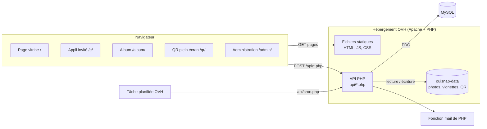
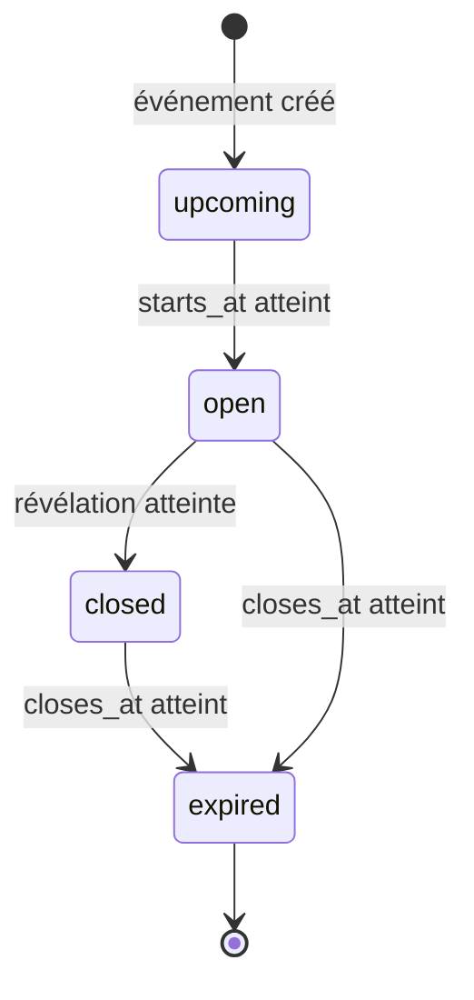
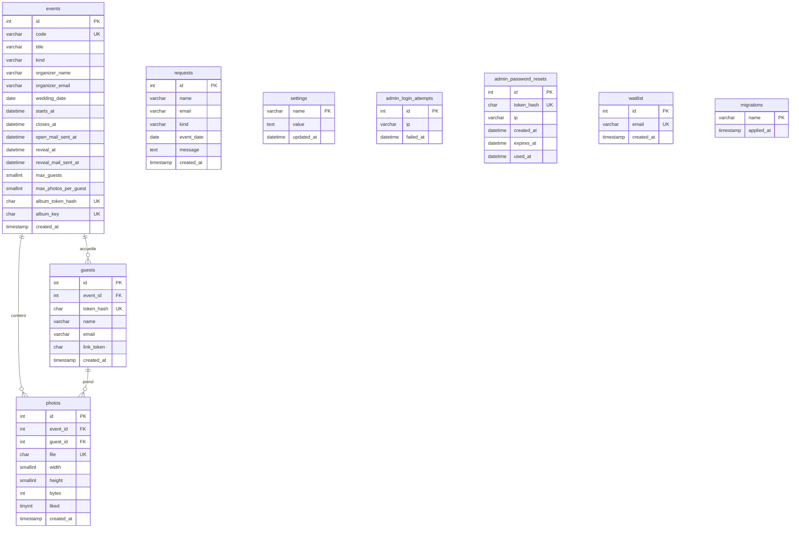
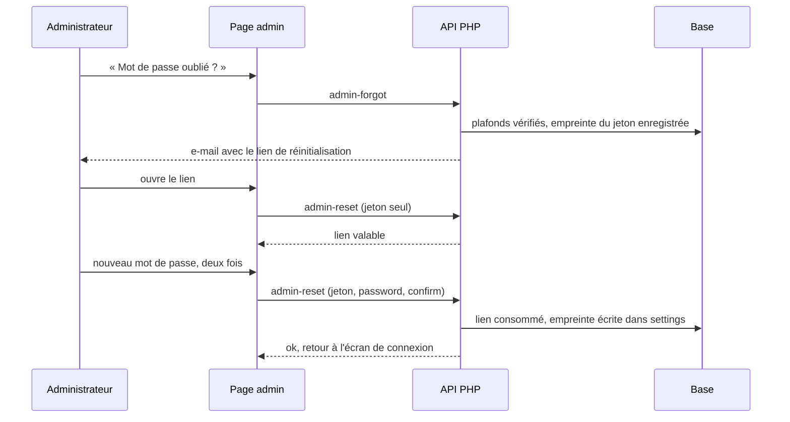
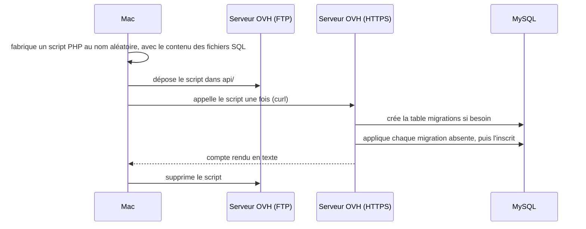

# OuiSnap — Document de conception de la solution (SDD)

| | |
|---|---|
| Projet | OuiSnap |
| Document | Solution Design Document (conception technique) |
| État du code décrit | branche `main`, commit `e777e6e` |
| Rédigé le | 4 octobre 2026 |

## Sommaire

1. [Introduction](#1-introduction)
2. [Vue d'ensemble de la solution](#2-vue-densemble-de-la-solution)
3. [Pile logicielle](#3-pile-logicielle)
4. [Organisation du dépôt](#4-organisation-du-dépôt)
5. [Interface (front)](#5-interface-front)
6. [API](#6-api)
7. [Modèle de données](#7-modèle-de-données)
8. [Stockage des fichiers](#8-stockage-des-fichiers)
9. [E-mails](#9-e-mails)
10. [Sécurité](#10-sécurité)
11. [Configuration](#11-configuration)
12. [Installation et commandes](#12-installation-et-commandes)
13. [Mise en ligne et exploitation](#13-mise-en-ligne-et-exploitation)
14. [Tests](#14-tests)
15. [Limites connues, dette et pistes](#15-limites-connues-dette-et-pistes)
16. [Annexes](#16-annexes)

---

## 1. Introduction

### 1.1 Objet

Ce document décrit comment OuiSnap est construit : architecture, code, base de données, configuration, mise en ligne, tests. Il doit suffire à quelqu'un qui reprend le projet pour l'installer, le comprendre, le modifier et le mettre en ligne.

### 1.2 Périmètre

Tout ce qui est technique : le site (Next.js exporté en fichiers statiques), l'API PHP, la base MySQL, le stockage des photos, l'envoi des e-mails, les scripts de mise en ligne, les tests de bout en bout.

Ce qui n'est pas ici : la présentation du produit et les règles métier.

### 1.3 Documents liés

| Document | Contenu |
|---|---|
| [`../README.md`](../README.md) | Présentation fonctionnelle du produit |
| [`PDD.md`](PDD.md) | Processus métier (qui fait quoi, dans quel ordre) |
| [`../AGENTS.md`](../AGENTS.md) | Avertissement sur la version de Next.js, à lire avant de toucher au front |
| [`../.claude/skills/pw/SKILL.md`](../.claude/skills/pw/SKILL.md) | Mode d'emploi des tests de bout en bout |

### 1.4 Conventions

- Les chemins sont donnés depuis la racine du dépôt (`public/api/lib.php`). Les liens sont relatifs à ce fichier.
- « Invité » ou « photographe » : la personne qui scanne le QR code et prend des photos. « Organisateurs » : les mariés, la famille, etc. « Administrateur » : Franck.
- « Révélation » : le moment où les organisateurs découvrent les photos. « Clôture » : le moment où l'album n'est plus accessible.
- « À confirmer » signale un point qui ne se vérifie pas dans le dépôt (réglage de l'hébergeur, par exemple).
- Ce document ne contient aucun secret. Les valeurs réelles sont dans `.env.deploy`, qui n'est pas versionné.

---

## 2. Vue d'ensemble de la solution

### 2.1 Contraintes qui expliquent les choix

L'hébergement est une offre mutualisée OVH. Trois conséquences :

| Contrainte | Conséquence dans le projet |
|---|---|
| PHP et MySQL disponibles, pas de Node.js en production | Le site est compilé en fichiers statiques (`out/`). Toute la logique serveur est en PHP, dans `public/api/`. |
| La base MySQL n'est joignable que depuis l'hébergement | Les migrations ne peuvent pas être lancées depuis le Mac. Un script PHP temporaire est déposé sur le serveur, appelé une fois, puis supprimé (`scripts/migrate.sh`). |
| Accès par FTP ou SFTP seulement, hébergement partagé avec d'autres sites | La mise en ligne est un envoi de fichiers (`lftp`). Le script refuse d'écrire à la racine de l'hébergement et ne supprime jamais rien sur le serveur. |

### 2.2 Schéma d'architecture



Le navigateur charge des pages statiques. Tout ce qui est dynamique passe par des requêtes `POST` vers `/api/<nom>.php`, sur le même domaine. Il n'y a pas de rendu côté serveur ni de serveur Node.

### 2.3 Environnements

| | Local | Production |
|---|---|---|
| Lancement | `npm run local` | `npm run deploy` |
| Serveur web | Serveur intégré de PHP (`php -S localhost:8000 -t out`) | Apache d'OVH |
| Base | SQLite, fichier `.local/dev.sqlite` | MySQL d'OVH |
| Photos | `.local/storage/` | `ouisnap-data/`, à côté du dossier du site |
| E-mails | Écrits dans `.local/mails.log`, jamais envoyés | Envoyés par la fonction `mail()` de PHP |
| `.htaccess` | Ignorés (le serveur intégré de PHP ne les lit pas) | Appliqués |
| Adresse | `http://localhost:8000` | `https://ouisnap.pourunouieternel.fr` |

Il n'existe pas d'environnement de recette. Les deux environnements servent le même dossier `out/` : voir le piège décrit en [13.4](#134-pièges).

---

## 3. Pile logicielle

### 3.1 Versions

Versions lues dans [`../package.json`](../package.json) et dans `node_modules/` au moment de la rédaction.

| Brique | Version déclarée | Version installée | Rôle |
|---|---|---|---|
| Next.js | `16.3.8` | 16.3.8 | Génération du site statique (App Router, `output: "export"`) |
| React, React DOM | `19.2.8` | 19.2.8 | Interface |
| TypeScript | `^5` | 5.9.3 | Typage (mode `strict`) |
| Tailwind CSS | `^4` | 4.3.3 | Styles, via `@tailwindcss/postcss` |
| Motion | `^14.0.0` | 14.0.0 | Animations (`motion/react`) |
| `@phosphor-icons/react` | `^2.1.10` | 2.1.10 | Icônes |
| `qrcode` | `^1.5.4` | 1.5.4 | Génération des QR codes dans le navigateur |
| `jspdf` | `^4.2.1` | 4.2.1 | PDF des cartes de table, chargé à la demande |
| ESLint | `^9` | 9.39.5 | Analyse du code, avec `eslint-config-next` 16.3.8 |
| PHP | — | — | API. Le code exige PHP 8.1 au minimum (type de retour `never`). Le README d'origine annonce PHP 8.3 chez OVH : à confirmer dans l'espace client. |
| MySQL | — | — | Base de production (moteur InnoDB, `utf8mb4`). Version : à confirmer. |

Extensions PHP utilisées : PDO (`pdo_mysql` en production, `pdo_sqlite` en local), `mbstring`, GD (facultative : sans elle, pas de vignettes, la photo entière est servie à la place).

Node.js : Next 16.3.8 demande Node 20.9 ou plus récent (champ `engines` du paquet).

### 3.2 Avertissement sur Next.js

[`../AGENTS.md`](../AGENTS.md) prévient : cette version de Next.js a des changements incompatibles avec les versions plus anciennes (API, conventions, structure des fichiers). Avant d'écrire du code côté front, lire le guide concerné dans `node_modules/next/dist/docs/` et tenir compte des avis de dépréciation.

Ce bloc d'`AGENTS.md` est réécrit par `next dev` à chaque lancement. Le retirer ne sert à rien : il revient. `CLAUDE.md` l'inclut par `@AGENTS.md`.

### 3.3 Réglages de compilation

| Fichier | Réglages notables |
|---|---|
| [`../next.config.ts`](../next.config.ts) | `output: "export"` (site statique dans `out/`), `trailingSlash: true` (chaque page devient `dossier/index.html`, servi par Apache à l'adresse `/dossier/`), `images.unoptimized: true` (pas de serveur pour redimensionner les images) |
| [`../tsconfig.json`](../tsconfig.json) | `strict`, cible `ES2017`, alias `@/*` vers `src/*` |
| [`../eslint.config.mjs`](../eslint.config.mjs) | Règles `core-web-vitals` et `typescript` de Next ; `.next/`, `out/`, `build/` ignorés |
| [`../postcss.config.mjs`](../postcss.config.mjs) | Greffon `@tailwindcss/postcss` |

---

## 4. Organisation du dépôt

```text
OuiSnap-1/
├── AGENTS.md               avertissement Next.js (réécrit par next dev)
├── CLAUDE.md               instructions pour les agents
├── README.md               présentation fonctionnelle
├── deploy.env.example      modèle de .env.deploy
├── package.json            dépendances et commandes npm
├── next.config.ts          export statique
├── docs/
│   ├── PDD.md              processus métier
│   └── SDD.md              ce document
├── database/
│   ├── 001_… à 014_….sql   migrations MySQL, appliquées dans l'ordre
│   └── local.sqlite.sql    schéma SQLite pour les tests locaux
├── scripts/
│   ├── deploy.sh           compile et envoie le site chez OVH
│   ├── migrate.sh          applique les migrations sur la base OVH
│   └── local.sh            lance l'appli complète en local
├── public/                 copié tel quel dans out/
│   ├── .htaccess           HTTPS forcé, en-têtes de sécurité, cache
│   ├── robots.txt, sitemap.xml
│   ├── media/              vidéo de présentation et captures de la vitrine
│   └── api/                API PHP
│       ├── .htaccess       interdit l'accès web aux fichiers internes
│       ├── lib.php         fonctions communes
│       ├── mail.php        gabarits et envoi des e-mails
│       ├── config.example.php
│       └── *.php           un fichier par endpoint
├── src/
│   ├── app/                pages (une par dossier), styles, icône
│   ├── components/         composants React
│   │   ├── guest/          appli invité
│   │   ├── album/          album des organisateurs
│   │   └── admin/          administration
│   └── lib/                fonctions partagées du front
└── .claude/skills/pw/      tests de bout en bout et leur bilan
```

Non versionné (voir [`../.gitignore`](../.gitignore)) :

| Chemin | Contenu |
|---|---|
| `.env.deploy` | Accès FTP et MySQL, mot de passe initial de l'administration. Ne jamais le versionner ni le recopier. |
| `out/`, `.next/` | Résultats de compilation |
| `public/api/config.php` | Configuration de l'API, si on en crée une à la main |
| `.local/` | Base, photos et e-mails de test |
| `.playwright-mcp/` | Résultats, captures et bilan des tests Playwright |
| `.mcp.json`, `video/` | Configuration locale des serveurs MCP ; sources de la vidéo de présentation |

---

## 5. Interface (front)

### 5.1 Pages et routes

Chaque page est un dossier de [`../src/app/`](../src/app/). Les paramètres sont lus dans l'adresse par le navigateur : il n'y a pas de route dynamique, ce qui permet l'export statique.

| Adresse | Rôle | Fichier de page | Composant principal | Paramètres d'URL |
|---|---|---|---|---|
| `/` | Page vitrine et formulaire de demande | `src/app/page.tsx` | page elle-même, `RequestForm`, `TeaserVideo` | aucun (ancres `#fonctionnement`, `#surprise`, `#demande`) |
| `/e/` | Appli des invités | `src/app/e/page.tsx` | `GuestApp` | `c` : code de l'événement. `t` : jeton du lien personnel reçu par e-mail (facultatif, retiré de l'adresse après lecture) |
| `/album/` | Album des organisateurs | `src/app/album/page.tsx` | `AlbumApp` | `k` : clé privée de l'album |
| `/qr/` | QR code de l'album en plein écran | `src/app/qr/page.tsx` | `QrPage` | `c` : code de l'événement |
| `/admin/` | Administration | `src/app/admin/page.tsx` | `AdminApp` | fragment `#reset=<jeton>` : lien de réinitialisation du mot de passe (retiré de l'adresse après lecture) |
| `/mentions-legales/` | Mentions légales et règles d'utilisation | `src/app/mentions-legales/page.tsx` | `LegalPage` | aucun |
| `/confidentialite/` | Politique de confidentialité | `src/app/confidentialite/page.tsx` | `LegalPage` | aucun |

[`../src/app/layout.tsx`](../src/app/layout.tsx) porte les polices, les métadonnées communes et la constante `SITE_URL` (adresse de production, utilisée pour le référencement). Les pages `/e/`, `/album/`, `/qr/` et `/admin/` déclarent `robots: { index: false }`. [`../public/robots.txt`](../public/robots.txt) interdit aussi `/api/`, `/admin/`, `/album/`, `/e/` et `/qr/` aux moteurs de recherche.

### 5.2 Composants principaux

| Composant | Fichier | Rôle |
|---|---|---|
| `GuestApp` | `src/components/guest/guest-app.tsx` | Chef d'orchestre de l'appli invité : connexion à l'album, écran « Connecté ! », file d'envoi, bascule entre appareil photo et « Mes photos », écrans d'attente et de clôture |
| `Camera` | `src/components/guest/camera.tsx` | Appareil photo : flux vidéo, zoom, changement de caméra, déclenchement, import depuis la galerie |
| `MyPhotos` | `src/components/guest/my-photos.tsx` | Grille des photos de l'invité, agrandissement, suppression, coups de cœur reçus |
| `AlbumApp` | `src/components/album/album-app.tsx` | Album des organisateurs : compte à rebours et compteurs avant la révélation ; ensuite photos par invité, coups de cœur, téléchargement ZIP |
| `AdminApp` | `src/components/admin/admin-app.tsx` | Connexion, liste des événements, suppression d'un événement, demande de lien « mot de passe oublié » |
| `EventForm` | `src/components/admin/event-form.tsx` | Création et modification d'un événement ; propose la révélation (lendemain 12h00) et la clôture (deux semaines après le début) |
| `EventLinks` | `src/components/admin/event-links.tsx` | QR code, PDF des tables, lien des invités, lien privé de l'album |
| `AlbumView` | `src/components/admin/album-view.tsx` | Toutes les photos d'un album pour l'administrateur, avec suppression |
| `PasswordReset` | `src/components/admin/password-reset.tsx` | Choix d'un nouveau mot de passe depuis le lien reçu |
| `PhotoImage`, `LazyThumb`, `ZoomablePhoto` | `src/components/photo-view.tsx` | Chargement d'une photo protégée, vignette chargée à l'approche de l'écran, photo agrandie avec zoom |
| `QrCard`, `QrFullScreen` | `src/components/qr-card.tsx` | QR code en vignette et en plein écran |
| `QrPage` | `src/components/qr-page.tsx` | Page `/qr/` : vérifie le code par `join`, puis affiche le QR code |
| `RequestForm` | `src/components/request-form.tsx` | Formulaire de demande de la vitrine, avec champ piège `site` |
| `LegalPage`, `Section` | `src/components/legal-page.tsx` | Gabarit des pages légales et coordonnées de l'éditeur (`EDITEUR`) |
| `Logo`, `Reveal`, `CountUp`, `TeaserVideo` | `src/components/` | Logo, apparition au défilement, compteur animé, vidéo de présentation |

### 5.3 Bibliothèques (`src/lib`)

| Fichier | Contenu |
|---|---|
| [`api.ts`](../src/lib/api.ts) | `api(chemin, champs)` : envoie un `POST` en `FormData` vers `/api/<chemin>.php` et lève une `ApiError` (code, message, statut HTTP) si la réponse n'a pas `ok: true`. `fetchPhoto()` : récupère une image sous forme de `Blob`. `ApiError.temporary` vaut vrai pour une coupure réseau ou un statut 500 et plus. |
| [`image.ts`](../src/lib/image.ts) | `toJpeg()` : réduit une image ou une image de la vidéo en JPEG de 2560 px au plus sur le grand côté, qualité 0,85. Gère le zoom numérique en ne gardant que le centre. |
| [`kinds.ts`](../src/lib/kinds.ts) | Les quatre natures d'événement et les textes qui en dépendent côté front. `kindOf()` retombe sur « autre » pour une valeur inconnue. |
| [`pinch.ts`](../src/lib/pinch.ts) | `usePinch()` : pincement à deux doigts et glissement à un doigt. |
| [`qr.ts`](../src/lib/qr.ts) | `guestUrl()`, `qrDataUrl()`, et `uploadEventQr()` qui dépose l'image du QR code sur le serveur pour les e-mails. |
| [`shutter.ts`](../src/lib/shutter.ts) | Son d'obturateur synthétisé, sans fichier audio. |
| [`table-card.ts`](../src/lib/table-card.ts) | PDF des tables : une carte A6 dessinée sur un canevas (1240 × 1748 px), posée quatre fois sur une page A4 avec traits de coupe. |

### 5.4 Session de l'invité

L'invité n'a pas de compte. Il est reconnu par un jeton.

1. À l'ouverture de `/e/?c=CODE`, `GuestApp` appelle `join` avec le code, et le jeton s'il en a un.
2. Sans jeton reconnu, l'écran « Connecté ! » demande le prénom (et l'e-mail, facultatif). `join` crée l'invité et renvoie un jeton de 48 caractères hexadécimaux.
3. Le jeton est gardé dans le `localStorage` du navigateur, sous la clé `ouisnap:invite:<CODE>`. S'il rescanne le QR code avec le même navigateur, l'invité retrouve sa session.
4. Si le `localStorage` est indisponible (navigation privée), la session dure le temps de la page.
5. Lien personnel : `/e/?c=CODE&t=JETON`. Le jeton est enregistré, puis retiré de l'adresse par `history.replaceState`. Ce lien n'existe que pour les invités qui ont laissé leur e-mail.

Côté serveur, seule l'empreinte SHA-256 du jeton est gardée (`guests.token_hash`), sauf pour les invités avec e-mail : voir [10.3](#103-jetons-des-invités-et-clé-dalbum).

L'album des organisateurs n'a pas de session : la clé `k` de l'adresse est renvoyée à chaque appel. L'administration utilise un cookie de session PHP ([10.1](#101-authentification-de-ladministration)).

### 5.5 File d'envoi des photos

Dans `GuestApp` :

- Chaque photo prise ou importée est d'abord convertie en JPEG réduit (`toJpeg`), puis ajoutée à une file en mémoire.
- Les photos partent une à une vers `upload`.
- Erreur passagère (réseau coupé, statut 500 et plus) : la file s'arrête, un nouvel essai a lieu toutes les 6 secondes et dès que le navigateur signale le retour du réseau (`online`).
- Refus définitif : la photo est retirée de la file et le message du serveur est affiché. Code `limit` : la file est vidée. Code `closed` : la file est vidée et l'appli passe en lecture seule.
- Tant que des photos attendent, le navigateur demande confirmation avant de fermer la page (`beforeunload`).
- Avant d'ajouter des photos, le front applique lui-même la limite restante. Le serveur la revérifie.

La file vit en mémoire : si la page est fermée ou rechargée, les photos pas encore envoyées sont perdues.

### 5.6 Appareil photo

Dans `Camera` :

- Flux obtenu par `getUserMedia`, caméra arrière par défaut, 2560 × 1440 demandés, sans son.
- La photo est une capture de l'image vidéo en cours, pas une prise par le capteur photo du téléphone.
- Zoom : optique si le téléphone l'expose (plafonné à 6×), sinon numérique (plafonné à 4×). Pincement ou bouton 1× / 2×.
- Le cadre affiché a exactement les proportions de la photo enregistrée. Il suit la rotation du téléphone.
- La caméra est relancée quand la page revient au premier plan (iOS la coupe en arrière-plan).
- Si la caméra n'est pas accessible, un bouton ouvre l'appareil photo du téléphone par un champ `<input type="file" capture>`.
- Import depuis la galerie : plusieurs fichiers à la fois ; les fichiers illisibles sont ignorés.

`getUserMedia` exige le HTTPS (ou `localhost`). C'est la raison d'être de la redirection HTTPS de [`../public/.htaccess`](../public/.htaccess).

### 5.7 PWA

Il n'y a ni manifeste d'application ni service worker dans le dépôt : `public/` ne contient que `.htaccess`, `robots.txt`, `sitemap.xml`, `media/` et `api/`. L'appli est une page web, sans installation et sans fonctionnement hors ligne.

Ce qui s'en approche : la couleur de thème par page (`viewport.themeColor`), `viewportFit: "cover"` pour occuper tout l'écran, et la file d'envoi qui tolère les coupures de réseau.

### 5.8 Charte

Définie dans [`../src/app/globals.css`](../src/app/globals.css). Thème unique, sombre.

| Nom | Valeur | Usage |
|---|---|---|
| `sapin-950` | `#121a16` | Fonds les plus sombres (appareil photo) |
| `sapin-900` | `#1a2620` | Fond de page |
| `sapin-800` | `#23332b` | Cartes |
| `sapin-700` | `#30443a` | Textes sur fond clair, bordures |
| `or` | `#cba660` | Accent, boutons principaux |
| `or-clair` | `#e2c88f` | Libellés, contour de focus |
| `or-fonce` | `#7d5f24` | Libellés sur fond crème |
| `creme` | `#f5f0e6` | Texte principal, fonds clairs |
| `brume` | `#b7c1b7` | Texte secondaire |
| `corail` | `#d9605a` | Coups de cœur, actions destructrices |
| `ambre`, `nuit` | `#57482f`, `#1e2942` | Teintes d'appoint |

Polices, chargées par `next/font/google` : Cormorant Garamond (titres, classe `font-serif`) et Montserrat (texte courant, classe `font-sans`). La classe utilitaire `libelle` donne les petites capitales espacées.

Les e-mails et le PDF des tables reprennent ces couleurs en dur (`public/api/mail.php`, `src/lib/table-card.ts`) : un changement de charte doit y être répercuté à la main. Le PDF utilise un doré un peu plus soutenu (`#b8924a`).

---

## 6. API

### 6.1 Conventions communes

Définies dans [`../public/api/lib.php`](../public/api/lib.php).

- **Un fichier par endpoint**, appelé à l'adresse `/api/<nom>.php`. Chaque fichier commence par `require lib.php`.
- **Méthode** : `POST` partout, sauf `qr.php` et `cron.php`. `require_post()` répond 405 sinon.
- **Entrées** : champs de formulaire (`multipart/form-data`), jamais de JSON.
- **Réponses** : JSON par `reply(code, tableau)`, avec `Cache-Control: no-store`. Un succès contient toujours `"ok": true`.
- **Erreurs** : `fail(code, erreur, message)` renvoie `{"ok": false, "error": "<code stable>", "message": "<texte affiché>"}`. Le front se sert du code `error` pour décider, et affiche `message` tel quel.
- **Images et archive** : `photo`, `album-photo`, `admin-photo`, `qr` et `album-zip` renvoient un fichier binaire, pas du JSON.
- **Dates** : stockées en UTC dans la base. L'API les renvoie au format ISO 8601 (`DATE_ATOM`). Le front les affiche en heure locale ; les e-mails les écrivent en heure de Paris.
- **Erreurs PHP** : jamais affichées (`display_errors` à 0), écrites dans le journal du serveur avec le préfixe « OuiSnap ».
- **Requêtes SQL** : toutes préparées (PDO, mode exception).

Codes d'erreur communs :

| Statut | `error` | Cause |
|---|---|---|
| 405 | `method` | Méthode autre que `POST` |
| 503 | `config` | `api/config.php` absent |
| 500 | `server` | Base injoignable, ou écriture de fichier impossible |
| 401 | `session` | Jeton d'invité absent ou inconnu |
| 401 | `auth` | Administration : pas de session valable, ou mot de passe faux |
| 404 | `album` | Clé d'album absente ou inconnue |
| 410 | `expired` | Album clôturé |

### 6.2 Endpoints

23 endpoints. « Jeton » : champ `token` contenant le jeton de l'invité. « Clé » : champ `token` contenant la clé de l'album. « Session admin » : cookie `ouisnap_admin`.

#### Invités

| Fichier | Rôle | Accès | Entrées | Réponse | Erreurs propres |
|---|---|---|---|---|---|
| `join.php` | Découvrir un événement, reprendre une session ou s'inscrire | Public, avec le code | `code` ; puis `token`, ou `name` et `email` (facultatif) | `token`, `name`, `event` (`title`, `kind`, `maxPhotos`, `emailBonus`, `state`, `opensAt`), `count` | 404 `event` (code inconnu), 403 `upcoming`, 403 `closed`, 410 `expired`, 409 `full` (nombre de photographes atteint), 422 `email` |
| `upload.php` | Recevoir une photo | Jeton | `token`, fichier `photo` | `id`, `count` | 400 `upload`, 413 `size` (plus de 15 Mo), 415 `format` (pas un JPEG, ou côté de plus de 8000 px), 409 `limit`, 403 `upcoming` / `closed`, 410 `expired` |
| `photos.php` | Lister ses photos | Jeton | `token` | `photos` (`id`, `width`, `height`, `liked`), `count` | 410 `expired` |
| `photo.php` | Image d'une de ses photos | Jeton | `token`, `id`, `size` (`thumb` ou autre) | Image JPEG | 404 `photo`, 410 `expired` |
| `delete.php` | Supprimer une de ses photos | Jeton | `token`, `id` | `count` | 404 `photo`, 403 `upcoming` / `closed`, 410 `expired` |

Les trois usages de `join.php` :

- `code` seul : renvoie l'événement, `token: null`. Aucun invité n'est créé. C'est aussi ce qu'appelle la page `/qr/`.
- `code` et `token` reconnu pour cet événement : renvoie la session, quel que soit l'état de l'album.
- `code` et `name` : crée l'invité. Refusé si l'album n'est pas ouvert ou s'il est complet. Si un e-mail est donné, le message de bienvenue part aussitôt.

#### Organisateurs

| Fichier | Rôle | Accès | Entrées | Réponse | Erreurs propres |
|---|---|---|---|---|---|
| `album.php` | État de l'album | Clé | `token` | `title`, `kind`, `code`, `revealAt`, `revealed`, `total`, `guests` (`name`, `count`) ; après la révélation seulement : `photos` (`id`, `width`, `height`, `guest`, `liked`, `name`) | — |
| `album-photo.php` | Image d'une photo de l'album | Clé, album dévoilé | `token`, `id`, `size` | Image JPEG | 403 `locked`, 404 `photo` |
| `album-like.php` | Poser ou retirer un coup de cœur | Clé, album dévoilé | `token`, `id`, `liked` (`1` ou autre) | `liked` | 403 `locked`, 404 `photo` |
| `album-zip.php` | Télécharger tout l'album | Clé, album dévoilé | `token` | Archive ZIP `album-<nom>.zip` | 403 `locked`, 404 `empty`, 413 `size` (plus de 4 Go ou de 65 535 fichiers) |

Les quatre passent par `current_album()` : 404 `album` si la clé est inconnue, 410 `expired` si l'album est clôturé.

#### Administration

| Fichier | Rôle | Accès | Entrées | Réponse | Erreurs propres |
|---|---|---|---|---|---|
| `admin-login.php` | Ouvrir une session | Public | `password` | `ok` | 401 `auth`, 429 `locked` |
| `admin-logout.php` | Fermer la session | Public | aucune | `ok` | — |
| `admin-forgot.php` | Envoyer le lien de réinitialisation | Public | aucune | `sentTo` (adresses masquées) | 503 `config`, 429 `locked`, 500 `mail` |
| `admin-reset.php` | Vérifier le lien, ou choisir le nouveau mot de passe | Jeton du lien | `token` seul (vérification) ; ou `token`, `password`, `confirm` | `ok` | 410 `link`, 422 `invalid` |
| `admin-events.php` | Lister les événements avec leurs compteurs | Session admin | aucune | `events` (voir `admin_event_payload()`) | — |
| `admin-event-save.php` | Créer (sans `id`) ou modifier (avec `id`) un événement | Session admin | `id`, `title`, `kind`, `organizerName`, `organizerEmail`, `startsAt`, `revealAt`, `closesAt`, `maxGuests`, `maxPhotos` | `event` | 422 `invalid`, 404 `event` |
| `admin-event-delete.php` | Supprimer un événement, ses invités, ses photos et son QR code | Session admin | `id` | `ok` | 404 `event`, 500 `server` (fichiers non supprimés : l'album est conservé) |
| `admin-event-qr.php` | Déposer l'image du QR code d'un événement | Session admin | `id`, fichier `qr` (PNG, 512 Ko au plus) | `ok` | 404 `event`, 400 `upload`, 415 `format`, 500 `server` |
| `admin-album.php` | Lister les photos d'un album, même avant la révélation | Session admin | `id` | `photos` | — |
| `admin-photo.php` | Image d'une photo | Session admin | `id`, `size` | Image JPEG | 404 `photo` |
| `admin-photo-delete.php` | Supprimer une photo, à tout moment | Session admin | `id` | `ok` | 404 `photo` |

Règles de `admin-event-save.php` : nom de l'album obligatoire (120 caractères au plus) ; nature parmi `mariage`, `bapteme`, `anniversaire`, `autre` ; nom (80 caractères au plus) et e-mail des organisateurs obligatoires ; début et révélation obligatoires ; révélation après le début ; clôture, si elle est donnée, après la révélation ; limites entre 1 et 65 535, ou vides pour « illimité ». À la création, le serveur tire un code de 8 caractères (alphabet sans `O`, `0`, `I`, `1`) et une clé d'album de 48 caractères hexadécimaux.

`admin-events.php` fait deux choses en plus de lister : il attribue une clé aux anciens albums qui n'en avaient pas en clair, et il déclenche l'envoi des e-mails en attente.

#### Autres

| Fichier | Rôle | Accès | Entrées | Réponse | Erreurs propres |
|---|---|---|---|---|---|
| `contact.php` | Enregistrer une demande de la vitrine et la transmettre par e-mail | Public | `name`, `email`, `kind`, `date` (facultative, `AAAA-MM-JJ`), `message` (facultatif, coupé à 2000 caractères), `site` (champ piège) | `ok` | 422 `invalid` |
| `qr.php` | Image du QR code d'un événement, pour les e-mails | Public, `GET` | `c` dans l'adresse | Image PNG, en cache 24 h | 404 sans corps |
| `cron.php` | Envoyer les e-mails en attente | Public, toute méthode | aucune | Réponse vide | — |

Si le champ piège `site` de `contact.php` est rempli, l'API répond `ok` sans rien enregistrer.

### 6.3 États d'un album

L'état est calculé à chaque appel à partir des dates. Il n'est jamais stocké.



| État | Sens | Invités | Organisateurs |
|---|---|---|---|
| `upcoming` | Pas encore ouvert | Écran d'attente ; pas d'inscription ni d'envoi | Compteurs (vides) |
| `open` | Les invités photographient | Inscription, envoi, suppression | Qui a posté, et combien. Pas les photos. |
| `closed` | Album dévoilé | Lecture seule de ses propres photos | Photos, coups de cœur, ZIP |
| `expired` | Album clôturé | Plus d'accès | Plus d'accès |

Dans l'administration, ces états s'affichent « À venir », « En cours », « Révélé », « Clôturé ».

Fonctions de [`../public/api/lib.php`](../public/api/lib.php) :

| Fonction | Rôle |
|---|---|
| `event_state($event)` | Renvoie l'état. Ordre des tests : clôturé, puis pas encore ouvert, puis dévoilé ou non. |
| `is_expired($event)` | Vrai si `closes_at` est renseigné et dépassé. |
| `reveal_at($event)` | Date de révélation : `events.reveal_at` s'il est renseigné ; sinon le lendemain de `wedding_date` à 12h00, heure de Paris ; sinon aucune. |
| `is_revealed($event)` | Vrai si la date de révélation est dépassée. |
| `require_open($event)` | Bloque avec 410 `expired`, 403 `upcoming` ou 403 `closed`. |
| `require_revealed($event)` | Bloque avec 403 `locked` tant que l'album n'est pas dévoilé. |
| `require_not_expired($event)` | Bloque avec 410 `expired`. |
| `guest_max_photos($event, $hasEmail)` | Limite de l'invité : celle de l'événement, plus 5 (`EMAIL_BONUS`) s'il a laissé son e-mail. `null` = illimité. |
| `current_guest()` | Retrouve l'invité et son événement à partir du jeton, ou 401 `session`. |
| `current_album()` | Retrouve l'événement à partir de la clé, ou 404 `album` ; vérifie la clôture. |
| `own_photo($guest)` | Photo appartenant à l'invité, ou 404 `photo`. |

La règle « lendemain de `wedding_date` à 12h00 » ne concerne que les anciens événements et les événements de test locaux : l'administration impose aujourd'hui une date de révélation.

---

## 7. Modèle de données

### 7.1 Schéma



Neuf tables en production : huit créées par les migrations, plus `migrations`, créée par `scripts/migrate.sh`. Toutes en InnoDB, `utf8mb4`.

### 7.2 Tables

#### `events` — un événement et son album

| Colonne | Type | Rôle |
|---|---|---|
| `id` | INT, clé primaire | Identifiant ; sert aussi de nom au dossier des photos |
| `code` | VARCHAR(16), unique | Code du QR code (`/e/?c=CODE`) |
| `title` | VARCHAR(120) | Nom de l'album |
| `kind` | VARCHAR(20), défaut `mariage` | Nature : `mariage`, `bapteme`, `anniversaire`, `autre` |
| `organizer_name` | VARCHAR(80), nul possible | Nom des organisateurs, pour les e-mails |
| `organizer_email` | VARCHAR(254), nul possible | E-mail des organisateurs |
| `wedding_date` | DATE, nul possible | Ancienne date de l'événement. N'est plus écrite par l'administration ; sert seulement de repli pour la révélation. |
| `starts_at` | DATETIME (UTC), nul possible | Début : pas d'envoi avant |
| `closes_at` | DATETIME (UTC), nul possible | Clôture. Nul = jamais. |
| `open_mail_sent_at` | DATETIME (UTC), nul possible | Envoi du message d'ouverture. Nul = pas encore traité. |
| `reveal_at` | DATETIME (UTC), nul possible | Révélation |
| `reveal_mail_sent_at` | DATETIME (UTC), nul possible | Envoi des messages de révélation. Nul = pas encore traité. |
| `max_guests` | SMALLINT, nul possible | Nombre maximum de photographes. Nul = illimité. |
| `max_photos_per_guest` | SMALLINT, nul possible | Photos par photographe. Nul = illimité. |
| `album_token_hash` | CHAR(64), unique, nul possible | SHA-256 de la clé d'album |
| `album_key` | CHAR(48), unique, nul possible | Clé d'album en clair, pour afficher le lien dans l'administration et l'écrire dans les e-mails |
| `created_at` | TIMESTAMP | Création |

#### `guests` — un photographe dans un événement

| Colonne | Type | Rôle |
|---|---|---|
| `id` | INT, clé primaire | Identifiant |
| `event_id` | INT, clé étrangère vers `events`, suppression en cascade | Événement |
| `token_hash` | CHAR(64), unique | SHA-256 du jeton gardé sur le téléphone |
| `name` | VARCHAR(40) | Prénom saisi |
| `email` | VARCHAR(254), nul possible | E-mail facultatif |
| `link_token` | CHAR(48), nul possible | Jeton en clair, gardé seulement si un e-mail a été donné : il sert au lien personnel du message de révélation |
| `created_at` | TIMESTAMP | Inscription |

Le même prénom peut exister plusieurs fois dans un événement.

#### `photos` — une photo

| Colonne | Type | Rôle |
|---|---|---|
| `id` | INT, clé primaire | Identifiant ; l'ordre des `id` est l'ordre de prise de vue |
| `event_id` | INT, clé étrangère vers `events`, cascade | Événement |
| `guest_id` | INT, clé étrangère vers `guests`, cascade | Photographe |
| `file` | CHAR(32), unique | Nom aléatoire du fichier, sans extension |
| `width`, `height` | SMALLINT | Dimensions en pixels |
| `bytes` | INT | Poids du fichier |
| `liked` | TINYINT(1), défaut 0 | Coup de cœur des organisateurs |
| `created_at` | TIMESTAMP | Réception |

#### `requests` — demandes de la page vitrine

`id`, `name` (VARCHAR 80), `email` (VARCHAR 254), `kind` (VARCHAR 20), `event_date` (DATE, nul possible), `message` (TEXT, nul possible), `created_at`. La demande est enregistrée avant l'envoi de l'e-mail : elle reste en base même si l'e-mail n'arrive pas. Aucun écran ne la relit ; elle se consulte dans la base.

#### `settings` — réglages modifiables depuis l'appli

`name` (clé primaire), `value`, `updated_at`. Une seule ligne est utilisée aujourd'hui : `admin_password_hash`, l'empreinte du mot de passe choisi par « Mot de passe oublié ? ».

#### `admin_login_attempts` — essais de connexion ratés

`id`, `ip` (VARCHAR 45), `failed_at` (DATETIME UTC, indexé). Les lignes de plus de 15 minutes sont effacées à chaque tentative de connexion.

#### `admin_password_resets` — liens de réinitialisation

`id`, `token_hash` (SHA-256 du jeton, unique), `ip`, `created_at` (indexé), `expires_at`, `used_at` (nul = lien encore utilisable). Les lignes de plus de 24 heures sont effacées à chaque nouvelle demande.

#### `waitlist` — ancienne liste d'attente

`id`, `email` (unique), `created_at`. Créée par la première migration pour la page vitrine d'origine. Plus aucun code ne la lit ni ne l'écrit.

#### `migrations` — suivi des migrations

`name` (nom du fichier, clé primaire), `applied_at`. Créée et tenue par `scripts/migrate.sh`.

### 7.3 Migrations

Fichiers de [`../database/`](../database/), appliqués dans l'ordre de leur nom.

| Fichier | Apport |
|---|---|
| `001_waitlist.sql` | Table `waitlist` |
| `002_app.sql` | Tables `events`, `guests`, `photos` ; événement de démonstration `DEMO2026` |
| `003_album.sql` | `events.wedding_date`, `events.album_token_hash` ; réglage de `DEMO2026` ; nettoyage de données d'essai |
| `004_reveal_at.sql` | `events.reveal_at` |
| `005_demo_reveal.sql` | Donnée seulement : dévoile `DEMO2026` deux minutes après le passage de la migration |
| `006_admin.sql` | `events.kind`, `starts_at`, `closes_at`, `max_guests`, `album_key` |
| `007_likes.sql` | `photos.liked` |
| `008_reveal_mail.sql` | `guests.email`, `events.reveal_mail_sent_at` |
| `009_guest_link.sql` | `guests.link_token` |
| `010_organizer_mail.sql` | `events.organizer_email`, `events.open_mail_sent_at` |
| `011_organizer_name.sql` | `events.organizer_name` |
| `012_login_attempts.sql` | Table `admin_login_attempts` |
| `013_requests.sql` | Table `requests` |
| `014_password_reset.sql` | Tables `settings` et `admin_password_resets` |

Les migrations 002, 003 et 005 contiennent des données de démonstration. Sur une base neuve, elles créent un événement `DEMO2026` en production : le supprimer depuis l'administration s'il n'est pas voulu.

### 7.4 Différences entre MySQL et SQLite local

[`../database/local.sqlite.sql`](../database/local.sqlite.sql) n'est pas une migration : c'est le schéma final, réécrit pour SQLite et rejoué à chaque `npm run local` (les instructions sont en `IF NOT EXISTS` et `INSERT OR IGNORE`, donc sans effet sur une base existante).

| Sujet | MySQL (production) | SQLite (local) |
|---|---|---|
| Construction | Migrations numérotées, suivies dans `migrations` | Un seul fichier, pas de suivi |
| Types | `VARCHAR`, `DATETIME`, `SMALLINT`… | `TEXT` et `INTEGER` ; aucune longueur imposée par la base |
| Clés étrangères | Toujours actives | Activées par `PRAGMA foreign_keys = ON` à chaque connexion (`db()`) |
| Tables absentes | — | `waitlist`, `migrations` |
| Index | Index sur `guests.event_id`, `photos.guest_id`, `photos.event_id`, `admin_login_attempts.failed_at` | Seulement les index uniques et celui de `admin_password_resets.created_at` |
| Données de départ | `DEMO2026` | `DEMO2026` (aujourd'hui, pas encore révélé) et `PASSE2026` (révélé) |

Conséquence pratique : **toute migration MySQL doit être reportée à la main dans `local.sqlite.sql`**, sinon l'appli locale ne correspond plus à la production. Comme le fichier ne modifie pas une base existante, il faut aussi supprimer `.local/dev.sqlite` (ou modifier la base à la main) pour que le changement prenne effet.

Le code PHP n'emploie que du SQL commun aux deux moteurs. Le seul test du moteur est dans `db()`, pour le `PRAGMA`.

---

## 8. Stockage des fichiers

### 8.1 Emplacements et nommage

Racine du stockage : `storage_dir()` dans `lib.php`.

- Production : dossier `ouisnap-data/`, placé **à côté** du dossier du site (deux niveaux au-dessus de `api/`).
- Local : `.local/storage/` (clé `storage` de la configuration).

| Fichier | Chemin | Détail |
|---|---|---|
| Photo | `<stockage>/<id événement>/<file>.jpg` | `file` : 32 caractères hexadécimaux aléatoires |
| Vignette | `<stockage>/<id événement>/<file>_t.jpg` | 480 px au plus sur le grand côté, JPEG qualité 78, créée à la réception si GD est présent |
| QR code | `<stockage>/qr/<CODE>.png` | Généré par le navigateur de l'administrateur, déposé par `admin-event-qr.php` |

Les dossiers sont créés à la demande, avec les droits `0755`.

### 8.2 Pourquoi hors du dossier web

Aucune adresse ne mène directement à une photo. Une image ne sort que par un script PHP qui vérifie d'abord le droit de la voir : jeton de l'invité (`photo.php`), clé d'album et révélation passée (`album-photo.php`, `album-zip.php`), session d'administration (`admin-photo.php`). C'est ce qui garantit la surprise avant la révélation.

Côté navigateur, les images sont donc chargées par `POST`, reçues en `Blob`, puis affichées par une adresse temporaire (`URL.createObjectURL`). Elles sont servies avec `Cache-Control: private, no-store`.

Seule exception : le QR code (`qr.php`), public, parce qu'il doit s'afficher dans les e-mails et qu'il n'a rien de secret.

### 8.3 Cycle de vie

- Avant envoi, le navigateur réduit la photo à 2560 px et la recompresse en JPEG.
- À la réception, le serveur vérifie le fichier ([10.6](#106-validation-des-envois-de-fichiers)), le range, crée la vignette, puis insère la ligne en base.
- Suppression d'une photo (invité ou administrateur) : ligne supprimée, puis fichier et vignette.
- Suppression d'un événement : les fichiers d'abord, puis la base. Si un fichier résiste, l'opération s'arrête et l'album est conservé.
- La clôture ne supprime rien : les photos d'un album clôturé restent sur le serveur jusqu'à sa suppression depuis l'administration.

### 8.4 Archive ZIP

`album-zip.php` écrit l'archive au fil de l'eau : pas de fichier temporaire, une seule photo en mémoire à la fois. Les JPEG sont rangés sans compression. Un dossier par invité (prénom sans accents ; `Camille`, `Camille-2` en cas d'homonymes), photos numérotées `001.jpg`, `002.jpg`… dans l'ordre de prise de vue.

- Limite du format : 4 Go et 65 535 fichiers par archive (413 `size` au-delà).
- La taille n'est annoncée au navigateur (`Content-Length`) qu'en dessous de 150 Mo : l'hébergement refuse les réponses qui annoncent une très grosse taille (erreur 500 constatée à 620 Mo, aucun souci à 195 Mo, d'après le commentaire du code).
- Mesure rapportée par le README d'origine, le 3 octobre 2026 sur le serveur : 1 000 photos (651 Mo) téléchargées en 64 secondes.
- Le front déclenche le téléchargement par un envoi de formulaire classique, pour que le navigateur écrive l'archive sur le disque sans la charger en mémoire.

---

## 9. E-mails

Tout est dans [`../public/api/mail.php`](../public/api/mail.php).

### 9.1 Mécanisme d'envoi

`send_mail($to, $mail, $replyTo)` :

- Production : fonction `mail()` de PHP. Expéditeur `OuiSnap <mail_from>`, adresse d'enveloppe forcée par l'option `-f`. Le message est en `multipart/alternative` : une version texte et une version HTML, encodées en base64. L'objet est encodé pour les accents.
- Si `mail_from` est vide, rien ne part et une ligne est écrite dans le journal du serveur.
- Local (clé `mail_log` présente) : rien ne part. Le texte est ajouté à `.local/mails.log`, et le HTML est écrit dans `.local/mails.log.<destinataire>.html` (un fichier par destinataire, écrasé à chaque message).

Aucun service d'envoi externe n'est utilisé. La délivrabilité (SPF, DKIM du domaine) dépend de la configuration du domaine chez OVH : à confirmer.

### 9.2 Gabarit

Chaque message est un tableau PHP : `subject`, `label`, `heading`, `paragraphs`, `highlight`, `image`, `button`, `note`, `footer`, et `plain_link` (facultatif : écrit l'adresse en toutes lettres sous le bouton).

- `mail_html()` produit la version HTML : mise en page en tableaux, styles en ligne, en-tête vert sapin avec le logo, corps crème, bouton doré. Tout le texte passe par `htmlspecialchars`.
- `mail_text()` produit la version texte à partir du même tableau.
- `KIND_TEXTS` porte les tournures propres à chaque nature d'événement. « autre » n'a pas d'entrée : les messages retombent sur une formulation neutre.
- Les liens sont construits à partir de `site_url()` : la clé `site_url` de la configuration, ou à défaut le domaine de la requête.

### 9.3 Messages et déclencheurs

| Message | Fonction | Destinataire | Déclencheur |
|---|---|---|---|
| Bienvenue | `welcome_mail()` | L'invité qui a laissé son e-mail | `join.php`, aussitôt après l'inscription |
| Ouverture de l'album | `organizer_open_mail()` | Les organisateurs | `send_due_open_mails()` : dès que le début est passé |
| Album dévoilé (invités) | `reveal_mail()` | Les invités avec e-mail **et** au moins une photo | `send_due_reveal_mails()` : dès que la révélation est passée |
| Album dévoilé (organisateurs) | `organizer_reveal_mail()` | Les organisateurs | `send_due_reveal_mails()`, après les invités |
| Demande reçue | tableau dans `contact.php` | L'adresse `mail_from` ; la réponse va à l'auteur de la demande | `contact.php` |
| Réinitialisation du mot de passe | `admin_reset_mail()` | Chaque adresse de `admin_emails` | `admin-forgot.php` |

Les messages d'ouverture et de révélation ne partent pas à heure fixe. `send_due_mails()` cherche les albums à traiter, et elle est appelée par quatre scripts :

| Appelant | Quand |
|---|---|
| `join.php` | Un invité ouvre l'appli (ou la page `/qr/`) avec un code valide |
| `album.php` | Les organisateurs ouvrent leur album ; puis toutes les 30 secondes tant qu'il n'est pas dévoilé |
| `admin-events.php` | L'administrateur ouvre ou recharge la liste des événements |
| `cron.php` | La tâche planifiée |

La page vitrine ne déclenche rien.

Garanties et limites :

- **Une seule fois par album.** Avant d'envoyer, le script écrit la date dans `open_mail_sent_at` ou `reveal_mail_sent_at` par un `UPDATE … WHERE … IS NULL`. Si deux visites arrivent en même temps, une seule passe.
- **Pas de nouvel essai.** La date est écrite avant l'envoi. Si `mail()` échoue, l'échec est noté dans le journal du serveur et le message n'est pas renvoyé.
- Le message d'ouverture n'est envoyé que si l'événement a un e-mail d'organisateur et une clé d'album. Si l'album est déjà dévoilé au moment du traitement, il est marqué comme traité sans envoi.
- Le QR code n'apparaît dans un e-mail que si son image est sur le serveur. L'administration la dépose juste après la création de l'événement, et rattrape les événements qui n'en ont pas à chaque affichage de la liste.

### 9.4 Tâche planifiée

`cron.php` appelle `send_due_mails()` et ne renvoie rien. Il n'a pas de protection : l'appeler ne fait qu'envoyer ce qui devait partir.

Le README d'origine demande de créer, dans l'espace client OVH, une tâche horaire sur `ouisnap/api/cron.php`. Cette tâche ne se voit pas dans le dépôt : **à confirmer** dans l'espace client. Sans elle, les messages partent à la première visite utile après l'échéance.

---

## 10. Sécurité

### 10.1 Authentification de l'administration

Un seul compte, protégé par un mot de passe. Pas d'identifiant.

- **Session** : cookie `ouisnap_admin` (`start_admin_session()`), `HttpOnly`, `SameSite=Strict`, `Secure` quand la requête est en HTTPS, sans date d'expiration (il disparaît à la fermeture du navigateur). L'identifiant de session est régénéré à la connexion.
- **Version du mot de passe** : la session ne retient pas « connecté », mais une *version* du mot de passe (`admin_password()['version']`). Elle vaut `config` pour le mot de passe initial, et le SHA-256 de l'empreinte pour un mot de passe choisi. `require_admin()` compare cette valeur à la version courante. Changer de mot de passe invalide donc toutes les sessions ouvertes.
- **Vérification** : `password_verify()` sur une empreinte produite par `password_hash()`.
- **Limitation des essais** (`admin-login.php`) : sur 15 minutes glissantes, 5 échecs depuis une même adresse IP, ou 30 échecs toutes adresses confondues, bloquent la connexion (429 `locked`), même avec le bon mot de passe. Chaque échec ajoute un délai de 0,8 seconde. Une connexion réussie efface les échecs de l'adresse.
- **Durée de la session côté serveur** : celle de la configuration PHP de l'hébergement (à confirmer).

Le front ne sait pas à l'avance s'il est connecté : il appelle `admin-events` et affiche l'écran de connexion sur un 401. Ce 401 apparaît dans la console du navigateur ; il est normal.

### 10.2 Mot de passe oublié



| Point | Règle | Où |
|---|---|---|
| Destinataires | Les adresses de `admin_emails`. Personne ne saisit d'adresse. | `admin-forgot.php` |
| Conditions | `admin_emails` non vide et `site_url` renseigné, sinon 503 `config`. Sans `site_url`, le lien serait construit à partir d'un en-tête que n'importe qui peut forger. | `admin-forgot.php` |
| Jeton | 48 caractères hexadécimaux aléatoires. Seule son empreinte SHA-256 est gardée. | `admin_password_resets.token_hash` |
| Emplacement dans le lien | Dans le fragment (`#reset=`) : il n'atteint ni les journaux du serveur ni l'en-tête `Referer`. Le front le retire de l'adresse dès qu'il l'a lu. | `admin-app.tsx` |
| Expiration | Une heure | `RESET_MINUTES` |
| Usage unique | Le lien est marqué utilisé dans la même transaction que l'écriture du mot de passe | `admin-reset.php` |
| Un seul lien à la fois | Un nouveau lien annule les précédents, seulement si au moins un e-mail est parti | `admin-forgot.php` |
| Plafonds | 3 demandes par heure, 10 par 24 heures, toutes origines confondues. Une demande dont aucun e-mail n'est parti ne compte pas. | `admin-forgot.php` |
| Mot de passe | 10 caractères au moins, 72 octets au plus, sans octet nul, saisi deux fois. Une saisie refusée ne consomme pas le lien. | `admin-reset.php` |
| Stockage | Empreinte dans `settings`, ligne `admin_password_hash` | `admin-reset.php` |
| Priorité | Le mot de passe de `settings` prime sur celui de la configuration (`ADMIN_PASSWORD`), qui n'est plus que le mot de passe initial | `admin_password()` |
| Effets | Sessions ouvertes invalidées, autres liens annulés, essais ratés effacés | `admin-reset.php` |
| Retour à l'écran | Les adresses destinataires sont renvoyées masquées (première lettre, puis le domaine) | `mask_email()` |

Si la table `settings` manque, `admin_password()` échoue et **toute connexion est refusée** : c'est voulu, pour ne pas retomber en silence sur le mot de passe de la configuration. D'où l'ordre « migration avant déploiement » ([13.1](#131-procédure)).

### 10.3 Jetons des invités et clé d'album

| Secret | Forme | Stockage côté serveur | Stockage côté client |
|---|---|---|---|
| Jeton d'invité | 48 caractères hexadécimaux (24 octets aléatoires) | Empreinte SHA-256 (`guests.token_hash`). En clair (`guests.link_token`) seulement pour les invités qui ont laissé un e-mail, afin de l'écrire dans le message de révélation. | `localStorage`, clé `ouisnap:invite:<CODE>` |
| Clé d'album | 48 caractères hexadécimaux | En clair (`events.album_key`) et en empreinte (`events.album_token_hash`) | Dans l'adresse `/album/?k=…` |
| Code de l'événement | 8 caractères | En clair (`events.code`) | Dans le QR code |

- Le code de l'événement n'est pas un secret : il est imprimé sur les tables. Il permet de voir le nom de l'album, sa nature et son état, et de s'inscrire.
- Le jeton d'invité donne accès aux photos de cet invité seulement.
- La clé d'album donne accès à tout l'album après la révélation. Quiconque a le lien a l'accès : c'est un lien privé, pas un compte.
- `current_album()` accepte une clé soit par `album_key`, soit par son empreinte, pour les anciens albums dont seule l'empreinte existait.

### 10.4 Ce qui sort du serveur avant la révélation

| Demandeur | Avant la révélation | Après |
|---|---|---|
| Invité | Ses propres photos, et rien d'autre | Ses propres photos, avec les coups de cœur reçus |
| Organisateurs | Nom, nature, code, date de révélation, total, et par invité : prénom et nombre de photos | La liste des photos, les images, le ZIP |
| Administrateur | Tout, à tout moment | Tout |

`album.php` n'ajoute le champ `photos` à sa réponse que si l'album est dévoilé. `album-photo.php`, `album-like.php` et `album-zip.php` répondent 403 `locked` avant. Le contrôle est fait par le serveur : masquer un écran ne suffirait pas.

### 10.5 Protections du dossier `api/` et en-têtes

[`../public/api/.htaccess`](../public/api/.htaccess) interdit l'accès web à `config.php`, `config.example.php`, `lib.php` et `mail.php`.

[`../public/.htaccess`](../public/.htaccess) :

| Réglage | Valeur | But |
|---|---|---|
| Redirection | HTTP vers HTTPS (301) | Indispensable à l'accès à la caméra |
| `Strict-Transport-Security` | `max-age=15552000` (180 jours) | Le navigateur ne revient plus en HTTP |
| `X-Content-Type-Options` | `nosniff` | Pas de devinette sur le type des fichiers |
| `X-Frame-Options` | `SAMEORIGIN` | Le site ne s'affiche pas dans le cadre d'un autre site |
| `Referrer-Policy` | `same-origin` | Les clés présentes dans les adresses ne partent jamais vers un autre site |
| `Permissions-Policy` | `camera=(self), microphone=(), geolocation=()` | Seule la caméra est autorisée, et seulement pour le site |
| Cache | `.js`, `.css`, `.woff2` : un an, immuable. `.html`, `.txt` : toujours revérifiés. | Une mise en ligne est visible tout de suite |
| Page d'erreur | `ErrorDocument 404 /404.html` | |

Ces fichiers ne s'appliquent qu'en production (Apache). En local, `lib.php`, `mail.php` et `config.php` sont joignables, sans conséquence : aucun n'affiche quoi que ce soit.

### 10.6 Validation des envois de fichiers

| Envoi | Contrôles |
|---|---|
| Photo (`upload.php`) | Vrai fichier envoyé (`is_uploaded_file`), 15 Mo au plus, contenu reconnu comme JPEG par `getimagesize`, côtés de 8000 px au plus, limite de l'invité vérifiée avant puis après l'insertion (deux envois simultanés ne passent pas la limite). Le nom d'origine est ignoré : le fichier reçoit un nom aléatoire et l'extension `.jpg`. |
| QR code (`admin-event-qr.php`) | Session d'administration, vrai fichier envoyé, PNG, 512 Ko au plus. Le nom vient du code de l'événement lu en base, pas de la requête. |

Les fichiers sont rangés hors du dossier web : même un fichier malveillant ne pourrait pas être exécuté par une adresse.

Les limites d'envoi de PHP chez OVH (`upload_max_filesize`, `post_max_size`) ne sont pas réglées par le dépôt : à confirmer. Une photo réduite à 2560 px reste en pratique très en dessous des 15 Mo.

### 10.7 Risques connus et limites

| Sujet | Constat | Portée |
|---|---|---|
| Liens porteurs de secrets | La clé d'album et le jeton du lien personnel sont dans l'adresse (`?k=`, `?t=`). Ils peuvent rester dans l'historique du navigateur et dans les journaux d'accès du serveur. | Atténué : `Referrer-Policy`, retrait de `t` après lecture. Le lien de réinitialisation, lui, utilise le fragment. |
| Secrets en clair dans la base | `events.album_key` et `guests.link_token` sont lisibles par qui a accès à la base. | Choix assumé : il faut pouvoir réafficher et renvoyer ces liens. |
| Pas de limitation de débit hors administration | `join`, `upload` et `contact` n'ont pas de plafond par adresse. `contact` n'a qu'un champ piège. | Les limites par événement (photographes, photos par photographe) bornent les abus quand elles sont réglées. |
| `cron.php` et `qr.php` publics | Appelables par tous | Sans effet nuisible : envoi de ce qui devait partir ; image non secrète. |
| Pas de jeton anti-CSRF | L'administration repose sur le cookie `SameSite=Strict` | Suffisant pour les navigateurs actuels. |
| Pas d'en-tête `Content-Security-Policy` | Non défini | Le site ne charge aucun script d'un autre domaine. |
| Adresse IP du visiteur | La limitation des essais lit `REMOTE_ADDR`. Si l'hébergeur place un relais devant PHP, toutes les requêtes peuvent sembler venir de la même adresse. | À confirmer chez OVH. Le plafond global de 30 échecs couvre ce cas. |
| Un seul compte administrateur | Pas de second facteur, pas de journal des actions | À la mesure d'un usage par une seule personne. |

---

## 11. Configuration

### 11.1 Variables de déploiement

Fichier `.env.deploy` à la racine, non versionné. Modèle : [`../deploy.env.example`](../deploy.env.example). Ne pas l'ouvrir dans un outil qui en recopie le contenu ; ne jamais le versionner.

| Variable | Rôle | `deploy` | `migrate` |
|---|---|---|---|
| `OVH_FTP_HOST` | Serveur FTP de l'hébergement | obligatoire | obligatoire |
| `OVH_FTP_USER` | Identifiant FTP | obligatoire | obligatoire |
| `OVH_FTP_PASSWORD` | Mot de passe FTP | obligatoire | obligatoire |
| `OVH_PROTOCOL` | `sftp` (défaut, chiffré) ou `ftp` | facultative | facultative |
| `OVH_REMOTE_DIR` | Dossier du site, relatif à la racine FTP. Refusé s'il est vide, `.`, `..`, `www` ou s'il contient `..`. | obligatoire | obligatoire |
| `DB_HOST` | Serveur MySQL | obligatoire | — |
| `DB_PORT` | Port MySQL. Absente du modèle ; 3306 par défaut. | facultative | — |
| `DB_NAME` | Nom de la base | obligatoire | — |
| `DB_USER` | Utilisateur MySQL | obligatoire | — |
| `DB_PASSWORD` | Mot de passe MySQL | obligatoire | — |
| `OVH_SITE_URL` | Adresse publique du site. Sert à appeler le script de migration et à construire les liens des e-mails. | obligatoire | obligatoire |
| `ADMIN_PASSWORD` | Mot de passe **initial** de l'administration. Ignoré dès qu'un mot de passe a été choisi par « Mot de passe oublié ? ». | obligatoire | — |
| `ADMIN_EMAILS` | Adresses qui reçoivent le lien de réinitialisation, séparées par des virgules. Le script refuse les adresses mal formées et les domaines `exemple.fr` et `example.com`. | obligatoire | — |
| `MAIL_FROM` | Adresse d'expédition des e-mails. Reçoit aussi les demandes de la vitrine. | obligatoire | — |

Le script de migration lit les accès MySQL dans le `config.php` déjà présent sur le serveur, pas dans `.env.deploy`.

### 11.2 `api/config.php`

Ce fichier n'existe pas dans le dépôt. Il est **généré dans `out/api/`** par `deploy.sh` (production) ou `local.sh` (local). Il renvoie un tableau PHP.

| Clé | Production | Local | Lue par |
|---|---|---|---|
| `host`, `port`, `database`, `user`, `password` | Depuis `DB_*` | absentes | `db()` |
| `dsn` | absente | `sqlite:…/.local/dev.sqlite` | `db()` : si présente, remplace la connexion MySQL |
| `storage` | absente (défaut : `ouisnap-data/` à côté du site) | `…/.local/storage` | `storage_dir()` |
| `admin_password_hash` | Empreinte de `ADMIN_PASSWORD`, recalculée à chaque déploiement | Empreinte de `admin` | `admin_password()` |
| `admin_emails` | Liste issue de `ADMIN_EMAILS` | Deux adresses fictives | `admin_emails()` |
| `site_url` | `OVH_SITE_URL` | absente (le domaine de la requête est utilisé) | `site_url()` |
| `mail_from` | `MAIL_FROM` | absente | `send_mail()`, `contact.php` |
| `mail_log` | absente | `…/.local/mails.log` | `send_mail()` : si présente, écrit au lieu d'envoyer |

Le mot de passe d'administration n'est jamais écrit en clair : seule son empreinte figure dans le fichier. Les accès MySQL, eux, y sont en clair ; le fichier est protégé par `api/.htaccess`.

[`../public/api/config.example.php`](../public/api/config.example.php) ne montre que les cinq clés MySQL. Il est retiré de `out/` avant l'envoi. Il ne suffit pas à écrire un `config.php` complet à la main : se fier au tableau ci-dessus.

Sans `config.php`, l'API répond 503 `config` à tout appel.

### 11.3 Adresse de production

L'adresse `https://ouisnap.pourunouieternel.fr` figure à quatre endroits :

| Endroit | Usage |
|---|---|
| `OVH_SITE_URL` (`.env.deploy`) | Liens des e-mails, appel du script de migration |
| `SITE_URL` (`src/app/layout.tsx`) | Référencement, aperçu de partage |
| `public/robots.txt` | Adresse du plan du site |
| `public/sitemap.xml` | Adresse de la page vitrine |

Les QR codes imprimés contiennent cette adresse (ils sont générés à partir du domaine sur lequel l'administrateur est connecté). Changer de domaine rend les cartes déjà imprimées inutilisables.

---

## 12. Installation et commandes

### 12.1 Prérequis

| Outil | Pour | Remarque |
|---|---|---|
| Node.js 20.9 ou plus récent, npm | Tout | Exigence de Next 16 |
| PHP en ligne de commande, avec `pdo_sqlite` | `local`, `deploy`, `migrate` | GD en plus pour les vignettes |
| `lftp` | `deploy`, `migrate` | `brew install lftp` |
| `curl`, `openssl` | `migrate` | Présents sur macOS |
| `sqlite3` | Tests Playwright (`base-locale.sh`) | Présent sur macOS |
| Fichier `.env.deploy` | `deploy`, `migrate` | Copier `deploy.env.example` et le remplir |

Première installation :

```bash
git clone <adresse du dépôt>
cd OuiSnap-1
npm install
npm run local
```

### 12.2 Commandes

| Commande | Ce qu'elle lance | Ce qu'elle fait |
|---|---|---|
| `npm run dev` | `next dev` | Interface seule, avec rechargement à chaud. Les appels à l'API échouent : il n'y a pas de PHP derrière. Utile pour la mise en page. |
| `npm run build` | `next build` | Compile le site dans `out/`. Le dossier est recréé : le `config.php` qu'il contenait disparaît. |
| `npm run local` | `scripts/local.sh` | Compile, crée ou complète la base SQLite, écrit `out/api/config.php` pour le local, puis sert `out/` sur `http://localhost:8000`. Le port se change par la variable `PORT`. |
| `npm run lint` | `eslint` | Analyse le code TypeScript. |
| `npm run migrate` | `scripts/migrate.sh` | Applique sur la base OVH les migrations pas encore passées. |
| `npm run deploy` | `scripts/deploy.sh` | Compile, génère `out/api/config.php` pour la production, envoie `out/` chez OVH. |
| `npm run deploy -- --dry-run` | idem | Liste ce qui serait envoyé, sans rien écrire sur le serveur. Compile et réécrit quand même `out/`. |
| `npm run start` | `next start` | Sans usage ici : le site est un export statique, servi par PHP en local et par Apache en production. |

Après une modification du front ou de l'API, relancer `npm run local` : le serveur local sert la copie compilée, pas les sources.

### 12.3 Données et identifiants de test en local

Ces valeurs ne valent qu'en local. Elles sont écrites dans `scripts/local.sh` et `database/local.sqlite.sql`.

| Élément | Valeur |
|---|---|
| Appli invité | `http://localhost:8000/e/?c=DEMO2026` |
| Administration | `http://localhost:8000/admin/`, mot de passe `admin` |
| Événement `DEMO2026` | Daté d'aujourd'hui, pas encore révélé, 10 photos par invité. Album : `/album/?k=` suivi de 48 fois `a`. |
| Événement `PASSE2026` | Daté du 20 juin 2026, révélé, sans limite. Album : `/album/?k=` suivi de 48 fois `b`. |
| E-mails | Lus dans `.local/mails.log` (texte) et `.local/mails.log.<destinataire>.html` |
| Lien « Mot de passe oublié ? » | À lire dans `.local/mails.log` |
| Base | `.local/dev.sqlite` |
| Photos | `.local/storage/` |

Deux points à savoir :

- Les deux événements de test n'ont pas de clé en clair. À la première ouverture de l'administration, `admin-events.php` leur en attribue une nouvelle : les liens en `aaaa…` et `bbbb…` cessent alors de fonctionner. Le nouveau lien se lit dans « QR code et liens ».
- Pour repartir de zéro : arrêter le serveur, supprimer le dossier `.local/`, relancer `npm run local`.

---

## 13. Mise en ligne et exploitation

### 13.1 Procédure

1. **Vérifier en local.** `npm run lint`, puis `npm run local`, et jouer les tests Playwright si le changement touche un parcours ([14](#14-tests)).
2. **Migrer, si un fichier SQL a été ajouté.** `npm run migrate`. La sortie liste chaque migration (« appliquée » ou « déjà appliquée ») puis les tables présentes.
3. **Déployer.** `npm run deploy`. En cas de doute, simuler d'abord avec `-- --dry-run`.
4. **Vérifier en ligne** ([13.2](#132-vérifications-après-mise-en-ligne)).

**Pourquoi la migration passe avant le déploiement.** Le nouveau code attend le nouveau schéma. Le cas le plus net : sans les tables de `014_password_reset.sql`, `admin_password()` échoue et l'administration refuse toute connexion. Une colonne ajoutée en avance, elle, ne gêne pas l'ancien code.

**Exception : la toute première installation.** Le script de migration lit les accès MySQL dans le `api/config.php` présent sur le serveur. Sur un hébergement vide, il faut donc déployer une première fois, puis migrer.

Ce que fait `scripts/deploy.sh` :

1. Charge `.env.deploy` et vérifie les variables obligatoires.
2. Refuse un dossier distant dangereux (racine, `www`, chemin avec `..`).
3. Vérifie les adresses de `ADMIN_EMAILS`.
4. Lance `npm run build`.
5. Écrit `out/api/config.php` et supprime `out/api/config.example.php`.
6. Envoie `out/` par `lftp mirror --reverse`, **sans option de suppression** : les fichiers sont ajoutés ou remplacés, rien n'est effacé sur le serveur.

Ce que fait `scripts/migrate.sh` :



Le script temporaire porte un nom aléatoire et il est supprimé même en cas d'erreur. Si la suppression échoue, un message demande de l'effacer à la main.

### 13.2 Vérifications après mise en ligne

| Vérification | Attendu |
|---|---|
| Page vitrine | S'affiche, la vidéo se lance |
| `/admin/` | La connexion fonctionne, la liste des événements s'affiche |
| Un événement de test | Création, « QR code et liens », ouverture du lien des invités sur un téléphone, une photo envoyée |
| Lien privé de l'album | Compteurs visibles, photos masquées avant la révélation |
| `/api/lib.php` et `/api/config.php` dans un navigateur | Accès refusé (403) |
| Adresse en `http://` | Redirigée vers `https://` |
| E-mails | Le message d'ouverture arrive aux organisateurs de l'événement de test |

Penser à supprimer l'événement de test ensuite.

### 13.3 Ajouter une migration

1. Créer `database/NNN_nom.sql`, avec le numéro suivant sur trois chiffres. Le script applique les fichiers dont le nom commence par un chiffre, triés par nom.
2. Écrire du SQL MySQL. **Chaque instruction se termine par un point-virgule en fin de ligne** : le script découpe le fichier sur ce motif. Ne pas terminer une ligne de commentaire par un point-virgule.
3. Reporter le changement dans `database/local.sqlite.sql`, en syntaxe SQLite, puis recréer ou ajuster `.local/dev.sqlite`.
4. Tester en local.
5. `npm run migrate`, puis `npm run deploy`.

Précautions :

- Ne jamais modifier une migration déjà appliquée : elle ne sera pas rejouée. Écrire une nouvelle migration.
- MySQL ne sait pas annuler un `ALTER TABLE`. Si une migration échoue au milieu, ce qui est passé reste en place et la migration n'est pas inscrite : il faut corriger la base à la main avant de relancer. Préférer une instruction par migration quand c'est possible.
- Il n'y a pas de migration de retour en arrière.

### 13.4 Pièges

| Piège | Explication | Parade |
|---|---|---|
| **`out/` est partagé entre le local et la production** | `npm run deploy` réécrit `out/api/config.php` avec la configuration de production. Si le serveur local tourne encore, il sert alors ce dossier : il ne travaille plus sur la base de test. | Après chaque déploiement, relancer `npm run local` avant tout essai local. `base-locale.sh etat` détecte le cas et refuse de continuer. |
| `npm run build` seul vide `out/` | Le `config.php` disparaît, l'API répond 503 | Utiliser `npm run local` plutôt que `build` seul |
| La simulation de déploiement réécrit aussi `out/` | `--dry-run` n'empêche que l'envoi | Même parade : relancer `npm run local` |
| Rien n'est supprimé sur le serveur | Les anciens fichiers de `_next/` s'accumulent ; une page retirée du code reste en ligne | Nettoyer à la main par FTP si besoin |
| Le mot de passe de `.env.deploy` semble sans effet | Un mot de passe choisi par « Mot de passe oublié ? » prime | Voir [13.5](#135-secours--mot-de-passe-de-ladministration) |
| Le serveur local sert une copie compilée | Une modification des sources n'apparaît pas | Relancer `npm run local` |
| `npm run dev` et l'API | Pas de PHP : tous les appels échouent | Normal ; réservé à la mise en page |
| Changement de domaine | Les QR codes imprimés pointent vers l'ancien | Garder l'ancien domaine actif, ou réimprimer |

### 13.5 Secours : mot de passe de l'administration

Dans l'ordre :

1. **« Mot de passe oublié ? »** sur l'écran de connexion. Le lien arrive aux adresses de `ADMIN_EMAILS`.
2. **Si les e-mails ne partent pas** : supprimer la ligne `admin_password_hash` de la table `settings` (par phpMyAdmin, dans l'espace client OVH). Le mot de passe de `ADMIN_PASSWORD`, tel qu'il était au dernier déploiement, redevient valable.
3. **Pour changer ce mot de passe initial** : modifier `ADMIN_PASSWORD` dans `.env.deploy`, puis `npm run deploy`. Sans effet tant qu'une ligne `admin_password_hash` existe dans `settings`.
4. **Connexion bloquée par trop d'essais** : attendre 15 minutes, ou vider la table `admin_login_attempts`.

### 13.6 Exploitation courante

| Sujet | État |
|---|---|
| Journaux | Les erreurs sont écrites par `error_log()` avec le préfixe « OuiSnap », dans le journal PHP de l'hébergement (emplacement : à confirmer dans l'espace client OVH). Il n'y a ni tableau de bord ni alerte. |
| Tâche planifiée | Appel horaire de `api/cron.php`, à créer dans l'espace client OVH (à confirmer, voir [9.4](#94-tâche-planifiée)) |
| Sauvegardes | Aucun script de sauvegarde dans le dépôt. D'après le README d'origine, les photos (`ouisnap-data/`) et la base ne sont sauvegardées que par les instantanés d'OVH (à confirmer). |
| Suppression des albums | Manuelle, depuis l'administration. La politique de confidentialité annonce une suppression au plus tard six mois après la clôture : rien ne l'automatise. |
| Demandes de la vitrine | Reçues par e-mail ; aussi conservées dans la table `requests`, sans écran pour les relire ni purge automatique |
| Espace disque | Le poids de chaque album s'affiche dans l'administration (colonne `bytes`). Pas de quota ni d'alerte. |

---

## 14. Tests

### 14.1 Ce qui existe

Il n'y a pas de tests unitaires. Les seuls tests automatisés sont les tests de bout en bout Playwright, rangés dans [`../.claude/skills/pw/`](../.claude/skills/pw/). Ils jouent de vrais parcours dans un navigateur, **contre le serveur local**, jamais contre la production.

Ils ne se lancent pas par une commande npm : ils sont joués par un agent, à travers le serveur MCP Playwright (outil `browser_run_code_unsafe`, qui exécute un fichier de script). Le mode d'emploi complet est dans [`SKILL.md`](../.claude/skills/pw/SKILL.md).

### 14.2 Les trois tests

| Test | Script | Parcours |
|---|---|---|
| `mariage` | `scripts/e2e-mariage.js` | 11 étapes. L'administrateur crée un mariage ; les mariés ouvrent l'album avant la révélation ; un invité s'inscrit et prend 5 photos ; les mariés voient les compteurs mais pas les photos ; l'administrateur supprime la photo 2 ; il avance la révélation ; les mariés découvrent l'album et posent 3 coups de cœur ; l'administrateur les voit ; l'invité retrouve ses 4 photos dans l'ordre, en lecture seule, avec les coups de cœur. |
| `mot-de-passe` | `scripts/e2e-mot-de-passe.js` | 10 étapes. Session ouverte avec le mot de passe actuel ; demande du lien ; contrôle de l'e-mail HTML ; ouverture du lien ; saisies refusées sans consommer le lien ; nouveau mot de passe ; ancien mot de passe et ancienne session refusés ; connexion avec le nouveau ; lien à usage unique et lien mal formé ; plafond de demandes. |
| `types` | `scripts/e2e-types.js` | 7 étapes pour chacune des 4 natures d'événement. Création ; album avant la révélation ; page invité (accueil, prénom vide, inscription, une photo, « Mes photos ») ; QR code plein écran ; révélation avancée ; album après la révélation ; album vide après suppression de la photo. Vérifie que les textes s'adaptent à la nature. |

### 14.3 Comment ils se jouent

1. **Vérifier le serveur local** : `bash .claude/skills/pw/scripts/base-locale.sh etat`. La commande vérifie que le port 8000 répond et que `out/api/config.php` est bien la configuration SQLite. Elle refuse de continuer sinon.
2. **Jouer chaque test** par l'outil Playwright, avec le chemin du script. Un test dure 10 à 30 secondes.
3. **Pour `mot-de-passe`**, avant et après : `base-locale.sh mdp`. Le test change le mot de passe local et épuise le plafond de demandes ; cette commande remet le mot de passe à `admin`.
4. **Ajouter le passage au bilan** : `node .claude/skills/pw/scripts/rapport.mjs ajouter <test>`.
5. **Publier la page de bilan**.

`base-locale.sh nettoyer` supprime les événements créés par les tests (titres « Léa & Tom E2E … » et « Test … E2E … ») et leurs photos.

### 14.4 Particularités techniques

| Sujet | Fonctionnement |
|---|---|
| Caméra simulée | Le navigateur de test n'a pas de webcam. Un script injecté avant le chargement de la page (`addInitScript`) remplace `getUserMedia` par le flux vidéo d'un canevas animé, qui affiche « Photo N » sur un fond de couleur. |
| Révélation | Pour ne pas attendre le lendemain, le test modifie la date de révélation depuis l'administration. |
| E-mails | Rien ne part en local. Le test `mot-de-passe` ouvre le fichier HTML écrit dans `.local/` et clique sur son bouton. |
| Journal du test | Une ligne `N. Titre` par étape, puis `  ✓ texte` par contrôle réussi. `  ✗ texte` note un constat qui n'arrête pas le test. Un contrôle faux arrête le test et prend une capture d'écran de chaque page ouverte. |
| Enregistrement du résultat | Le script s'exécute dans le serveur Playwright, sans accès aux fichiers. Il pose son résultat dans le `localStorage` d'une page du site, puis demande à Playwright d'écrire l'état du navigateur dans `.playwright-mcp/dernier-<test>.json`. `rapport.mjs` l'en extrait. |
| Captures | Dans `.playwright-mcp/e2e/`. |
| Chemins | Les scripts contiennent le chemin absolu du projet (`/Volumes/Mac500/DEV/OuiSnap-1`). À adapter si le dépôt est déplacé. |

### 14.5 Bilan et publication

`rapport.mjs` tient l'historique des passages dans `.playwright-mcp/resultats.json` et régénère la page `.playwright-mcp/rapport-pw.html`. Il refuse d'ajouter deux fois le même passage. Sans argument, il régénère seulement la page. Sa sortie donne le verdict, le chemin de la page, le dossier racine et la liste des captures.

La page est ensuite publiée comme Artifact, toujours à la même adresse, sous le titre « Tests Playwright ». L'adresse et les paramètres de publication sont dans [`SKILL.md`](../.claude/skills/pw/SKILL.md).

`.playwright-mcp/` n'est pas versionné : l'historique des passages n'existe que sur la machine où les tests ont tourné.

### 14.6 Ce qui n'est pas couvert

D'après les limites déclarées dans `rapport.mjs` et la lecture des scripts :

- La vraie caméra d'un téléphone, le zoom, la rotation, l'import depuis la galerie.
- Le passage automatique à l'heure de révélation, la clôture, l'état « à venir ».
- Le téléchargement ZIP et le PDF des tables.
- L'envoi réel des e-mails par OVH, et le contenu des e-mails autres que celui de réinitialisation.
- L'expiration du lien de réinitialisation au bout d'une heure.
- La page vitrine et le formulaire de demande.
- Les limites (nombre de photographes, photos par photographe, bonus e-mail), la file d'envoi en cas de coupure de réseau, le lien personnel `?t=`.
- La production : MySQL, Apache, `.htaccess`, HTTPS. Tout est joué sur SQLite et le serveur intégré de PHP.
- Les scripts de mise en ligne et de migration.

---

## 15. Limites connues, dette et pistes

Uniquement ce que le code ou le README d'origine confirment.

### 15.1 Limites de fonctionnement

| Limite | Source |
|---|---|
| Archive ZIP : 4 Go et 65 535 fichiers au plus | `album-zip.php` |
| Photo : JPEG, 15 Mo et 8000 px de côté au plus à la réception ; 2560 px après réduction par l'appli | `upload.php`, `src/lib/image.ts` |
| Les photos en attente d'envoi sont perdues si la page est fermée | `guest-app.tsx` (file en mémoire) |
| Un invité qui change de navigateur ou vide ses données perd sa session, sauf s'il a laissé son e-mail (lien personnel) | `guest-app.tsx`, `join.php` |
| Un e-mail d'ouverture ou de révélation en échec n'est pas renvoyé | `mail.php` |
| Sans tâche planifiée ni visite, les e-mails d'ouverture et de révélation ne partent pas à l'heure | `mail.php`, `cron.php` |
| Pas d'application installable ni de mode hors ligne | Aucun manifeste ni service worker |
| Un seul administrateur | `lib.php` |
| Paiement : non réalisé, « à décider » | README d'origine |

### 15.2 Dette

| Sujet | Détail |
|---|---|
| Table `waitlist` | Créée par la migration 001, plus utilisée par aucun code. |
| Colonne `events.wedding_date` | N'est plus écrite par l'administration. Sert seulement de repli pour la révélation, c'est-à-dire aux événements de test locaux et aux anciens événements. |
| Colonne `events.album_token_hash` | Double emploi avec `album_key` depuis la migration 006 ; gardée pour les anciens albums. |
| Données de démonstration dans les migrations | Les migrations 002, 003 et 005 créent et règlent `DEMO2026` en production. |
| Deux schémas à tenir à la main | Migrations MySQL d'un côté, `local.sqlite.sql` de l'autre. Rien ne vérifie qu'ils concordent. |
| Textes par nature d'événement en double | `src/lib/kinds.ts` pour le front, `KIND_TEXTS`, `album_label()` et `hosts_label()` dans `mail.php` pour les e-mails. La liste des natures existe aussi dans `EVENT_KINDS` (`lib.php`). |
| Couleurs en double | `globals.css`, `mail.php`, `table-card.ts`. |
| Bonus e-mail écrit en dur dans l'administration | Le texte « (+5 avec e-mail) » de `admin-app.tsx` ne lit pas la constante `EMAIL_BONUS` du serveur. |
| `config.example.php` incomplet | Ne montre que les clés MySQL. |
| Commentaires datés | L'en-tête de `deploy.sh` parle encore de « la page vitrine » ; plusieurs commentaires disent « mariés » là où le code traite toutes les natures d'événement. |
| Nettoyage du serveur | Le déploiement ne supprime rien : les anciens fichiers compilés restent. |
| Chemins absolus dans les tests Playwright | Liés à l'emplacement du dépôt sur le Mac de Franck. |
| Pas de tests unitaires ni d'intégration continue | Seuls les tests Playwright existent, joués à la demande. |

### 15.3 Pistes

Aucune de ces pistes n'est décidée. Elles découlent directement des limites ci-dessus.

- Suppression automatique des albums six mois après la clôture, pour tenir sans geste manuel l'engagement de la politique de confidentialité.
- Sauvegarde propre des photos et de la base, en plus des instantanés de l'hébergeur.
- Nouvel essai des e-mails en échec.
- Écran de lecture des demandes (`requests`) dans l'administration.
- Limitation de débit sur `join`, `upload` et `contact`.
- Retrait de la table `waitlist` et des données de démonstration par une migration de nettoyage.

---

## 16. Annexes

### 16.1 Glossaire technique

| Terme | Sens ici |
|---|---|
| Export statique | Le site est transformé une fois pour toutes en fichiers HTML, JS et CSS. Aucun programme ne tourne côté serveur pour produire les pages. |
| Endpoint | Une adresse de l'API, ici un fichier PHP. |
| Jeton | Longue chaîne aléatoire qui prouve qui l'on est, sans mot de passe. |
| Empreinte (hash) | Résultat d'un calcul à sens unique. On peut vérifier un jeton ou un mot de passe à partir de son empreinte, pas le retrouver. |
| SHA-256 | Le calcul d'empreinte utilisé pour les jetons. |
| PDO | La bibliothèque PHP qui parle à MySQL et à SQLite avec le même code. |
| Migration | Fichier SQL qui fait évoluer le schéma de la base. Appliqué une seule fois. |
| `localStorage` | Petite mémoire du navigateur, propre à chaque site, qui survit à la fermeture de l'onglet. |
| `.htaccess` | Fichier de réglages lu par Apache dans le dossier où il se trouve. |
| HSTS | Consigne donnée au navigateur de n'utiliser que le HTTPS pour ce site. |
| Fragment | La partie d'une adresse après `#`. Elle n'est jamais envoyée au serveur. |
| UTC | Heure universelle. Les dates sont stockées ainsi pour ne pas dépendre du fuseau ni de l'heure d'été. |
| Champ piège | Champ de formulaire invisible : seul un robot le remplit. |
| MCP Playwright | Outil qui permet à un agent de piloter un navigateur. |
| `lftp` | Programme en ligne de commande qui envoie des fichiers par FTP ou SFTP. |

### 16.2 « Je veux modifier… »

| Je veux modifier | Fichiers concernés |
|---|---|
| Un texte de la page vitrine | `src/app/page.tsx` ; le formulaire : `src/components/request-form.tsx` |
| La vidéo ou les images de la vitrine | `public/media/` ; `src/components/teaser-video.tsx` |
| Un texte de l'appli invité | `src/components/guest/guest-app.tsx`, `camera.tsx`, `my-photos.tsx` |
| Un texte qui dépend de la nature de l'événement (écran) | `src/lib/kinds.ts` |
| Un texte qui dépend de la nature de l'événement (e-mail) | `public/api/mail.php` : `KIND_TEXTS`, `album_label()`, `hosts_label()` |
| Ajouter une nature d'événement | `src/lib/kinds.ts`, `EVENT_KINDS` dans `public/api/lib.php`, `KIND_TEXTS` et les libellés de `public/api/mail.php`, le tableau `$kinds` de `public/api/contact.php` |
| Le contenu ou l'allure d'un e-mail | `public/api/mail.php` |
| Un message d'erreur de l'API | Le fichier PHP de l'endpoint, ou `public/api/lib.php` pour les messages communs |
| Les couleurs ou les polices | `src/app/globals.css`, `src/app/layout.tsx` ; puis `public/api/mail.php` et `src/lib/table-card.ts`, qui ont leurs propres valeurs |
| Le logo | `src/components/logo.tsx`, `src/app/icon.svg` ; en-tête des e-mails dans `mail.php` ; carte de table dans `table-card.ts` |
| La carte de table (PDF) | `src/lib/table-card.ts` |
| L'allure du QR code | `src/lib/qr.ts`, `src/components/qr-card.tsx` |
| La taille ou la qualité des photos envoyées | `src/lib/image.ts` (`MAX_SIDE`, `QUALITY`) ; plafonds du serveur dans `public/api/upload.php` |
| La taille des vignettes | `public/api/upload.php` (`THUMB_SIDE`) |
| Le bonus de photos pour un e-mail | `EMAIL_BONUS` dans `public/api/lib.php` ; le texte « +5 » de `src/components/admin/admin-app.tsx` |
| Les dates proposées à la création (révélation, clôture) | `src/components/admin/event-form.tsx` |
| Les règles de validation d'un événement | `public/api/admin-event-save.php` |
| Les règles d'ouverture, de révélation, de clôture | `public/api/lib.php` : `event_state()`, `reveal_at()`, `is_expired()`, `require_open()` |
| Ce que voient les organisateurs avant la révélation | `public/api/album.php`, `src/components/album/album-app.tsx` |
| Le rythme de rafraîchissement de l'album | `REFRESH_MS` dans `src/components/album/album-app.tsx` |
| Le nombre d'essais de connexion | Constantes de `public/api/admin-login.php` |
| Les règles du mot de passe oublié | Constantes de `public/api/admin-forgot.php` et `public/api/admin-reset.php` |
| Les adresses qui reçoivent le lien de réinitialisation | `ADMIN_EMAILS` dans `.env.deploy`, puis `npm run deploy` |
| L'adresse d'expédition des e-mails | `MAIL_FROM` dans `.env.deploy`, puis `npm run deploy` |
| L'adresse du site | `OVH_SITE_URL` (`.env.deploy`), `SITE_URL` (`src/app/layout.tsx`), `public/robots.txt`, `public/sitemap.xml` |
| Les en-têtes de sécurité ou le cache | `public/.htaccess` |
| Les pages ouvertes aux moteurs de recherche | `public/robots.txt`, `public/sitemap.xml`, et le champ `robots` des pages de `src/app/` |
| Les mentions légales, la confidentialité, les coordonnées de l'éditeur | `src/app/mentions-legales/page.tsx`, `src/app/confidentialite/page.tsx`, `EDITEUR` dans `src/components/legal-page.tsx` |
| Le schéma de la base | Nouvelle migration dans `database/`, **et** `database/local.sqlite.sql` |
| Ajouter un endpoint | Nouveau fichier dans `public/api/`, qui commence par `require __DIR__ . '/lib.php';` ; appel côté front par `api("<nom>", …)` |
| Ajouter une page | Nouveau dossier dans `src/app/` avec un `page.tsx` ; lire d'abord le guide Next.js signalé par `AGENTS.md` ; penser à `robots.txt` |
| La mise en ligne | `scripts/deploy.sh`, `deploy.env.example` |
| Un test Playwright, ou en ajouter un | `.claude/skills/pw/scripts/`, le tableau `TESTS` de `rapport.mjs`, `.claude/skills/pw/SKILL.md` |
