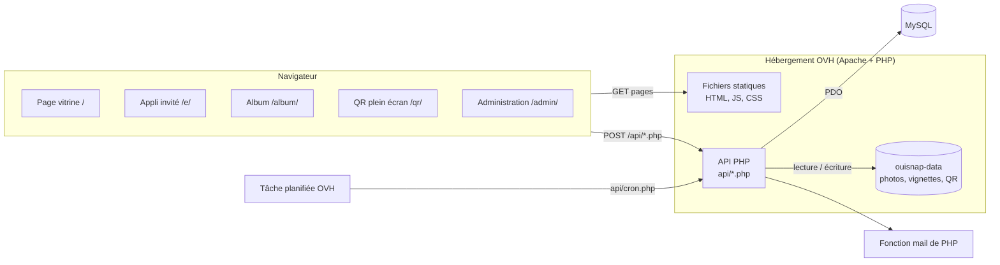
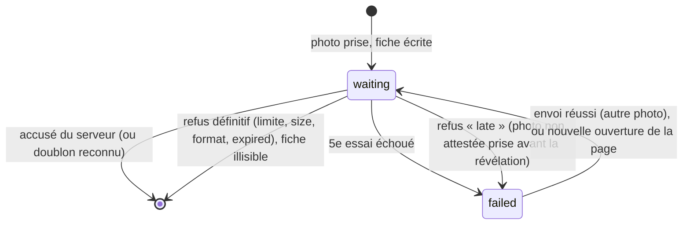
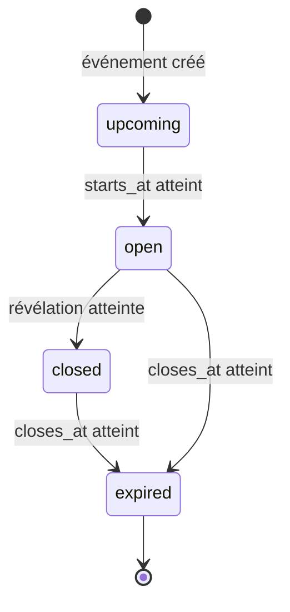
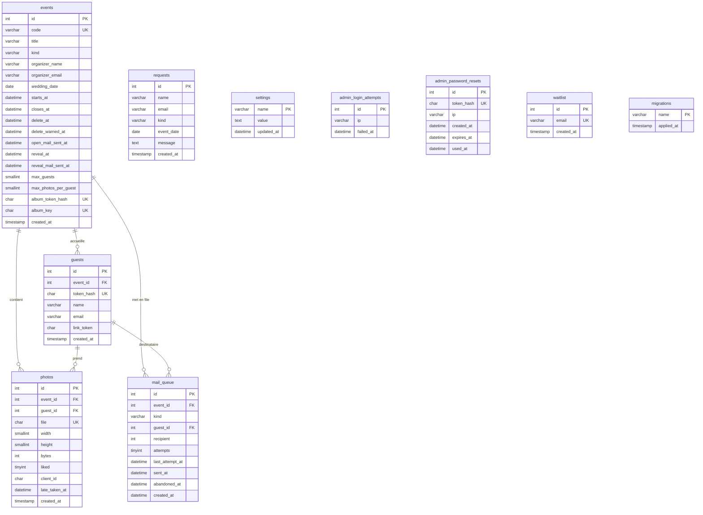
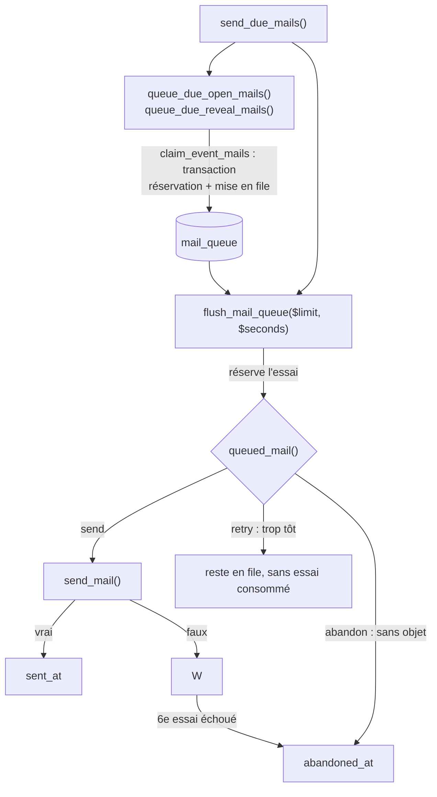
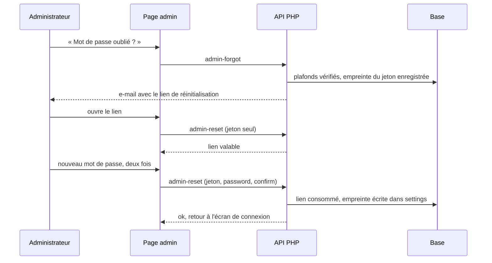
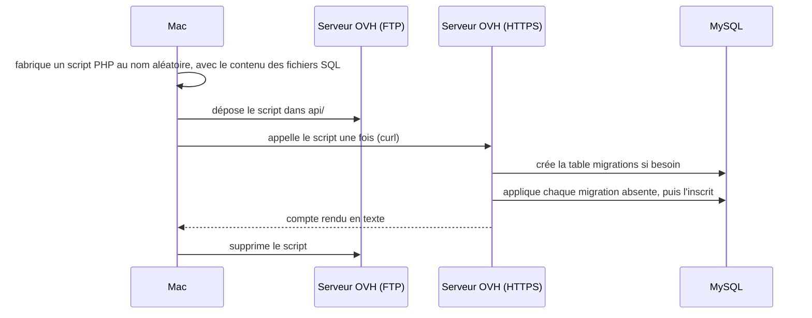

# OuiSnap — Document de conception de la solution (SDD)

| | |
|---|---|
| Projet | OuiSnap |
| Document | Solution Design Document (conception technique) |
| État du code décrit | branche `main`, file d'attente des e-mails, état de la tâche planifiée, suppression automatique des albums et des demandes de la vitrine compris (migration `017_auto_delete.sql`, mis en ligne le 6 octobre 2026) |
| Rédigé le | 4 octobre 2026, mis à jour le 6 octobre 2026 |

## Sommaire

1. [Introduction](#1-introduction)
2. [Vue d'ensemble de la solution](#2-vue-densemble-de-la-solution)
3. [Pile logicielle](#3-pile-logicielle)
4. [Organisation du dépôt](#4-organisation-du-dépôt)
5. [Interface (front)](#5-interface-front)
6. [API](#6-api)
7. [Modèle de données](#7-modèle-de-données)
8. [Stockage des fichiers](#8-stockage-des-fichiers)
9. [E-mails](#9-e-mails)
10. [Sécurité](#10-sécurité)
11. [Configuration](#11-configuration)
12. [Installation et commandes](#12-installation-et-commandes)
13. [Mise en ligne et exploitation](#13-mise-en-ligne-et-exploitation)
14. [Tests](#14-tests)
15. [Limites connues, dette et pistes](#15-limites-connues-dette-et-pistes)
16. [Annexes](#16-annexes)

---

## 1. Introduction

### 1.1 Objet

Ce document décrit comment OuiSnap est construit : architecture, code, base de données, configuration, mise en ligne, tests. Il doit suffire à quelqu'un qui reprend le projet pour l'installer, le comprendre, le modifier et le mettre en ligne.

### 1.2 Périmètre

Tout ce qui est technique : le site (Next.js exporté en fichiers statiques), l'API PHP, la base MySQL, le stockage des photos, l'envoi des e-mails, les scripts de mise en ligne, les tests de bout en bout.

Ce qui n'est pas ici : la présentation du produit et les règles métier.

### 1.3 Documents liés

| Document | Contenu |
|---|---|
| [`../README.md`](../README.md) | Présentation fonctionnelle du produit |
| [`PDD.md`](PDD.md) | Processus métier (qui fait quoi, dans quel ordre) |
| [`../AGENTS.md`](../AGENTS.md) | Avertissement sur la version de Next.js, à lire avant de toucher au front |
| [`../.claude/skills/pw/SKILL.md`](../.claude/skills/pw/SKILL.md) | Mode d'emploi des tests de bout en bout |

### 1.4 Conventions

- Les chemins sont donnés depuis la racine du dépôt (`public/api/lib.php`). Les liens sont relatifs à ce fichier.
- « Invité » ou « photographe » : la personne qui scanne le QR code et prend des photos. « Organisateurs » : les mariés, la famille, etc. « Administrateur » : Franck.
- « Révélation » : le moment où les organisateurs découvrent les photos. « Clôture » : le moment où l'album n'est plus accessible.
- « À confirmer » signale un point qui ne se vérifie pas dans le dépôt (réglage de l'hébergeur, par exemple).
- Ce document ne contient aucun secret. Les valeurs réelles sont dans `.env.deploy`, qui n'est pas versionné.

---

## 2. Vue d'ensemble de la solution

### 2.1 Contraintes qui expliquent les choix

L'hébergement est une offre mutualisée OVH. Trois conséquences :

| Contrainte | Conséquence dans le projet |
|---|---|
| PHP et MySQL disponibles, pas de Node.js en production | Le site est compilé en fichiers statiques (`out/`). Toute la logique serveur est en PHP, dans `public/api/`. |
| La base MySQL n'est joignable que depuis l'hébergement | Les migrations ne peuvent pas être lancées depuis le Mac. Un script PHP temporaire est déposé sur le serveur, appelé une fois, puis supprimé (`scripts/migrate.sh`). |
| Accès par FTP ou SFTP seulement, hébergement partagé avec d'autres sites | La mise en ligne est un envoi de fichiers (`lftp`). Le script refuse d'écrire à la racine de l'hébergement et ne supprime jamais rien sur le serveur. |

### 2.2 Schéma d'architecture



Le navigateur charge des pages statiques. Tout ce qui est dynamique passe par des requêtes `POST` vers `/api/<nom>.php`, sur le même domaine. Il n'y a pas de rendu côté serveur ni de serveur Node.

### 2.3 Environnements

| | Local | Production |
|---|---|---|
| Lancement | `npm run local` | `npm run deploy` |
| Serveur web | Serveur intégré de PHP (`php -S localhost:8000 -t out`) | Apache d'OVH |
| Base | SQLite, fichier `.local/dev.sqlite` | MySQL d'OVH |
| Photos | `.local/storage/` | `ouisnap-data/`, à côté du dossier du site |
| E-mails | Écrits dans `.local/mails.log`, jamais envoyés | Envoyés par la fonction `mail()` de PHP |
| `.htaccess` | Ignorés (le serveur intégré de PHP ne les lit pas) | Appliqués |
| Adresse | `http://localhost:8000` | `https://ouisnap.pourunouieternel.fr` |

Il n'existe pas d'environnement de recette. Les deux environnements servent le même dossier `out/` : voir le piège décrit en [13.4](#134-pièges).

---

## 3. Pile logicielle

### 3.1 Versions

Versions lues dans [`../package.json`](../package.json) et dans `node_modules/` au moment de la rédaction.

| Brique | Version déclarée | Version installée | Rôle |
|---|---|---|---|
| Next.js | `16.3.8` | 16.3.8 | Génération du site statique (App Router, `output: "export"`) |
| React, React DOM | `19.2.8` | 19.2.8 | Interface |
| TypeScript | `^5` | 5.9.3 | Typage (mode `strict`) |
| Tailwind CSS | `^4` | 4.3.3 | Styles, via `@tailwindcss/postcss` |
| Motion | `^14.0.0` | 14.0.0 | Animations (`motion/react`) |
| `@phosphor-icons/react` | `^2.1.10` | 2.1.10 | Icônes |
| `qrcode` | `^1.5.4` | 1.5.4 | Génération des QR codes dans le navigateur |
| `jspdf` | `^4.2.1` | 4.2.1 | PDF des cartes de table et des organisateurs, chargé à la demande |
| ESLint | `^9` | 9.39.5 | Analyse du code, avec `eslint-config-next` 16.3.8 |
| PHP | — | — | API. Le code exige PHP 8.1 au minimum (type de retour `never`). Le README d'origine annonce PHP 8.3 chez OVH : à confirmer dans l'espace client. |
| MySQL | — | — | Base de production (moteur InnoDB, `utf8mb4`). Version : à confirmer. |

Extensions PHP utilisées : PDO (`pdo_mysql` en production, `pdo_sqlite` en local), `mbstring`, GD (facultative : sans elle, pas de vignettes, la photo entière est servie à la place).

Node.js : Next 16.3.8 demande Node 20.9 ou plus récent (champ `engines` du paquet).

### 3.2 Avertissement sur Next.js

[`../AGENTS.md`](../AGENTS.md) prévient : cette version de Next.js a des changements incompatibles avec les versions plus anciennes (API, conventions, structure des fichiers). Avant d'écrire du code côté front, lire le guide concerné dans `node_modules/next/dist/docs/` et tenir compte des avis de dépréciation.

Ce bloc d'`AGENTS.md` est réécrit par `next dev` à chaque lancement. Le retirer ne sert à rien : il revient. `CLAUDE.md` l'inclut par `@AGENTS.md`.

### 3.3 Réglages de compilation

| Fichier | Réglages notables |
|---|---|
| [`../next.config.ts`](../next.config.ts) | `output: "export"` (site statique dans `out/`), `trailingSlash: true` (chaque page devient `dossier/index.html`, servi par Apache à l'adresse `/dossier/`), `images.unoptimized: true` (pas de serveur pour redimensionner les images) |
| [`../tsconfig.json`](../tsconfig.json) | `strict`, cible `ES2017`, alias `@/*` vers `src/*` |
| [`../eslint.config.mjs`](../eslint.config.mjs) | Règles `core-web-vitals` et `typescript` de Next ; `.next/`, `out/`, `build/` ignorés |
| [`../postcss.config.mjs`](../postcss.config.mjs) | Greffon `@tailwindcss/postcss` |

---

## 4. Organisation du dépôt

```text
OuiSnap-1/
├── AGENTS.md               avertissement Next.js (réécrit par next dev)
├── CLAUDE.md               instructions pour les agents
├── README.md               présentation fonctionnelle
├── deploy.env.example      modèle de .env.deploy
├── package.json            dépendances et commandes npm
├── next.config.ts          export statique
├── docs/
│   ├── PDD.md              processus métier
│   └── SDD.md              ce document
├── database/
│   ├── 001_… à 017_….sql   migrations MySQL, appliquées dans l'ordre
│   └── local.sqlite.sql    schéma SQLite pour les tests locaux (mis à niveau par scripts/local.sh)
├── scripts/
│   ├── deploy.sh           compile et envoie le site chez OVH
│   ├── migrate.sh          applique les migrations sur la base OVH
│   └── local.sh            lance l'appli complète en local
├── public/                 copié tel quel dans out/
│   ├── .htaccess           HTTPS forcé, en-têtes de sécurité, cache
│   ├── robots.txt, sitemap.xml
│   ├── media/              vidéo de présentation et captures de la vitrine
│   └── api/                API PHP
│       ├── .htaccess       interdit l'accès web aux fichiers internes (config, lib, mail, retention)
│       ├── lib.php         fonctions communes
│       ├── mail.php        gabarits, envoi et file d'attente des e-mails
│       ├── retention.php   suppression automatique des albums et des demandes (tâche planifiée seulement)
│       ├── config.example.php
│       └── *.php           un fichier par endpoint
├── src/
│   ├── app/                pages (une par dossier), styles, icône
│   ├── components/         composants React
│   │   ├── guest/          appli invité
│   │   ├── album/          album des organisateurs
│   │   └── admin/          administration
│   └── lib/                fonctions partagées du front (dont la file d'envoi : upload-queue.ts, photo-store.ts, wake-lock.ts ; les cartes imprimables : card-kit.ts, table-card.ts, organizer-card.ts ; qr.ts)
└── .claude/skills/pw/      tests de bout en bout et leur bilan
```

Non versionné (voir [`../.gitignore`](../.gitignore)) :

| Chemin | Contenu |
|---|---|
| `.env.deploy` | Accès FTP et MySQL, mot de passe initial de l'administration. Ne jamais le versionner ni le recopier. |
| `out/`, `.next/` | Résultats de compilation |
| `public/api/config.php` | Configuration de l'API, si on en crée une à la main |
| `.local/` | Base, photos et e-mails de test |
| `.playwright-mcp/` | Résultats, captures et bilan des tests Playwright |
| `.mcp.json`, `video/` | Configuration locale des serveurs MCP ; sources de la vidéo de présentation |

---

## 5. Interface (front)

### 5.1 Pages et routes

Chaque page est un dossier de [`../src/app/`](../src/app/). Les paramètres sont lus dans l'adresse par le navigateur : il n'y a pas de route dynamique, ce qui permet l'export statique.

| Adresse | Rôle | Fichier de page | Composant principal | Paramètres d'URL |
|---|---|---|---|---|
| `/` | Page vitrine et formulaire de demande | `src/app/page.tsx` | page elle-même, `RequestForm`, `TeaserVideo` | aucun (ancres `#fonctionnement`, `#surprise`, `#demande`) |
| `/e/` | Appli des invités | `src/app/e/page.tsx` | `GuestApp` | `c` : code de l'événement. `t` : jeton du lien personnel reçu par e-mail (facultatif, retiré de l'adresse après lecture) |
| `/album/` | Album des organisateurs | `src/app/album/page.tsx` | `AlbumApp` | `k` : clé privée de l'album |
| `/qr/` | QR code de l'album en plein écran | `src/app/qr/page.tsx` | `QrPage` | `c` : code de l'événement |
| `/admin/` | Administration | `src/app/admin/page.tsx` | `AdminApp` | fragment `#reset=<jeton>` : lien de réinitialisation du mot de passe (retiré de l'adresse après lecture) |
| `/mentions-legales/` | Mentions légales et règles d'utilisation | `src/app/mentions-legales/page.tsx` | `LegalPage` | aucun |
| `/confidentialite/` | Politique de confidentialité | `src/app/confidentialite/page.tsx` | `LegalPage` | aucun |

[`../src/app/layout.tsx`](../src/app/layout.tsx) porte les polices, les métadonnées communes et la constante `SITE_URL` (adresse de production, utilisée pour le référencement). Les pages `/e/`, `/album/`, `/qr/` et `/admin/` déclarent `robots: { index: false }`. [`../public/robots.txt`](../public/robots.txt) interdit aussi `/api/`, `/admin/`, `/album/`, `/e/` et `/qr/` aux moteurs de recherche.

### 5.2 Composants principaux

| Composant | Fichier | Rôle |
|---|---|---|
| `GuestApp` | `src/components/guest/guest-app.tsx` | Chef d'orchestre de l'appli invité : connexion à l'album (avec nouvelles tentatives si la page est rouverte sans réseau), écran « Connecté ! », lecture de l'état de la file d'envoi et textes de statut, bascule entre appareil photo et « Mes photos », écrans d'attente et de clôture |
| `Camera` | `src/components/guest/camera.tsx` | Appareil photo : flux vidéo, zoom, changement de caméra, déclenchement, import depuis la galerie |
| `MyPhotos` | `src/components/guest/my-photos.tsx` | Grille des photos de l'invité, agrandissement, suppression, coups de cœur reçus ; en lecture seule, affiche aussi le message des photos restées sur le téléphone (propriété `notice`) |
| `AlbumApp` | `src/components/album/album-app.tsx` | Album des organisateurs : compte à rebours et compteurs avant la révélation ; ensuite photos par invité, coups de cœur, téléchargement ZIP ; ligne d'avertissement quand `deletesAt` est renseigné (suppression à moins de trente jours) |
| `AdminApp` | `src/components/admin/admin-app.tsx` | Connexion, liste des événements (dont la ligne « Suppression des photos » de chaque carte et, dans `MailStatus`, l'examen des suppressions automatiques), bulle d'état du service à côté du titre, suppression d'un événement, demande de lien « mot de passe oublié » |
| `StatusBubble` | `src/components/admin/admin-app.tsx` | Bulle d'info à côté du titre « Événements » : un bouton rond (pictogramme `Info` à contour discret, ou `Warning` coloré si `statusAlerts(status)` est vrai) qui ouvre un panneau contenant `MailStatus`. Ouverture au clic ou au toucher (un simple survol ne marcherait pas sur téléphone), au clavier (bouton natif, `aria-expanded`) ; fermeture par Échap (écouteur `keydown` posé seulement bulle ouverte), par un second clic ou par un bouton plein écran transparent « Fermer le détail » derrière le panneau. L'alerte est portée par le bouton lui-même (couleur, pictogramme et `aria-label`) pour ne pas être cachée bulle fermée |
| `EventForm` | `src/components/admin/event-form.tsx` | Création et modification d'un événement ; propose la révélation (lendemain 12h00) et la clôture (deux semaines après le début) ; champ « Suppression » borné entre la clôture et six mois après (`sixMonthsLater`) |
| `EventLinks`, `QrCase`, `CopyRow` | `src/components/admin/event-links.tsx` | Bloc « QR code et liens ». `EventLinks` affiche deux cases `QrCase` côte à côte (invités, puis organisateurs si l'événement a une clé d'album) puis deux lignes `CopyRow`. Chaque `QrCase` montre l'image du QR code (`imageQr`, avec le bandeau « ALBUM PRIVÉ » pour la case privée), un bouton PDF (« Préparation… » pendant la création, message d'erreur si elle échoue) et un lien de téléchargement du code seul (`ouisnap-qr-<code>.png`, `ouisnap-qr-organisateurs-<code>.png`). `CopyRow` : lien sélectionnable, bouton de copie et bouton qui l'ouvre dans un nouvel onglet (`target="_blank"`, `rel="noopener noreferrer"`). Le PDF et l'image se fabriquent dans le navigateur (voir [5.9](#59-cartes-imprimables)). |
| `AlbumView` | `src/components/admin/album-view.tsx` | Toutes les photos d'un album pour l'administrateur, avec suppression. Ouvrir une photo ajoute une étape à l'historique du navigateur (`pushState`), pour que le retour arrière ramène à la galerie au lieu de quitter l'administration |
| `PasswordReset` | `src/components/admin/password-reset.tsx` | Choix d'un nouveau mot de passe depuis le lien reçu |
| `PhotoImage`, `LazyThumb`, `ZoomablePhoto` | `src/components/photo-view.tsx` | Chargement d'une photo protégée, vignette chargée à l'approche de l'écran, photo agrandie avec zoom (double appui ou double clic pour revenir au zoom initial) et, sans zoom, balayage horizontal vers la photo suivante ou précédente (prop `onSwipe`, utilisée par l'administration et l'album des organisateurs) |
| `QrCard`, `QrFullScreen` | `src/components/qr-card.tsx` | QR code en vignette et en plein écran |
| `QrPage` | `src/components/qr-page.tsx` | Page `/qr/` : vérifie le code par `join`, puis affiche le QR code |
| `RequestForm` | `src/components/request-form.tsx` | Formulaire de demande de la vitrine, avec champ piège `site` |
| `LegalPage`, `Section` | `src/components/legal-page.tsx` | Gabarit des pages légales et coordonnées de l'éditeur (`EDITEUR`) |
| `Logo`, `Reveal`, `CountUp`, `TeaserVideo` | `src/components/` | Logo, apparition au défilement, compteur animé, vidéo de présentation |

### 5.3 Bibliothèques (`src/lib`)

| Fichier | Contenu |
|---|---|
| [`api.ts`](../src/lib/api.ts) | `api(chemin, champs, options?)` : envoie un `POST` en `FormData` vers `/api/<chemin>.php` et lève une `ApiError` (code, message, statut HTTP, indicateur `foreign`) si la réponse n'a pas `ok: true`. Options : `timeout` (délai maximal en millisecondes, lecture du JSON comprise) et `signal` (annulation par l'appelant) ; sans option, le comportement est celui d'avant. Un seul `AbortController` interne et une minuterie, sans `AbortSignal.timeout` ni `AbortSignal.any` (trop récents sur Safari). Délai dépassé : `ApiError("timeout", "Connexion trop lente.", 0)` ; annulation par le signal : `ApiError("aborted", "", 0)`. `foreign` vaut vrai quand la réponse n'est pas du JSON (portail Wi-Fi, page d'un intermédiaire) : l'API répond toujours en JSON, refus compris. `fetchPhoto()` : récupère une image sous forme de `Blob`. `ApiError.temporary` vaut vrai pour une coupure réseau ou un statut 500 et plus : il est lu ailleurs que dans la file (`album-app.tsx`, `password-reset.tsx`), donc inchangé. La file d'envoi lit un autre accesseur, `ApiError.retryable` : `temporary`, ou `foreign`, ou statut 429 ou 408, ou code `timeout`. |
| [`upload-queue.ts`](../src/lib/upload-queue.ts) | La file d'envoi des photos de l'invité : singleton `uploadQueue`, boucle d'envoi, reprise, tableau des réponses du serveur (voir [5.5](#55-file-denvoi-des-photos)). Aucun accès au navigateur à l'import : la page est prérendue en statique. |
| [`photo-store.ts`](../src/lib/photo-store.ts) | Stockage des photos en attente sur le téléphone (IndexedDB) avec repli en mémoire : `openStore()`, `countStored()`, type `QueuedPhoto` (voir [5.5](#55-file-denvoi-des-photos)). |
| [`wake-lock.ts`](../src/lib/wake-lock.ts) | `useWakeLock(actif)` : garde l'écran allumé pendant l'envoi (voir [5.5](#55-file-denvoi-des-photos)). |
| [`image.ts`](../src/lib/image.ts) | `toJpeg()` : réduit une image ou une image de la vidéo en JPEG de 2560 px au plus sur le grand côté, qualité 0,85. Gère le zoom numérique en ne gardant que le centre. |
| [`kinds.ts`](../src/lib/kinds.ts) | Les quatre natures d'événement et les textes qui en dépendent côté front. `kindOf()` retombe sur « autre » pour une valeur inconnue. `kindKey()` renvoie la clé de la nature (ou « autre ») : elle choisit le dessin des cartes imprimables. |
| [`pinch.ts`](../src/lib/pinch.ts) | `usePinch()` : pincement à deux doigts et glissement à un doigt. |
| [`qr.ts`](../src/lib/qr.ts) | `guestUrl()` (`/e/?c=CODE`), `albumUrl()` (`/album/?k=CLÉ`, l'album privé), `qrDataUrl()` (QR code sans logo, couleur `#1a2620` sur blanc) et `uploadEventQr()`, qui dépose sur le serveur l'image du QR code des invités pour les e-mails. Ce QR code des e-mails, celui de la page des organisateurs et celui du plein écran n'ont pas de logo. |
| [`shutter.ts`](../src/lib/shutter.ts) | Son d'obturateur synthétisé, sans fichier audio. |
| [`card-kit.ts`](../src/lib/card-kit.ts) | Outils de dessin communs aux cartes imprimables : couleurs, canevas, textes (espacé, courbe, règle du nom, paragraphe), QR code tracé module par module avec son cartouche, plaque, logo, motifs, écriture du PDF (voir [5.9](#59-cartes-imprimables)). |
| [`table-card.ts`](../src/lib/table-card.ts) | PDF des tables : `drawTableCard()` dessine une carte A6 (1240 × 1748 px) selon la nature de l'événement, `downloadTablePdf()` la pose quatre fois sur une page A4. Fichier `ouisnap-tables-<code>.pdf`. |
| [`organizer-card.ts`](../src/lib/organizer-card.ts) | PDF des organisateurs : `drawOrganizerCard()` dessine deux volets côte à côte (2480 × 1754 px, A5 paysage), `downloadOrganizerPdf()` le pose deux fois sur une page A4. Fichier `ouisnap-organisateurs-<code>.pdf`. |

### 5.4 Session de l'invité

L'invité n'a pas de compte. Il est reconnu par un jeton.

1. À l'ouverture de `/e/?c=CODE`, `GuestApp` appelle `join` avec le code, et le jeton s'il en a un.
2. Sans jeton reconnu, l'écran « Connecté ! » demande le prénom (et l'e-mail, facultatif). `join` crée l'invité et renvoie un jeton de 48 caractères hexadécimaux.
3. Le jeton est gardé dans le `localStorage` du navigateur, sous la clé `ouisnap:invite:<CODE>`. S'il rescanne le QR code avec le même navigateur, l'invité retrouve sa session.
4. Si le `localStorage` est indisponible (navigation privée), la session dure le temps de la page.
   Chaque photo en attente garde dans sa fiche le jeton de l'invité au moment de la prise : un renvoi part avec le même invité, ce qui garde l'anti-doublon cohérent. Si le serveur ne reconnaît plus l'invité (`session` confirmé), `GuestApp` appelle `forgetToken(code)` et revient à l'écran « Connecté ! ».
5. Lien personnel : `/e/?c=CODE&t=JETON`. Le jeton est enregistré, puis retiré de l'adresse par `history.replaceState`. Ce lien n'existe que pour les invités qui ont laissé leur e-mail.

Côté serveur, seule l'empreinte SHA-256 du jeton est gardée (`guests.token_hash`), sauf pour les invités avec e-mail : voir [10.3](#103-jetons-des-invités-et-clé-dalbum).

L'album des organisateurs n'a pas de session : la clé `k` de l'adresse est renvoyée à chaque appel. L'administration utilise un cookie de session PHP ([10.1](#101-authentification-de-ladministration)).

### 5.5 File d'envoi des photos

Chaque photo est gardée sur le téléphone avant d'être envoyée, et ne la quitte qu'après la confirmation du serveur. La file vit dans `src/lib/upload-queue.ts`, hors de React : l'envoi continue quel que soit l'écran affiché. `GuestApp` ne fait que lire son état (`useSyncExternalStore`, comme `album-app.tsx`) et lui passer des réactions.



`failed --> waiting` ne concerne pas les fiches `reason: "late"` : refusées pour leur date de prise, elles sont gardées sur le téléphone (jusqu'à `KEEP_MS`) mais ne sont plus jamais renvoyées, même si l'administrateur repousse la révélation. Une fiche `closed` laissée par une version antérieure, elle, repart (voir « À l'ouverture de la page »).

#### Magasin sur le téléphone (`photo-store.ts`)

Base IndexedDB `ouisnap`, version 1, sans dépendance npm. Deux magasins :

| Magasin | Clé | Contenu |
|---|---|---|
| `queue` | `seq` (automatique), index `code` | Les fiches. L'ordre des `seq` est l'ordre d'envoi. |
| `bytes` | clé hors ligne égale au `seq` | L'image, en `ArrayBuffer` |

Pourquoi deux magasins : à la réouverture, seules les fiches sont chargées ; quarante photos de 2 Mo en mémoire feraient fermer l'onglet par le téléphone. Pourquoi un `ArrayBuffer` et non un `Blob` : sur iPhone, un `Blob` relu après réouverture peut être vide.

- Écriture : une seule transaction sur les deux magasins, résolue sur `oncomplete`. L'envoi d'une photo attend la fin de son écriture.
- Relecture : avant chaque envoi, fiche et octets sont lus en une transaction.
- Purge après accusé : les deux enregistrements sont supprimés en une transaction.
- Délais : ouverture de la base, 3 secondes (`OPEN_TIMEOUT_MS`) ; chaque transaction, 8 secondes (`TRANSACTION_TIMEOUT_MS`). Une transaction qui ne répond pas est annulée. Sur certains Safari, l'ouverture ou une base revenue de l'arrière-plan ne répond jamais : sans ces délais, l'écriture d'une photo ne finirait pas et bloquerait les suivantes.
- Chaque opération rouvre la base une fois en cas d'erreur, puis réessaie.
- Repli en mémoire : `openStore()` ne rejette jamais. Absence d'`indexedDB`, erreur ou ouverture trop longue : tout se fait en mémoire. Si l'écriture d'une photo échoue ou ne répond pas au bout de 8 secondes (stockage plein, base fermée), la photo passe en mémoire avec un `seq` négatif (pour ne pas croiser ceux de la base). Le drapeau `durable` vaut alors faux, et l'écran demande de ne pas fermer la page. Une transaction qui aboutit après le délai a pu écrire la fiche : elle existe alors en double, part deux fois sous le même identifiant, et le serveur n'en garde qu'une.
- `update`, `remove` et `purge` n'échouent jamais aux yeux de l'appelant : au pire, une fiche qui aurait dû disparaître repart à la prochaine ouverture, et le serveur reconnaît la photo.
- `countStored(code)` : nombre de fiches d'un événement, sans ouvrir la file ; sert à l'écran d'une page rouverte sans réseau. Rend 0 si le stockage ne répond pas.

#### Fiche d'une photo

| Champ | Rôle |
|---|---|
| `seq` | Clé donnée par la base ; ordre d'envoi |
| `id` | Identifiant client, 32 caractères hexadécimaux tirés par `crypto.getRandomValues` (même forme que `photos.file`) ; envoyé au serveur comme `client_id` |
| `code` | Code de l'événement, en majuscules |
| `token` | Jeton de l'invité au moment de la prise |
| `createdAt` | Date de prise, en millisecondes ; **envoyée au serveur** (`taken_at`), qui s'en sert pour accepter une photo après la révélation |
| `bytes` | Poids de l'image, recontrôlé à la relecture |
| `attempts` | Essais échoués avec une réponse ou un délai dépassé |
| `state` | `waiting` ou `failed` ; « en cours d'envoi » n'est jamais écrit |
| `reason` | Code de l'erreur, si `failed` (`timeout`, `server`, `late`…). `late` : refusée parce qu'elle n'est pas attestée prise avant la révélation ; jamais retentée. Une ancienne version écrivait aussi `closed`. |

#### Boucle d'envoi

`run()` envoie la première fiche `waiting`, une seule à la fois, dans l'ordre des `seq`. Avant chaque envoi (`sendOne`) :

1. Si l'album était indiqué pas encore ouvert, l'état est demandé par `join` (quelques octets) au lieu de renvoyer la photo entière ; l'envoi ne repart que si l'état n'est plus `upcoming`.
2. Si le jeton de la fiche n'est plus reconnu mais que l'invité s'est réinscrit depuis, la fiche prend le nouveau jeton.
3. Relecture de la fiche et des octets. Fiche absente : un autre onglet l'a envoyée, elle sort de la liste et le compteur est redemandé par `join`. Octets absents, poids différent ou début autre que `FF D8` : fiche supprimée et message « 1 photo en attente était illisible et n'a pas pu être envoyée. »
4. `api("upload", { token, client_id, taken_at, photo }, { timeout, signal })`. `taken_at` est `String(createdAt)`.

Délai maximal d'un envoi : 60 secondes, plus 30 secondes par Mo, plafonné à 180 secondes (0,5 Mo : 75 s ; 3 Mo : 150 s). `JOIN_TIMEOUT_MS` : 30 secondes pour les appels `join`.

Les constantes sont en tête de `upload-queue.ts` : `KEEP_MS` (7 jours), `MAX_ATTEMPTS` (5), `RETRY_SECONDS` (6, 12, 24, 48, 60), `UPCOMING_RETRY_SECONDS` (60), `HIDDEN_ABORT_MS` (10 s), `AWAKE_MS` (3 minutes).

#### Réponses du serveur et traitement

| Réponse | Traitement |
|---|---|
| Succès (y compris `duplicate: true`) | Fiche et octets supprimés, compteur `sent` augmenté, `onCount` avec le compteur du serveur (seulement si la fiche est celle de l'invité en cours). Si la réponse porte `state: "closed"`, `onRevealed()` : l'appareil photo n'est plus proposé. Les photos mises de côté (hors `late`) repassent en `waiting`, essais remis à zéro, placées après celles qui attendent. |
| `limit` (409) | Les photos `waiting` du même invité sont supprimées, `onLimit(nombre)`, message « Limite de N photos atteinte : X photos n'ont pas été envoyées. » |
| `closed` (403, album dévoilé et photo non attestée prise avant la révélation) | La fiche passe en `failed` avec `reason: "late"`, elle est gardée ; la file continue (`next`) ; `onRevealed()` est appelée. Les autres fiches ne sont pas touchées : elles partent avec leur propre date. |
| `expired` (410) | Fiches de l'événement supprimées. `onExpired(nombre)`. La file s'arrête. |
| `upcoming` (403) | File en pause (`stalled = "upcoming"`), fiches gardées, nouvel essai à 60 s, avec contrôle de l'état par `join` avant chaque renvoi. |
| `session` (401) | Vérification par `join(code, token)`, voir ci-dessous. |
| `size`, `format` | Fiche supprimée, message du serveur, les suivantes continuent. |
| Réseau coupé | Pause, pas d'essai compté. |
| Délai dépassé, 5xx, 429, 408, réponse non JSON, `upload`, code inconnu | `attempts + 1`, pause ; au 5e essai la fiche passe en `failed` et la suivante part. |
| Annulation (`aborted`) | Envoi relancé sans compter d'essai. |

Vérification d'un `session`. Un envoi trop gros pour PHP ressemble à une session expirée : au-delà de `post_max_size`, PHP vide `$_POST`, donc `current_guest()` répond 401 `session`. La file demande donc à `join` si l'invité est connu :

- `join` répond 404 `event` : fiches de l'événement supprimées, `onGone`, écran d'erreur.
- `join` renvoie le jeton : fausse alerte, l'échec compte pour un essai.
- `join` renvoie `token: null` : fiches gardées, jeton oublié (`onSessionLost`), retour à l'écran « Connecté ! ». Après réinscription, les fiches dont le jeton est inconnu prennent le nouveau jeton.

#### Déclencheurs de reprise

| Déclencheur | Effet |
|---|---|
| Fin de `open()`, fin de l'écriture d'une photo (`add`), `setToken` | `kick()` : essai immédiat, délais remis à zéro |
| Événement `online` | `kick(true)` : essai immédiat même en pause |
| `visibilitychange` vers visible, `pageshow` avec `persisted` | `resume()` : envoi en vol annulé puis relancé sans compter d'essai si la page est restée masquée plus de 10 s ; puis `kick()` |
| Minuterie | 6, 12, 24, 48 puis 60 s, remise à 6 s après un succès ou un déclencheur ; 60 s si l'album n'est pas ouvert |

Un `kick()` ordinaire ne fait rien quand la file est en pause pour `server` ou `slow` et qu'un essai est déjà programmé : chaque essai échoué est compté, et cinq photos prises coup sur coup pendant une panne épuiseraient les essais en quelques secondes. Seul `online` force l'essai. Un onglet masqué continue d'envoyer.

Deux onglets : pas de verrou (sur iPhone, un onglet gelé qui tiendrait un verrou bloquerait l'onglet visible). Chacun a son garde-fou en mémoire ; le pire cas est une photo envoyée deux fois, que le serveur dédoublonne.

#### À l'ouverture de la page (`start`)

1. `openStore()`, puis purge des fiches de plus de 7 jours, tous événements confondus.
2. Lecture des fiches du code. `expired` ou `gone` (code inconnu) : toutes supprimées (message `onExpired` si `expired`). Sinon, l'état `closed` est traité comme `open` : les fiches `failed` dont `reason !== "late"` repassent en `waiting` avec `attempts: 0`, y compris celles de `reason: "closed"` qu'une version antérieure avait bloquées (c'est tout l'objet du changement), et les fiches lues sont marquées « retrouvées ».
3. Écouteurs `online`, `pageshow` et `visibilitychange` posés une fois pour toute la vie de la page.

`GuestApp` appelle `uploadQueue.open(...)` sans l'attendre, puis `setToken`. `open()` est idempotent : un second appel ne fait que remplacer les réactions (l'effet de démarrage tourne deux fois en développement).

Page rouverte sans réseau : l'appel `join` de `GuestApp` a un délai maximal de 30 secondes et, sur erreur passagère (`network` ou `retryable`), est retenté automatiquement : événement `online`, retour sur la page (`visibilitychange`), puis minuterie de 6, 12, 24, 48 puis 60 secondes. L'écran d'erreur affiche le nombre de photos gardées, lu par `countStored`. Dès que `join` répond, la file s'ouvre normalement.

#### État lu par l'interface

Instantané immuable, remplacé et jamais modifié (sinon `useSyncExternalStore` boucle) : `{ waiting, restored, blocked, refused, sent, stalled, durable, awake }`. `refused` : fiches `late` ; `blocked` : fiches mises de côté après 5 essais, `late` exclues ; `sent` : photos acquittées depuis l'ouverture de la page. `stalled` vaut `null`, `"network"`, `"slow"`, `"server"` ou `"upcoming"`. `getServerSnapshot` renvoie une constante vide : la page est prérendue. La fonction pure `sendingStatus()` de `guest-app.tsx` en tire le texte de statut quand l'album est ouvert ; `revealedStatus()`, placée à côté, fait de même une fois l'album dévoilé (« N photos prises avant la révélation partent vers l'album… », « … ont rejoint l'album », « … n'ont pas pu rejoindre l'album : elles n'ont pas été prises avant la révélation »). Les textes figurent dans le [PDD](PDD.md) (P5). `notice` garde la priorité sur ces statuts. Après la révélation, `GuestApp` affiche `MyPhotos` en lecture seule avec `notice ?? revealedStatus(queue)` et lui passe `reload={queue.sent}` : la grille est relue à chaque photo acquittée.

Compteurs : `taken = count + waiting`, borné à la limite ; les fiches `failed` ne comptent pas. Après la révélation il n'y a plus d'appareil photo, donc plus de compteur « N / max » : le total est celui de la grille. « Vous avez envoyé vos N photos. Merci ! » seulement si plus rien n'attend. Le front applique lui-même la limite restante avant d'ajouter ; le serveur la revérifie.

Fermeture de la page : tant que `waiting > 0`, `beforeunload` demande confirmation.

#### Écran allumé (`wake-lock.ts`)

`useWakeLock(actif)` demande `navigator.wakeLock.request("screen")` quand la page est visible, la redemande à chaque retour au premier plan (le téléphone relâche le verrou quand la page est masquée) et la relâche au nettoyage. Tous les rejets sont avalés : sans effet si le navigateur ou le téléphone refuse. `actif` vaut `queue.awake` : vrai tant que des photos attendent et qu'il y a eu un progrès (ajout, accusé, reprise) depuis moins de 3 minutes.

### 5.6 Appareil photo

Dans `Camera` :

- Flux obtenu par `getUserMedia`, caméra arrière par défaut, 2560 × 1440 demandés, sans son.
- La photo est une capture de l'image vidéo en cours, pas une prise par le capteur photo du téléphone.
- Zoom : optique si le téléphone l'expose (plafonné à 6×), sinon numérique (plafonné à 4×). Pincement ou bouton 1× / 2×.
- Le cadre affiché a exactement les proportions de la photo enregistrée. Il suit la rotation du téléphone.
- La caméra est relancée quand la page revient au premier plan (iOS la coupe en arrière-plan).
- Si la caméra n'est pas accessible, un bouton ouvre l'appareil photo du téléphone par un champ `<input type="file" capture>`.
- Import depuis la galerie : plusieurs fichiers à la fois ; les fichiers illisibles sont ignorés.

`getUserMedia` exige le HTTPS (ou `localhost`). C'est la raison d'être de la redirection HTTPS de [`../public/.htaccess`](../public/.htaccess).

### 5.7 PWA

Il n'y a ni manifeste d'application ni service worker dans le dépôt : `public/` ne contient que `.htaccess`, `robots.txt`, `sitemap.xml`, `media/` et `api/`. L'appli est une page web, sans installation et sans fonctionnement hors ligne.

Ce qui s'en approche : la couleur de thème par page (`viewport.themeColor`), `viewportFit: "cover"` pour occuper tout l'écran, et la file d'envoi ([5.5](#55-file-denvoi-des-photos)) qui garde les photos sur le téléphone, tolère les coupures de réseau et reprend à la réouverture de la page. Elle repose sur IndexedDB et non sur un service worker : rien ne part page fermée.

### 5.8 Charte

Définie dans [`../src/app/globals.css`](../src/app/globals.css). Thème unique, sombre.

| Nom | Valeur | Usage |
|---|---|---|
| `sapin-950` | `#121a16` | Fonds les plus sombres (appareil photo) |
| `sapin-900` | `#1a2620` | Fond de page |
| `sapin-800` | `#23332b` | Cartes |
| `sapin-700` | `#30443a` | Textes sur fond clair, bordures |
| `or` | `#cba660` | Accent, boutons principaux |
| `or-clair` | `#e2c88f` | Libellés, contour de focus |
| `or-fonce` | `#7d5f24` | Libellés sur fond crème |
| `creme` | `#f5f0e6` | Texte principal, fonds clairs |
| `brume` | `#b7c1b7` | Texte secondaire |
| `corail` | `#d9605a` | Coups de cœur, actions destructrices |
| `ambre`, `nuit` | `#57482f`, `#1e2942` | Teintes d'appoint |

Polices, chargées par `next/font/google` : Cormorant Garamond (titres, classe `font-serif`) et Montserrat (texte courant, classe `font-sans`). La classe utilitaire `libelle` donne les petites capitales espacées.

Les e-mails et les PDF des cartes reprennent ces couleurs en dur (`public/api/mail.php`, `src/lib/card-kit.ts`) : un changement de charte doit y être répercuté à la main. Les cartes utilisent un doré un peu plus soutenu (`#b8924a`), un or foncé pour les petits libellés (`#7d5f24`), un bleu d'eau (`#7ea3ad`) pour le baptême ; les polices sont celles du site, lues dans les variables CSS `--font-cormorant` et `--font-montserrat`.


### 5.9 Cartes imprimables

Trois fichiers de `src/lib` fabriquent les PDF des cartes, entièrement dans le navigateur de l'administrateur : aucune donnée n'est envoyée au serveur et aucune image n'est ajoutée au dépôt. `card-kit.ts` porte les outils communs, `table-card.ts` les quatre cartes de table, `organizer-card.ts` la carte des organisateurs. Les règles de produit correspondantes sont dans le PDD (RG-96 à RG-104).

**Canevas 2D et polices.** Chaque carte est tracée sur un `<canvas>` blanc (`nouvelleCarte()`). Avant tout dessin, `document.fonts.load()` charge Cormorant Garamond (500 et 500 italique) et Montserrat (500 et 600), lues dans les variables CSS du site : sans cela le premier dessin partirait en police de repli. Les coordonnées sont en pixels à 300 points par pouce.

| Carte | Canevas | Taille réelle | Pose dans le PDF A4 (portrait) |
|---|---|---|---|
| Table | 1240 × 1748 px | A6, 105 × 148,5 mm | quatre fois : (0, 0), (105, 0), (0, 148,5), (105, 148,5) ; coupes : un trait vertical à x = 105 et un horizontal à y = 148,5 |
| Organisateurs | 2480 × 1754 px (deux volets de 1240 px) | A5 paysage, 210 × 148,5 mm | deux fois : (0, 0) et (0, 148,5) ; coupe : un trait horizontal à y = 148,5 |

**Pose dans le PDF** (`enregistrerPdf()`). `jspdf` est chargé à la demande (`import()`), pour ne rien coûter aux autres pages. Le canevas est converti en PNG (le trait sur blanc s'y compresse bien, sans le halo du JPEG autour du QR code), puis posé à chaque place avec `addImage` (alias `carte`, compression `FAST`). Les traits de coupe sont des pointillés (1,5 mm de trait, 1,5 mm de blanc) gris 115, épaisseur 0,15 mm : plus clairs, ils disparaîtraient à l'impression. Le fichier est enregistré par `pdf.save()`.

**Volet droit de la carte des organisateurs.** Les motifs de `card-kit.ts` sont écrits pour une carte de table et prennent un décalage horizontal `dx`. La carte des organisateurs les reprend avec `dx = 1240` sur le volet droit ; le volet gauche est le carton crème, dessiné par `carton()`.

**QR code tracé module par module** (`coderQr()`, `tracerQr()`, `plaque()`, `imageQr()`).
- Le code est créé par `QRCode.create()` (bibliothèque `qrcode`) et chaque module noir est dessiné par `fillRect` en pixels entiers, pour des bords nets à l'impression (une image étirée serait floue). Sur une plaque, le pas est `ceil(590 / modules)` ; la plaque fait 780 px de côté (`COTE_PLAQUE`), le code y est centré. Dans `imageQr()`, le pas est de 20 px et la marge de 3 modules.
- Cartouche du logo : au centre, 5 modules de haut et au plus 30 % de la largeur (arrondie à l'impair inférieur), calé sur la grille. Ses modules sont laissés blancs en entier. Le logo « Oui » (romain) et « Snap » (italique) y est écrit au plus grand corps qui tienne avec un module de blanc tout autour.
- Niveau de correction d'erreurs : `coderQr()` essaie H, puis Q, puis M. Un niveau est retenu si le code fait au moins 29 modules de côté et si le cartouche ne recouvre aucun module réservé (`reservedBit` : repères d'angle, repère d'alignement, lignes de synchronisation). Garde-fou : si aucun niveau ne convient (les grands codes ont un repère d'alignement en plein centre), le code est créé au niveau M et tracé sans cartouche ni logo. Pour l'adresse d'un événement, le niveau et la version dépendent de la longueur de l'adresse : ils sont recalculés à chaque tracé.
- `imageQr(url, bandeau?)` : image PNG du code seul, logo au centre. Avec un bandeau, un bandeau sapin de 110 px de haut, mot en capitales espacées en blanc, est ajouté au-dessus ; l'administration l'utilise pour le QR code des organisateurs (« ALBUM PRIVÉ »), y compris dans l'image téléchargée.
- `plaque()` accepte un `onglet` (étiquette sapin de 96 px de haut posée sur le bord supérieur de la plaque, de sa largeur, avec un liseré facultatif) : c'est l'onglet « ALBUM PRIVÉ » de la carte des organisateurs.

**Règle du nom** (`composerNom()`, `nomDroit()`). Chaque carte donne à `composerNom()` sa zone (hauteur, largeur d'une ligne, qui peut dépendre du corps et du rang de la ligne sur un arc). Le corps part de 88 px (`corpsMax` le change : 112 px pour le mariage) et baisse de 4 px en 4 px jusqu'à 56 px pour tenir sur une ligne ; puis deux lignes équilibrées (`equilibrer()`) à partir de 62 px (`corpsMaxDeuxLignes`), jusqu'au plancher de 36 px (`CORPS_PLANCHER`, 3 mm) ; au plancher, `tronquer()` coupe la seconde ligne par « … ». Jamais de troisième ligne. Un mot seul plus large que la ligne est lui-même coupé.

**Texte courbe** (`texteCourbe()`). Chaque lettre est posée sur un cercle de centre et de rayon donnés : sa position vient de la mesure du début de la chaîne (pour garder les approches de paires), plus un interlettrage ajouté à la main (`letterSpacing` du canevas n'est pas utilisé, il manque à certains navigateurs). « haut » : texte au sommet, hauts de lettres vers l'extérieur ; « bas » : au point bas, hauts de lettres vers le centre. Utilisé pour le baptême (nom, libellé, explication) et sur la carte des organisateurs du baptême. Sur le baptême, le nom ne s'étale pas à plus de 42° du sommet (largeur de ligne : 1,466 fois le rayon).

**Dessins par nature** (`table-card.ts`, table `dessins` de `drawTableCard()`, clé donnée par `kindKey()`) : mariage (deux alliances par `alliances()`, filets d'or, plaque à contour doré de 3 px), baptême (`ondes()`, `goutte()`, textes courbes), anniversaire (`bougie()`, sept bougies, `glacage()`, `presentoir()`, plaque à contour sapin de 5 px), autre (`viseur()`, `mire()`, repères de mi-côté, déclencheur dessiné). Après le dessin de la nature, `logo()` signe le pied de la carte. L'étiquette est `kindOf(kind).album` en capitales, avec l'apostrophe typographique.

**Carte des organisateurs** (`organizer-card.ts`). `drawOrganizerCard()` appelle `carton()` (volet gauche : pastille « POUR … », titre « Votre album » dont le corps baisse de 190 px vers 120 px pour tenir en 930 px, nom par `nomDroit()`, rubriques « AVANT LA RÉVÉLATION », « APRÈS », « RÉVÉLATION DE L'ALBUM », consigne de confidentialité), puis le volet de la nature (table `VOLETS`), puis le logo (corps 78 px) et « par PourUnOuiEternel » dessous. La date vient de `texteRevelation()` : heure de Paris (`Intl.DateTimeFormat`, fuseau `Europe/Paris`), sans année, « er » du 1er en exposant ; `revealAt` nul ou illisible : « Vous serez prévenus par e-mail. » ; `revealed` vrai ou date passée : « Votre album est dévoilé. » ; la ligne baisse de 72 px à 56 px pour tenir en 930 px.

**Règle du nom de fichier.** Les fichiers téléchargés portent le code de l'événement : `ouisnap-tables-<code>.pdf`, `ouisnap-organisateurs-<code>.pdf`, `ouisnap-qr-<code>.png`, `ouisnap-qr-organisateurs-<code>.png`. Jamais la clé de l'album, qui est le secret du lien privé (voir [10.3](#103-jetons-des-invités-et-clé-dalbum)).

**Limites** (voir aussi [15.1](#151-limites-de-fonctionnement)). Les cartes ont été imprimées et leurs QR codes lus sur papier le 6 octobre 2026. Les QR codes avaient aussi été relus par un détecteur dans le navigateur, y compris réduits et floutés. Le rendu n'a pas été vérifié sur Safari. Le tracé emploie `roundRect()` du canevas, récent.

---

## 6. API

### 6.1 Conventions communes

Définies dans [`../public/api/lib.php`](../public/api/lib.php).

- **Un fichier par endpoint**, appelé à l'adresse `/api/<nom>.php`. Chaque fichier commence par `require lib.php`.
- **Méthode** : `POST` partout, sauf `qr.php` et `cron.php`. `require_post()` répond 405 sinon.
- **Entrées** : champs de formulaire (`multipart/form-data`), jamais de JSON.
- **Réponses** : JSON par `reply(code, tableau)`, avec `Cache-Control: no-store`. Un succès contient toujours `"ok": true`.
- **Erreurs** : `fail(code, erreur, message)` renvoie `{"ok": false, "error": "<code stable>", "message": "<texte affiché>"}`. Le front se sert du code `error` pour décider, et affiche `message` tel quel.
- **Images et archive** : `photo`, `album-photo`, `admin-photo`, `qr` et `album-zip` renvoient un fichier binaire, pas du JSON.
- **Dates** : stockées en UTC dans la base. L'API les renvoie au format ISO 8601 (`DATE_ATOM`). Le front les affiche en heure locale ; les e-mails les écrivent en heure de Paris.
- **Erreurs PHP** : jamais affichées (`display_errors` à 0), écrites dans le journal du serveur avec le préfixe « OuiSnap ».
- **Requêtes SQL** : toutes préparées (PDO, mode exception).

Cette évolution (photos prises avant la révélation) n'ajoute aucun code d'erreur commun : un refus pour date de prise garde le code `closed` d'avant.

Codes d'erreur communs :

| Statut | `error` | Cause |
|---|---|---|
| 405 | `method` | Méthode autre que `POST` |
| 503 | `config` | `api/config.php` absent |
| 500 | `server` | Base injoignable, ou écriture de fichier impossible |
| 401 | `session` | Jeton d'invité absent ou inconnu |
| 401 | `auth` | Administration : pas de session valable, ou mot de passe faux |
| 404 | `album` | Clé d'album absente ou inconnue |
| 410 | `expired` | Album clôturé |

### 6.2 Endpoints

23 endpoints (plus `retention.php`, qui n'en est pas un : il est inclus par `cron.php` et interdit d'accès web). « Jeton » : champ `token` contenant le jeton de l'invité. « Clé » : champ `token` contenant la clé de l'album. « Session admin » : cookie `ouisnap_admin`.

#### Invités

| Fichier | Rôle | Accès | Entrées | Réponse | Erreurs propres |
|---|---|---|---|---|---|
| `join.php` | Découvrir un événement, reprendre une session ou s'inscrire | Public, avec le code | `code` ; puis `token`, ou `name` et `email` (facultatif) | `token`, `name`, `event` (`title`, `kind`, `maxPhotos`, `emailBonus`, `state`, `opensAt`), `count` | 404 `event` (code inconnu), 403 `upcoming`, 403 `closed`, 410 `expired`, 409 `full` (nombre de photographes atteint), 422 `email` |
| `upload.php` | Recevoir une photo | Jeton | `token`, fichier `photo`, `client_id` (facultatif : 32 caractères hexadécimaux), `taken_at` (facultatif : date de prise en millisecondes depuis 1970) | `id`, `count`, `state` (`open` ou `closed`, y compris sur un doublon) et `duplicate: true` si la photo avait déjà été reçue | 400 `client_id` (identifiant mal formé), 400 `upload`, 413 `size` (plus de 15 Mo), 415 `format` (pas un JPEG, ou côté de plus de 8000 px), 409 `limit`, 403 `upcoming` / `closed`, 410 `expired`, 500 `server` |
| `photos.php` | Lister ses photos | Jeton | `token` | `photos` (`id`, `width`, `height`, `liked`), `count` | 410 `expired` |
| `photo.php` | Image d'une de ses photos | Jeton | `token`, `id`, `size` (`thumb` ou autre) | Image JPEG | 404 `photo`, 410 `expired` |
| `delete.php` | Supprimer une de ses photos | Jeton | `token`, `id` | `count` | 404 `photo`, 403 `upcoming` / `closed`, 410 `expired` |

Ordre des contrôles de `upload.php`, qui compte :

1. `current_guest()` : 401 `session` si le jeton est inconnu.
2. Lecture de `client_id`. Vide : `null`, l'envoi est accepté comme avant (page chargée avant cette version). Non conforme à `/^[a-f0-9]{32}$/` : 400 `client_id`.
3. Si l'identifiant est déjà connu pour cet invité (`SELECT id FROM photos WHERE guest_id = ? AND client_id = ?`) : réponse 200 `{ ok, id, count, duplicate: true, state }`, sans rien écrire (`state` : une page restée ouverte apprend ainsi la révélation). Ce contrôle passe **avant** `require_upload_allowed`, les contrôles de fichier et la limite : une photo déjà reçue n'est jamais refusée, même si l'album s'est fermé ou la limite atteinte depuis. La fonction `reply_if_received()` porte ce contrôle.
4. `posted_taken_at()` lit `taken_at`, puis `require_upload_allowed($guest, $taken)` contrôle l'état de l'album : 410 `expired`, 403 `upcoming`, et 403 `closed` si l'album est dévoilé et que la date de prise ne tient pas dans la fenêtre (`taken_before_reveal()`). Elle rend l'état (`open` ou `closed`). Puis contrôles du fichier, limite, écriture du fichier et de la vignette (inchangés). L'état passe donc avant la limite : une photo tardive refusée par la date l'est en 403, une photo tardive acceptée par la date mais au-delà du quota l'est en 409 `limit`.
5. `INSERT` (qui écrit aussi `late_taken_at`, renseignée seulement si l'état est `closed`) dans un `try/catch (PDOException)` : en cas d'échec, fichier et vignette sont supprimés (`delete_photo_files`) ; si le code SQLSTATE est `23000` (violation de la clé unique : le même envoi est arrivé deux fois en même temps), la réponse est celle du point 3 si l'autre enregistrement existe maintenant ; sinon `error_log` et 500 `server`.
6. Recomptage du rang pour la limite, puis réponse finale (inchangés).

Le SQL est commun aux deux moteurs : ni `INSERT IGNORE` ni `ON CONFLICT`. Le code `23000` est le même pour MySQL et SQLite d'après leur documentation ; ce chemin n'a pas été exécuté (aucun test ne peut envoyer deux fois le même identifiant en même temps : `php -S` traite une requête à la fois).

Les trois usages de `join.php` :

- `code` seul : renvoie l'événement, `token: null`. Aucun invité n'est créé. C'est aussi ce qu'appelle la page `/qr/`.
- `code` et `token` reconnu pour cet événement : renvoie la session, quel que soit l'état de l'album.
- `code` et `name` : crée l'invité. Refusé si l'album n'est pas ouvert ou s'il est complet. Si un e-mail est donné, le message de bienvenue part aussitôt.

#### Organisateurs

| Fichier | Rôle | Accès | Entrées | Réponse | Erreurs propres |
|---|---|---|---|---|---|
| `album.php` | État de l'album | Clé | `token` | `title`, `kind`, `code`, `revealAt`, `revealed`, `closesAt`, `deletesAt` (voir ci-dessous), `total`, `guests` (`name`, `count`) ; après la révélation seulement : `photos` (`id`, `width`, `height`, `guest`, `liked`, `name`) et `late` (nombre de photos dont `late_taken_at` n'est pas nul, 0 s'il n'y en a pas) | — |
| `album-photo.php` | Image d'une photo de l'album | Clé, album dévoilé | `token`, `id`, `size` | Image JPEG | 403 `locked`, 404 `photo` |
| `album-like.php` | Poser ou retirer un coup de cœur | Clé, album dévoilé | `token`, `id`, `liked` (`1` ou autre) | `liked` | 403 `locked`, 404 `photo` |
| `album-zip.php` | Télécharger tout l'album | Clé, album dévoilé | `token` | Archive ZIP `album-<nom>.zip` | 403 `locked`, 404 `empty`, 413 `size` (plus de 4 Go ou de 65 535 fichiers) |

Les quatre passent par `current_album()` : 404 `album` si la clé est inconnue, 410 `expired` si l'album est clôturé. `current_album()` lit désormais toutes les colonnes de l'événement (`SELECT *`) : `album.php` en tire les dates de suppression. `closesAt` : la clôture, en ISO 8601 (ou `null`). `deletesAt` : la date réelle de suppression au plus tôt (`deletion_at()`, [8.5](#85-conservation-et-suppression-automatique)) quand l'échéance est à moins de trente jours (`deletion_is_near()`), sinon `null`. Le calcul ne fait pas de requête sur `events` ; il lit seulement la file d'e-mails pour la preuve d'envoi.

#### Administration

| Fichier | Rôle | Accès | Entrées | Réponse | Erreurs propres |
|---|---|---|---|---|---|
| `admin-login.php` | Ouvrir une session | Public | `password` | `ok` | 401 `auth`, 429 `locked` |
| `admin-logout.php` | Fermer la session | Public | aucune | `ok` | — |
| `admin-forgot.php` | Envoyer le lien de réinitialisation | Public | aucune | `sentTo` (adresses masquées) | 503 `config`, 429 `locked`, 500 `mail` |
| `admin-reset.php` | Vérifier le lien, ou choisir le nouveau mot de passe | Jeton du lien | `token` seul (vérification) ; ou `token`, `password`, `confirm` | `ok` | 410 `link`, 422 `invalid` |
| `admin-events.php` | Lister les événements avec leurs compteurs, et donner l'état de l'envoi des e-mails | Session admin | aucune | `events` (voir `admin_event_payload()`), `status` (voir ci-dessous) | — |
| `admin-event-save.php` | Créer (sans `id`) ou modifier (avec `id`) un événement | Session admin | `id`, `title`, `kind`, `organizerName`, `organizerEmail`, `startsAt`, `revealAt`, `closesAt`, `deleteAt` (facultatif), `maxGuests`, `maxPhotos` | `event` | 422 `invalid`, 404 `event` |
| `admin-event-delete.php` | Supprimer un événement, ses invités, ses photos et son QR code (par `delete_event()`, comme la suppression automatique) | Session admin | `id` | `ok` | 404 `event`, 500 `server` (fichiers ou lignes non supprimés : l'album est conservé) |
| `admin-event-qr.php` | Déposer l'image du QR code d'un événement | Session admin | `id`, fichier `qr` (PNG, 512 Ko au plus) | `ok` | 404 `event`, 400 `upload`, 415 `format`, 500 `server` |
| `admin-album.php` | Lister les photos d'un album, même avant la révélation | Session admin | `id` | `photos` | — |
| `admin-photo.php` | Image d'une photo | Session admin | `id`, `size` | Image JPEG | 404 `photo` |
| `admin-photo-delete.php` | Supprimer une photo, à tout moment | Session admin | `id` | `ok` | 404 `photo` |

Règles de `admin-event-save.php` : nom de l'album obligatoire (120 caractères au plus) ; nature parmi `mariage`, `bapteme`, `anniversaire`, `autre` ; nom (80 caractères au plus) et e-mail des organisateurs obligatoires ; début et révélation obligatoires ; révélation après le début ; clôture, si elle est donnée, après la révélation ; limites entre 1 et 65 535, ou vides pour « illimité ». Date de suppression `deleteAt` (même format que `closesAt`, fin du jour choisi), facultative, lue par `posted_date()` : refusée en 422 `invalid` sans clôture (« La suppression automatique demande une date de clôture… »), avant la clôture (« La suppression ne peut pas avoir lieu avant la clôture. »), ou plus de six mois après (« …plus de six mois après la clôture. Pour garder l'album plus longtemps, repoussez sa date de clôture. »). Le plafond se compare au jour près, en UTC, à `add_months($closes, DELETE_AFTER_MONTHS)` : le formulaire envoie la fin du jour local, qui peut dépasser d'une heure le plafond exact au changement d'heure ; `deletion_due_at()` ramène de toute façon la date au plafond. En **modification**, lecture de l'événement, décision et `UPDATE` se font dans une seule transaction (`beginTransaction`/`commit`, `rollBack` sur toute exception, 404 `event` si l'id n'existe pas) : si `delete_warned_at` n'est pas nul, il est remis à `NULL` dans le même `UPDATE`, et les lignes non envoyées de `mail_queue` des natures `delete_organizer` et `delete_admin` sont supprimées (`clear_delete_warning_mails($id)`, sans l'option qui garderait les envoyées : toutes partent), quand la nouvelle échéance (`deletion_due_at()` sur les valeurs saisies) est `null`, ou à plus de trente jours (`now < deletion_warning_from($newDue)`), ou antérieure à l'ancienne, ou quand l'adresse des organisateurs (minuscules, espaces retirés) change. À la création, `delete_at` est inséré avec l'événement ; `delete_warned_at` reste nul ; le serveur tire un code de 8 caractères (alphabet sans `O`, `0`, `I`, `1`) et une clé d'album de 48 caractères hexadécimaux.

`admin-events.php` lit les événements par `SELECT e.*` : les colonnes `delete_at` et `delete_warned_at` arrivent donc sans changement de ce fichier, et `admin_event_payload()` en tire les champs de suppression (voir ci-dessous). Il fait trois choses en plus de lister : il attribue une clé aux anciens albums qui n'en avaient pas en clair, il déclenche l'envoi des e-mails en attente (`send_due_mails()`, avant la lecture de l'état), et il renvoie `status`, fabriqué par `admin_status()` (`lib.php`) :

| Champ de `status` | Contenu |
|---|---|
| `cronLastRun` | Dernier passage de la tâche planifiée, au format ISO 8601 ; `null` si elle n'est jamais passée |
| `cronAge` | Secondes écoulées depuis ce passage, à l'horloge du serveur ; `null` si jamais passée |
| `cronMode` | `cli` (lancée par l'hébergeur) ou `web` (appel de l'adresse de `cron.php`) ; `null` si jamais passée |
| `mailsPending` | Nombre de lignes de `mail_queue` ni envoyées ni abandonnées (y compris celles pas encore essayées) |
| `mailsAbandoned` | Nombre de lignes abandonnées (ne baisse qu'à la suppression de l'événement) |
| `retentionLastRun` | Dernier passage où les suppressions d'albums ont réellement été examinées (réglage `retention_last_run`), ISO 8601 ; `null` si jamais |
| `retentionAge` | Secondes écoulées depuis, à l'horloge du serveur ; `null` si jamais |
| `autoDeleteLastAt` | Date de la dernière suppression automatique d'un album ; `null` s'il n'y en a pas eu |
| `autoDeleteLastTitle` | Titre de l'album supprimé à cette occasion |
| `autoDeleteCount` | Nombre total d'albums supprimés automatiquement (0 si aucun) |

Champs ajoutés à chaque élément de `events` par `admin_event_payload()` : `deleteAt` (date choisie par l'administrateur, `null` si vide), `deletesAt` (date réelle de suppression au plus tôt, `null` sans échéance), `deleteNear` (échéance à moins de trente jours ou dépassée), `deleteWarnedAt` (mise en file du préavis, `null` tant qu'il n'est pas en file), `deleteWarningSentAt` (premier envoi réussi d'un message de préavis, `null` tant que rien n'est parti). La lecture de la file est protégée : sur `PDOException`, comme si rien n'était parti.

Si la lecture échoue (table `mail_queue` absente, par exemple), `admin_status()` note l'erreur dans le journal et renvoie les valeurs lues jusque-là : la liste des événements s'affiche quand même. Le front (`MailStatus` dans `src/components/admin/admin-app.tsx`, type `AdminStatus` dans `types.ts`) affiche le bloc dans la bulle `StatusBubble`, placée à côté du titre « Événements » (le bouton n'est pas rendu sans `status`) ; il traite `status` comme facultatif. La fonction `statusAlerts(status)` décide si le bouton prend l'état d'alerte : `cronAge` nul ou supérieur à deux heures, au moins un e-mail abandonné, ou tâche déjà passée avec `retentionAge` absent ou supérieur à deux heures. Les libellés d'accessibilité du bouton sont « Service : quelque chose demande votre attention. Voir le détail » et « Service : tout va bien. Voir le détail ».

#### Autres

| Fichier | Rôle | Accès | Entrées | Réponse | Erreurs propres |
|---|---|---|---|---|---|
| `contact.php` | Enregistrer une demande de la vitrine et la transmettre par e-mail | Public | `name`, `email`, `kind`, `date` (facultative, `AAAA-MM-JJ`), `message` (facultatif, coupé à 2000 caractères), `site` (champ piège) | `ok` | 422 `invalid` |
| `qr.php` | Image du QR code d'un événement, pour les e-mails | Public, `GET` | `c` dans l'adresse | Image PNG, en cache 24 h | 404 sans corps |
| `cron.php` | Noter son passage ; en ligne de commande, appliquer les durées de conservation ([8.5](#85-conservation-et-suppression-automatique)) ; puis mettre en file et envoyer les e-mails en attente | Public, toute méthode (la conservation, seulement en ligne de commande) | aucune | Réponse vide | — (voir [9.5](#95-tâche-planifiée)) |

Si le champ piège `site` de `contact.php` est rempli, l'API répond `ok` sans rien enregistrer.

### 6.3 États d'un album

L'état est calculé à chaque appel à partir des dates. Il n'est jamais stocké.



| État | Sens | Invités | Organisateurs |
|---|---|---|---|
| `upcoming` | Pas encore ouvert | Écran d'attente ; pas d'inscription ni d'envoi | Compteurs (vides) |
| `open` | Les invités photographient | Inscription, envoi, suppression | Qui a posté, et combien. Pas les photos. |
| `closed` | Album dévoilé | Lecture seule de ses propres photos ; les photos déjà prises et en attente partent encore | Photos, coups de cœur, ZIP |
| `expired` | Album clôturé | Plus d'accès | Plus d'accès |

Dans l'administration, ces états s'affichent « À venir », « En cours », « Révélé », « Clôturé ».

Fonctions de [`../public/api/lib.php`](../public/api/lib.php) :

| Fonction | Rôle |
|---|---|
| `event_state($event)` | Renvoie l'état. Ordre des tests : clôturé, puis pas encore ouvert, puis dévoilé ou non. |
| `is_expired($event)` | Vrai si `closes_at` est renseigné et dépassé. |
| `reveal_at($event)` | Date de révélation : `events.reveal_at` s'il est renseigné ; sinon le lendemain de `wedding_date` à 12h00, heure de Paris ; sinon aucune. |
| `is_revealed($event)` | Vrai si la date de révélation est dépassée. |
| `require_open($event)` | Bloque avec 410 `expired`, 403 `upcoming` ou 403 `closed`. Plus utilisée par `upload.php` (reste employée par `join.php` et `delete.php`). |
| `posted_taken_at()` | Date de prise déclarée (champ POST `taken_at`, millisecondes) : lue si elle correspond à `/^[0-9]{1,14}$/`, convertie en UTC. `null` si le champ est absent, mal formé ou plus de `TAKEN_SKEW_SECONDS` dans le futur. |
| `taken_before_reveal($event, $taken)` | Vrai si la date tient dans la fenêtre de l'événement : au plus `TAKEN_SKEW_SECONDS` après la révélation et, si `starts_at` est renseigné, au plus `TAKEN_SKEW_SECONDS` avant le début. Sans date de début (anciens événements), seule la borne de la révélation s'applique. Faux si la date ou la révélation est absente. |
| `require_upload_allowed($event, $taken)` | Contrôle d'état de `upload.php` : 410 `expired`, 403 `upcoming`, 403 `closed` si l'album est dévoilé et que `taken_before_reveal()` est faux. Rend `open` ou `closed`. |
| `TAKEN_SKEW_SECONDS` | Constante, 900 : tolérance d'horloge des téléphones, commune aux trois bornes. |
| `require_revealed($event)` | Bloque avec 403 `locked` tant que l'album n'est pas dévoilé. |
| `require_not_expired($event)` | Bloque avec 410 `expired`. |
| `guest_max_photos($event, $hasEmail)` | Limite de l'invité : celle de l'événement, plus 5 (`EMAIL_BONUS`) s'il a laissé son e-mail. `null` = illimité. |
| `current_guest()` | Retrouve l'invité et son événement à partir du jeton, ou 401 `session`. |
| `current_album()` | Retrouve l'événement à partir de la clé, ou 404 `album` ; vérifie la clôture. |
| `own_photo($guest)` | Photo appartenant à l'invité, ou 404 `photo`. |

La règle « lendemain de `wedding_date` à 12h00 » ne concerne que les anciens événements et les événements de test locaux : l'administration impose aujourd'hui une date de révélation.

---

## 7. Modèle de données

### 7.1 Schéma



Dix tables en production : neuf créées par les migrations, plus `migrations`, créée par `scripts/migrate.sh`. La table `mail_queue` est décrite en 7.2. Toutes en InnoDB, `utf8mb4`.

### 7.2 Tables

#### `events` — un événement et son album

| Colonne | Type | Rôle |
|---|---|---|
| `id` | INT, clé primaire | Identifiant ; sert aussi de nom au dossier des photos |
| `code` | VARCHAR(16), unique | Code du QR code (`/e/?c=CODE`) |
| `title` | VARCHAR(120) | Nom de l'album |
| `kind` | VARCHAR(20), défaut `mariage` | Nature : `mariage`, `bapteme`, `anniversaire`, `autre` |
| `organizer_name` | VARCHAR(80), nul possible | Nom des organisateurs, pour les e-mails |
| `organizer_email` | VARCHAR(254), nul possible | E-mail des organisateurs |
| `wedding_date` | DATE, nul possible | Ancienne date de l'événement. N'est plus écrite par l'administration ; sert seulement de repli pour la révélation. |
| `starts_at` | DATETIME (UTC), nul possible | Début : pas d'envoi avant |
| `closes_at` | DATETIME (UTC), nul possible | Clôture. Nul = jamais. |
| `delete_at` | DATETIME (UTC), nul possible | Date de suppression choisie par l'administrateur (migration 017). Nul = six mois après la clôture. Jamais plus tard que ce plafond. |
| `delete_warned_at` | DATETIME (UTC), nul possible | Mise en file du préavis de suppression (migration 017) : une fois par annonce. Nul = pas encore annoncé. Ce n'est pas la preuve d'un envoi : celle-ci se lit dans `mail_queue.sent_at`. |
| `open_mail_sent_at` | DATETIME (UTC), nul possible | Réservation du message d'ouverture : date à laquelle il a été mis en file. Nul = pas encore traité. L'envoi lui-même se lit dans `mail_queue`. |
| `reveal_at` | DATETIME (UTC), nul possible | Révélation |
| `reveal_mail_sent_at` | DATETIME (UTC), nul possible | Réservation des messages de révélation : date à laquelle ils ont été mis en file. Nul = pas encore traité. L'envoi lui-même se lit dans `mail_queue`. |
| `max_guests` | SMALLINT, nul possible | Nombre maximum de photographes. Nul = illimité. |
| `max_photos_per_guest` | SMALLINT, nul possible | Photos par photographe. Nul = illimité. |
| `album_token_hash` | CHAR(64), unique, nul possible | SHA-256 de la clé d'album |
| `album_key` | CHAR(48), unique, nul possible | Clé d'album en clair, pour afficher le lien dans l'administration et l'écrire dans les e-mails |
| `created_at` | TIMESTAMP | Création |

#### `guests` — un photographe dans un événement

| Colonne | Type | Rôle |
|---|---|---|
| `id` | INT, clé primaire | Identifiant |
| `event_id` | INT, clé étrangère vers `events`, suppression en cascade | Événement |
| `token_hash` | CHAR(64), unique | SHA-256 du jeton gardé sur le téléphone |
| `name` | VARCHAR(40) | Prénom saisi |
| `email` | VARCHAR(254), nul possible | E-mail facultatif |
| `link_token` | CHAR(48), nul possible | Jeton en clair, gardé seulement si un e-mail a été donné : il sert au lien personnel du message de révélation |
| `created_at` | TIMESTAMP | Inscription |

Le même prénom peut exister plusieurs fois dans un événement.

#### `photos` — une photo

| Colonne | Type | Rôle |
|---|---|---|
| `id` | INT, clé primaire | Identifiant ; l'ordre des `id` est l'ordre de prise de vue |
| `event_id` | INT, clé étrangère vers `events`, cascade | Événement |
| `guest_id` | INT, clé étrangère vers `guests`, cascade | Photographe |
| `file` | CHAR(32), unique | Nom aléatoire du fichier, sans extension |
| `width`, `height` | SMALLINT | Dimensions en pixels |
| `bytes` | INT | Poids du fichier |
| `liked` | TINYINT(1), défaut 0 | Coup de cœur des organisateurs |
| `client_id` | CHAR(32) ascii, nul possible | Identifiant donné à la photo par le téléphone. Nul pour les photos reçues avant la migration 015 et pour celles d'une page chargée avant cette version. |
| `late_taken_at` | DATETIME (UTC), nul possible ; `TEXT` en SQLite | Date de prise déclarée par le téléphone, renseignée seulement pour une photo reçue après la révélation ; nulle veut donc dire « arrivée avant la révélation ». C'est une déclaration du téléphone, bornée par le serveur, pas une preuve. Sert à expliquer l'acceptation de la photo et à compter les arrivées tardives pour les organisateurs (`album.php`). |
| `created_at` | TIMESTAMP | Réception |

Clé unique `photos_guest_client (guest_id, client_id)` : un même envoi reçu deux fois ne s'enregistre qu'une fois pour un invité. Plusieurs valeurs nulles sont admises par MySQL comme par SQLite, donc les photos sans identifiant ne se gênent pas. L'unicité est par invité : le renvoi d'une photo part avec le même jeton, donc le même invité.

#### `requests` — demandes de la page vitrine

`id`, `name` (VARCHAR 80), `email` (VARCHAR 254), `kind` (VARCHAR 20), `event_date` (DATE, nul possible), `message` (TEXT, nul possible), `created_at`. La demande est enregistrée avant l'envoi de l'e-mail : elle reste en base même si l'e-mail n'arrive pas. Aucun écran ne la relit ; elle se consulte dans la base.

#### `settings` — réglages modifiables depuis l'appli

`name` (clé primaire), `value`, `updated_at`. Huit lignes sont utilisées aujourd'hui :

| `name` | `value` | Écrite par |
|---|---|---|
| `admin_password_hash` | Empreinte du mot de passe choisi par « Mot de passe oublié ? » | `admin-reset.php` |
| `cron_last_run` | Date UTC (`AAAA-MM-JJ HH:MM:SS`) du dernier passage de la tâche planifiée | `cron.php`, par `save_setting()` |
| `cron_last_mode` | `cli` ou `web` : qui a lancé ce passage | `cron.php`, par `save_setting()` |
| `retention_last_run` | Date UTC du dernier passage où l'examen des suppressions d'albums (`delete_due_events`) est allé au bout, sans exception | `retention.php` |
| `auto_delete_count` | Nombre d'albums supprimés automatiquement, depuis la première suppression | `retention.php`, après chaque suppression |
| `auto_delete_last_title` | Titre du dernier album supprimé automatiquement | `retention.php` |
| `auto_delete_last_at` | Date UTC de cette suppression | `retention.php` |

`save_setting($name, $value)` (`lib.php`) fait un `UPDATE`, puis un `INSERT` si aucune ligne n'a été modifiée (réglage absent, ou déjà à cette valeur : MySQL ne compte que les lignes changées). Un `INSERT` refusé pour doublon (SQLSTATE `23000`, course avec un autre passage) est ignoré ; toute autre erreur remonte.

#### `admin_login_attempts` — essais de connexion ratés

`id`, `ip` (VARCHAR 45), `failed_at` (DATETIME UTC, indexé). Les lignes de plus de 15 minutes sont effacées à chaque tentative de connexion.

#### `admin_password_resets` — liens de réinitialisation

`id`, `token_hash` (SHA-256 du jeton, unique), `ip`, `created_at` (indexé), `expires_at`, `used_at` (nul = lien encore utilisable). Les lignes de plus de 24 heures sont effacées à chaque nouvelle demande.

#### `mail_queue` — file d'attente des e-mails d'ouverture, de révélation et de préavis de suppression

Une ligne par message à envoyer. Le corps n'est pas gardé : il est reconstruit à chaque essai.

| Colonne | Type | Rôle |
|---|---|---|
| `id` | INT, clé primaire | Identifiant ; l'ordre des `id` est l'ordre d'envoi |
| `event_id` | INT, clé étrangère vers `events`, cascade | Événement |
| `kind` | VARCHAR(20) | `open_organizer`, `reveal_guest`, `reveal_organizer`, `delete_organizer` (préavis aux organisateurs, 16 caractères) ou `delete_admin` (préavis à une adresse de l'administrateur) |
| `guest_id` | INT, nul possible, clé étrangère vers `guests`, cascade | Invité destinataire ; nul pour les organisateurs |
| `recipient` | INT, défaut 0 | `guest_id`, ou 0 pour les organisateurs ; pour `delete_admin`, le rang de l'adresse dans `admin_emails()` (1, 2…). Sert à l'unicité : MySQL admet plusieurs `NULL` dans une clé unique, donc `guest_id` seul ne l'assurerait pas pour les organisateurs. |
| `attempts` | TINYINT, défaut 0 | Essais déjà faits (réservés avant l'envoi) |
| `last_attempt_at` | DATETIME (UTC), nul possible | Date du dernier essai |
| `sent_at` | DATETIME (UTC), nul possible | Envoi réussi |
| `abandoned_at` | DATETIME (UTC), nul possible | Abandon : essais épuisés, ou message devenu sans objet |
| `created_at` | DATETIME (UTC) | Mise en file |

Un message est « en attente » tant que `sent_at` et `abandoned_at` sont nuls. Clé unique `mail_queue_message (event_id, kind, recipient)` : un même message ne peut être mis en file qu'une fois. Index `mail_queue_guest (guest_id)` et `mail_queue_pending (sent_at, abandoned_at)`. Les lignes disparaissent avec l'événement ou l'invité (cascade) ; aucune purge automatique sinon.

#### `waitlist` — ancienne liste d'attente

`id`, `email` (unique), `created_at`. Créée par la première migration pour la page vitrine d'origine. Plus aucun code ne la lit ni ne l'écrit.

#### `migrations` — suivi des migrations

`name` (nom du fichier, clé primaire), `applied_at`. Créée et tenue par `scripts/migrate.sh`.

### 7.3 Migrations

Fichiers de [`../database/`](../database/), appliqués dans l'ordre de leur nom.

| Fichier | Apport |
|---|---|
| `001_waitlist.sql` | Table `waitlist` |
| `002_app.sql` | Tables `events`, `guests`, `photos` ; événement de démonstration `DEMO2026` |
| `003_album.sql` | `events.wedding_date`, `events.album_token_hash` ; réglage de `DEMO2026` ; nettoyage de données d'essai |
| `004_reveal_at.sql` | `events.reveal_at` |
| `005_demo_reveal.sql` | Donnée seulement : dévoile `DEMO2026` deux minutes après le passage de la migration |
| `006_admin.sql` | `events.kind`, `starts_at`, `closes_at`, `max_guests`, `album_key` |
| `007_likes.sql` | `photos.liked` |
| `008_reveal_mail.sql` | `guests.email`, `events.reveal_mail_sent_at` |
| `009_guest_link.sql` | `guests.link_token` |
| `010_organizer_mail.sql` | `events.organizer_email`, `events.open_mail_sent_at` |
| `011_organizer_name.sql` | `events.organizer_name` |
| `012_login_attempts.sql` | Table `admin_login_attempts` |
| `013_requests.sql` | Table `requests` |
| `014_password_reset.sql` | Tables `settings` et `admin_password_resets` |
| `015_photo_client_id.sql` | `photos.client_id` (CHAR(32), jeu de caractères `ascii`, comparaison `ascii_bin`, nul possible) et clé unique `photos_guest_client (guest_id, client_id)`. Une seule instruction `ALTER TABLE`. L'ancien `upload.php` nomme ses colonnes : la colonne en plus ne le gêne pas, donc la migration peut passer avant le déploiement. |
| `016_mail_queue.sql` | Table `mail_queue`, avec sa clé unique, ses deux index et ses deux clés étrangères. `CREATE TABLE IF NOT EXISTS`, une seule instruction. L'ancien code ne la connaît pas : la migration peut passer avant le déploiement. |
| `017_auto_delete.sql` | `events.delete_at` et `events.delete_warned_at` (DATETIME nuls, après `closes_at`). Une seule instruction `ALTER TABLE … ADD COLUMN` pour les deux. **Doit passer avant le déploiement** : le nouveau `admin-event-save.php` écrit `delete_at` à chaque enregistrement d'événement (voir [13.1](#131-procédure)). |
| `018_photo_late.sql` | `photos.late_taken_at` (DATETIME nul, après `client_id`). Une seule instruction `ALTER TABLE … ADD COLUMN`. **Doit passer avant le déploiement** : le nouveau `upload.php` nomme la colonne dans son `INSERT` (voir [13.1](#131-procédure)). |

Les migrations 002, 003 et 005 contiennent des données de démonstration. Sur une base neuve, elles créent un événement `DEMO2026` en production : le supprimer depuis l'administration s'il n'est pas voulu.

### 7.4 Différences entre MySQL et SQLite local

[`../database/local.sqlite.sql`](../database/local.sqlite.sql) n'est pas une migration : c'est le schéma final, réécrit pour SQLite et rejoué à chaque `npm run local` (les instructions sont en `IF NOT EXISTS` et `INSERT OR IGNORE`, donc sans effet sur une base existante).

| Sujet | MySQL (production) | SQLite (local) |
|---|---|---|
| Construction | Migrations numérotées, suivies dans `migrations` | Un seul fichier, pas de suivi |
| Types | `VARCHAR`, `DATETIME`, `SMALLINT`… | `TEXT` et `INTEGER` ; aucune longueur imposée par la base |
| Clés étrangères | Toujours actives | Activées par `PRAGMA foreign_keys = ON` à chaque connexion (`db()`) |
| Tables absentes | — | `waitlist`, `migrations` |
| Index | Index sur `guests.event_id`, `photos.guest_id`, `photos.event_id`, `admin_login_attempts.failed_at` | Seulement les index uniques, celui de `admin_password_resets.created_at` et ceux de `mail_queue` (`mail_queue_guest`, `mail_queue_pending`) |
| Données de départ | `DEMO2026` | `DEMO2026` (aujourd'hui, pas encore révélé) et `PASSE2026` (révélé) |

Conséquence pratique : **toute migration MySQL doit être reportée à la main dans `local.sqlite.sql`**, sinon l'appli locale ne correspond plus à la production. `CREATE TABLE IF NOT EXISTS` ne modifie pas une table existante : pour une colonne ajoutée, la base locale déjà créée est mise à niveau par `scripts/local.sh`, qui lit le tableau `$added` (table, colonne, type) dans son bloc `php -r` et lance `ALTER TABLE … ADD COLUMN` pour chaque colonne absente (`PRAGMA table_info`). Cette mise à niveau passe **avant** l'exécution de `local.sqlite.sql`, sinon le `CREATE UNIQUE INDEX` de la colonne neuve échouerait sur une base ancienne et arrêterait le script. Pour `photos.client_id`, `local.sqlite.sql` porte `client_id TEXT NULL` dans la table et `CREATE UNIQUE INDEX IF NOT EXISTS photos_guest_client ON photos (guest_id, client_id)` après elle ; `$added` contient `["photos" => ["client_id" => "TEXT NULL", "late_taken_at" => "TEXT NULL"], "events" => ["delete_at" => "TEXT NULL", "delete_warned_at" => "TEXT NULL"]]` (la migration 017 est reportée de la même façon : colonnes dans `events` de `local.sqlite.sql`, entrée dans `$added` ; la migration 018 aussi : `late_taken_at TEXT NULL` dans `photos`, entrée dans `$added`). Piège : le bloc `php -r '…'` est entouré d'apostrophes shell ; **aucune apostrophe n'y est permise, même en commentaire**. Une base neuve (aucune colonne présente) est ignorée par la mise à niveau : le fichier SQL crée tout. Pour repartir de zéro, supprimer `.local/dev.sqlite`.

Le code PHP n'emploie que du SQL commun aux deux moteurs. Le seul test du moteur est dans `db()`, pour le `PRAGMA`.

---

## 8. Stockage des fichiers

### 8.1 Emplacements et nommage

Racine du stockage : `storage_dir()` dans `lib.php`.

- Production : dossier `ouisnap-data/`, placé **à côté** du dossier du site (deux niveaux au-dessus de `api/`).
- Local : `.local/storage/` (clé `storage` de la configuration).

| Fichier | Chemin | Détail |
|---|---|---|
| Photo | `<stockage>/<id événement>/<file>.jpg` | `file` : 32 caractères hexadécimaux aléatoires |
| Vignette | `<stockage>/<id événement>/<file>_t.jpg` | 480 px au plus sur le grand côté, JPEG qualité 78, créée à la réception si GD est présent |
| QR code | `<stockage>/qr/<CODE>.png` | Généré par le navigateur de l'administrateur, déposé par `admin-event-qr.php` |

Les dossiers sont créés à la demande, avec les droits `0755`.

### 8.2 Pourquoi hors du dossier web

Aucune adresse ne mène directement à une photo. Une image ne sort que par un script PHP qui vérifie d'abord le droit de la voir : jeton de l'invité (`photo.php`), clé d'album et révélation passée (`album-photo.php`, `album-zip.php`), session d'administration (`admin-photo.php`). C'est ce qui garantit la surprise avant la révélation.

Côté navigateur, les images sont donc chargées par `POST`, reçues en `Blob`, puis affichées par une adresse temporaire (`URL.createObjectURL`). Elles sont servies avec `Cache-Control: private, no-store`.

Seule exception : le QR code (`qr.php`), public, parce qu'il doit s'afficher dans les e-mails et qu'il n'a rien de secret.

### 8.3 Cycle de vie

- Avant envoi, le navigateur réduit la photo à 2560 px et la recompresse en JPEG.
- À la réception, le serveur vérifie le fichier ([10.6](#106-validation-des-envois-de-fichiers)), le range, crée la vignette, puis insère la ligne en base.
- Suppression d'une photo (invité ou administrateur) : ligne supprimée, puis fichier et vignette.
- Suppression d'un événement (par l'administrateur ou automatique) : `delete_event()` efface les fichiers d'abord, puis la base. Si un fichier résiste, l'opération s'arrête et l'album est conservé ([8.5](#85-conservation-et-suppression-automatique)).
- La clôture ne supprime rien : les photos d'un album clôturé restent sur le serveur jusqu'à sa suppression, automatique à l'échéance ([8.5](#85-conservation-et-suppression-automatique)) ou faite à la main depuis l'administration.

### 8.4 Archive ZIP

`album-zip.php` écrit l'archive au fil de l'eau : pas de fichier temporaire, une seule photo en mémoire à la fois. Les JPEG sont rangés sans compression. Un dossier par invité (prénom sans accents ; `Camille`, `Camille-2` en cas d'homonymes), photos numérotées `001.jpg`, `002.jpg`… dans l'ordre de prise de vue.

- Limite du format : 4 Go et 65 535 fichiers par archive (413 `size` au-delà).
- La taille n'est annoncée au navigateur (`Content-Length`) qu'en dessous de 150 Mo : l'hébergement refuse les réponses qui annoncent une très grosse taille (erreur 500 constatée à 620 Mo, aucun souci à 195 Mo, d'après le commentaire du code).
- Mesure rapportée par le README d'origine, le 3 octobre 2026 sur le serveur : 1 000 photos (651 Mo) téléchargées en 64 secondes.
- Le front déclenche le téléchargement par un envoi de formulaire classique, pour que le navigateur écrive l'archive sur le disque sans la charger en mémoire.

### 8.5 Conservation et suppression automatique

La politique de confidentialité promet la suppression des albums six mois après leur clôture et celle des demandes de la vitrine trois ans après leur réception. Le calcul des dates est dans [`../public/api/lib.php`](../public/api/lib.php), la mise en file du préavis dans [`../public/api/mail.php`](../public/api/mail.php), la décision et la suppression dans [`../public/api/retention.php`](../public/api/retention.php), appelé par `cron.php` seulement.

**Constantes.**

| Constante | Valeur | Fichier | Rôle |
|---|---|---|---|
| `DELETE_AFTER_MONTHS` | 6 | `lib.php` | Échéance par défaut et plafond : clôture + six mois |
| `DELETE_WARNING_DAYS` | 30 | `lib.php` | Préavis : mis en file trente jours avant l'échéance |
| `DELETE_GRACE_DAYS` | 7 | `lib.php` | Jamais de suppression moins de sept jours après l'envoi du préavis |
| `DELETE_REWARN_HOURS` | 24 | `retention.php` | Préavis jamais parti : remis en file au plus une fois par jour et par album |
| `DELETE_BATCH` | 5 | `retention.php` | Albums supprimés au plus par passage |
| `REQUEST_RETENTION_YEARS` | 3 | `retention.php` | Âge des demandes de la vitrine à supprimer |

**Fonctions de calcul (`lib.php`).**

| Fonction | Rôle |
|---|---|
| `stored_date($value)` | Lit une date de la base : format strict `AAAA-MM-JJ HH:MM:SS`, UTC, année 2020 ou plus, relue à l'identique. Toute autre valeur (vide, date à zéro de MySQL, texte) donne `null` : dans le doute, aucune échéance. |
| `add_months($date, $mois)` | Ajoute des mois sur le calendrier sans déborder sur le mois suivant : 31 août + 6 mois = 28 ou 29 février. |
| `deletion_due_at($event)` | Échéance : `null` sans clôture lisible ; la clôture + 6 mois si `delete_at` est vide ; sinon `min(delete_at, plafond)`. `null` aussi si `delete_at` est illisible ou antérieur à la clôture. |
| `deletion_warning_from($due)` | Début de la période de préavis : échéance moins 30 jours. |
| `delete_warning_sends($event)` | Lit dans `mail_queue` les envois **réussis** (`sent_at` non nul) des natures `delete_organizer` et `delete_admin`. Renvoie `first` (premier envoi réussi, pour l'affichage) et `proof` (voir ci-dessous). |
| `deletion_at($event)` | Date réelle de suppression au plus tôt : `max(échéance, preuve + 7 jours)` ; sans preuve, `max(échéance, maintenant + 7 jours)`. File illisible : comme si rien n'était parti. |
| `deletion_is_near($event)` | Vrai à partir de trente jours avant l'échéance (et après). |
| `delete_event($event)` | Suppression définitive (voir ci-dessous). |

**Preuve d'envoi.** `delete_warning_sends()['proof']` n'est non nulle que si au moins un message `delete_admin` est parti avec succès **et**, quand l'événement a une adresse d'organisateurs, le message `delete_organizer` aussi. Sa valeur est la plus tardive de ces deux dates (pour l'administrateur, la plus ancienne de ses adresses). `delete_warned_at` ne dit que « mis en file » : un `mail()` en échec jusqu'à l'abandon laisserait cette colonne remplie sans que personne soit prévenu, d'où la lecture de `sent_at`.

**Mise en file du préavis (`queue_due_delete_warnings()`, `mail.php`).** Sans adresse d'administrateur (`admin_emails()` vide), ne fait rien. Sinon, pour chaque événement avec clôture et `delete_warned_at` nul dont la période de préavis est ouverte (`now >= échéance − 30 jours`, donc aussi pour un album déjà échu), `claim_event_mails($event, 'delete_warned_at', …)` écrit la date et, dans la même transaction, supprime les restes non envoyés d'une mise en file précédente (`clear_delete_warning_mails($id, true)`), met en file un message `delete_organizer` si l'événement a une adresse d'organisateurs (`queue_organizer_mail($id, $kind)`, destinataire 0) et un `delete_admin` par adresse de l'administrateur (destinataire = rang de l'adresse, à partir de 1). La clé unique `(event_id, kind, recipient)` empêche le doublon.

**Passage de la tâche (`run_retention()`, `retention.php`).** Sort tout de suite hors ligne de commande (`PHP_SAPI !== 'cli'`) en écrivant dans le journal. Sans adresse d'administrateur, ne garde que la suppression des demandes. Sinon, quatre étapes dans cet ordre, chacune dans son `try/catch (Throwable)` (transaction annulée, ligne dans le journal, les autres étapes continuent) :

1. `reset_unsent_delete_warnings()` : pour chaque événement avec clôture et `delete_warned_at` non nul, si cette date a plus de 24 h, qu'il existe encore une échéance, qu'il n'y a pas de preuve (`proof` nul) et qu'aucun message de préavis n'est encore en attente d'essai (`sent_at` et `abandoned_at` nuls), alors, dans une transaction, `delete_warned_at` est remis à nul et les lignes non envoyées sont supprimées (les envoyées sont gardées : leur destinataire n'est pas prévenu deux fois). Une ligne est écrite dans le journal.
2. `queue_due_delete_warnings()` : voir ci-dessus. Elle remet donc en file, dans le même passage, ce que l'étape 1 vient de libérer.
3. `delete_due_events()` : voir ci-dessous. Si elle va au bout, `retention_last_run` est écrit.
4. `delete_old_requests()` : `DELETE FROM requests WHERE created_at < maintenant − 3 ans` (UTC) ; `created_at` est la seule date de la table. Le nombre de lignes supprimées est écrit dans le journal.

Puis `cron.php` appelle `send_due_mails(500, 600.0)` : les préavis mis en file partent dans la foulée.

**Garde-fou (`deletion_refusal()`).** Pour chaque événement avec clôture et `delete_warned_at` non nul (les plus anciens `id` d'abord), la ligne est relue juste avant la décision (l'administrateur a pu repousser une date entre-temps) puis soumise à une suite de contrôles. Le premier qui échoue renvoie `[raison, anomalie]` : l'album est conservé, et seules les anomalies sont écrites dans le journal (« OuiSnap : album N non supprimé automatiquement : … »). L'ordre : colonnes `id`, `code`, `title`, `closes_at`, `delete_at`, `delete_warned_at` présentes (anomalie si la migration 017 manque) ; identifiant valide ; clôture présente, lisible et passée ; échéance calculable (anomalie sinon) et passée ; préavis mis en file, à une date lisible et pas dans le futur ; préavis mis en file depuis au moins 7 jours ; adresse d'administrateur configurée ; preuve d'envoi non nulle (anomalie sinon, avec la date de mise en file dans le message), pas dans le futur, et vieille d'au moins 7 jours. Il y a donc deux délais de sept jours cumulés : depuis la mise en file et depuis l'envoi réel ; le second est le plus tardif en pratique.

**Lots.** `delete_due_events()` s'arrête après `DELETE_BATCH` suppressions réussies. Elle ne compte pas les albums refusés. Les suppressions réussies écrivent `auto_delete_count`, `auto_delete_last_title` et `auto_delete_last_at` (échec d'écriture : ligne dans le journal, l'album est déjà supprimé) et une ligne de journal « suppression automatique de l'album CODE « titre » (clôture …, avertissement … UTC) ».

**`delete_event($event)`**, commune à l'administration et à la tâche, sans contrôle de droit ni d'échéance (c'est à l'appelant) : refuse un identifiant invalide ; efface les fichiers du dossier `storage_dir()/<id>` (compte les effacés et les restants), puis le dossier ; si un fichier ou le dossier reste, renvoie `false` en journalisant combien de fichiers sont déjà effacés du disque, et **ne touche pas à la base** ; efface l'image du QR code (le code ne sert de nom de fichier que s'il a la forme `[A-Za-z0-9]{1,16}`) ; puis, dans une transaction, supprime les lignes de `photos`, `guests` et `events` (les lignes de `mail_queue` partent par cascade). Si la transaction échoue : annulation, ligne de journal, `false`. Dans ce dernier cas les fichiers sont déjà effacés mais toutes les lignes sont conservées : au passage suivant le dossier n'existe plus et la suppression des lignes est retentée.

**Journal.** Tout est écrit par `error_log()` avec le préfixe « OuiSnap » : avertissement remis en file, album non supprimé pour une raison anormale, suppression réussie, suppression impossible, suppression de demandes, étape en panne (« … en panne, rien n'a été supprimé à cette étape »), tâche lancée par le web (« suppressions automatiques non examinées »), absence d'adresse d'administrateur.

**Reprise.** Rien n'est à faire à la main. Un passage interrompu laisse la base cohérente (garde-fous relus à chaque passage). Pour annuler une suppression annoncée, repousser la clôture ou la date de suppression dans l'administration (remise à zéro du préavis, voir [6.2](#62-endpoints)) ; pour retarder une suppression sans modifier l'événement, aucun interrupteur n'existe.

---

## 9. E-mails

Tout est dans [`../public/api/mail.php`](../public/api/mail.php).

### 9.1 Mécanisme d'envoi

`send_mail($to, $mail, $replyTo)` :

- Production : fonction `mail()` de PHP. Expéditeur `OuiSnap <mail_from>`, adresse d'enveloppe forcée par l'option `-f`. Le message est en `multipart/alternative` : une version texte et une version HTML, encodées en base64. L'objet est encodé pour les accents.
- Si `mail_from` est vide, rien ne part et une ligne est écrite dans le journal du serveur.
- Local (clé `mail_log` présente) : rien ne part. Le texte est ajouté à `.local/mails.log`, et le HTML est écrit dans `.local/mails.log.<destinataire>.html` (un fichier par destinataire, écrasé à chaque message).

Aucun service d'envoi externe n'est utilisé. La délivrabilité (SPF, DKIM du domaine) dépend de la configuration du domaine chez OVH : à confirmer.

### 9.2 Gabarit

Chaque message est un tableau PHP : `subject`, `label`, `heading`, `paragraphs`, `highlight`, `image`, `button`, `note`, `footer`, et, facultatifs, `plain_link` (écrit l'adresse en toutes lettres sous le bouton) et `reply_to` (adresse de réponse portée par le message lui-même, lue par `send_mail()` quand son paramètre `$replyTo` est absent : utile aux messages qui partent de la file). `button` peut être `null` : `mail_text()` et `mail_html()` omettent alors le bouton et le lien en clair (préavis aux organisateurs sans adresse d'administrateur à qui écrire).

- `mail_html()` produit la version HTML : mise en page en tableaux, styles en ligne, en-tête vert sapin avec le logo, corps crème, bouton doré. Tout le texte passe par `htmlspecialchars`.
- `mail_text()` produit la version texte à partir du même tableau.
- `KIND_TEXTS` porte les tournures propres à chaque nature d'événement (dont `delete_heading` et `delete_extra` pour les préavis). « autre » n'a pas d'entrée : les messages retombent sur une formulation neutre.
- `french_day($date)` écrit un jour avec son année (« lundi 12 avril 2027 », heure de Paris) : utilisé pour les échéances lointaines des préavis.
- Les liens sont construits à partir de `site_url()` : la clé `site_url` de la configuration, ou à défaut le domaine de la requête.

### 9.3 Messages et déclencheurs

| Message | Fonction | Destinataire | Déclencheur | File |
|---|---|---|---|---|
| Bienvenue | `welcome_mail()` | L'invité qui a laissé son e-mail | `join.php`, aussitôt après l'inscription | Non |
| Ouverture de l'album | `organizer_open_mail()` | Les organisateurs | `queue_due_open_mails()` : dès que le début est passé | Oui, `open_organizer` |
| Album dévoilé (invités) | `reveal_mail()` | Les invités avec e-mail **et** au moins une photo | `queue_due_reveal_mails()` : dès que la révélation est passée | Oui, `reveal_guest` |
| Album dévoilé (organisateurs) | `organizer_reveal_mail()` | Les organisateurs | `queue_due_reveal_mails()` : dès que la révélation est passée | Oui, `reveal_organizer` |
| Préavis de suppression (organisateurs) | `organizer_delete_mail()` | Les organisateurs, s'ils ont une adresse | `queue_due_delete_warnings()`, appelée par `run_retention()` : 30 jours avant l'échéance | Oui, `delete_organizer` |
| Préavis de suppression (administrateur) | `admin_delete_mail()` | Chaque adresse de `admin_emails` | Idem | Oui, `delete_admin` |
| Demande reçue | tableau dans `contact.php` | L'adresse `mail_from` ; la réponse va à l'auteur de la demande | `contact.php` | Non |
| Réinitialisation du mot de passe | `admin_reset_mail()` | Chaque adresse de `admin_emails` | `admin-forgot.php` | Non |

Les messages d'ouverture, de révélation et de préavis ne partent pas à heure fixe. Ils sont mis en file puis envoyés par `send_due_mails($limit, $seconds)`, appelée par quatre scripts :

| Appelant | Quand | Bornes (`$limit`, `$seconds`) |
|---|---|---|
| `join.php` | Un invité ouvre l'appli (ou la page `/qr/`) avec un code valide | 20 messages, 8 secondes (valeurs par défaut) |
| `album.php` | Les organisateurs ouvrent leur album ; puis toutes les 30 secondes tant qu'il n'est pas dévoilé | 20, 8 |
| `admin-events.php` | L'administrateur ouvre ou recharge la liste des événements | 20, 8 |
| `cron.php` | La tâche planifiée | 500 messages, 600 secondes en ligne de commande ; 100 messages, 20 secondes par appel web |

Aucun e-mail n'est ajouté ni modifié par l'évolution « photos prises avant la révélation » : une photo arrivée après la révélation ne déclenche aucun message, et l'e-mail de révélation n'est pas renvoyé (un invité dont toutes les photos arrivent tard ne l'a donc pas reçu : il n'avait aucune photo au moment de la mise en file).

La page vitrine ne déclenche rien. Le délai est contrôlé avant chaque message : un message déjà commencé n'est pas interrompu, donc une visite peut dépasser un peu ses 8 secondes si `mail()` est lent.

Le QR code n'apparaît dans un e-mail que si son image est sur le serveur. L'administration la dépose juste après la création de l'événement, et rattrape les événements qui n'en ont pas à chaque affichage de la liste.

### 9.4 File d'attente des e-mails

Depuis le commit `3ffab4e`, les messages d'ouverture et de révélation passent par la table `mail_queue` ([7.2](#72-tables)). Avant, la date était écrite avant l'envoi et un échec perdait le message. Les anciennes fonctions `send_due_open_mails()` et `send_due_reveal_mails()` n'existent plus : elles sont remplacées par `queue_due_open_mails()` et `queue_due_reveal_mails()` (mise en file) et `flush_mail_queue()` (envoi). Les deux préavis de suppression y passent aussi (natures `delete_organizer` et `delete_admin`, [8.5](#85-conservation-et-suppression-automatique)). Le message de bienvenue, le mot de passe oublié et le formulaire de contact n'y passent pas. Le correctif décrit plus bas (message « trop tôt » sans essai consommé) s'applique à toutes les natures.



**Mise en file** (`mail.php`).

- `claim_event_mails($event, $colonne, $mise_en_file)` : ouvre une transaction, écrit la date dans `open_mail_sent_at`, `reveal_mail_sent_at` ou `delete_warned_at` par `UPDATE … WHERE id = ? AND colonne IS NULL`, et si une ligne a changé exécute la mise en file avant de valider. Sinon (une autre visite a déjà réservé) elle annule. Réservation et mise en file sont donc enregistrées ensemble, ou pas du tout.
- Messages qui ne vont pas à un invité : `queue_organizer_mail($eventId, $kind, $recipient = 0)` fait un `INSERT … SELECT … WHERE NOT EXISTS` sur `(événement, nature, destinataire)` ; en plus, la clé unique interdit le doublon. Destinataire 0 pour les organisateurs, rang de l'adresse pour l'administrateur.
- `clear_delete_warning_mails($eventId, $unsentOnly = false)` retire de la file les messages de préavis d'un album ; avec `$unsentOnly`, elle garde les envoyés.
- Messages aux invités : un `INSERT … SELECT` sur `guests` pour ceux qui ont une adresse et au moins une photo, avec le même `NOT EXISTS`.
- Ouverture : pas de message si l'événement n'a pas d'e-mail d'organisateurs ni de clé d'album (la requête les exclut), si l'album est à venir ou clôturé (ignoré), ni s'il est déjà dévoilé (la date est réservée sans rien mettre en file).
- Révélation : message aux organisateurs seulement s'ils ont une adresse et une clé d'album.

**Envoi** (`flush_mail_queue`).

1. Lecture, par ordre d'`id` et **par pages** (au moins 200 lignes, `id > dernier id lu`), des lignes ni envoyées ni abandonnées et « dues » : jamais essayées (`attempts = 0`), ou dont le dernier essai est assez ancien pour leur rang (tableau ci-dessous). Les lignes ayant atteint le maximum d'essais sans abandon noté (requête coupée en plein envoi) sont reprises pour être closes. La boucle lit la page suivante tant que la page lue est pleine.
2. `$limit` borne les messages **traités** (envoyés, en échec ou abandonnés), pas les lignes lues : un message « trop tôt » n'est pas compté, pour que ceux qui attendent leur heure ne bloquent pas les suivants. Avant chaque message, contrôle du temps écoulé : au-delà de `$seconds`, ou une fois `$limit` atteint, le passage s'arrête.
3. **Messages trop tôt (correctif)** : `queued_mail()` est appelé **avant** la réservation de l'essai. S'il répond `retry`, la ligne est laissée telle quelle : ni essai réservé, ni `last_attempt_at`, ni échec dans le journal, et le couple « événement:nature » est mémorisé pour ce passage (les autres lignes du même couple sont sautées sans nouvelle question). Le message part au premier passage après son heure, même si la date est avancée ou repoussée de plusieurs jours : il n'épuise plus les six essais.
4. **Réservation de l'essai** : `UPDATE mail_queue SET attempts = attempts + 1, last_attempt_at = ? WHERE id = ? AND attempts = <valeur lue> AND sent_at IS NULL AND abandoned_at IS NULL`. Seule la requête qui change la ligne envoie ; l'autre passe au message suivant. C'est la garantie contre l'envoi simultané en double.
5. Le résultat de `queued_mail($ligne)` (message reconstruit à partir de l'événement et de l'invité d'aujourd'hui) a déjà été lu à l'étape 3 : `send` (adresse, message), `retry` (trop tôt) ou `abandon` (sans objet).
6. `send` : `send_mail()` ; si elle répond vrai, `sent_at` est écrit. Sinon l'échec est noté dans le journal.
7. `abandon` : `abandoned_at` est écrit (`abandon_queued_mail()`), avec la raison dans le journal.
8. Si l'envoi a échoué et que c'est le dernier essai permis, le message est abandonné.

| Essais déjà faits | Attente avant le suivant, depuis `last_attempt_at` |
|---|---|
| 0 | aucune : tout de suite |
| 1 | 10 minutes (600 s) |
| 2 | 30 minutes (1 800 s) |
| 3 | 2 heures (7 200 s) |
| 4 | 6 heures (21 600 s) |
| 5 | 12 heures (43 200 s) |
| 6 | plus d'essai : abandon au sixième échec |

Les délais sont dans `MAIL_RETRY_DELAYS` (`[0, 600, 1800, 7200, 21600, 43200]`) ; le nombre d'essais en est le nombre d'éléments. Au moins 20 h 40 séparent le premier essai de l'abandon ; la granularité réelle est celle des passages (tâche toutes les heures, visites).

Cas d'abandon immédiat de `queued_mail` : événement supprimé ; album clôturé (ouverture et révélation seulement) ; invité supprimé, sans adresse ou sans photo ; événement sans adresse d'organisateurs ni clé d'album ; ouverture d'un album déjà dévoilé ; nature de message inconnue ; et, pour les préavis, échéance absente ou `delete_warned_at` nul (préavis annulé), organisateurs sans adresse, adresse d'administrateur de ce rang absente de la configuration. Cas `retry` : révélation pas encore atteinte (M3, M4), album pas encore ouvert (M2). Un `retry` **ne consomme plus d'essai** (voir l'étape 3) : un début ou une révélation repoussés n'abandonnent plus les messages.

**Préavis de suppression dans la file.** Pour ces deux natures, `queued_mail()` répond avant le test « album clôturé » : le préavis part justement quand l'album est clôturé. Le jour annoncé est `max(échéance, maintenant + 7 jours)`, recalculé à chaque essai ; `organizer_delete_mail()` choisit sa version selon `is_expired()` et la présence d'une clé d'album. Le nombre de photos du message à l'administrateur est compté à l'essai.

**Garanties et limites.**

- Un message est mis en file une fois (clé unique, `NOT EXISTS`, réservation de l'album en transaction) et un essai n'est joué que par une requête à la fois.
- Un message `sent_at` ne repart jamais.
- **Fenêtre de double envoi** : si le processus s'arrête entre le retour de `mail()` et l'écriture de `sent_at`, l'essai est déjà compté et `sent_at` reste nul : le message est retenté après le délai suivant et peut arriver deux fois. Fenêtre étroite (quelques millisecondes), jamais observée ni testée.
- **Remise non garantie** : `mail()` répond vrai quand le serveur local de l'hébergeur accepte le message. Rien ne dit qu'il arrive ; aucun retour de remise n'est lu.
- **Jamais éprouvé par un envoi réel.** Le mécanisme a été vérifié sur une base de test SQLite et dans le navigateur en local (`mail_log`, qui fait répondre vrai), pas par la fonction `mail()` d'OVH.
- Une panne de la file (`PDOException` : table absente, base occupée) est attrapée par `send_due_mails()` : transaction annulée, ligne dans le journal (« OuiSnap : file d'attente des e-mails en panne »), la page répond normalement. Le passage suivant recommence.
- **Événements déjà traités** : les dates `open_mail_sent_at` et `reveal_mail_sent_at` déjà écrites avant la migration 016 ne sont pas reprises : seuls les événements dont la réservation est encore nulle passent par la file. Les messages perdus avant 016 le restent.
- **Code sans la table** : si le nouveau code tourne avant la migration 016, les appels ne plantent pas, mais aucun message ne part (la mise en file échoue, la réservation est annulée) ; les messages attendent la migration, sans perte. Voir [13.1](#131-procédure).
- Les abandons restent comptés dans l'administration tant que l'événement existe. Aucun écran ni script ne renvoie un message abandonné (secours manuel en [13.6](#136-exploitation-courante)), à une exception : un préavis de suppression abandonné est remis en file par la tâche planifiée ([8.5](#85-conservation-et-suppression-automatique)).
- Le correctif des messages « trop tôt » et les préavis n'ont été vérifiés que sur la base de test SQLite (154 contrôles) et dans le navigateur en local, jamais par l'envoi réel ni sur MySQL.

### 9.5 Tâche planifiée

`cron.php` ne renvoie rien et n'a pas de protection : l'appeler ne fait qu'envoyer ce qui devait partir (et noter le passage). Il s'exécute dans deux modes, détectés par `PHP_SAPI === 'cli'`. **Seul le mode `cli` applique les durées de conservation** (suppression des albums et des demandes, [8.5](#85-conservation-et-suppression-automatique)) : un appel web ne supprime jamais rien.

| Mode | Qui l'a lancé | `cron_last_mode` | Bornes de `send_due_mails` | Particularité |
|---|---|---|---|---|
| `cli` | Le planificateur de l'hébergeur | `cli` | 500 messages, 600 secondes | Après l'écriture du passage et le test de `site_url`, appelle `run_retention()` **avant** `send_due_mails(500, 600.0)` : les préavis mis en file partent dans la foulée. Sans clé `site_url` dans la configuration (et sans `mail_log`), le passage est noté, une ligne est écrite dans le journal et le script sort en erreur (code 1) sans rien envoyer **ni rien supprimer** : en ligne de commande, le domaine du site ne se devine pas et les liens des messages seraient faux. |
| `web` | Un appel de l'adresse `/api/cron.php` (navigateur, `curl`, ou tâche OVH réglée sur une adresse) | `web` | 100 messages, 20 secondes | Le domaine est déduit de la requête si `site_url` manque. Aucune conservation : une ligne est écrite dans le journal (« tâche planifiée lancée par le web … suppressions automatiques non examinées »). Si l'hébergeur lance la tâche ainsi, aucun album n'est jamais supprimé automatiquement. |

Dans les deux cas, le script écrit d'abord `cron_last_run` (heure UTC) et `cron_last_mode` dans `settings` par `save_setting()`. Si cette écriture échoue (`PDOException`), l'erreur est notée dans le journal et l'envoi continue. Le mode `web` fausse l'état affiché : n'importe qui peut appeler l'adresse (voir [10.7](#107-risques-connus-et-limites)), et l'administration écrit alors « , par un appel web ».

L'administration lit ces deux réglages dans `admin_status()` ([6.2](#62-endpoints)) et alerte au-delà de deux heures sans passage (`2 * 3600` dans `MailStatus`, `admin-app.tsx`), ou si `cronAge` est nul. Les réglages `retention_last_run`, `auto_delete_count`, `auto_delete_last_title` et `auto_delete_last_at` ([7.2](#72-tables)) alimentent trois lignes de plus du même bloc (le contenu de la bulle d'état, voir [6.2](#62-endpoints)), affichées quand la tâche est déjà passée une fois : « Suppressions automatiques : examinées il y a … », ou en rouge « … aucun examen depuis … » (plus de deux heures) ou « … jamais examinées. Elles ne le sont que si l'hébergeur lance la tâche planifiée en ligne de commande. », puis « Dernière suppression automatique : « titre », le jour. ». `retention_last_run` n'est écrit que par une passe de `delete_due_events()` menée à son terme : sans adresse d'administrateur ou avec la migration 017 absente, il reste ancien et l'administration le signale.

La tâche se crée à la main dans l'espace client OVH : voir [13.7](#137-créer-la-tâche-planifiée-chez-ovh). **Au 6 octobre 2026, elle n'est pas créée** : l'administration affiche « aucun passage enregistré » tant qu'elle ne passe pas. Sans elle, les messages partent à la première visite utile après l'échéance.

---

## 10. Sécurité

### 10.1 Authentification de l'administration

Un seul compte, protégé par un mot de passe. Pas d'identifiant.

- **Session** : cookie `ouisnap_admin` (`start_admin_session()`), `HttpOnly`, `SameSite=Strict`, `Secure` quand la requête est en HTTPS, sans date d'expiration (il disparaît à la fermeture du navigateur). L'identifiant de session est régénéré à la connexion.
- **Version du mot de passe** : la session ne retient pas « connecté », mais une *version* du mot de passe (`admin_password()['version']`). Elle vaut `config` pour le mot de passe initial, et le SHA-256 de l'empreinte pour un mot de passe choisi. `require_admin()` compare cette valeur à la version courante. Changer de mot de passe invalide donc toutes les sessions ouvertes.
- **Vérification** : `password_verify()` sur une empreinte produite par `password_hash()`.
- **Limitation des essais** (`admin-login.php`) : sur 15 minutes glissantes, 5 échecs depuis une même adresse IP, ou 30 échecs toutes adresses confondues, bloquent la connexion (429 `locked`), même avec le bon mot de passe. Chaque échec ajoute un délai de 0,8 seconde. Une connexion réussie efface les échecs de l'adresse.
- **Durée de la session côté serveur** : celle de la configuration PHP de l'hébergement (à confirmer).

Le front ne sait pas à l'avance s'il est connecté : il appelle `admin-events` et affiche l'écran de connexion sur un 401. Ce 401 apparaît dans la console du navigateur ; il est normal.

### 10.2 Mot de passe oublié



| Point | Règle | Où |
|---|---|---|
| Destinataires | Les adresses de `admin_emails`. Personne ne saisit d'adresse. | `admin-forgot.php` |
| Conditions | `admin_emails` non vide et `site_url` renseigné, sinon 503 `config`. Sans `site_url`, le lien serait construit à partir d'un en-tête que n'importe qui peut forger. | `admin-forgot.php` |
| Jeton | 48 caractères hexadécimaux aléatoires. Seule son empreinte SHA-256 est gardée. | `admin_password_resets.token_hash` |
| Emplacement dans le lien | Dans le fragment (`#reset=`) : il n'atteint ni les journaux du serveur ni l'en-tête `Referer`. Le front le retire de l'adresse dès qu'il l'a lu. | `admin-app.tsx` |
| Expiration | Une heure | `RESET_MINUTES` |
| Usage unique | Le lien est marqué utilisé dans la même transaction que l'écriture du mot de passe | `admin-reset.php` |
| Un seul lien à la fois | Un nouveau lien annule les précédents, seulement si au moins un e-mail est parti | `admin-forgot.php` |
| Plafonds | 3 demandes par heure, 10 par 24 heures, toutes origines confondues. Une demande dont aucun e-mail n'est parti ne compte pas. | `admin-forgot.php` |
| Mot de passe | 10 caractères au moins, 72 octets au plus, sans octet nul, saisi deux fois. Une saisie refusée ne consomme pas le lien. | `admin-reset.php` |
| Stockage | Empreinte dans `settings`, ligne `admin_password_hash` | `admin-reset.php` |
| Priorité | Le mot de passe de `settings` prime sur celui de la configuration (`ADMIN_PASSWORD`), qui n'est plus que le mot de passe initial | `admin_password()` |
| Effets | Sessions ouvertes invalidées, autres liens annulés, essais ratés effacés | `admin-reset.php` |
| Retour à l'écran | Les adresses destinataires sont renvoyées masquées (première lettre, puis le domaine) | `mask_email()` |

Si la table `settings` manque, `admin_password()` échoue et **toute connexion est refusée** : c'est voulu, pour ne pas retomber en silence sur le mot de passe de la configuration. D'où l'ordre « migration avant déploiement » ([13.1](#131-procédure)).

### 10.3 Jetons des invités et clé d'album

| Secret | Forme | Stockage côté serveur | Stockage côté client |
|---|---|---|---|
| Jeton d'invité | 48 caractères hexadécimaux (24 octets aléatoires) | Empreinte SHA-256 (`guests.token_hash`). En clair (`guests.link_token`) seulement pour les invités qui ont laissé un e-mail, afin de l'écrire dans le message de révélation. | `localStorage`, clé `ouisnap:invite:<CODE>` |
| Clé d'album | 48 caractères hexadécimaux | En clair (`events.album_key`) et en empreinte (`events.album_token_hash`) | Dans l'adresse `/album/?k=…` |
| Code de l'événement | 8 caractères | En clair (`events.code`) | Dans le QR code |

- Le code de l'événement n'est pas un secret : il est imprimé sur les tables. Il permet de voir le nom de l'album, sa nature et son état, et de s'inscrire.
- Le jeton d'invité donne accès aux photos de cet invité seulement.
- La clé d'album donne accès à tout l'album après la révélation. Quiconque a le lien a l'accès : c'est un lien privé, pas un compte.
- La clé d'album est imprimée, sous forme de QR code (`/album/?k=…`), sur la carte des organisateurs et dans l'image « QR code privé seul ». Elle est lue dans les données de l'administration (`event.albumKey`) et le PDF se fabrique dans le navigateur : rien n'est envoyé au serveur. Le fichier téléchargé porte le code de l'événement, jamais la clé (un nom de fichier se voit dans un aperçu ou un dossier partagé). La carte et l'image portent « ALBUM PRIVÉ » et une consigne (« ne la posez pas sur les tables ») : elles ne doivent pas passer pour celles des invités. Qui possède la carte a l'accès à l'album : elle se remet en main propre.
- `current_album()` accepte une clé soit par `album_key`, soit par son empreinte, pour les anciens albums dont seule l'empreinte existait.

### 10.4 Ce qui sort du serveur avant la révélation

| Demandeur | Avant la révélation | Après |
|---|---|---|
| Invité | Ses propres photos, et rien d'autre | Ses propres photos, avec les coups de cœur reçus |
| Organisateurs | Nom, nature, code, date de révélation, total, et par invité : prénom et nombre de photos | La liste des photos, les images, le ZIP |
| Administrateur | Tout, à tout moment | Tout |

`album.php` n'ajoute le champ `photos` à sa réponse que si l'album est dévoilé. `album-photo.php`, `album-like.php` et `album-zip.php` répondent 403 `locked` avant. Le contrôle est fait par le serveur : masquer un écran ne suffirait pas.

### 10.5 Protections du dossier `api/` et en-têtes

[`../public/api/.htaccess`](../public/api/.htaccess) interdit l'accès web à `config.php`, `config.example.php`, `lib.php`, `mail.php` et `retention.php` (expression `^(config|config\.example|lib|mail|retention)\.php$`).

[`../public/.htaccess`](../public/.htaccess) :

| Réglage | Valeur | But |
|---|---|---|
| Redirection | HTTP vers HTTPS (301) | Indispensable à l'accès à la caméra |
| `Strict-Transport-Security` | `max-age=15552000` (180 jours) | Le navigateur ne revient plus en HTTP |
| `X-Content-Type-Options` | `nosniff` | Pas de devinette sur le type des fichiers |
| `X-Frame-Options` | `SAMEORIGIN` | Le site ne s'affiche pas dans le cadre d'un autre site |
| `Referrer-Policy` | `same-origin` | Les clés présentes dans les adresses ne partent jamais vers un autre site |
| `Permissions-Policy` | `camera=(self), microphone=(), geolocation=()` | Seule la caméra est autorisée, et seulement pour le site |
| Cache | `.js`, `.css`, `.woff2` : un an, immuable. `.html`, `.txt` : toujours revérifiés. | Une mise en ligne est visible tout de suite |
| Page d'erreur | `ErrorDocument 404 /404.html` | |

Ces fichiers ne s'appliquent qu'en production (Apache). En local, `lib.php`, `mail.php`, `retention.php` et `config.php` sont joignables, sans conséquence : aucun n'affiche quoi que ce soit. `retention.php` ne définit que des fonctions, aucune n'est appelée à son chargement, et `run_retention()` refuse de tourner hors ligne de commande.

### 10.6 Validation des envois de fichiers

| Envoi | Contrôles |
|---|---|
| Photo (`upload.php`) | Vrai fichier envoyé (`is_uploaded_file`), 15 Mo au plus, contenu reconnu comme JPEG par `getimagesize`, côtés de 8000 px au plus, limite de l'invité vérifiée avant puis après l'insertion (deux envois simultanés ne passent pas la limite). Le nom d'origine est ignoré : le fichier reçoit un nom aléatoire et l'extension `.jpg`. L'identifiant `client_id` doit avoir exactement la forme de 32 caractères hexadécimaux (sinon 400) ; il n'entre jamais dans un nom de fichier ni dans une requête non préparée. Un identifiant déjà connu est traité avant tout autre contrôle, mais seulement pour l'invité qui le présente avec son propre jeton : la réponse `duplicate` ne révèle rien sur les photos d'un autre invité. |
| QR code (`admin-event-qr.php`) | Session d'administration, vrai fichier envoyé, PNG, 512 Ko au plus. Le nom vient du code de l'événement lu en base, pas de la requête. |

Les fichiers sont rangés hors du dossier web : même un fichier malveillant ne pourrait pas être exécuté par une adresse.

Les limites d'envoi de PHP chez OVH (`upload_max_filesize`, `post_max_size`) ne sont pas réglées par le dépôt : à confirmer. Une photo réduite à 2560 px reste en pratique très en dessous des 15 Mo.

### 10.7 Risques connus et limites

| Sujet | Constat | Portée |
|---|---|---|
| Liens porteurs de secrets | La clé d'album et le jeton du lien personnel sont dans l'adresse (`?k=`, `?t=`). Ils peuvent rester dans l'historique du navigateur et dans les journaux d'accès du serveur. | Atténué : `Referrer-Policy`, retrait de `t` après lecture. Le lien de réinitialisation, lui, utilise le fragment. |
| Secrets en clair dans la base | `events.album_key` et `guests.link_token` sont lisibles par qui a accès à la base. | Choix assumé : il faut pouvoir réafficher et renvoyer ces liens. |
| Pas de limitation de débit hors administration | `join`, `upload` et `contact` n'ont pas de plafond par adresse. `contact` n'a qu'un champ piège. | Les limites par événement (photographes, photos par photographe) bornent les abus quand elles sont réglées. |
| `cron.php` et `qr.php` publics | Appelables par tous | Sans effet nuisible : envoi de ce qui devait partir (borné à 100 messages et 20 secondes par appel web) ; image non secrète. Un appel web note aussi un passage : l'état affiché dans l'administration peut être faussé par un tiers, mais il signale alors « par un appel web ». |
| Qui peut déclencher une suppression d'album | Trois chemins seulement : l'administrateur connecté (`admin-event-delete.php`, une suppression à la main, sans délai) ; la tâche planifiée lancée par l'hébergeur en ligne de commande (`run_retention()` refuse `PHP_SAPI !== 'cli'`) ; personne d'autre. Ni une visite, ni un appel web de `cron.php`, ni `retention.php` (interdit par `.htaccess` et sans effet à son chargement) ne suppriment quoi que ce soit. Une personne qui appelle `cron.php` par le web ne peut rien supprimer. | Le garde-fou ([8.5](#85-conservation-et-suppression-automatique)) ne supprime que sur preuve d'envoi et dans le doute s'abstient. |
| Date de prise d'une photo | Elle est déclarée par le téléphone : le serveur la borne (début de l'événement quand il est renseigné, révélation, pas dans le futur, 15 minutes de tolérance, `TAKEN_SKEW_SECONDS`) mais ne peut pas la vérifier. Un invité inscrit avant la révélation peut donc ajouter à l'album, dans la limite de son quota et jusqu'à la clôture, une photo prise plus tard. Il pouvait déjà envoyer n'importe quelle photo de sa galerie pendant l'album ouvert ; il ne voit toujours que les siennes. Un événement sans date de début n'a que la borne de la révélation. | Risque ajouté faible, borné par le quota. Voir [15.1](#151-limites-de-fonctionnement). |
| Pas de jeton anti-CSRF | L'administration repose sur le cookie `SameSite=Strict` | Suffisant pour les navigateurs actuels. |
| Pas d'en-tête `Content-Security-Policy` | Non défini | Le site ne charge aucun script d'un autre domaine. |
| Adresse IP du visiteur | La limitation des essais lit `REMOTE_ADDR`. Si l'hébergeur place un relais devant PHP, toutes les requêtes peuvent sembler venir de la même adresse. | À confirmer chez OVH. Le plafond global de 30 échecs couvre ce cas. |
| Un seul compte administrateur | Pas de second facteur, pas de journal des actions | À la mesure d'un usage par une seule personne. |

---

## 11. Configuration

### 11.1 Variables de déploiement

Fichier `.env.deploy` à la racine, non versionné. Modèle : [`../deploy.env.example`](../deploy.env.example). Ne pas l'ouvrir dans un outil qui en recopie le contenu ; ne jamais le versionner.

| Variable | Rôle | `deploy` | `migrate` |
|---|---|---|---|
| `OVH_FTP_HOST` | Serveur FTP de l'hébergement | obligatoire | obligatoire |
| `OVH_FTP_USER` | Identifiant FTP | obligatoire | obligatoire |
| `OVH_FTP_PASSWORD` | Mot de passe FTP | obligatoire | obligatoire |
| `OVH_PROTOCOL` | `sftp` (défaut, chiffré) ou `ftp` | facultative | facultative |
| `OVH_REMOTE_DIR` | Dossier du site, relatif à la racine FTP. Refusé s'il est vide, `.`, `..`, `www` ou s'il contient `..`. | obligatoire | obligatoire |
| `DB_HOST` | Serveur MySQL | obligatoire | — |
| `DB_PORT` | Port MySQL. Absente du modèle ; 3306 par défaut. | facultative | — |
| `DB_NAME` | Nom de la base | obligatoire | — |
| `DB_USER` | Utilisateur MySQL | obligatoire | — |
| `DB_PASSWORD` | Mot de passe MySQL | obligatoire | — |
| `OVH_SITE_URL` | Adresse publique du site. Sert à appeler le script de migration et à construire les liens des e-mails. | obligatoire | obligatoire |
| `ADMIN_PASSWORD` | Mot de passe **initial** de l'administration. Ignoré dès qu'un mot de passe a été choisi par « Mot de passe oublié ? ». | obligatoire | — |
| `ADMIN_EMAILS` | Adresses qui reçoivent le lien de réinitialisation, séparées par des virgules. Le script refuse les adresses mal formées et les domaines `exemple.fr` et `example.com`. | obligatoire | — |
| `MAIL_FROM` | Adresse d'expédition des e-mails. Reçoit aussi les demandes de la vitrine. | obligatoire | — |

Le script de migration lit les accès MySQL dans le `config.php` déjà présent sur le serveur, pas dans `.env.deploy`.

### 11.2 `api/config.php`

Ce fichier n'existe pas dans le dépôt. Il est **généré dans `out/api/`** par `deploy.sh` (production) ou `local.sh` (local). Il renvoie un tableau PHP.

| Clé | Production | Local | Lue par |
|---|---|---|---|
| `host`, `port`, `database`, `user`, `password` | Depuis `DB_*` | absentes | `db()` |
| `dsn` | absente | `sqlite:…/.local/dev.sqlite` | `db()` : si présente, remplace la connexion MySQL |
| `storage` | absente (défaut : `ouisnap-data/` à côté du site) | `…/.local/storage` | `storage_dir()` |
| `admin_password_hash` | Empreinte de `ADMIN_PASSWORD`, recalculée à chaque déploiement | Empreinte de `admin` | `admin_password()` |
| `admin_emails` | Liste issue de `ADMIN_EMAILS` | Deux adresses fictives | `admin_emails()` |
| `site_url` | `OVH_SITE_URL` | absente (le domaine de la requête est utilisé) | `site_url()` |
| `mail_from` | `MAIL_FROM` | absente | `send_mail()`, `contact.php` |
| `mail_log` | absente | `…/.local/mails.log` | `send_mail()` : si présente, écrit au lieu d'envoyer |

Le mot de passe d'administration n'est jamais écrit en clair : seule son empreinte figure dans le fichier. Les accès MySQL, eux, y sont en clair ; le fichier est protégé par `api/.htaccess`.

[`../public/api/config.example.php`](../public/api/config.example.php) ne montre que les cinq clés MySQL. Il est retiré de `out/` avant l'envoi. Il ne suffit pas à écrire un `config.php` complet à la main : se fier au tableau ci-dessus.

Sans `config.php`, l'API répond 503 `config` à tout appel.

### 11.3 Adresse de production

L'adresse `https://ouisnap.pourunouieternel.fr` figure à quatre endroits :

| Endroit | Usage |
|---|---|
| `OVH_SITE_URL` (`.env.deploy`) | Liens des e-mails, appel du script de migration |
| `SITE_URL` (`src/app/layout.tsx`) | Référencement, aperçu de partage |
| `public/robots.txt` | Adresse du plan du site |
| `public/sitemap.xml` | Adresse de la page vitrine |

Les QR codes imprimés contiennent cette adresse (ils sont générés à partir du domaine sur lequel l'administrateur est connecté). Changer de domaine rend les cartes déjà imprimées inutilisables.

---

## 12. Installation et commandes

### 12.1 Prérequis

| Outil | Pour | Remarque |
|---|---|---|
| Node.js 20.9 ou plus récent, npm | Tout | Exigence de Next 16 |
| PHP en ligne de commande, avec `pdo_sqlite` | `local`, `deploy`, `migrate` | GD en plus pour les vignettes |
| `lftp` | `deploy`, `migrate` | `brew install lftp` |
| `curl`, `openssl` | `migrate` | Présents sur macOS |
| `sqlite3` | Tests Playwright (`base-locale.sh`) | Présent sur macOS |
| Fichier `.env.deploy` | `deploy`, `migrate` | Copier `deploy.env.example` et le remplir |

Première installation :

```bash
git clone <adresse du dépôt>
cd OuiSnap-1
npm install
npm run local
```

### 12.2 Commandes

| Commande | Ce qu'elle lance | Ce qu'elle fait |
|---|---|---|
| `npm run dev` | `next dev` | Interface seule, avec rechargement à chaud. Les appels à l'API échouent : il n'y a pas de PHP derrière. Utile pour la mise en page. |
| `npm run build` | `next build` | Compile le site dans `out/`. Le dossier est recréé : le `config.php` qu'il contenait disparaît. |
| `npm run local` | `scripts/local.sh` | Compile, crée ou complète la base SQLite, écrit `out/api/config.php` pour le local, puis sert `out/` sur `http://localhost:8000`. Le port se change par la variable `PORT`. |
| `npm run lint` | `eslint` | Analyse le code TypeScript. |
| `npm run migrate` | `scripts/migrate.sh` | Applique sur la base OVH les migrations pas encore passées. |
| `npm run deploy` | `scripts/deploy.sh` | Compile, génère `out/api/config.php` pour la production, envoie `out/` chez OVH. |
| `npm run deploy -- --dry-run` | idem | Liste ce qui serait envoyé, sans rien écrire sur le serveur. Compile et réécrit quand même `out/`. |
| `npm run start` | `next start` | Sans usage ici : le site est un export statique, servi par PHP en local et par Apache en production. |

Après une modification du front ou de l'API, relancer `npm run local` : le serveur local sert la copie compilée, pas les sources.

### 12.3 Données et identifiants de test en local

Ces valeurs ne valent qu'en local. Elles sont écrites dans `scripts/local.sh` et `database/local.sqlite.sql`.

| Élément | Valeur |
|---|---|
| Appli invité | `http://localhost:8000/e/?c=DEMO2026` |
| Administration | `http://localhost:8000/admin/`, mot de passe `admin` |
| Événement `DEMO2026` | Daté d'aujourd'hui, pas encore révélé, 10 photos par invité. Album : `/album/?k=` suivi de 48 fois `a`. |
| Événement `PASSE2026` | Daté du 20 juin 2026, révélé, sans limite. Album : `/album/?k=` suivi de 48 fois `b`. |
| E-mails | Lus dans `.local/mails.log` (texte) et `.local/mails.log.<destinataire>.html` |
| Lien « Mot de passe oublié ? » | À lire dans `.local/mails.log` |
| Base | `.local/dev.sqlite` |
| Photos | `.local/storage/` |

Deux points à savoir :

- Les deux événements de test n'ont pas de clé en clair. À la première ouverture de l'administration, `admin-events.php` leur en attribue une nouvelle : les liens en `aaaa…` et `bbbb…` cessent alors de fonctionner. Le nouveau lien se lit dans « QR code et liens ».
- Pour repartir de zéro : arrêter le serveur, supprimer le dossier `.local/`, relancer `npm run local`.

---

## 13. Mise en ligne et exploitation

### 13.1 Procédure

1. **Vérifier en local.** `npm run lint`, puis `npm run local`, et jouer les tests Playwright si le changement touche un parcours ([14](#14-tests)).
2. **Migrer, si un fichier SQL a été ajouté.** `npm run migrate`. La sortie liste chaque migration (« appliquée » ou « déjà appliquée ») puis les tables présentes.
3. **Déployer.** `npm run deploy`. En cas de doute, simuler d'abord avec `-- --dry-run`.
4. **Vérifier en ligne** ([13.2](#132-vérifications-après-mise-en-ligne)).

**Pourquoi la migration passe avant le déploiement.** Le nouveau code attend le nouveau schéma. Le cas le plus net : sans les tables de `014_password_reset.sql`, `admin_password()` échoue et l'administration refuse toute connexion. Une colonne ajoutée en avance, elle, ne gêne pas l'ancien code : c'est le cas de `015_photo_client_id.sql` (l'ancien `upload.php` nomme ses colonnes).

**Cas de `016_mail_queue.sql` (file des e-mails).** Elle crée une table que l'ancien code ignore : elle passe avant le déploiement sans gêner personne. Si le nouveau code est déployé avant elle, rien ne plante (les erreurs de la file sont attrapées), mais aucun e-mail d'ouverture ou de révélation ne part tant que la table manque : la réservation de l'album est annulée avec la mise en file, et le journal se remplit d'une ligne par appel. Les messages ne sont pas perdus : ils partent après la migration. Retour arrière : redéployer le commit précédent ; la table reste, sans effet, et les messages encore en file ne partent plus (l'ancien code ne la lit pas).

**Cas de `017_auto_delete.sql` (suppression automatique).** Elle ajoute deux colonnes à `events`. **Elle passe avant le déploiement** : le nouveau `admin-event-save.php` écrit `delete_at` à chaque enregistrement d'événement, et sans la colonne la création et la modification d'un événement échoueraient (500). L'ancien code, lui, ignore les colonnes (il nomme les siennes) : la migration en avance ne le gêne pas. Si le nouveau code tourne sans la migration, les examens de suppression de la tâche tombent en panne sans rien supprimer (ligne de journal « … en panne, rien n'a été supprimé à cette étape »), et `admin_event_payload()` et `album.php` continuent de répondre (colonnes absentes lues comme vides). Retour arrière : redéployer le commit précédent ; les colonnes restent, sans effet, et les préavis déjà en file ne partent plus.

**Ce qui se passe au premier passage de la tâche après la mise en ligne.** Les albums clôturés depuis plus de cinq mois sont à moins de trente jours de leur échéance, voire échus : leur préavis est mis en file au premier passage et part dans la foulée. Un album déjà échu n'est pas supprimé ce jour-là : il l'est au plus tôt sept jours après l'envoi réel du préavis, à condition que ce préavis soit parti à l'administrateur (et aux organisateurs qui ont une adresse). Les administrateurs reçoivent donc un message par album concerné ; vérifier ensuite la liste des événements (ligne « Suppression des photos ») avant la première suppression. Pour garder un de ces albums, repousser sa clôture dans l'intervalle.

**Invité avec la page ouverte pendant la mise en ligne.** Sa page déjà chargée continue de fonctionner avec l'ancien code : elle envoie les photos sans `client_id`, que le nouveau `upload.php` accepte comme avant (sans anti-doublon). Les photos en attente d'une page de la nouvelle version sont gardées sur le téléphone et reprises à la réouverture. Avec la version des photos tardives : une page ancienne continue d'envoyer sans date de prise ; avant la révélation c'est accepté comme avant, après la révélation c'est refusé comme avant (403 `closed`), et ses photos repartent dès que l'invité recharge la page (la nouvelle version remet en file les fiches `closed` de l'ancienne). Faire la mise en ligne hors d'un événement en cours reste préférable. Retour arrière : redéployer le commit précédent ; la colonne reste, sans effet.

**Cas de `018_photo_late.sql` (photos prises avant la révélation).** Elle ajoute `photos.late_taken_at`. **Elle passe avant le déploiement** : le nouveau `upload.php` nomme la colonne dans son `INSERT`, et sans elle tout envoi de photo échoue en 500, avant comme après la révélation. L'ordre n'est pas négociable. L'ancien code, lui, nomme ses colonnes et ignore celle-ci : la migration en avance ne le gêne pas. Retour arrière : redéployer le commit précédent ; la colonne reste, sans effet. Seul effet de bord : une page de la nouvelle version déjà chargée, avec des photos en attente après la révélation, recevrait de nouveau `closed` et les marquerait `late`, donc ne les renverrait plus ; elles restent 7 jours sur le téléphone, mais il faudrait vider `reason` à la main pour qu'elles repartent.

**Exception : la toute première installation.** Le script de migration lit les accès MySQL dans le `api/config.php` présent sur le serveur. Sur un hébergement vide, il faut donc déployer une première fois, puis migrer.

Ce que fait `scripts/deploy.sh` :

1. Charge `.env.deploy` et vérifie les variables obligatoires.
2. Refuse un dossier distant dangereux (racine, `www`, chemin avec `..`).
3. Vérifie les adresses de `ADMIN_EMAILS`.
4. Lance `npm run build`.
5. Écrit `out/api/config.php` et supprime `out/api/config.example.php`.
6. Envoie `out/` par `lftp mirror --reverse`, **sans option de suppression** : les fichiers sont ajoutés ou remplacés, rien n'est effacé sur le serveur.

Ce que fait `scripts/migrate.sh` :



Le script temporaire porte un nom aléatoire et il est supprimé même en cas d'erreur. Si la suppression échoue, un message demande de l'effacer à la main.

### 13.2 Vérifications après mise en ligne

| Vérification | Attendu |
|---|---|
| Page vitrine | S'affiche, la vidéo se lance |
| `/admin/` | La connexion fonctionne, la liste des événements s'affiche |
| Un événement de test | Création, « QR code et liens », ouverture du lien des invités sur un téléphone, une photo envoyée ; puis, pour l'envoi fiable : mode avion, 3 photos, fermeture de l'onglet, réouverture avec le réseau, les 3 photos partent |
| Révélation (photos prises avant) | Sur un événement de test : 2 photos en mode avion, révélation avancée depuis l'administration, réseau rétabli. Les 2 photos arrivent, l'appareil photo disparaît, la page de l'album affiche la ligne des photos arrivées après la révélation |
| Lien privé de l'album | Compteurs visibles, photos masquées avant la révélation |
| `/api/lib.php` et `/api/config.php` dans un navigateur | Accès refusé (403) |
| Adresse en `http://` | Redirigée vers `https://` |
| E-mails | Le message d'ouverture arrive aux organisateurs de l'événement de test |
| État de la file des e-mails | En haut de la liste de l'administration : « Tâche planifiée : … ». Aucune ligne « abandonné » ni « en attente de nouvel essai » une fois l'événement de test traité |
| Suppression automatique | Sur chaque carte d'événement clôturé ou à échéance, la ligne « Suppression des photos » ; dans le bloc de la tâche, « Suppressions automatiques : examinées il y a N minutes » (et non « jamais examinées », qui signale une tâche lancée par le web ou une migration manquante). Après la migration : enregistrer un événement de test avec une date de suppression, sans erreur |
| Tâche planifiée | Tant qu'elle n'est pas créée : « aucun passage enregistré » en rouge. Dans l'heure qui suit sa création : « dernier passage il y a N minutes », sans « par un appel web » (13.7) |

Penser à supprimer l'événement de test ensuite.

### 13.3 Ajouter une migration

1. Créer `database/NNN_nom.sql`, avec le numéro suivant sur trois chiffres. Le script applique les fichiers dont le nom commence par un chiffre, triés par nom.
2. Écrire du SQL MySQL. **Chaque instruction se termine par un point-virgule en fin de ligne** : le script découpe le fichier sur ce motif. Ne pas terminer une ligne de commentaire par un point-virgule.
3. Reporter le changement dans `database/local.sqlite.sql`, en syntaxe SQLite. Pour une colonne ajoutée à une table existante, l'ajouter aussi au tableau `$added` de `scripts/local.sh` (voir [7.4](#74-différences-entre-mysql-et-sqlite-local)) : les bases locales déjà créées sont ainsi mises à niveau par `npm run local`. Pas d'apostrophe dans ce bloc.
4. Tester en local.
5. `npm run migrate`, puis `npm run deploy`.

Précautions :

- Ne jamais modifier une migration déjà appliquée : elle ne sera pas rejouée. Écrire une nouvelle migration.
- MySQL ne sait pas annuler un `ALTER TABLE`. Si une migration échoue au milieu, ce qui est passé reste en place et la migration n'est pas inscrite : il faut corriger la base à la main avant de relancer. Préférer une instruction par migration quand c'est possible.
- Il n'y a pas de migration de retour en arrière.

### 13.4 Pièges

| Piège | Explication | Parade |
|---|---|---|
| **`out/` est partagé entre le local et la production** | `npm run deploy` réécrit `out/api/config.php` avec la configuration de production. Si le serveur local tourne encore, il sert alors ce dossier : il ne travaille plus sur la base de test. | Après chaque déploiement, relancer `npm run local` avant tout essai local. `base-locale.sh etat` détecte le cas et refuse de continuer. |
| `npm run build` seul vide `out/` | Le `config.php` disparaît, l'API répond 503 | Utiliser `npm run local` plutôt que `build` seul |
| La simulation de déploiement réécrit aussi `out/` | `--dry-run` n'empêche que l'envoi | Même parade : relancer `npm run local` |
| Rien n'est supprimé sur le serveur | Les anciens fichiers de `_next/` s'accumulent ; une page retirée du code reste en ligne | Nettoyer à la main par FTP si besoin |
| Le mot de passe de `.env.deploy` semble sans effet | Un mot de passe choisi par « Mot de passe oublié ? » prime | Voir [13.5](#135-secours--mot-de-passe-de-ladministration) |
| Le serveur local sert une copie compilée | Une modification des sources n'apparaît pas | Relancer `npm run local` |
| `npm run dev` et l'API | Pas de PHP : tous les appels échouent | Normal ; réservé à la mise en page |
| Changement de domaine | Les QR codes imprimés pointent vers l'ancien | Garder l'ancien domaine actif, ou réimprimer |

### 13.5 Secours : mot de passe de l'administration

Dans l'ordre :

1. **« Mot de passe oublié ? »** sur l'écran de connexion. Le lien arrive aux adresses de `ADMIN_EMAILS`.
2. **Si les e-mails ne partent pas** : supprimer la ligne `admin_password_hash` de la table `settings` (par phpMyAdmin, dans l'espace client OVH). Le mot de passe de `ADMIN_PASSWORD`, tel qu'il était au dernier déploiement, redevient valable.
3. **Pour changer ce mot de passe initial** : modifier `ADMIN_PASSWORD` dans `.env.deploy`, puis `npm run deploy`. Sans effet tant qu'une ligne `admin_password_hash` existe dans `settings`.
4. **Connexion bloquée par trop d'essais** : attendre 15 minutes, ou vider la table `admin_login_attempts`.

### 13.6 Exploitation courante

| Sujet | État |
|---|---|
| Journaux | Les erreurs sont écrites par `error_log()` avec le préfixe « OuiSnap », dans le journal PHP de l'hébergement (emplacement : à confirmer dans l'espace client OVH). Il n'y a ni tableau de bord ni alerte. |
| Tâche planifiée | Appel horaire de `api/cron.php`, **à créer** dans l'espace client OVH (voir [13.7](#137-créer-la-tâche-planifiée-chez-ovh) et [9.5](#95-tâche-planifiée)). Son état se lit en haut de la liste de l'administration. |
| File des e-mails | Lignes de la table `mail_queue`, consultables par phpMyAdmin (`abandoned_at` non nul : abandonné ; `sent_at` nul et `abandoned_at` nul : en attente). Le journal PHP contient les lignes « OuiSnap : e-mail N de la file … ». Secours manuel, non éprouvé : pour retenter un message abandonné, remettre `attempts` à 0, `last_attempt_at` et `abandoned_at` à `NULL` sur sa ligne ; il part au passage suivant. |
| Sauvegardes | Aucun script de sauvegarde dans le dépôt. D'après le README d'origine, les photos (`ouisnap-data/`) et la base ne sont sauvegardées que par les instantanés d'OVH (à confirmer). |
| Suppression des albums | Automatique, par la tâche planifiée en ligne de commande, six mois après la clôture au plus tard, après préavis ([8.5](#85-conservation-et-suppression-automatique)) ; manuelle possible depuis l'administration. Le journal PHP contient les lignes « OuiSnap : suppression automatique de l'album … » et celles des albums non supprimés pour une raison anormale. |
| Demandes de la vitrine | Reçues par e-mail ; aussi conservées dans la table `requests`, sans écran pour les relire. Supprimées trois ans après leur réception par la tâche planifiée. |
| Espace disque | Le poids de chaque album s'affiche dans l'administration (colonne `bytes`). Pas de quota ni d'alerte. |

### 13.7 Créer la tâche planifiée chez OVH

À faire une seule fois, à la main : rien dans le dépôt ni dans `npm run deploy` ne la crée. **Pas encore faite au 6 octobre 2026.**

1. Espace client OVH, hébergement du site, onglet « Plus », puis « Cron » (« Ajouter une tâche »).
2. **Commande** : le dossier distant du site, suivi de `/api/cron.php`. Le dossier est la valeur de `OVH_REMOTE_DIR` dans `.env.deploy` (l'exemple de [`../deploy.env.example`](../deploy.env.example) est `ouisnap`, soit `ouisnap/api/cron.php`). Ne pas ouvrir `.env.deploy` dans un outil qui en recopie le contenu : seule cette valeur est utile.
3. **Langage** : PHP, dans la version du site (8.1 au minimum, voir [3.1](#31-versions)).
4. **Fréquence** : toutes les heures. L'alerte de l'administration se déclenche après deux heures sans passage.
5. Enregistrer et activer la tâche.
6. **Vérifier** : au passage suivant, recharger l'administration : « Tâche planifiée : dernier passage il y a N minutes. » (sans « , par un appel web », ce qui indique que l'hébergeur l'a lancée en ligne de commande). L'alerte rouge doit avoir disparu.

**Lancement en ligne de commande exigé.** La conservation ne s'applique que si OVH lance le script par l'interpréteur PHP en ligne de commande, comme le fait la tâche « Cron » de l'espace client. Une tâche réglée sur une adresse web envoie les e-mails mais ne supprime rien. Le signe, dans l'administration : « dernier passage … » sans « par un appel web », et « Suppressions automatiques : examinées il y a … » (au lieu de « jamais examinées »).

Points à vérifier au premier passage (non éprouvés) : que `mail()` fonctionne depuis la ligne de commande chez OVH ; la durée maximale qu'OVH accorde à une tâche (la borne de 600 secondes de `cron.php` n'en tient pas compte) ; que `site_url` est bien dans `api/config.php` (déployé depuis `OVH_SITE_URL`) : sans lui, la tâche note son passage mais n'envoie rien.

---

## 14. Tests

### 14.1 Ce qui existe

Il n'y a pas de tests unitaires. Les seuls tests automatisés sont les tests de bout en bout Playwright, rangés dans [`../.claude/skills/pw/`](../.claude/skills/pw/). Ils jouent de vrais parcours dans un navigateur, **contre le serveur local**, jamais contre la production.

Ils ne se lancent pas par une commande npm : ils sont joués par un agent, à travers le serveur MCP Playwright (outil `browser_run_code_unsafe`, qui exécute un fichier de script). Le mode d'emploi complet est dans [`SKILL.md`](../.claude/skills/pw/SKILL.md).

### 14.2 Les quatre tests

| Test | Script | Parcours |
|---|---|---|
| `mariage` | `scripts/e2e-mariage.js` | 11 étapes. L'administrateur crée un mariage ; les mariés ouvrent l'album avant la révélation ; un invité s'inscrit et prend 5 photos ; les mariés voient les compteurs mais pas les photos ; l'administrateur supprime la photo 2 ; il avance la révélation ; les mariés découvrent l'album et posent 3 coups de cœur ; l'administrateur les voit ; l'invité retrouve ses 4 photos dans l'ordre, en lecture seule, avec les coups de cœur. |
| `mot-de-passe` | `scripts/e2e-mot-de-passe.js` | 10 étapes. Session ouverte avec le mot de passe actuel ; demande du lien ; contrôle de l'e-mail HTML ; ouverture du lien ; saisies refusées sans consommer le lien ; nouveau mot de passe ; ancien mot de passe et ancienne session refusés ; connexion avec le nouveau ; lien à usage unique et lien mal formé ; plafond de demandes. |
| `types` | `scripts/e2e-types.js` | 7 étapes pour chacune des 4 natures d'événement. Création ; album avant la révélation ; page invité (accueil, prénom vide, inscription, une photo, « Mes photos ») ; QR code plein écran ; révélation avancée ; album après la révélation ; album vide après suppression de la photo. Vérifie que les textes s'adaptent à la nature. |
| `reprise` | `scripts/e2e-reprise.js` | 11 étapes (68 contrôles), titre d'événement « Test reprise E2E <6 chiffres> » (type « autre », limite de 8 photos). L'administrateur crée l'événement ; l'invité s'inscrit et envoie 1 photo en ligne (compteur 1, IndexedDB vide) ; réseau coupé, 3 photos gardées (« Réseau indisponible », « 4 / 8 photos », 3 fiches) ; page fermée, réseau rétabli, nouvelle page : pas d'écran « Connecté ! », « 3 photos retrouvées », envois dans l'ordre des `seq`, IndexedDB vide ; envoi coupé, 1 photo, rechargement, photo retrouvée et envoyée ; réponse perdue (`route.fetch()` puis `route.abort()`) : second envoi avec `duplicate: true` et le même `id`, pas de photo en double ; navigateur sans stockage (`indexedDB` neutralisé) : message « ne fermez pas cette page » puis envoi ; limite atteinte pendant une coupure ; depuis la page admin, renvoi d'un identifiant connu (200 `duplicate` malgré la limite atteinte) puis identifiant mal formé (400) ; album dévoilé avant l'envoi : l'étape 10 vérifie que les 2 photos en attente partent quand même (200, `state: "closed"`), qu'IndexedDB se vide, que l'appareil photo disparaît, que le bandeau « L'album a été dévoilé. Vous ne pouvez plus prendre de nouvelles photos ni en supprimer. » et le message « 2 photos prises avant la révélation ont rejoint l'album. » s'affichent, que la grille passe à 8 vignettes et que le rechargement n'envoie plus rien ; l'étape 11 injecte dans IndexedDB une fiche `failed / closed` telle que l'ancienne version la laissait (elle repart et est acceptée), puis, par envois directs depuis la page admin, vérifie qu'une photo prise il y a 2 h est acceptée, qu'une date dans le futur et une page sans date sont refusées (403 `closed`), et que le quota s'applique aux photos tardives (409 `limit`), sans photo ajoutée par les refus ni envoi en boucle au rechargement. |

### 14.3 Comment ils se jouent

1. **Vérifier le serveur local** : `bash .claude/skills/pw/scripts/base-locale.sh etat`. La commande vérifie que le port 8000 répond, que `out/api/config.php` est bien la configuration SQLite, et que la table `photos` a la colonne `client_id` (`pragma_table_info`). Elle refuse de continuer sinon : « Relancer npm run local » met la base à niveau.
2. **Jouer chaque test** par l'outil Playwright, avec le chemin du script. Un test dure 10 à 30 secondes. Sans précision, jouer les quatre.
3. **Pour `mot-de-passe`**, avant et après : `base-locale.sh mdp`. Le test change le mot de passe local et épuise le plafond de demandes ; cette commande remet le mot de passe à `admin`.
4. **Ajouter le passage au bilan** : `node .claude/skills/pw/scripts/rapport.mjs ajouter <test>`.
5. **Publier la page de bilan**.

`base-locale.sh nettoyer` supprime les événements créés par les tests (titres « Léa & Tom E2E … » et « Test … E2E … ») et leurs photos.

### 14.4 Particularités techniques

| Sujet | Fonctionnement |
|---|---|
| Caméra simulée | Le navigateur de test n'a pas de webcam. Un script injecté avant le chargement de la page (`addInitScript`) remplace `getUserMedia` par le flux vidéo d'un canevas animé, qui affiche « Photo N » sur un fond de couleur. |
| Révélation | Pour ne pas attendre le lendemain, le test modifie la date de révélation depuis l'administration. |
| E-mails | Rien ne part en local (`mail_log` : `send_mail()` écrit un fichier et répond vrai). Le test `mot-de-passe` ouvre le fichier HTML écrit dans `.local/` et clique sur son bouton. |
| Journal du test | Une ligne `N. Titre` par étape, puis `  ✓ texte` par contrôle réussi. `  ✗ texte` note un constat qui n'arrête pas le test. Un contrôle faux arrête le test et prend une capture d'écran de chaque page ouverte. |
| Enregistrement du résultat | Le script s'exécute dans le serveur Playwright, sans accès aux fichiers. Il pose son résultat dans le `localStorage` d'une page du site, puis demande à Playwright d'écrire l'état du navigateur dans `.playwright-mcp/dernier-<test>.json`. `rapport.mjs` l'en extrait. |
| Captures | Dans `.playwright-mcp/e2e/`. Le test `reprise` en prend sept (étapes 3, 4, 6, 7, 8, 10 et 11). |
| Test `reprise` | Caméra factice injectée par `addInitScript` du contexte, pour qu'elle vaille aussi après une réouverture de page. Réseau coupé par `setOffline`. Envois ralentis, coupés ou rejoués par `route` (`route.fetch()` puis `route.abort()` pour perdre une réponse). Reprise sans attendre la minuterie : `dispatchEvent(new Event('online'))`. Le contenu d'IndexedDB (fiches et nombre d'octets) est lu depuis la page. Les envois directs partent de la page admin, parce que la `route` de la page invité les intercepterait. Les erreurs de console attendues (réseau coupé, 409, 403, 400) sont déclarées dans `expected` de `rapport.mjs`. |
| Chemins | Les scripts contiennent le chemin absolu du projet (`/Volumes/Mac500/DEV/OuiSnap-1`). À adapter si le dépôt est déplacé. |

### 14.5 Bilan et publication

`rapport.mjs` tient l'historique des passages dans `.playwright-mcp/resultats.json` et régénère la page `.playwright-mcp/rapport-pw.html`. Il refuse d'ajouter deux fois le même passage. Sans argument, il régénère seulement la page. Sa sortie donne le verdict, le chemin de la page, le dossier racine et la liste des captures.

La page est ensuite publiée comme Artifact, toujours à la même adresse, sous le titre « Tests Playwright ». L'adresse et les paramètres de publication sont dans [`SKILL.md`](../.claude/skills/pw/SKILL.md).

`.playwright-mcp/` n'est pas versionné : l'historique des passages n'existe que sur la machine où les tests ont tourné.

### 14.6 Ce qui n'est pas couvert

D'après les limites déclarées dans `rapport.mjs` et la lecture des scripts :

- La vraie caméra d'un téléphone, le zoom, la rotation, l'import depuis la galerie.
- Le passage automatique à l'heure de révélation, la clôture, l'état « à venir ».
- Le téléchargement ZIP, le PDF des tables et le PDF des organisateurs.
- L'envoi réel des e-mails par OVH, et le contenu des e-mails autres que celui de réinitialisation.
- La file d'attente des e-mails (mise en file, nouveaux essais, abandon, bloc d'état de l'administration) : vérifiée à la main sur la base de test SQLite et dans le navigateur, sans scénario Playwright. Rien ne simule non plus un échec de `mail()` réel, ni deux passages simultanés (`php -S` traite une requête à la fois).
- L'expiration du lien de réinitialisation au bout d'une heure.
- La page vitrine et le formulaire de demande.
- Les limites (nombre de photographes, photos par photographe, bonus e-mail), le lien personnel `?t=`.
- Pour la file d'envoi (couverte en partie par `reprise`), ce que Playwright ne peut pas simuler : un onglet tué ou gelé par le téléphone ; l'écran verrouillé et le maintien réel de l'écran allumé ; Safari sur iPhone et ses défauts de stockage ; la vraie navigation privée et un quota réellement plein (l'absence de stockage est imitée en neutralisant `indexedDB`) ; le navigateur intégré d'une autre application ; deux envois vraiment simultanés du même identifiant (`php -S` traite une requête à la fois) ; MySQL ; le délai maximal de 75 à 180 secondes.
- Pour les photos prises avant la révélation (étapes 10 et 11 de `reprise`) : une horloge de téléphone mal réglée de plus de 15 minutes (Playwright ne décale pas l'horloge du navigateur de test ; seul un envoi direct avec une fausse date l'imite) ; la purge à 7 jours et la fenêtre réelle entre la prise et cette purge (il faudrait avancer le temps) ; le cas d'une page ouverte à l'instant exact de la révélation (approché par l'étape 10, pas identique) ; le refus d'une photo par le téléphone lui-même (fiche `late`, texte « n'ont pas pu rejoindre l'album ») : seuls les refus par envoi direct sont joués, la fiche `late` et son message ne le sont pas ; la ligne des photos tardives sur la page des organisateurs et le rang d'une photo tardive dans le ZIP.
- La production : MySQL, Apache, `.htaccess`, HTTPS. Tout est joué sur SQLite et le serveur intégré de PHP.
- Les scripts de mise en ligne et de migration.

---

## 15. Limites connues, dette et pistes

Uniquement ce que le code ou le README d'origine confirment.

### 15.1 Limites de fonctionnement

| Limite | Source |
|---|---|
| Archive ZIP : 4 Go et 65 535 fichiers au plus | `album-zip.php` |
| Photo : JPEG, 15 Mo et 8000 px de côté au plus à la réception ; 2560 px après réduction par l'appli | `upload.php`, `src/lib/image.ts` |
| Page fermée : rien ne part. Les photos en attente sont gardées sur le téléphone et repartent à la prochaine ouverture de la page | `upload-queue.ts` |
| Le téléphone peut effacer le stockage de la page s'il manque de place ; Safari l'efface après 7 jours sans visite : les photos en attente sont alors perdues | `photo-store.ts` |
| Navigation privée : les photos en attente survivent à un rechargement, pas à la fermeture de l'onglet, et l'appli ne peut pas le détecter | `photo-store.ts` |
| Navigateur intégré d'une autre application : stockage à part, aucune détection prévue | `photo-store.ts` |
| Très mauvais réseau : une photo de 3 Mo ne passe pas sous environ 160 kbit/s ; mise de côté après 5 essais, sans être supprimée | `upload-queue.ts` |
| Une photo mise de côté puis envoyée plus tard arrive après les suivantes | `upload-queue.ts` |
| Photo supprimée dans « Mes photos » alors que la réponse de son envoi s'était perdue : un renvoi la recrée (cas très rare) | `upload.php` |
| La date de prise déclarée par le téléphone n'est pas vérifiable : le serveur ne fait que la borner (15 minutes de tolérance) ; une photo prise jusqu'à 15 minutes après la révélation est acceptée | `lib.php` (`posted_taken_at`, `taken_before_reveal`) |
| Sans date de début d'événement, seule la borne de la révélation s'applique | `taken_before_reveal()` |
| Une photo refusée parce qu'elle n'est pas attestée prise avant la révélation n'est plus jamais renvoyée, même si l'administrateur repousse ensuite la révélation | `upload-queue.ts` (`reason: "late"`) |
| Fenêtre réelle d'arrivée d'une photo tardive : 7 jours après la prise (`KEEP_MS`), alors que la clôture est à 14 jours du début par défaut ; avec une révélation le lendemain du début, environ 6 jours après la révélation | `KEEP_MS` dans `upload-queue.ts` |
| Une photo arrivée après la révélation se range en fin de la liste de son photographe (ordre de réception), pas à son rang de prise de vue : dans « Mes photos », l'album et le ZIP | `photos.php`, `album.php`, `album-zip.php` |
| Après la révélation l'invité ne peut pas supprimer pour libérer une place : une photo en attente au-delà du quota est refusée et effacée | `upload.php`, `upload-queue.ts` |
| Les organisateurs ne voient une arrivée tardive qu'au prochain chargement de leur page (pas de rafraîchissement automatique après la révélation) et aucun e-mail ne les prévient | `album-app.tsx` |
| Un invité dont toutes les photos arrivent après la révélation n'a pas reçu l'e-mail de révélation | `queue_due_reveal_mails()` |
| Photos prises avant la révélation : non vérifié sur MySQL (colonne et `COUNT(*)` sont du SQL commun, mais tout est éprouvé sur SQLite) ni sur Safari | `upload.php`, `album.php` |
| Photos en attente gardées 7 jours sur le téléphone, depuis la prise de vue. Valeur gardée par le propriétaire | `KEEP_MS` dans `upload-queue.ts` |
| Un invité qui change de navigateur ou vide ses données perd sa session, sauf s'il a laissé son e-mail (lien personnel) | `guest-app.tsx`, `join.php` |
| Un e-mail d'ouverture ou de révélation en échec est retenté (10 min, 30 min, 2 h, 6 h, 12 h), puis abandonné au sixième échec ; un message abandonné n'est jamais renvoyé, sauf à la main dans la base | `mail.php` (`MAIL_RETRY_DELAYS`) |
| Nouveaux essais jamais éprouvés par un envoi réel ; `mail()` qui répond vrai ne garantit pas la remise | `mail.php` (`send_mail`) |
| Fenêtre étroite de double envoi si le serveur s'arrête entre l'envoi et l'écriture de `sent_at` | `flush_mail_queue()` |
| Un début ou une révélation repoussés après la mise en file n'épuisent plus les essais : le message attend son heure, sans essai consommé. Vérifié sur une base de test seulement | `flush_mail_queue()` |
| Suppression automatique : jamais éprouvée sur MySQL ni par un envoi réel de préavis. Vérifiée sur une base de test SQLite (154 contrôles) et dans le navigateur en local | `retention.php`, `mail.php` |
| La suppression automatique ne tourne que si l'hébergeur lance `cron.php` en ligne de commande ; sinon rien n'est supprimé (l'administration l'affiche) | `cron.php`, `run_retention()` |
| Si l'envoi d'e-mails échoue durablement, aucun album n'est supprimé et le préavis est retenté chaque jour : la promesse des six mois n'est alors pas tenue, sans perte de photo | `reset_unsent_delete_warnings()` |
| Six mois « au plus tard » : jusqu'à sept jours de plus après l'envoi du préavis, notamment pour les albums déjà échus à la mise en ligne | `deletion_refusal()`, `DELETE_GRACE_DAYS` |
| Sans adresse d'administrateur configurée, aucun album n'est annoncé ni supprimé ; les demandes de la vitrine le sont quand même | `run_retention()` |
| Au plus cinq albums supprimés par passage (le reste attend le passage suivant) | `DELETE_BATCH` |
| Suppression en deux temps (fichiers, puis lignes) : un échec de la base laisse des lignes sans fichiers ; la suppression est retentée au passage suivant | `delete_event()` |
| Demandes de la vitrine : seule la date de réception est connue ; trois ans comptés à partir d'elle | `delete_old_requests()` |
| Les événements dont les messages avaient été réservés avant la migration 016 ne sont pas repris | `claim_event_mails()` |
| Sans tâche planifiée ni visite, les e-mails d'ouverture et de révélation ne partent pas à l'heure ; la tâche est à créer chez OVH, son état est visible dans l'administration | `mail.php`, `cron.php`, `admin_status()` |
| Le compteur d'e-mails abandonnés ne baisse qu'à la suppression de l'événement ; le compteur « en attente » compte aussi les messages pas encore essayés | `admin_status()` |
| L'état de la tâche peut être faussé par un appel web de `cron.php` (signalé « par un appel web ») | `cron.php` |
| Pas d'application installable ni de mode hors ligne : pas de service worker, donc pas d'envoi en arrière-plan page fermée | Aucun manifeste ni service worker |
| Cartes imprimables : rendu non vérifié sur Safari. Le tracé emploie `roundRect()` du canevas et les polices chargées par `document.fonts.load()` | `card-kit.ts` |
| Cartes imprimables : le niveau de correction d'erreurs du QR code dépend de la longueur de l'adresse (H, Q ou M) ; sans niveau qui convienne, le code est tracé sans logo | `coderQr()` dans `card-kit.ts` |
| Un seul administrateur | `lib.php` |
| Paiement : non réalisé, « à décider » | README d'origine |

### 15.2 Dette

| Sujet | Détail |
|---|---|
| Table `waitlist` | Créée par la migration 001, plus utilisée par aucun code. |
| Colonne `events.wedding_date` | N'est plus écrite par l'administration. Sert seulement de repli pour la révélation, c'est-à-dire aux événements de test locaux et aux anciens événements. |
| Colonne `events.album_token_hash` | Double emploi avec `album_key` depuis la migration 006 ; gardée pour les anciens albums. |
| Données de démonstration dans les migrations | Les migrations 002, 003 et 005 créent et règlent `DEMO2026` en production. |
| Deux schémas à tenir à la main | Migrations MySQL d'un côté, `local.sqlite.sql` de l'autre. Rien ne vérifie qu'ils concordent. |
| Textes par nature d'événement en double | `src/lib/kinds.ts` pour le front, `KIND_TEXTS`, `album_label()` et `hosts_label()` dans `mail.php` pour les e-mails. La liste des natures existe aussi dans `EVENT_KINDS` (`lib.php`). |
| Couleurs en double | `globals.css`, `mail.php`, `card-kit.ts`. |
| Bonus e-mail écrit en dur dans l'administration | Le texte « (+5 avec e-mail) » de `admin-app.tsx` ne lit pas la constante `EMAIL_BONUS` du serveur. |
| `config.example.php` incomplet | Ne montre que les clés MySQL. |
| Commentaires datés | L'en-tête de `deploy.sh` parle encore de « la page vitrine » ; plusieurs commentaires disent « mariés » là où le code traite toutes les natures d'événement. |
| Nettoyage du serveur | Le déploiement ne supprime rien : les anciens fichiers compilés restent. |
| Chemins absolus dans les tests Playwright | Liés à l'emplacement du dépôt sur le Mac de Franck. |
| Pas de tests unitaires ni d'intégration continue | Seuls les tests Playwright existent, joués à la demande. |

### 15.3 Pistes

Aucune de ces pistes n'est décidée. Elles découlent directement des limites ci-dessus.

- Interrupteur ou bouton « garder cet album » dans l'administration, et bouton pour renvoyer un préavis abandonné.
- Sauvegarde propre des photos et de la base, en plus des instantanés de l'hébergeur.
- Renvoi à la main d'un e-mail abandonné depuis l'administration, et suivi de la remise réelle des e-mails (retours d'erreur de l'hébergeur).
- Écran de lecture des demandes (`requests`) dans l'administration.
- Limitation de débit sur `join`, `upload` et `contact`.
- Retrait de la table `waitlist` et des données de démonstration par une migration de nettoyage.

---

## 16. Annexes

### 16.1 Glossaire technique

| Terme | Sens ici |
|---|---|
| Export statique | Le site est transformé une fois pour toutes en fichiers HTML, JS et CSS. Aucun programme ne tourne côté serveur pour produire les pages. |
| Endpoint | Une adresse de l'API, ici un fichier PHP. |
| Jeton | Longue chaîne aléatoire qui prouve qui l'on est, sans mot de passe. |
| Empreinte (hash) | Résultat d'un calcul à sens unique. On peut vérifier un jeton ou un mot de passe à partir de son empreinte, pas le retrouver. |
| SHA-256 | Le calcul d'empreinte utilisé pour les jetons. |
| PDO | La bibliothèque PHP qui parle à MySQL et à SQLite avec le même code. |
| Migration | Fichier SQL qui fait évoluer le schéma de la base. Appliqué une seule fois. |
| `localStorage` | Petite mémoire du navigateur, propre à chaque site, qui survit à la fermeture de l'onglet. |
| `.htaccess` | Fichier de réglages lu par Apache dans le dossier où il se trouve. |
| HSTS | Consigne donnée au navigateur de n'utiliser que le HTTPS pour ce site. |
| Fragment | La partie d'une adresse après `#`. Elle n'est jamais envoyée au serveur. |
| UTC | Heure universelle. Les dates sont stockées ainsi pour ne pas dépendre du fuseau ni de l'heure d'été. |
| Champ piège | Champ de formulaire invisible : seul un robot le remplit. |
| MCP Playwright | Outil qui permet à un agent de piloter un navigateur. |
| `lftp` | Programme en ligne de commande qui envoie des fichiers par FTP ou SFTP. |

### 16.2 « Je veux modifier… »

| Je veux modifier | Fichiers concernés |
|---|---|
| Un texte de la page vitrine (dont « Le lendemain », qui annonce la révélation) | `src/app/page.tsx` ; le formulaire : `src/components/request-form.tsx` |
| La vidéo ou les images de la vitrine | `public/media/` ; `src/components/teaser-video.tsx` |
| Un texte de l'appli invité | `src/components/guest/guest-app.tsx`, `camera.tsx`, `my-photos.tsx` |
| Un texte qui dépend de la nature de l'événement (écran) | `src/lib/kinds.ts` |
| Un texte qui dépend de la nature de l'événement (e-mail) | `public/api/mail.php` : `KIND_TEXTS`, `album_label()`, `hosts_label()` |
| Ajouter une nature d'événement | `src/lib/kinds.ts`, `EVENT_KINDS` dans `public/api/lib.php`, `KIND_TEXTS` et les libellés de `public/api/mail.php`, le tableau `$kinds` de `public/api/contact.php` |
| Le contenu ou l'allure d'un e-mail | `public/api/mail.php` |
| Le nombre d'essais et les délais entre essais des e-mails d'ouverture et de révélation | `MAIL_RETRY_DELAYS` dans `public/api/mail.php` |
| Les cas où un e-mail de la file est abandonné ou reporté | `queued_mail()` dans `public/api/mail.php` |
| Le nombre de messages et la durée d'un passage d'envoi | Paramètres de `send_due_mails()` dans `public/api/mail.php` ; valeurs de la tâche planifiée dans `public/api/cron.php` |
| La table de la file des e-mails | `database/016_mail_queue.sql`, `database/local.sqlite.sql` |
| L'état de la tâche planifiée dans l'administration (textes, seuil de deux heures, conditions d'alerte du bouton, bulle) | `MailStatus`, `statusAlerts` et `StatusBubble` dans `src/components/admin/admin-app.tsx` ; type dans `src/components/admin/types.ts` ; données dans `admin_status()` de `public/api/lib.php`, renvoyées par `public/api/admin-events.php` |
| Les durées de conservation (six mois, trente jours de préavis, sept jours de délai, cinq albums par passage, trois ans pour les demandes) | `DELETE_AFTER_MONTHS`, `DELETE_WARNING_DAYS`, `DELETE_GRACE_DAYS` dans `public/api/lib.php` ; `DELETE_BATCH`, `DELETE_REWARN_HOURS`, `REQUEST_RETENTION_YEARS` dans `public/api/retention.php` ; texte de la politique de confidentialité dans `src/app/confidentialite/page.tsx` ; plafond du champ côté formulaire : `sixMonthsLater()` dans `src/components/admin/event-form.tsx` |
| Le calcul de l'échéance et la preuve d'envoi du préavis | `deletion_due_at()`, `deletion_at()`, `delete_warning_sends()`, `add_months()` dans `public/api/lib.php` |
| La décision de supprimer un album (garde-fou) | `deletion_refusal()` et `delete_due_events()` dans `public/api/retention.php` |
| La suppression d'un événement (fichiers, QR code, lignes) | `delete_event()` dans `public/api/lib.php` (partagée par `public/api/admin-event-delete.php` et `retention.php`) |
| La mise en file et le texte des préavis de suppression | `queue_due_delete_warnings()`, `organizer_delete_mail()`, `admin_delete_mail()`, `KIND_TEXTS` (`delete_heading`, `delete_extra`) dans `public/api/mail.php` ; remise à zéro du préavis : `public/api/admin-event-save.php` ; remise en file d'un préavis jamais parti : `reset_unsent_delete_warnings()` dans `retention.php` |
| Le champ « Suppression », la ligne « Suppression des photos » et le bloc d'examen des suppressions dans l'administration | `src/components/admin/event-form.tsx`, `src/components/admin/admin-app.tsx` (`MailStatus`), `src/components/admin/types.ts` ; données : `admin_event_payload()` et `admin_status()` dans `public/api/lib.php` |
| L'avertissement de suppression sur la page des organisateurs | `public/api/album.php` (`closesAt`, `deletesAt`), `src/components/album/album-app.tsx` |
| La suppression des demandes de la vitrine | `delete_old_requests()` dans `public/api/retention.php` |
| Les colonnes `delete_at` et `delete_warned_at` | `database/017_auto_delete.sql`, `database/local.sqlite.sql`, tableau `$added` de `scripts/local.sh` |
| La tâche planifiée (ce qu'elle note, ses deux modes) | `public/api/cron.php`, `save_setting()` dans `public/api/lib.php` ; création chez OVH : [13.7](#137-créer-la-tâche-planifiée-chez-ovh) |
| Un message d'erreur de l'API | Le fichier PHP de l'endpoint, ou `public/api/lib.php` pour les messages communs |
| Les couleurs ou les polices | `src/app/globals.css`, `src/app/layout.tsx` ; puis `public/api/mail.php` et `src/lib/card-kit.ts`, qui ont leurs propres valeurs |
| Le logo | `src/components/logo.tsx`, `src/app/icon.svg` ; en-tête des e-mails dans `mail.php` ; carte de table et carte des organisateurs dans `src/lib/card-kit.ts` (`logo()`) |
| Le dessin ou les textes d'une carte de table (PDF) | `src/lib/table-card.ts` ; ses outils de dessin : `src/lib/card-kit.ts` |
| La carte des organisateurs (PDF) : textes, date de révélation, motif | `src/lib/organizer-card.ts` ; outils de dessin : `src/lib/card-kit.ts` |
| Le nom de fichier d'un PDF ou d'une image de QR code | `downloadTablePdf()` dans `src/lib/table-card.ts`, `downloadOrganizerPdf()` dans `src/lib/organizer-card.ts`, `imageName` dans `src/components/admin/event-links.tsx` |
| La taille de la page, la pose des cartes et les traits de coupe | `enregistrerPdf()` dans `src/lib/card-kit.ts` ; les places et les coupes de chaque PDF dans `downloadTablePdf()` et `downloadOrganizerPdf()` |
| Le logo au centre du QR code, son cartouche, le niveau de correction d'erreurs | `coderQr()` et `tracerQr()` dans `src/lib/card-kit.ts` |
| La règle de réduction du nom sur les cartes | `composerNom()` et ses constantes dans `src/lib/card-kit.ts` |
| Le bloc « QR code et liens » de l'administration (cases, boutons, liens) | `src/components/admin/event-links.tsx` |
| L'adresse portée par un QR code (invités, organisateurs) | `guestUrl()` et `albumUrl()` dans `src/lib/qr.ts` |
| L'allure du QR code des e-mails, de la page des organisateurs, du plein écran | `src/lib/qr.ts`, `src/components/qr-card.tsx` |
| Le comportement de l'envoi des photos (essais, délais, conservation, reprise) | `src/lib/upload-queue.ts` (constantes en tête de fichier) |
| Le stockage des photos en attente sur le téléphone | `src/lib/photo-store.ts` |
| L'écran maintenu allumé pendant l'envoi | `src/lib/wake-lock.ts`, `AWAKE_MS` dans `src/lib/upload-queue.ts` |
| Les textes affichés pendant l'envoi (attente, réseau coupé, photos retrouvées) | `sendingStatus()` dans `src/components/guest/guest-app.tsx` ; message des photos non envoyées après la révélation : `guest-app.tsx` et `src/components/guest/my-photos.tsx` |
| Le contrôle anti-doublon d'une photo | `public/api/upload.php` (`reply_if_received`), `database/015_photo_client_id.sql`, `client_id` dans `src/lib/upload-queue.ts` |
| La taille ou la qualité des photos envoyées | `src/lib/image.ts` (`MAX_SIDE`, `QUALITY`) ; plafonds du serveur dans `public/api/upload.php` |
| La taille des vignettes | `public/api/upload.php` (`THUMB_SIDE`) |
| Le bonus de photos pour un e-mail | `EMAIL_BONUS` dans `public/api/lib.php` ; le texte « +5 » de `src/components/admin/admin-app.tsx` |
| Les dates proposées à la création (révélation, clôture) | `src/components/admin/event-form.tsx` |
| Les règles de validation d'un événement | `public/api/admin-event-save.php` |
| Les règles d'ouverture, de révélation, de clôture | `public/api/lib.php` : `event_state()`, `reveal_at()`, `is_expired()`, `require_open()` |
| Ce que voient les organisateurs avant la révélation (dont la phrase sans date de révélation) | `public/api/album.php`, `src/components/album/album-app.tsx` |
| Le rythme de rafraîchissement de l'album | `REFRESH_MS` dans `src/components/album/album-app.tsx` |
| Le nombre d'essais de connexion | Constantes de `public/api/admin-login.php` |
| Les règles du mot de passe oublié | Constantes de `public/api/admin-forgot.php` et `public/api/admin-reset.php` |
| Les adresses qui reçoivent le lien de réinitialisation | `ADMIN_EMAILS` dans `.env.deploy`, puis `npm run deploy` |
| L'adresse d'expédition des e-mails | `MAIL_FROM` dans `.env.deploy`, puis `npm run deploy` |
| L'adresse du site | `OVH_SITE_URL` (`.env.deploy`), `SITE_URL` (`src/app/layout.tsx`), `public/robots.txt`, `public/sitemap.xml` |
| Les en-têtes de sécurité ou le cache | `public/.htaccess` |
| Les pages ouvertes aux moteurs de recherche | `public/robots.txt`, `public/sitemap.xml`, et le champ `robots` des pages de `src/app/` |
| Les mentions légales, la confidentialité, les coordonnées de l'éditeur | `src/app/mentions-legales/page.tsx`, `src/app/confidentialite/page.tsx`, `EDITEUR` dans `src/components/legal-page.tsx` |
| Le schéma de la base | Nouvelle migration dans `database/`, **et** `database/local.sqlite.sql`, **et** le tableau `$added` de `scripts/local.sh` si une colonne est ajoutée |
| Ajouter un endpoint | Nouveau fichier dans `public/api/`, qui commence par `require __DIR__ . '/lib.php';` ; appel côté front par `api("<nom>", …)` |
| Ajouter une page | Nouveau dossier dans `src/app/` avec un `page.tsx` ; lire d'abord le guide Next.js signalé par `AGENTS.md` ; penser à `robots.txt` |
| La mise en ligne | `scripts/deploy.sh`, `deploy.env.example` |
| Un test Playwright, ou en ajouter un | `.claude/skills/pw/scripts/`, le tableau `TESTS` de `rapport.mjs`, `.claude/skills/pw/SKILL.md` |
